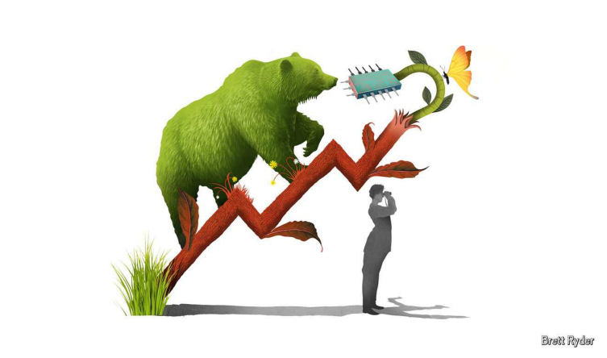

# What could stop the Nvidia frenzy?

Two contradictions could stymie the AI chipmaker-in-chief

**Editor’s note (August 28th 2024):** *This article was updated following Nvidia’s latest quarterly results.*

原文：

IF TODAY’S STOCKMARKETS have their version of the great wildebeest migration, it is the

stampede of the Nvidia bulls. Wall Street is no Serengeti, and Jim Cramer’s

high-pitched narration no match for the dulcet tones of Sir David

Attenborough. But in other respects investors’ headlong rush into the

American chipmaker’s shares has been every bit as enthralling a spectacle.

如果说今天的股票市场上演了角马大迁徙，那就是英伟达牛市的蜂拥而至。华尔街不是塞伦盖蒂，吉姆·克莱默的高调叙述也比不上大卫·爱登堡爵士的悦耳音调。但在其他方面，投资者对这家美国芯片制造商股票的盲目追捧也同样引人入胜。

学习：

>**Jim Cramer** 是一位美国著名的财经评论员和电视主持人，以其在 CNBC 节目 "Mad Money" 中的高亢、情绪激动的解说风格闻名。**David Attenborough** 是一位英国著名的自然纪录片制片人，以其温和、富有魅力的叙述风格著称，尤其是在描述大自然和动物世界时。
>
>文章中的“Wall Street is no Serengeti, and Jim Cramer’s high-pitched narration no match for the dulcet tones of Sir David Attenborough”意在将股市的投资者与自然界中的动物迁徙相类比。作者用 Serengeti（坦桑尼亚的塞伦盖蒂平原，以动物大迁徙闻名）来象征股市，用 Jim Cramer 和 David Attenborough 的解说风格对比，来突出金融市场中股东对 Nvidia 股票的狂热与自然界中动物迁徙的壮观之间的类比。这样的比较既形象地表现了投资者的疯狂，也为文章增添了幽默感和趣味性。

wildebeest：英 [ˈwɪldəbiːst] 牛羚；角马（产于南非）

great wildebeest migration：角马大迁徙

stampede： 美 [stæmˈpiːd] （人群的）蜂拥；奔逃；狂奔；使狂奔

high-pitched：音调高的；尖声的；尖锐的；高调的

narration：美 [nəˈreɪʃn] 叙述；故事；讲述

no match for：配不上；不敌          

dulcet：美 [ˈdʌlsɪt] 悦耳的；动听的；

headlong：匆忙的；冒失的；草率的；急速的

headlong rush：仓促冲刺          

enthralling：美 [ɪn'θrɔlɪŋ] 迷人的

spectacle：壮观的场面；壮观的景象；

原文：

Galloping sales of Nvidia’s artificial-intelligence (AI) processors have lifted

its market capitalisation from \$350bn at the start of 2023 to \$1trn, then

\$2trn, and then, this summer, \$3trn. In June it overtook Microsoft, an AI

-zealous software giant believed to be the biggest buyer of its chips, as the

world’s most valuable firm. It proceeded to lose that title—and $900bn in

value—amid the recent stockmarket panic, only to claw back most of its

losses in the past few weeks. “How much money have you made over the

years betting against Jensen Huang?” Mr Cramer asked rhetorically on his

CNBC show recently, referring to Nvidia’s boss. These days the Nvidia bear

appears to be an endangered species. Or, as Sir David might whisper, “Not

an *Ursus nvidiaensis* in sight.”

Nvidia人工智能(AI)处理器的迅猛销售使其市值从2023年初的3500亿美元上升到1万亿美元，然后是2万亿美元，然后是今年夏天的3万亿美元。六月，它超越了微软，一个热衷于人工智能的软件巨头，被认为是其芯片的最大买家，成为世界上最有价值的公司。在最近的股票市场恐慌中，它失去了这个头衔——价值9000亿美元——只是在过去几周收回了大部分损失。"这些年来，你赌黄仁勋赢了多少钱？"克莱姆先生最近在他的美国消费者新闻与商业频道秀上反问道，指的是英伟达的老板。如今，英伟达熊似乎是一种濒危物种。或者，正如大卫爵士可能会小声说的，“看不到一只乌苏斯nvidiaensis。”

学习：

galloping：美 [ˈɡæləpɪŋ] 飞驰；奔驰；急速进行；（gallop的现在分词形式）

galloping sales：销量迅猛增长

market capitalisation = maket cap=市值

claw back：夺回；收回；弥补回来          

whisper：低语；耳语；轻声说；

原文：

For every hedge fund that trims its stake in the company, another seems to

do the opposite. Among the 74 Wall Street analysts who cover Nvidia and

are tracked by Bloomberg, 66 advised buying more of its shares as of late

August; none suggested selling. Their average price target for the stock one

year from now implied a market value of around $3.5trn. James Anderson, a

veteran tech investor who was an early backer, teases that Nvidia could be

worth $49trn in a decade, a shade more than the total value today of the S&P

500 index of large American firms. All it would take is consistent annual

sales growth of 60% at current operating margins of 60% or so, plus some

plausible assumptions about cashflow. (Mr Anderson’s current employer,

Lingotto, is owned by Exor, the biggest shareholder of *The Economist*’s

parent company.)

对于每一家减持该公司股份的对冲基金来说，另一家似乎在做相反的事情。在彭博追踪的74位研究英伟达的华尔街分析师中，有66位建议在8月下旬购买更多英伟达的股票；没有人建议出售。他们对该股的平均目标价意味着一年后的市值约为3.5万亿美元。资深科技投资者詹姆斯·安德森是英伟达的早期支持者，他调侃道，英伟达的市值在十年内可能达到49万亿美元，略高于今天标准普尔500美国大公司指数的总市值。所需要的只是在目前60%左右的运营利润率下，持续60%的年销售额增长率，以及一些关于现金流的可信假设。(安德森先生现在的雇主，Lingotto，由Exor所有，Exor是经济学人母公司的最大股东。)

学习：

backer：赞助人；支持者；资助者；投资者；

tease：取笑；戏弄；挑逗

a shade：一点儿；少许；些微          

trim: 削减，减少

>这里的“**trim**”指的是“削减”或“减少”，在金融或投资领域中通常用于描述投资者减少其在某家公司中的持股比例。
>
>**举例子**：
>
>- 英文：A hedge fund decided to **trim** its position in Apple, selling off 10% of its shares to diversify its portfolio.
>- 中文：一家对冲基金决定削减其在苹果公司的持股，卖出了10%的股票以多样化其投资组合。
>
>在你提到的句子中，“trim its stake”意思是某些对冲基金减少了它们在Nvidia的持股。

原文：

On August 28th Nvidia reported another blow-out quarter. Revenue shot up

by 122%, year on year, to $30bn, an all-time high and above market

projections. Investment bankers project that Nvidia’s yearly sales will

double this year, to over $100bn, grow by as much as half in 2025 and by

double digits until at least 2027. By then its operating profit could exceed

$150bn—a third more than Apple, tech’s most successful money-spinner,

managed last year.

8月28日，Nvidia报告了另一个爆发的季度。收入同比增长122%，达到300亿美元，创历史新高，超过市场预期。投资银行家预计，英伟达的年销售额今年将翻一番，超过1000亿美元，2025年将增长一半，至少到2027年将保持两位数增长。届时，它的营业利润可能超过1500亿美元，比苹果这个科技行业最成功的赚钱机器去年的利润高出三分之一。

学习：

blow-out: 超出预期的、极其成功或巨大的结果

>这里的“**blow-out**”指的是一种超出预期的、极其成功或巨大的结果，通常用于描述极为出色的业绩或表现。在你提到的句子中，"blow-out quarter" 意思是Nvidia的季度表现远远超过了市场预期，取得了极其优异的成绩。
>
>**举例子**：
>
>- 英文：The company had a **blow-out** year, with profits increasing by 200% and far exceeding analysts' expectations.
>- 中文：这家公司经历了一个辉煌的一年，利润增长了200%，远远超过了分析师的预期。

shoot up：迅速上升；迅速成长；

above market projections：高于市场预期

double digits：两位数

money-spinner：摇钱树；赚钱的东西；盈利项目

原文：

In a sign of exalted expectations, Nvidia’s share price slumped after its

results were published, possibly because they beat forecasts by less than in

previous quarters. As the bulls pause to catch their breath, they might wish

to ruminate on two deeper contradictions lurking in Nvidia’s long-term

growth story.

Nvidia的股价在业绩公布后暴跌，这表明人们的期望很高，可能是因为业绩超出预期的幅度小于前几个季度。当看涨者停下来喘口气时，他们可能希望反思一下Nvidia长期增长故事中潜藏的两个更深层次的矛盾。

学习：

exalted：高贵的；崇高的；高尚的；显赫的；

exalted expectations：很高的期望

slump：暴跌

ruminate：美 [ˈruməˌneɪt] 思；反刍；默想；琢磨；反省；

lurk：潜伏，潜藏

原文：

The first concerns its main supplier. Nvidia designs chips but does not

produce them. That falls to TSMC, a Taiwanese contract chipmaker that

dominates the market for the cutting-edge silicon that goes into AI servers. As

demand for these has rocketed, Nvidia has gone from one among many of

TSMC’s clients to probably its second-biggest behind Apple. If it is indeed

“customer B”, one of two that represent at least 10% of TSMC’s revenues and so

must be disclosed in regulatory filings, it spent $7.7bn with TSMC last year, up

from $5.5bn two years earlier. Given that most of Nvidia’s purchase

commitments of $19bn for 2025 are likely to end up with TSMC, it could soon

eclipse the current “customer A”, which handed the Taiwanese firm just shy

of $18bn in 2023.

首先是它的主要供应商。英伟达设计芯片，但不生产芯片。这落到了代工芯片制造商台积电的头上，该公司在用于人工智能服务器的尖端芯片市场占据主导地位。随着对这些产品的需求激增，英伟达已经从台积电的众多客户之一变成了仅次于苹果的第二大客户。如果它确实是“客户B”，即代表台积电至少10%收入的两个客户之一，因此必须在监管文件中披露，它去年在台积电花费了77亿美元，高于两年前的55亿美元。鉴于英伟达2025年190亿美元的采购承诺中的大部分很可能最终会流向台积电，它可能很快就会超越目前的“客户A”，后者在2023年向这家公司支付了近180亿美元。

学习：

Contract chipmaker: 代工芯片制造商

>**Contract chipmaker**: 这个词组指的是“代工芯片制造商”，即专门根据其他公司的设计和要求来生产芯片的公司。Nvidia本身设计芯片，但并不直接生产芯片，而是将生产任务外包给像台积电（TSMC）这样的代工厂。

shy of:  接近但不完全到达某个数量或程度
>**Shy of**: 这个短语的意思是“接近但不完全到达某个数量或程度”，通常用于表示稍微低于某个数字或标准。
>
>英文：The project budget came **shy of** $1 million, just a little under the initial estimate.
>
>中文：项目预算略低于100万美元，比最初的估计少了一点。

原文：

Even as Nvidia’s and TSMC’s fates become more entwined, however, their

product cycles are diverging. Earlier this year Mr Huang vowed to launch a

new AI chip every year, rather than every couple of years. TSMC is thus in a mad

rush to expand capacity, investing up to $32bn this year and possibly more

in 2025. But it still takes at least 18 months to erect a new factory. And since

these can cost $20bn a pop, careful discussions with clients start a year or

two in advance. It is unclear how Nvidia’s accelerated timeline fits in with

TSMC’s more measured pace of decision-making. In an early sign of trouble,

Nvidia has delayed shipments of its latest chips, called Blackwell, by a

couple of months owing to technical kinks.

然而，尽管英伟达和台积电的命运变得更加交织在一起，他们的产品周期却出现了分化。今年早些时候，Huang发誓要每年推出一款新的人工智能芯片，而不是每几年一款。因此，台积电正疯狂扩张产能，今年投资高达320亿美元，2025年可能会更多。但建立一座新工厂仍需要至少18个月。由于这些项目每次可能花费200亿美元，因此提前一两年就开始与客户进行仔细的讨论。目前还不清楚英伟达的加速时间表如何适应台积电更有分寸的决策步伐。麻烦的早期迹象是，由于技术故障，Nvidia将其最新芯片Blackwell的发货时间推迟了几个月。

学习：

entwined：美 [ɛnˈtwaɪnd] 盘绕；（entwine的过去式）

expand capacity：扩大产能

erect：建造；建立；搭建；

erect  a factory：建造一座工厂

kink：美 [kɪŋk]  障碍；

technical kink：技术故障

原文：

Nvidia’s reliance on TSMC also highlights the second tension in the bulls’ case.

Because the manufacturer controls the volume and efficiency of production,

the only way for Nvidia to ensure that it meets investors’ bullish

expectations for sales is to raise prices. A Blackwell chip will cost 20-25%

more than the earlier generation, which was twice the price of the one

before. Each chip is more powerful than the last, so the cost per unit of

computing power is probably declining. But not fast enough for customers.

英伟达对台积电的依赖也凸显了这个牛市案例中的第二个紧张因素。由于制造商控制着生产的数量和效率，英伟达确保满足投资者对销售的看涨预期的唯一方法就是提高价格。Blackwell芯片的成本将比上一代高出20-25%,是上一代的两倍。每个芯片都比上一个更强大，因此每单位计算能力的成本可能正在下降。但对客户来说不够快。

原文：

In August Andy Jassy, chief executive of Amazon, whose cloud-computing

arm is a big user of Nvidia chips, acknowledged that he had “heard loud and

clear from customers that they relish better price performance”. His

company is investing in its own designs. So are Google, Meta, Microsoft

and Tesla. AMD, a rival chip-designer, has gone from almost no AI-chip sales in

2022 to a forecast $5bn this year. On August 19th it said it would buy ZT

Systems, a server maker, helping it to compete with Nvidia’s end-to-end

offering. Chinese tech champions such as Huawei, barred by American

sanctions from procuring top-end Nvidia gear, may forge breakthroughs that

could do to Nvidia’s market share what Chinese competitors like BYD did to

Tesla’s in electric cars.

8月，亚马逊首席执行官安迪·雅西(Andy Jassy)承认，他“从客户那里清楚响亮地听到，他们喜欢更好的性价比”。亚马逊的云计算部门是英伟达芯片的大用户。他的公司正在投资自己的设计。谷歌、Meta、微软、特斯拉也是。另一家芯片设计公司AMD，已经从2022年几乎没有人工智能芯片销售增长到今年预计的50亿美元。8月19日，它宣布将收购服务器制造商ZT系统公司，帮助它与英伟达的端到端产品竞争。华为等中国科技巨头被美国制裁禁止采购高端英伟达设备，但它们可能会取得突破，对英伟达的市场份额产生影响，就像比亚迪等中国竞争对手对特斯拉在电动汽车领域的影响一样。

学习：

relish：享受；喜爱；渴望

tech champions：技术巨头

bar：禁止

procure：获得；取得；获取；得到

top-end：高端的；顶级的；最高档的；

gear：设备

forge：稳步前进；努力加强；艰苦干成；逐渐发展；努力形成；

forge breakthroughs：取得突破

## **Exit, pursued by a bear**

原文：

Even assuming a killer app eventually emerges—which it hasn’t yet—

generative AI is unlikely to become widely used unless it gets much cheaper; a

ChatGPT query can cost seven times more to answer than a Google search.

Nvidia may soon have to choose between lowering prices to support its

growth or maintaining prices to protect its profit margin. For now Nvidia

bulls think they can have it both ways. The whiff of irrational exuberance

may become too overwhelming for *U. nvidiaensis* to resist. ■

即使假设一个杀手级应用最终出现——现在还没有——生成式人工智能也不太可能被广泛使用，除非它变得更便宜；一个ChatGPT查询的回答成本是谷歌搜索的七倍。英伟达可能很快不得不在降低价格以支持其增长和维持价格以保护其利润率之间做出选择。目前，看好英伟达的人认为他们可以两者兼得。非理性繁荣的气息可能会变得过于强大，让英伟达无法抗拒。■

学习：

profit margin：利润率

whiff：轻微的迹象（感觉）；一阵气味

exuberance：[ɪg'zjʊbərəns] 繁荣，丰富；茂盛

irrational exuberance：非理性繁荣

>“非理性繁荣”是指在金融市场或经济活动中，由于过度乐观或不理性的情绪驱动，投资者或消费者大规模涌入某个资产或行业，从而导致资产价格迅速上涨，远远超出其实际价值。这种现象通常伴随着市场泡沫的形成，当人们对未来回报的预期过高时，往往会忽视潜在的风险和基本面因素。一旦市场情绪发生逆转，泡沫破裂，价格会急剧下跌，导致重大损失。
>
>这个概念最早由美国经济学家、前美联储主席艾伦·格林斯潘（Alan Greenspan）在1996年用来描述当时美国股市的高涨情绪，后来被广泛用于形容各种资产泡沫现象。

## 后记

2024年9月1日19点50分于上海。

