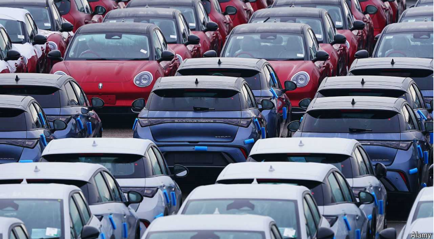
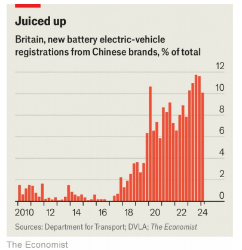

# Britain’s unusual stance on Chinese electric vehicles

Unlike America or Europe, Britain is welcoming the cheap cars—for now

原文：

A short walk down the road from Berkeley Square in Mayfair, a swish part of

London, sits a BYD showroom. The Chinese electric-vehicle (EV) manufacturer

set up shop there last year. Rolls-Royce displays its luxury cars just across

the street, having first taken up in the neighbourhood in 1932. BYD probably

doesn’t mind the association.

从伦敦高档区梅菲尔的伯克利广场走一小段路，就有一个比亚迪展厅。这家中国电动汽车制造商去年在那里设立了工厂。劳斯莱斯就在街对面展示其豪华汽车，它于1932年首次进驻该街区。比亚迪大概不介意被联系在一起。

学习：

swish：豪华的；高雅的；显眼的；时髦的；

showroom：展览室；样品间；商品陈列室；汽车展厅

set up shop：开店；开业；设立营业点；

原文：

BYD clearly hopes to pitch its vehicles as aspirational. But their real allure is

that they are affordable. One model on display, the Dolphin, sells for around

£25,000 ($33,000); British car reviewers have called the pricing “attractive”

and “impressively low”. What really worries BYD’s Western rivals is that there

is plenty of room for prices to fall. In China the Dolphin sells for 99,800

yuan, or just over £10,000. An analysis by Rhodium Group, a consultancy,

found that BYD could cut its prices in Europe by 30% and still make the same

profit per car that it does in China.

比亚迪显然希望将其汽车定位为有抱负的。但它们真正的吸引力在于价格实惠。展出的海豚车型售价约为25000英镑(33000美元)；英国汽车评论家称这一定价“有吸引力”且“低得令人印象深刻”。真正让比亚迪的西方竞争对手担心的是，价格还有很大的下降空间。在中国，海豚售价为9.98万元人民币，约合1万多英镑一点。咨询公司Rhodium Group的一项分析发现，比亚迪可以将其在欧洲的价格降低30%,但每辆车的利润仍与在中国相同。

学习：

pitch：宣传；定调

allure：吸引

plenty of room for price to fall：还有很大的降价空间

原文：

Consumers are gradually cottoning on to the appeal of Chinese EVs. Seeing an

Ora, Maxus, MG or BYD marque on the road in Britain still feels noteworthy. On

current trends, that won’t be the case for long. Chinese brands now make up

around 10% of new EV sales in Britain, up from around 3-4% five years ago

(see chart). Those figures, if anything, understate China’s increasing role in

the car market because Western brands are also shifting carmaking to China.

According to data from JATO Dynamics, an automotive-research firm, 22%

of EVs registered in Britain (and 7.5% of all cars) are now made in China.

消费者正逐渐意识到中国电动汽车的吸引力。在英国的道路上看到Ora、Maxus、MG或BYD品牌的汽车，仍然让人觉得值得关注。按照目前的趋势，这种情况不会持续太久。中国品牌现在占英国新电动汽车销量的10%左右，比五年前的3-4%有所上升(见图表)。如果说这些数字有什么不同的话，那就是低估了中国在汽车市场日益增长的作用，因为西方品牌也在将汽车制造转移到中国。根据汽车研究公司JATO Dynamics的数据，目前在英国注册的22%的电动汽车(占所有汽车的7.5%)是中国制造的。

学习：

cotton on：理解；明白；意识到

marque：美 [mɑrk] 商标；品牌；标志

noteworthy：值得注意的；显著的；重要的；引人注目的

原文：

More affordable cars are welcome news for households: EVs are more

expensive than their petrol equivalents for now, but the gap is narrowing

fast. Making it cheaper to get around ought to be a welcome spur to growth.

Speedy EV penetration is critical for the government’s decarbonisation goals.

But these arguments also apply in America and the European Union, and

they are both instituting hefty tariffs on Chinese cars to discourage imports

and shield domestic carmakers. On August 26th Canada said that it was

following suit.

对家庭来说，更实惠的汽车是受欢迎的消息:目前电动汽车比汽油汽车更贵，但差距正在迅速缩小。降低出行成本应该是一个受欢迎的增长刺激。电动汽车的快速普及对于政府的脱碳目标至关重要。但是这些观点也适用于美国和欧盟，他们都对中国汽车征收高额关税以阻止进口和保护国内汽车制造商。8月26日，加拿大表示将紧随其后。

学习：

equivalents：相等物；等价物；（equivalent的复数）          

get around：出行；

penetration：渗透

follow suit：跟风

原文：

Wisely, Britain’s new Labour government has so far largely leant away from

such protectionism. Jonathan Reynolds, the business secretary, said in July

that he was not planning to ask the independent Trade Remedies Authority

(TRA) to investigate Chinese EVs, a necessary first step towards tariffs. Britain’s

own car industry, which can also demand an investigation, has held off, too.

明智的是，到目前为止，英国新工党政府在很大程度上远离了这种保护主义。英国商务大臣乔纳森·雷诺兹(Jonathan Reynolds)7月份表示，他不打算要求独立贸易救济局(TRA)调查中国电动汽车，这是征收关税的必要第一步。英国自己的汽车工业也可以要求调查，也已经推迟了。

学习：

hold off: 暂缓，推迟

>这里的 **hold off** 指的是“暂缓”或“推迟”采取某种行动。在这个上下文中，指的是英国的汽车行业目前还没有要求对中国电动汽车进行调查或采取进一步的行动。
>
>**例子**：
>- 英文: The company decided to hold off on launching the new product until the market conditions improved.
>- 中文: 公司决定推迟新产品的发布，直到市场条件改善。

原文：

Why the different approach? The main motivation is likely to be fear of

retaliatory tariffs. China is a big export market for high-end producers like

Rolls-Royce, Jaguar and Bentley, which make up a big chunk of Britain’s

car industry. And China would be unlikely to limit its retaliation to the car

industry. Scottish salmon and whisky might be juicy targets; China buys lots

of both products and Labour is loth to risk alienating voters north of the

border.

为什么采用不同的方法？主要动机可能是害怕报复性关税。中国是劳斯莱斯、捷豹和宾利等高端生产商的一个巨大出口市场，这些生产商在英国汽车行业占据了很大一块。中国不太可能将报复局限于汽车行业。苏格兰鲑鱼和威士忌可能是诱人的目标；中国大量购买这两种产品，而工党不愿意冒险疏远边境以北的选民。

学习：

retaliatory： 美 [rɪˈtæliətɔːri] 报复的；报复性的

jaguar： 英 [ˈdʒaɡjʊə] 美洲虎；美洲豹；作为汽车品牌是捷豹

salmon：美 [ˈsæmən] 鲑；鲑鱼；三文鱼； **注意发音**

juicy：充满诱惑的；吸引人的

原文：

Advocates of trade barriers on Chinese EVs also raise security concerns.

Modern cars gather vast amounts of data. Sensors scan road conditions; on-

board computers connect to passengers’ smartphones; voice-control systems

record conversations. The Chinese military has banned Tesla vehicles from

its facilities since 2021, citing security issues with their on-board cameras. A

Chinese carmaker should not be supplying ministerial cars in Britain—no

matter how cheap. And there may come a point when Chinese EVs exert too

much control over the market for comfort.

主张对中国电动汽车设置贸易壁垒的人也提出了安全担忧。现代汽车收集了大量的数据。传感器扫描路况；车载电脑连接乘客的智能手机；声控系统记录对话。自2021年以来，中国军方一直禁止特斯拉汽车进入其设施，理由是车载摄像头存在安全问题。一家中国汽车制造商不应该向英国供应部长级汽车——不管有多便宜。也许会有一天，中国的电动汽车会为了舒适而过度控制市场。

学习：

road conditions：路况

on-board：机载的；车载的

ministerial：美 [ˌmɪnəˈstɪriəl] 部长级的；政府部门的；

原文：

But what distinguishes Chinese EVs is less their usefulness for surveillance

and more that they are increasingly competitive. For cameras, smart toasters

and more, Chinese manufacturers have an incentive to behave well because

any whiff of association with spying would be commercially harmful. The

logic isn’t any different behind the steering wheel. ■

但中国电动汽车的与众不同之处不在于它们在监控方面的实用性，而在于它们越来越具有竞争力。对于相机、智能烤面包机等等，中国制造商有动力表现良好，因为任何与间谍活动有关的迹象都会造成商业上的伤害。方向盘后面的逻辑没有任何不同。■

## 后记

2024年9月4日18点55分于上海。

