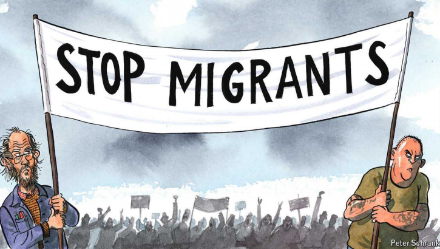

# Europe’s lefties bash migrants (nearly) as well as the hard right

Xenophobia is crossing the political spectrum

bash：猛烈批评，抨击

>这里的 **bash** 是“猛烈批评”或“抨击”的意思。在这句话中，**bash** 表示欧洲的左翼政客对待移民的态度变得和极右翼差不多，甚至也开始激烈批评和反对移民。它暗示左翼政党开始采纳类似右翼的强硬移民政策，批评移民或推行限制移民的措施。
>
>**例子**：
>
>- 英文：The politician bashed the new immigration policies, calling them unfair and harmful.
>- 中文：那位政客猛烈抨击了新的移民政策，称其不公平且有害。

lefty: 左派分子；左翼政治倾向者

Xenophobia: 美 [ˌzenəˈfoʊbiə] 仇外；惧外（对外国人的厌恶或惧怕）；排外情绪

原文：

As EUROPE FACED a sharp rise in the arrival of migrants seeking asylum in 2015,

many national governments demanded more be done to stem the flow.

Sweden’s prime minister disagreed. “My Europe does not build walls,”

Stefan Lofven, leader of the Social Democrats, thundered in response,

exuding the high-mindedness left-wingers muster at will. A couple of

electoral setbacks later—it turns out voters are rather keen on walls during

migration crises—the party is speaking from a different register, this time as

an opposition force. “The Swedish people can feel safe in the knowledge

that Social Democrats will stand up for a strict migration policy,” Magdalena

Andersson, its current leader, said in an interview to a local paper in

December. Remember peace, open borders and the socialist brotherhood of

man? Not Mrs Andersson. “Free immigration is not left-wing,” she now

argues.

随着欧洲在2015年面临寻求庇护的移民数量急剧增加，许多国家政府要求采取更多措施来阻止这一流动。瑞典首相不同意。“我的欧洲不建墙，”社会民主党领袖斯特凡·洛芬(Stefan Lofven)大声回应道，散发出左翼分子随意聚集的崇高气质。在经历了几次选举挫折后——事实证明，在移民危机期间，选民们对隔离墙相当感兴趣——该党从不同的角度发表了讲话，这一次是作为一股反对力量。“瑞典人民可以感到安全，因为他们知道社会民主党会支持严格的移民政策，”现任领导人马格达莱纳·安德森(Magdalena Andersson)在去年12月接受当地一家报纸采访时说。还记得和平、开放的边界和人类的社会主义兄弟情谊吗？不是安德森夫人。“自由移民不是左翼，”她现在争辩道。

学习：

sharp rise：急剧增加

stem：阻止；遏制；遏止；

exude：美 [ɪɡˈzud]   流露；显露（感觉或品质）；

thunder: 用强烈或威严的语气发表讲话

>**Thundered** 在这里指的是用强烈或威严的语气发表讲话，类似于“怒吼”或“激烈地表达观点”。
>**例子**：
>
>- 英文：The politician thundered against the proposed law during the debate.
>- 中文：那位政客在辩论中强烈反对提议的法律。

muster：集合；召集；聚集；

brotherhood：兄弟情谊；手足情谊

high-mindedness: 一种道德上的高尚或理想主义的态度，特别是那些强调正义和崇高目标的态度

>**High-mindedness** 是指一种道德上的高尚或理想主义的态度，特别是那些强调正义和崇高目标的态度。这里指的是左翼政客在谈论移民问题时展示的理想主义姿态。
>**例子**：
>
>- 英文：The activist’s speech was full of high-mindedness, calling for justice and equality for all.
>- 中文：那位活动家的演讲充满了高尚的理想，呼吁人人享有正义和平等。

register: 指的是表达的方式或语气

>**Register** 在这里指的是表达的方式或语气。文中指的是社会民主党现在用不同的语气（从之前的开放移民转变为严格移民政策）发言。
>**例子**：
>
>- 英文：Her tone shifted to a more formal register when addressing the audience.
>- 中文：她在向观众讲话时语气变得更加正式。

原文：

Migrant-bashing has had a good run of late in Europe, largely as a result of

the xenophobic hard right gaining ground across the continent. But these

days it is not just the ideological allies of Marine Le Pen in France or Geert

Wilders in the Netherlands banging on about new arrivals, or the integration

of old ones. Parties on the other end of the political spectrum sometimes join

in. On September 1st Sahra Wagenknecht, a German stalwart of the radical

left, is expected to do well in two state elections, with a third to come later in

the month. Polls show that in some contests her one-woman band, launched

in January, will beat all three parties of the ruling coalition. Beyond wanting

to soak the rich, it is Ms Wagenknecht’s overt animosity to migrants that

stands out. Her claim there is “no more room” to take in refugees is the kind

of rhetoric that has helped propel the nationalist Alternative for Germany

(AfD) to the top of the polls. A stabbing spree by a Syrian asylum-seeker that

left three dead on August 24th would once have delivered a windfall to the

hard right. This time it is likely to help Ms Wagenknecht’s lot just as much.

最近在欧洲，对移民的抨击很盛行，这主要是由于仇外的强硬右翼在欧洲大陆的崛起。但如今，不仅仅是法国的马林·勒·庞或荷兰的海尔特·维尔德斯的意识形态盟友在喋喋不休地谈论新移民或老移民的融合。政治光谱另一端的政党有时也会加入进来。9月1日，德国激进左翼的坚定支持者Sahra Wagenknecht预计将在两次州选举中表现出色，第三次选举将于本月晚些时候举行。民意调查显示，在一些竞争中，她在一月份成立的一人乐队将击败执政联盟的所有三个政党。除了想向富人征税，Wagenknecht女士对移民的公开敌意也很突出。她声称“没有更多的空间”来接纳难民，这种言论有助于将民族主义的德国选择党(AfD)推上民意调查的首位。8月24日，一名叙利亚寻求庇护者疯狂行刺，导致三人死亡，这原本会给极右翼带来一笔横财。这一次，它很可能对Wagenknecht女士的命运有同样大的帮助。

学习：

bashing：猛击；痛打；猛烈抨击；严厉批评；暴力攻击；（bash的现在分词）          

xenophobic：美 [ˌzenə'foʊbɪk] 恐惧（或憎恨）外国人的；恐外的；仇外的

overt：美 [oʊˈvɜːrt] 明显的；公然的；不隐蔽的；不隐瞒的

animosity：美 [ˌænɪˈmɑːsəti] 敌意；仇恨；憎恶

stabbing：美 [ˈstæbɪŋ] 持刀伤人事件；用刀等锐器、用手指、尖物等）刺；戳；捅；（stab的现在分词）

spree：美 [spriː]  短暂的疯狂行为

windfall：横财；意外之财；意外收获

原文：

Is the left simply aping the xenophobic right to siphon off some of its votes?

If so, it is becoming a proven strategy. In Denmark Mette Frederiksen, prime

minister since 2019, has inserted a hefty dose of hard-nosed policy on

migration into her centre-left party’s programme. Far from reversing her

conservative predecessors’ tough rhetoric on new arrivals, she made it her

own. So-called “ghettos” with lots of migrants and crime (or just poverty)

have been razed in a bid to force newcomers to integrate. Some refugees

from Syria have been told their country is now safe enough to return to. A

plan to deport asylum-seekers to Rwanda so they could be processed there

was mooted. The strategy horrifies many socialists beyond Denmark—but is

popular. With the exception of tiny Malta, Ms Frederiksen is the only centre-

left leader in Europe whose party is both in office and ahead in the polls.

左派仅仅是在模仿排外的右派来吸走部分选票吗？如果是这样的话，这将成为一个行之有效的策略。在丹麦，自2019年以来担任总理的梅特·弗雷德里克森(Mette Frederiksen)在她的中左翼政党的纲领中加入了一剂强硬的移民政策。她非但没有扭转她的保守派前任对新来者的强硬言辞，反而把它变成了自己的风格。有大量移民和犯罪(或者仅仅是贫困)的所谓“贫民窟”已经被夷为平地，以迫使新来者融入社会。一些来自叙利亚的难民被告知，他们的国家现在足够安全，可以返回。一项将寻求庇护者驱逐到卢旺达的计划正在讨论中。这一策略吓坏了丹麦以外的许多社会主义者——但是很受欢迎。除了小小的马耳他，弗雷德里克森女士是欧洲唯一一位执政党在民意调查中领先的中左翼领导人。

学习：

aping：模仿；（ape的现在分词）          

siphon off：美 [ˈsaɪfən] 虹吸；吸吮；榨取          

proven：被证明的；已证实的

hard-nosed：务实、坚定或强硬

>**Hard-nosed** 形容非常务实、坚定或强硬，不易受情感或理想主义的影响。
>**例子**：
>
>- 英文：The hard-nosed manager didn’t hesitate to cut costs to improve the company’s profitability.
>- 中文：那位务实的经理毫不犹豫地削减成本，以提高公司的盈利能力。

ghettos：美 ['getəus] 贫民区；犹太人区；（ghetto的复数）

razed: 消除；彻底摧毁；夷为平地；将…夷为平地；（raze的过去式）

mooted: 提出…供讨论；（moot的过去式）；

horrifies: 使恐惧；使极度厌恶；（horrify的第三人称单数）          

bid: 为了达到某种目的而采取的努力或行动，类似于“尝试”或“努力争取”

>**Bid** 在这里指的是为了达到某种目的而采取的努力或行动，类似于“尝试”或“努力争取”。
>**例子**：
>
>- 英文：The company’s bid to enter the Asian market involved significant investments in infrastructure.
>- 中文：那家公司为进军亚洲市场付出了大量的基础设施投资努力。

原文：

Part of the left, especially its revolutionary fringe, has long been

uncomfortable about migration. Karl Marx saw the importation of foreign

labourers as a ploy by capitalist bosses to keep the proletariat down. His

French disciples among communists and trade unionists were among the

most ardently opposed to open borders. A softening of that policy in the

1980s left the door open to Ms Le Pen’s father to build a truly xenophobic

political movement, often pitched to the same working-class electorate.

Jean-Luc Mélenchon, France’s latest firebrand of the left, has advocated

against the right of European Union citizens to settle in France. For him,

migration is at its root an exploitation of the migrant.

部分左翼人士，尤其是其革命边缘人士，长期以来一直对移民感到不安。卡尔·马克思认为输入外国劳工是资本主义老板压制无产阶级的策略。他在共产主义者和工会会员中的法国信徒是最强烈反对开放边境的。20世纪80年代，这一政策的软化为勒庞的父亲开启了建立真正排外的政治运动的大门，该运动通常面向相同的工人阶级选民。法国最新的左翼煽动者让-吕克·梅伦琼(Jean-Luc Mélenchon)反对欧盟公民在法国定居的权利。对他来说，移民从根本上说是对移民的剥削。

学习：

fringe：边缘；外围；边缘地带；

ploy：策略；手段；手法；计谋；

proletariat：美 [ˌproʊləˈtɛriət] 无产阶级；工人阶级；劳动阶级

disciples：美 [dɪˈsaɪpəlz] 门徒；（disciple的复数）

unionist：美 [ˈjunjənəst]   工会会员；工会主义者；工联主义者；统一主义者；统一派（主张北爱尔兰继续为英国的一部分）；

ardently：美 [ˈɑːrdntli] 热烈地；热心地

firebrand：火把；煽动者；惹事生非者；激进分子；

pitch： 向特定人群宣传或推销某种观点或政策

>这里的 **pitch** 是指向特定人群宣传或推销某种观点或政策，通常带有说服的目的。它可以翻译为“向……推销”或“宣传”。在这个语境下，Le Pen 的父亲将一种极端排外的政治运动**宣传**给工人阶级选民。
>
>**例子**：  
>- 英文：The politician pitched his tax reform plan to middle-class voters, hoping to gain their support.  
>- 中文：那位政客向中产阶级选民宣传他的税收改革计划，希望获得他们的支持。

原文：

More centrist lefties have long been relaxed about immigration. That is in

part because mainstream social-democratic parties that once catered to blue-

collar types—those worried about jobs going to foreigners—have been taken

over by college-educated yuppies for whom inclusion trumps class warfare.

But even that bleeding-heart urban electorate occasionally questions the

effects of letting in lots of new people. Some, like David Goodhart, a British

thinker of the left, argue that high levels of migration undermine support for

the welfare state. The solidarity required to enforce redistribution rests on

the belief those in need are “people like us” that have merely fallen on hard

times. Carsten is happy to bail out Torsten, whose values he shares. But what

about Ahmed? Too much diversity frays societal bonds. America never fully

developed a welfare state in part because those in need (often blacks or

Hispanics) did not look like those with plenty.

更多的中间派左派长期以来对移民问题都很放松。这部分是因为曾经迎合蓝领阶层的主流社会民主党已经被受过大学教育的雅皮士接管，对他们来说包容胜过阶级斗争。但是，即使是那些具有同情心的城市选民偶尔也会质疑接纳大量新人的影响。一些人，如英国左翼思想家大卫·古德哈特，认为大量移民削弱了对福利国家的支持。实施再分配所需要的团结是基于这样一种信念，即那些有需要的人是“像我们一样的人”，他们只是在困难时期倒下了。卡斯滕很乐意救助托尔斯滕，他认同后者的价值观。但是艾哈迈德呢？太多的多样性会破坏社会纽带。美国从未完全发展出一个福利国家，部分原因是那些需要帮助的人(通常是黑人或西班牙人)看起来不像那些富裕的人。

学习：

cater to：迎合

trump：胜过

class warfare：阶级斗争

college-educated：受过大学教育；大学学历；受过高等教育          

yuppies: 年轻的城市专业人士，通常指那些受过良好教育、有稳定高收入、生活方式时尚的白领阶层

>**Yuppies** 是 "young urban professionals" 的缩写，指年轻的城市专业人士，通常指那些受过良好教育、有稳定高收入、生活方式时尚的白领阶层。这个词在20世纪80年代开始流行，带有一些贬义色彩，常用来形容那些追求物质财富和成功的年轻人。
>
>在 **"college-educated yuppies"** 这句话中，yuppies 是指那些接受过高等教育、并且倾向于支持自由和包容价值观的年轻专业人士，强调他们的背景与工薪阶层不同。这个群体通常不太担心移民对就业的影响，更多关心包容性和多样性等社会议题。
>
>**例子**：  
>- 英文：The downtown area has been taken over by yuppies, with their coffee shops and luxury apartments.
>- 中文：市中心已经被那些年轻的白领阶层占领了，满是咖啡店和豪华公寓。

electorate：选民

solidarity：美 [ˌsɑːlɪˈdærəti] 团结一致；相互支持

fray：磨破；磨损

>
>
>至于 "Carsten is happy to bail out Torsten, whose values he shares. But what about Ahmed?" 这一句，意思是说 Carsten 愿意帮助 Torsten，因为他们拥有相似的价值观或背景，这意味着他们之间有社会纽带和认同感。但是当面对 Ahmed 时，由于他可能来自不同的文化或背景，Carsten 可能不愿意提供同样的帮助。这段话强调了社会团结的作用，即当帮助对象被视为“与我们相似的人”时，人们更愿意支持福利制度，而过多的多样性可能削弱这种团结感。

bleeding-heart: 极为同情弱势群体的人

>**Bleeding-heart** 是一个带有讽刺意味的表达，指那些在社会或政治问题上极为同情弱势群体的人，通常用来形容过于情感化、过度关心社会正义或平等的人。在这里，它形容那些城市里的自由派选民，他们往往对移民持包容态度，但偶尔也会质疑大量新移民的影响。
>
>**例子**：
>
>- 英文：The politician criticized his opponent for being a bleeding-heart liberal who prioritizes compassion over practical solutions.
>- 中文：那位政客批评他的对手是一个过于感情用事的自由派，优先考虑同情心而非实际解决方案。

## **I’m not racist, but...**

原文：

For those on the front lines of political life, rather than in its ivory towers,

the left’s shift to grappling with migration feels overdue. Yes, xenophobes

exist. But even open-minded voters worry about migration for all sorts of

legitimate reasons, including the strain on housing and public services. In

some places, notably Sweden, a rise in gun crime can be tied back to a rise

in poorly integrated migrants. Yet in the political centre, and particularly on

the left, *omerta* prevailed for years. Merely talking about the effects of

migration was “doing the far right’s bidding”; voters would always “prefer

the original to the copy” at the ballot box.

对于那些站在政治生活第一线而不是象牙塔里的人来说，左翼转向解决移民问题感觉姗姗来迟。是的，排外情绪是存在的。但是，即使是思想开放的选民也出于各种合理的原因担心移民，包括住房和公共服务的压力。在一些地方，特别是瑞典，枪支犯罪的增加可以追溯到融合不良的移民的增加。然而，在政治中心，尤其是左翼，omerta多年来一直占据上风。仅仅谈论移民的影响是“为极右分子服务”；在投票箱前，选民们总是“更喜欢原件而不是复印件”。

学习：

ivory： 美 [ˈaɪvəri] 象牙；牙；

ivory towers：象牙塔

strain：压力

omerta:   英 [əʊməˈtɑː] 沉默法则；

>**Omertà** 是意大利语词汇，最初来源于西西里岛黑手党文化，意思是保持沉默、避免向当局或外界透露信息的行为，类似于“沉默法则”。这个词后来被广泛使用，用来形容在某些话题上，群体或社会故意保持沉默，不愿公开讨论的现象。
>
>在你提到的这句话中，**omertà** 用来形容政治中心尤其是左翼长时间对移民问题保持沉默，不愿公开讨论这些话题。这样做的原因是担心如果讨论移民问题，会显得在帮助极右翼的宣传，进而让选民在投票时“更倾向于选择原版的右翼政策，而不是左翼的模仿版本”。
>
>**例子**：
>- 英文：The political omertà surrounding the corruption scandal made it hard for anyone to speak out.
>- 中文：围绕腐败丑闻的政治沉默法则使得很难有人站出来揭露真相。

原文：

The result was that an issue voters care about was mostly brought up by

parties with abhorrent views. If that is changing, so much the better. Signs

are it might be. Plenty on the left talk about being “pro-integration” rather

than “pro-migration”, ie, dealing with foreigners already here rather than

allowing more to come. At the EU level, socialists in May voted for a new

“migration pact” that will make life tougher for illegal migrants—including

building the metaphorical walls Mr Lofven once objected to. The debate

around immigration requires nuance: welcoming people is a boon to society

if handled well (not to mention a moral obligation when dealing with

refugees) but can be a burden if not. It is one the left should not be left out

of. ■

结果是选民关心的问题大多是由观点不一致的政党提出来的。如果这种情况正在改变，那就更好了。有迹象表明这是可能的。许多左翼人士谈论的是“支持融合”而不是“支持移民”，也就是说，与已经在这里的外国人打交道，而不是允许更多的人到来。在欧盟层面，社会党人在五月投票通过了一项新的“移民协议”,该协议将使非法移民的生活更加艰难——包括建造Lofven先生曾经反对的隐喻墙。围绕移民的辩论需要细致入微:如果处理得好，欢迎人们是社会的福音(更不用说处理难民问题时的道德义务了)，但如果处理不好，就可能成为负担。左翼不应被排除在外。■

学习：

abhorrent;美 [æbˈhɔrənt] 可憎的；令人憎恶的；令人厌恶的；引起反感的；

pact: 契约；盟约；和约

## 后记

2024年9月5日18点42分于上海。

