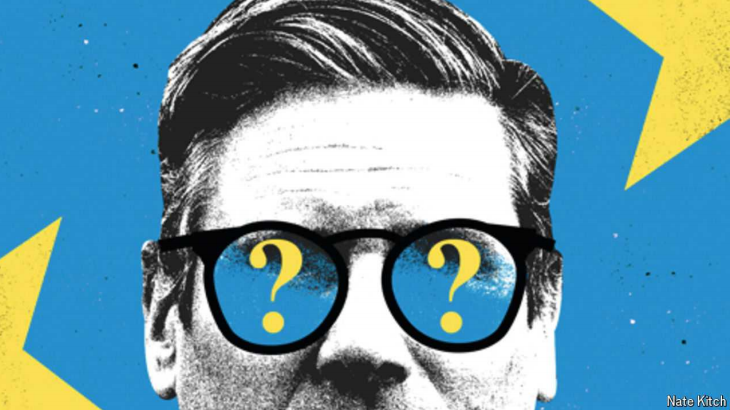

# The Labour government’s worrying lack of ambition in Europe

Sir Keir Starmer is trapped by the mindset of the post-Brexit years

原文：

Sir Keir Starmer, Britain’s prime minister, says that he has a “once-in-a-

generation opportunity” to turn the corner on Brexit. He is right. He was

propelled to power in July by a largely pro-European electoral coalition. The

leading lights of the Brexit era—Boris Johnson, Michael Gove, Sir Jacob

Rees-Mogg—are figures of the past. And Britons themselves show plenty of

signs of regret for the decision made in 2016. A clear majority of them now

consider it a mistake.

英国首相凯尔·斯塔莫爵士说，他有“一代人一次的机会”来扭转英国退出欧盟的局势。他是对的。他在7月份被一个主要支持欧洲的选举联盟推上了权力宝座。英国退出欧盟时代的领军人物——鲍里斯·约翰逊、迈克尔·戈夫、雅各布·里斯-莫格爵士——都已成为过去。英国人自己也对2016年做出的决定表现出很多后悔的迹象。他们中的绝大多数现在认为这是一个错误。

学习：

turn the corner：转机；拐过街角；拐过弯角          

Brexit：美 [ˈbreɡzɪt , ˈbreksɪt] 脱欧（英国脱离欧盟）

原文：

Closer relations with Europe would also serve the Labour government’s

priority: growth. Working out how big an economic hit Brexit has inflicted is

hard, but the damage has been substantial. Investment has suffered, trade has

stuttered. The stifling of competition from abroad risks sapping productivity

for years to come.

与欧洲更紧密的关系也有利于工党政府的首要任务:增长。很难计算出英国退出欧盟造成了多大的经济打击，但损失是巨大的。投资受损，贸易停滞。来自国外竞争的抑制有可能在未来几年削弱生产力。

学习：

inflict：给予（打击等）

damage has been substantial：损失很大

stutter：美 [ˈstʌtər]  口吃；结巴；结结巴巴地说；不流畅，中断；不顺利

>这里的 "stutter" 用来形容贸易因某种阻力或问题变得不流畅或中断，类似于人说话时断断续续的口吃。在这个语境中，它表示英国脱欧导致贸易变得不稳定或困难，像是受到了干扰。
>
>举例：“The company’s expansion plans began to stutter after encountering regulatory hurdles.”（在遇到监管障碍后，公司的扩展计划开始变得不顺利、断断续续。）

sapping：使衰竭；使伤元气；（sap的现在分词）；

原文：

But opportunities can be wasted as well as seized. Sir Keir has spent the

summer meeting leaders from the European Union and pursuing the Sally

Rooney school of diplomacy: normal people having conversations with

friends. That is a necessary first step. But he will need to do a lot more than

that.

但是机会既可以被抓住，也可以被浪费。基尔爵士整个夏天都在会见来自欧盟的领导人，追求萨利·鲁尼外交学派:普通人与朋友交谈。这是必要的第一步。但他需要做的远不止这些。

原文：

One problem stands out. The Brexit saga turned the relationship with Europe

into a test of ideology. Compromise was portrayed as betrayal, sovereignty

became a shibboleth. After Theresa May specified her hard-line negotiating

priorities, one commentator wrote in 2017: “Those red lines swept the

customs union and single market off the table, along with any future role for

the European Court of Justice. This was always an extreme interpretation of

the referendum.”

有一个问题很突出。英国退出欧盟事件把与欧洲的关系变成了一场意识形态的考验。妥协被描绘成背叛，主权成了陈词滥调。在特里萨·梅(Theresa May)明确了她的强硬谈判重点后，一名评论员在2017年写道:“这些红线将关税同盟和单一市场以及欧洲法院(European Court of Justice)的未来角色扫地出门。这一直是对公投的极端解读。”

学习：

saga：美 [ˈsɑɡə] 传奇故事；长篇故事（讲述许多年间发生的事情的）；一连串的事件（或经历）

Brexit saga：脱欧事件

shibboleth：美 [ˈʃɪbələθ] 陈词滥调；过时习俗

hard-line：强硬；强硬派；

referendum：美 [ˌrefəˈrendəm] 全民投票；公民投票；全民公决；公投

>这个 **commentator** 的意思是，特蕾莎·梅当时的强硬谈判策略，过于激进地解读了2016年英国脱欧公投的结果。她设定的谈判“红线”（即不能妥协的条件）把很多选项排除在外，尤其是离开关税同盟和单一市场，以及排除任何未来欧洲法院的司法角色。这位评论员认为，这种做法是一种极端的解释，意味着特蕾莎·梅并没有给英国和欧盟之间的关系留有足够的妥协空间。这种极端立场限制了可能的谈判结果，而脱欧公投本身未必要求采取如此强硬的路线。

原文：

That commentator was—you guessed it—Sir Keir. Yet seven years on, he

and his government appear trapped by the lexicon and mindset of the post-

2016 years. He has outlined some sensible, but piecemeal, objectives: fewer

checks for farm products and more co-operation in foreign policy and

defence. But he has needlessly drawn red lines of his own. In the campaign

Sir Keir said that Britain would not go into the single market or the customs

union in his lifetime. He has been disdainful of European overtures for a

youth-mobility agreement, although that would supply the economy with

young, dependant-free workers and open doors abroad to young Britons.

那个评论员就是——你猜对了——基尔爵士。然而，七年过去了，他和他的政府似乎被2016年后的词汇和思维模式所困。他概述了一些合理但零碎的目标:减少对农产品的检查，在外交政策和国防方面加强合作。但他不必要地为自己划了红线。基尔爵士在竞选中表示，在他有生之年，英国不会加入单一市场或关税同盟。他对欧洲提出的青年流动协议不屑一顾，尽管这将为经济提供年轻的、不带亲属的工人，并向年轻的英国人打开海外之门。

学习：

lexicon：美 [ˈleksɪkɑːn] 词汇表；词库；词典；字典；词汇资源；全部词汇

piecemeal：英 [ˈpiːsmiːl] 不系统的；零散的；零碎的；零星的

farm products：农产品

disdainful：美 [dɪsˈdeɪnfəl] 轻蔑的；鄙视的；傲慢的

overtures： 英 [ˈəʊvətjʊəz] 提议；序曲；主动的表示；前奏曲；（overture的复数）

原文：

Missing is any attempt to reframe the relationship. That does not mean

trying to rejoin the EU: the one thing Brexit did mean was that Britain would

leave the bloc. But the result left plenty of room to make the case for closer

economic integration and regulatory alignment than exists today. Sir Keir

can aim for more defence-industry co-operation, say, without having to pick

a specific model, such as the customs union.

缺少的是任何重新构建关系的尝试。这并不意味着试图重新加入欧盟:英国退出欧盟的意思是英国将离开欧盟。但这一结果留下了足够的空间来证明比现在更紧密的经济一体化和监管协调。比方说，基尔爵士可以着眼于更多的国防工业合作，而不必选择一个特定的模式，比如关税同盟。

原文：

Sir Keir has some good arguments. One is that nothing matters more than

growth, which alone makes closer ties with Britain’s largest trading part-ner

essential. Another is that trying to resist the EU’s power to set regulatory

norms is often quixotic and costly. Tory governments wasted time trying to

promote a British rival to the “CE” product-certification mark stamped on

toasters and toys. They failed. Integration is not a zero-sum game, despite

what negotiators on all sides tend to say. By allowing youth mobility to be

presented as a European “demand”, Sir Keir has made something that would

be good for Britain seem like a concession.

基尔爵士有一些很好的论点。一是没有什么比增长更重要了，光是增长就使得与英国最大的贸易伙伴建立更紧密的关系变得至关重要。另一个原因是，试图抵制欧盟制定监管规范的权力通常是不切实际的，而且代价高昂。保守党政府浪费时间试图推动一个英国版的获得印在烤面包机和玩具上的“CE”产品认证标志。他们失败了。一体化不是零和游戏，尽管各方谈判者都倾向于这么说。通过允许青年流动作为欧洲的“需求”，基尔爵士让一些对英国有利的事情看起来像是一种让步。

学习：

quixotic： [kwɪkˈsɑdɪk] 不切实际的；过于空想的；堂·吉诃德式的；

concession：让步；妥协；

>Tory governments wasted time trying to promote a British rival to the “CE” product-certification mark stamped on toasters and toys.
>
>这句话的意思是，英国保守党政府（Tory governments）花费了时间试图推广一种英国本土的产品认证标志，以取代欧盟的 "CE" 认证。CE标志是欧盟的产品认证，表明某些产品符合欧盟的健康、安全和环保标准，通常印在诸如烤面包机和玩具等商品上。然而，英国政府的这一尝试最终失败了。
>
>举例来说，CE认证相当于一种国际公认的标准，而英国政府的做法则是在脱欧后希望用自己的认证体系替代欧盟的体系，但未能成功推动。

原文：

Caution comes naturally to him. At some level, it is understandable: saying

little on Brexit did not stop him getting into office. But public opinion on the

EU is not rigid. Polls suggest a big majority of voters are receptive to

common-sense forms of co-operation. He has the rare political capital that

comes with a landslide election victory, and the chance to set out a new

rationale for Britain’s relationship with the EU in the national interest. If Sir

Keir and his government are too timid and unambitious to argue their case

on an easy issue like Europe, they will struggle with everything else. ■

他天生谨慎。在某种程度上，这是可以理解的:很少谈论英国退出欧盟并没有阻止他掌权。但公众对欧盟的看法并不僵化。民调显示，绝大多数选民接受常识性的合作形式。他拥有压倒性选举胜利带来的罕见政治资本，也有机会从国家利益出发，为英国与欧盟的关系提出新的理由。如果基尔爵士和他的政府过于胆怯和缺乏雄心，无法在欧洲这样的简单问题上为自己辩护，他们将会在其他所有事情上苦苦挣扎。■

学习：

receptive：美 [rɪˈseptɪv] 乐于接受的；愿意接受的；

political capital：政治资本

landslide： 美 [ˈlændslaɪd] 山崩；泥石流；土石流；地滑；压倒性胜利；

landslide victory：压倒性优势

## 后记

2024年9月7日18点32分于上海。

