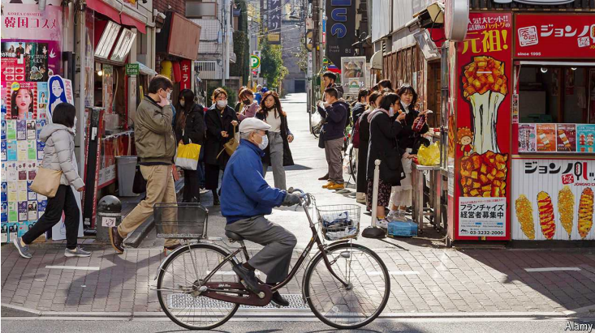
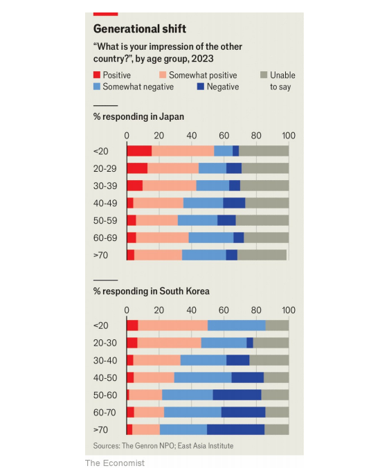

# Could Japan and South Korea finally become friends?

Younger generations are less concerned with their country’s shared history

原文：

National Liberation Day is traditionally an occasion for solemn celebration

in South Korea, marking the country’s independence from its colonial

overlord, Japan. Yet for many younger South Koreans, the holiday has

become a day off like any other, and a chance to unwind. This year, on

August 15th, scores of 20-somethings filled a pop-up bar in Seoul, the

capital, for a party featuring drinks from around the world, including

Japanese sake. “I know it’s Liberation Day, but we decided to do something

fun together,” says Min Young-ji, a 28-year-old who was there with her 27-

year-old sister, Gyoung-im. As children they raised South Korean flags with

their parents during the holiday, but these days “you see fewer and fewer

flagpoles”, says Gyoung-im.

在韩国，民族解放日传统上是一个庄严庆祝的日子，标志着这个国家从殖民宗主国日本的统治下独立出来。然而，对于许多年轻的韩国人来说，这个节日已经成为一个和其他节日一样的休息日，也是一个放松的机会。今年，8月15日，数十名20多岁的年轻人聚集在首都首尔的一个临时酒吧，参加一个以世界各地的饮料为特色的聚会，包括日本清酒。“我知道今天是解放日，但我们决定一起做些有趣的事情，”28岁的赵敏英-吉(音译)说，她和27岁的妹妹金妍(Gyoung-im)也在那里。Gyoung-im说，小时候，他们在节日期间和父母一起升起韩国国旗，但这些天“你看到的旗杆越来越少了”。

学习：

solemn：美 [ˈsɑːləm] 庄严的；严肃的

solemn celebration：庄严的庆祝

overlord：美 [ˈoʊvərˌlɔrd] 统治者；君主；主宰；领袖；支配者

unwind：放松；轻松；松弛

a chance to unwind：放松的机会

20-somethings：20多岁的人

pop-up bar： 临时或快闪酒吧

>
>
>这里的“pop-up bar”指的是临时或快闪酒吧。这种酒吧通常只在短时间内运营，可能是几天或几周，之后就会关闭或移到其他地方。这类酒吧往往设置在特殊的场所，如城市中的空闲店铺，或是为了某个特定的活动或主题而设立。

sake：美 [seɪk , ˈsɑːki] 日本米酒；日本清酒

flagpole：美 [ˈflæɡˌpoʊl]  旗杆；旗竿

原文：

Diplomatic relations between South Korea and Japan have improved

markedly over the past few years. That is in large part thanks to Yoon Suk

Yeol, South Korea’s president, who came to office in 2022 determined to

repair ties with Japan following a period of bitter disputes over

compensation for atrocities committed during the colonial era. Kishida

Fumio, Japan’s departing prime minister, will visit Seoul this week for a

final summit with Mr Yoon. But officials in both countries also credit

generational change for helping to transform the relationship.

韩国和日本之间的外交关系在过去几年里有了明显的改善。这在很大程度上要归功于2022年上台的韩国总统尹锡悦，他决心修复与日本的关系，此前一段时间，围绕殖民时代所犯暴行的赔偿问题存在激烈争议。日本即将离任的首相岸田文雄将于本周访问首尔，与尹先生举行最后一次峰会。但两国官员也认为代际变化有助于改变两国关系。

学习：

diplomatic relations：外交关系

markedly：显著地；明显地

in large part：很大程度上；在很大程度上

came to office：上台，掌权

repair ties with：修复xxx的关系

bitter disputes：激烈的争论

atrocities：美 [əˈtrɔsitiz] 暴行；（atrocity的复数）

原文：

Today’s youth are on far better terms with their neighbours than their parents

or grandparents were. While just over 20% of South Koreans over 50 years

old have a positive impression of Japan, over 45% of 18- to 29-year-olds do,

according to Genron NPO, a Japanese think-tank, and the East Asia Institute, a

South Korean one, which conduct annual studies of public opinion. Among

Japanese, over 45% of 18- to 29-year-olds see South Korea positively,

compared with 35% of those over 50 (see chart).

今天的年轻人与邻居的关系比他们的父母或祖父母当时与邻居的关系好得多。根据日本智库Genron NPO和韩国东亚研究所(East Asia Institute)的数据，虽然50岁以上的韩国人中只有20%以上对日本有正面印象，但18至29岁的人中有超过45%的人对日本有正面印象。东亚研究所每年都会进行民意调查。在日本，超过45%的18-29岁的年轻人对韩国持积极态度，相比之下，50岁以上的人中只有35%持积极态度(见图表)。

学习：

on better terms with：与……的关系要好得多

>这里的 "terms with" 是指人与人或团体之间的关系或相处状况。 "on far better terms with" 的意思是“与……的关系要好得多”。
>
>举例：
>
>- "After years of conflict, the two countries are now on better terms with each other, engaging in trade and diplomacy more frequently."
>  （经过多年的冲突后，两国现在关系好多了，贸易和外交互动更为频繁。）
>- "John is on good terms with his colleagues, making the workplace environment more pleasant."
>  （约翰和同事关系很好，使工作环境更加愉快。）

have a positive impression of：对xxx有正面印象

原文：

In part, the passage of time has dulled the intensity of bitter memories.

“History is very much alive for my generation, but not for the younger

generation,” sighs Oh Gun-suk, whose grandfather was held at the notorious

Seodaemun prison for taking part in an anti-Japanese resistance movement

in 1919.

在某种程度上，时间的流逝淡化了痛苦记忆的强度。“对我这一代人来说，历史是活生生的，但对年轻一代来说却不是，”吴君石叹息道，他的祖父因参加1919年的反日抵抗运动而被关押在臭名昭著的西大门监狱。

学习：

passage of time：时光流逝；时间推移；星移斗转          

dull：减少（痛苦、感觉等）的强度；

bitter：痛苦的；悲伤的；

bitter memories：痛苦的记忆

原文：

As South Korea developed, the power dynamics also shifted. Young South

Koreans, who came of age in a rich country, have no sense of inferiority and

more pride in their own heritage. Mutual cultural affinities have bred legions

of anime fans in South Korea and K-pop fans in Japan.

随着韩国的发展，权力格局也发生了变化。年轻的韩国人成长在一个富裕的国家，他们没有自卑感，对自己的传统更加自豪。相互的文化亲和力已经在韩国培养了大批的动漫迷和日本的K-pop迷。

学习：

come of age：成年

inferiority：英 [ɪnˌfɪəriˈɒrəti] 自卑感；次等；低劣

sense of inferiority：自卑感

affinity：美 [əˈfɪnəti]  亲和力；吸引力；相似性；

legions：军队；万马千军；众多；军团；（legion的复数）

anime：美 [ˈænɪmeɪ] 日本动画片；动漫；日本风格的动画 **注意发音**

K-pop: 韩国流行音乐（Korean Pop）

>
>
>这里的“K-pop”是指韩国流行音乐（Korean Pop），它是一种结合了多种音乐类型（如流行、嘻哈、R&B、电子音乐等）的韩国音乐风格。K-pop不仅指音乐，还包括视觉效果、编舞和偶像文化，吸引了大量的全球粉丝群体。
>
>举例：
>
>- 防弹少年团（BTS）：BTS是世界范围内最受欢迎的K-pop男团之一，他们不仅在韩国，也在欧美市场大获成功。歌曲如《Dynamite》和《Butter》在全球排行榜中名列前茅。
>- Blackpink：这个女子组合以其强大的舞台表现力和音乐风格吸引了全球粉丝。她们的歌曲《How You Like That》和《Kill This Love》成为了全球K-pop粉丝的热门曲目。

原文：

First-hand experience of each other’s country is widespread, too. South

Koreans made up the largest share of foreign visitors to Japan last year, and

Japanese the largest group of visitors to South Korea. “Japan has a certain

attractive quality to it,” Gyoung-im says. “I’m not sure I should say such

things today of all days, but it’s the truth!” Similarly, on the same day in

Japan, the streets of Shin-Okubo, Tokyo’s “Korea town”, were bustling.

Young Japanese swooned over photographs of K-pop stars and munched on

Korean street food, from crunchy corn dogs to *tteok-bokki*, a sticky, spicy

rice cake. “I’ve never been to Korea but I want to go,” says Suzuki Dai, an

18-year-old who is trying to learn how to read *hangul*, the Korean alphabet.

彼此国家的第一手经验也很普遍。去年，韩国人占了访日外国游客的最大份额，而日本人是访韩游客的最大群体。“日本有某种吸引人的特质，”Gyoung-im说。“我不确定我应该说这样的事情，但这是事实！”同样，当天在日本，东京“韩国小镇”新大久保的街道上熙熙攘攘。年轻的日本人迷恋韩国流行歌星的照片，大嚼韩国街头小吃，从松脆的玉米热狗到粘粘的辣年糕。“我从未去过韩国，但我想去，”18岁的戴(音译)说，她正努力学习如何阅读韩文。

学习：

have a attractive quality：有吸引人的特质

bustling：喧闹；裙撑；热闹的活动；熙熙攘攘的；繁忙的；忙乱；（bustle的现在分词形式）

swooned：痴迷；（swoon的过去式）          

munched：大声咀嚼；（munch的过去式和过去分词）          

street food：街头小吃

crunchy：松脆的；口感脆的；

rice cake：年糕；米糕；米饼

原文：

Yet it would be a mistake to confuse fandom for fundamental shifts in the

national narratives. Young Japanese may be more familiar with South

Korean songs and shows but often lack knowledge of the darker chapters of

their shared history. “I do see people talking about stuff on the news, but

honestly I don’t pay much attention. It’s not something I’m conscious of,”

Mr Suzuki acknowledges. Tucked beside shops selling Korean cosmetics in

Shin-Okubo in Tokyo, the Koryo Museum of Korean history receives

relatively few visitors. Young people come mostly to rent *chima jeogori*,

traditional Korean dresses, sighs Ogihara Midori, a curator at the museum.

While walking past displays about comfort women, the euphemistic moniker

for Japan’s wartime sex slaves, “sometimes they go ‘Huh? what is this?’”

Ms Ogihara says. “Then I explain and they go ‘Huh! I didn’t know that!’”

然而，将粉丝群体与国家叙事的根本转变混为一谈是错误的。年轻的日本人可能更熟悉韩国歌曲和节目，但往往缺乏对他们共同历史中黑暗章节的了解。“我确实看到人们在新闻上谈论一些事情，但老实说，我并不太注意。我没有意识到这一点，”铃木承认道。坐落在东京新大久保卖韩国化妆品的商店旁边，高丽历史博物馆接待的游客相对较少。博物馆馆长奥吉原·美岛莉感叹道:“年轻人来这里主要是为了租马驰jeogori，这是传统的韩国服装。”。走过关于慰安妇(日本战时性奴隶的委婉称呼)的展览时，“有时候她们会说‘啊？这是什么？”Ogihara女士说然后我解释，他们说“啊！我不知道！"

学习：

confuse：混淆；（将…）混同

fandom：美 ['fændəm] 影迷；运动迷；粉丝圈

national narratives：国家叙事

tuck：把…塞进狭窄的空间

receive relatively few visitors：接待相对较少的游客

curator：美 [kjʊˈreɪtər] （博物馆或美术馆等的）馆长；负责人

comfort women：慰安妇

euphemistic：美 [ˌjufəˈmɪstɪk] 委婉的；婉转的

moniker： 英 [ˈmɒnɪkə] 绰号；别名

euphemistic moniker：委婉的叫法

原文：

Relations with Japan remain a politically charged issue in South Korea.

Opposition parties spurned the government’s official Liberation Day events

this year, to protest at Mr Yoon’s choice of a conservative historian to head

the main independence history museum. “Things can look good on the

surface”, but if historical disputes remain unresolved, relations can sour

again, says Hong Joo-hyun of the Independence Activists’ Families

Association, a South Korean outfit which supports the descendants of

activists.

在韩国，与日本的关系仍然是一个充满政治意味的问题。反对党拒绝参加政府今年的官方解放日活动，以抗议尹先生选择一位保守派历史学家来领导主要的独立历史博物馆。“事情表面上看起来很好”，但是如果历史争端得不到解决，关系可能会再次恶化，韩国独立活动分子家庭协会的Hong Joo-hyun说，该协会是一个支持活动分子后代的机构。

学习：

politically charged：充满政治意味的

spurned：一脚踢开；（spurn的过去式和过去分词）；藐视；摒弃          

historical disputes：历史争端

remain unresolved：没有解决

relations can sour：关系会变坏

descendants：后代，子孙

## **K-pop diplomacy**

原文：

For many in South Korea, resistance to Japanese aggression remains central

to the country’s identity. Schools still take students to visit the museum at

Seodaemun Prison; in Korean textbooks and in popular culture tales of the

heroism of Korean nationalists and the brutality of Japanese imperialists are

ubiquitous. On one of Seoul’s central avenues stands a 17-metre statue of

Admiral Yi Sun-sin, who helped defeat Japanese forces in the 16th century.

对许多韩国人来说，抵抗日本侵略仍然是这个国家身份的核心。学校仍然带学生去参观西大门监狱的博物馆；在韩国的教科书和流行文化中，韩国民族主义者的英雄主义和日本帝国主义者的残暴无处不在。在首尔的一条中央大街上矗立着一座17米高的海军上将李善信的雕像，他曾在16世纪帮助打败日本军队。

学习：

aggression：侵略；攻击；侵害；侵占；

resistance to Japanese aggression：抵抗日本侵略

textbook：教科书，课本

heroism：美 [ˈheroʊɪzəm] 英雄精神；英勇表现；英勇事迹

brutality：残忍；暴行；野蛮          

admiral：英 [ˈadm(ə)r(ə)l] 海军上将；舰队司令；海军将官

原文：

Plenty of young parents still consider it a duty to teach their children about

the colonial era. At a ceremony at Seoul’s Bosingak pavilion on August

15th, a choir of women and girls clad in white sang odes to independence

fighters; the crowd chanted “Mansei”, a traditional independence call. Kim

Min-ji went there with her two primary-school-age children. “I won’t accept

an apology from Japan!” her youngest son exclaims. “Japan wants to get rid

of Korea!” Ms Kim chuckles and corrects him: “That was a long time ago.”

But, even so, it is still hard to forget. ■

许多年轻的父母仍然认为教育他们的孩子了解殖民时代是一种责任。8月15日，在首尔波辛加阁的一个仪式上，一个由身着白衣的妇女和女孩组成的合唱团为独立战士唱颂歌；人群高呼“Mansei”，这是一种传统的独立呼声。金玟和她的两个上小学的孩子去了那里。“我不会接受日本的道歉！”她的小儿子惊呼道。“日本要搞掉韩国！”金女士笑着纠正他:“那是很久以前的事了。”但是，即使如此，还是很难忘记。■

学习：

pavilion：美 [pəˈvɪliən] 亭子；凉亭；阁

clad：穿着衣服的；覆盖着的

odes：美 [əʊdz] 颂诗；（ode的复数）

two primary-school-age children：两个上小学的孩子

exclaims：美 [ɪk'sklemz] 呼喊；惊叫；（exclaim的第三人称单数）

chuckles：英 [ˈtʃʌklz] 咯咯地笑；（chuckle的第三人称单数）

## 后记

2024年9月8日17点37分于上海。

