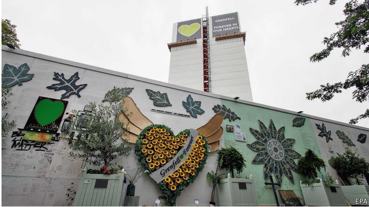

# A tardy, scathing report on the Grenfell Tower fire in London

Blaming lots of people slows things down

tardy：美 [ˈtɑrdi] 迟到的；延迟的；迟缓的；

scathing：美 [ˈskeɪðɪŋ] 严厉的；尖刻的；苛刻的；刻薄的；尖锐批评的

原文：

The worst thing that can be said of a public inquiry is that it is a whitewash.

Perhaps it is too narrow, too rushed or too gentle. None of which can fairly

be said of Sir Martin Moore-Bick’s final report into the fire that tore through

Grenfell Tower in London in 2017, killing 72 people. The report was

released on September 4th, seven years after the fire. It is almost 1,700

pages long (a preliminary report, released in 2019, was 850 pages long) and

casts blame in every direction.

公开调查最糟糕的事情就是它是一种粉饰。也许它太狭隘、太匆忙或太温和。马丁·摩尔-比克爵士对2017年伦敦格伦费尔大厦大火的最终报告中没有一项是公平的。这份报告在火灾发生七年后的9月4日发布。这份报告长达近1700页(2019年发布的初步报告长达850页)，对各方进行了指责。

学习：

public inquiry： 公开调查；公众调查          

whitewash：美 [ˈ(h)waɪtˌwɑʃ] 粉饰；掩盖；美化；

rushed：匆忙的；贸然的；

tore：撕裂；撕毁；扯破；挣开；拉伤；猛拉；（tear的过去式）

tore through:  快速猛烈地穿过或袭击

>"Tore through" 意思是“快速猛烈地穿过或袭击”，常用来形容破坏力极大的事件，比如火灾、风暴等迅速蔓延的情况。例子：
>
>- **英文**: A devastating hurricane tore through the coastal town, leaving destruction in its wake.
>- **中文**: 一场毁灭性的飓风迅速袭击了沿海小镇，留下了一片破坏。
>
>在你提到的句子中，“the fire that tore through Grenfell Tower” 表示火灾猛烈而迅速地蔓延，造成了极大的破坏和伤亡。

1700 pages long：长达1700页

in every direction：各个方向；每个方向；四面八方          

原文：

Grenfell burned rapidly because of its exterior cladding, which was added

during renovations in the mid-2010s. Sir Martin, a retired judge, concludes

that some of the cladding manufacturers engaged in “systematic dishonesty”.

The report finds that one firm, Arconic, possessed test data showing that a

type of panel could react dangerously to fire, yet continued to tell the market

that it was classified as safe. An insulation firm, Celotex, “embarked on a

dishonest scheme to mislead its customers”, submitting materials for testing

that contained additional fire-resistant boards.

格伦费尔燃烧迅速，因为它的外部覆层，这是在2010年代中期的翻修期间增加的。退休法官马丁爵士得出结论，一些包层制造商参与了“系统性的欺诈”。该报告发现，一家名为Arconic的公司拥有的测试数据显示，一种面板可能对火灾做出危险的反应，但却继续告诉市场它被归类为安全的。一家名为Celotex的绝缘材料公司“开始了一项误导顾客的不诚实计划”，提交了含有额外防火板的测试材料。

学习：

exterior：英 [ɪkˈstɪəriə] 外部的；外面的；外观的；外表的；

cladding：美 [ˈklædɪŋ] 镀层；保护层；外层；绝缘层；

renovations：革新；翻新；（renovation的复数）          

dishonesty：不诚实；不诚信；欺骗；欺诈；

insulation：美 [ˌɪnsəˈleɪʃn] 绝缘；隔热；隔音；孤立；隔热材料

fire-resistant：防火的；耐火的；抗火的          

原文：

Fire had spread through cladding on other buildings before 2017. After one

tower in London caught fire in 2009, killing six people, some of its panels

were tested. They burned so fiercely, while dripping flaming debris, that the

testing outfit feared for its equipment. Yet regulations stayed lax. Architects

and contractors assumed it was someone else’s responsibility to ensure that

panels were safe.

在2017年之前，火已经通过其他建筑物的覆层蔓延。2009年，伦敦的一座塔楼着火，导致6人死亡，之后，它的一些面板接受了测试。他们燃烧得如此激烈，同时滴落燃烧的碎片，以至于测试机构担心他们的设备。然而，监管仍然松懈。建筑师和承包商认为确保面板安全是其他人的责任。

学习：

caught fire：着火

flaming：熊熊燃烧的；火红的；

debris： 美 [dəˈbriː] 残骸；碎片；瓦砾；碎屑；

outfit：机构

lax：松懈的；不严格的；马虎的

regulations stay lax：监管很松懈

architects：建筑师；创造者；缔造者；设计师；（architect的复数）          

contractors：承包商

原文：

In the background, while fateful decisions were being made to clad Grenfell

Tower in dangerous materials, were Conservative-led governments. The

report suggests they made matters worse. Cuts to local-authority budgets left

the inspector responsible for Grenfell Tower overseeing up to 130 projects.

A national deregulation drive made civil servants loth to propose new safety

measures. Sir Martin points to “a serious failure of leadership” in the

housing department.

在这种背景下，保守党领导的政府正在做出重大决定，用危险材料包裹格伦费尔大楼。报告显示他们让事情变得更糟。地方政府预算的削减使得负责格伦费尔大厦的检查员监督了多达130个项目。全国性的放松管制运动使得公务员不愿意提出新的安全措施。马丁爵士指出了住房部“严重的领导失误”。

学习：

fateful：决定性的；重大的；命运的

fateful decisions：重大决定

inspector：检查员；调查员；审查员；巡视员；

civil servants：公务员

原文：

As for the London Fire Brigade, it was complacent and poorly led. It failed

to plan for a large fire in a tower block or to prepare for the many phone

calls that would result. In 2017 the control room was overwhelmed. Some

call handlers told people that the fire was far away when it was not. One

resident, who said the smoke was so thick that “you could not see a hand in

front of ya”, was not told to leave.

至于伦敦消防队，它自满且领导不力。它没有为大楼里的一场大火做好准备，也没有为可能发生的许多电话做好准备。2017年控制室不堪重负。一些电话接线员告诉人们火灾已经扑灭了，而事实并非如此。一位居民说，烟太浓了，以至于“你在你面前看不到一只手”，但他没有被告知离开。

学习：

brigade：美 [brɪˈɡeɪd] 大队（军事单位或消防、警察等组织）；团体

fire brigade： 消防队；消防部门；救火队；

complacent：美 [kəmˈpleɪsnt] 自满的；自鸣得意的；沾沾自喜的

poorly led：领导不力

tower block：高层建筑；塔式建筑；高楼大厦；塔楼

smoke was thick：烟很浓

原文：

Among other recommendations, Sir Martin says that Britain should create an

independent construction regulator, reporting to a single department. A

professional body should be created for fire engineers; at present, the title

means little. A College of Fire and Rescue should be built—something the

government has said it wants. Firefighters ought to use high-powered radios

more often, to avoid the cut-outs that occurred during the Grenfell Tower

blaze.

在其他建议中，马丁爵士说英国应该建立一个独立的建筑监管机构，向一个单一的部门报告。应该为消防工程师建立一个专业机构；目前来看，标题意义不大。应该建立一所消防和救援学院——这是政府已经说过想要的。消防队员应该更多地使用高功率无线电，以避免在格伦费尔大楼大火期间发生的断电。

学习：

high-powered：高功率的；高性能的；

blaze：烈火；火焰；火灾

原文：

Some survivors of the fire have welcomed the report and look forward to

prosecutions. But it has been a long time in coming partly because it blames

so many people. The inquiry’s solicitors informed 247 people and

organisations of the criticisms that would be made of them and then dealt

with their responses—a process that “took much longer than had been

expected”. That may have reduced the report’s potency.

一些火灾幸存者对报告表示欢迎，并期待起诉。但是它的到来已经过了很长时间，部分原因是它指责了太多的人。该调查的律师通知了247个人和组织对他们的批评，然后处理他们的回应——这个过程“比预期的要长得多”。这可能降低了报告的效力。

学习：

solicitor：美 [səˈlɪsɪtər]  律师；事务律师；诉状律师； （英国某些地方政府的）法律顾问官

potency：美 [ˈpoʊtnsi] 效力；威力；

reduce report's potency：降低报告的效力

原文：

In the past seven years the architecture firm that worked on the

refurbishment of Grenfell Tower has closed; people have changed jobs;

politicians have come and gone. It is easier for everyone to say that faults

have already been fixed. This is a known drawback of slow inquiries. Soon

after the Grenfell fire, the Institute for Government, a think-tank, argued that

the “window of opportunity for change” tends to close as systems and

institutions move on after a disaster. And Sir Martin’s report is too hefty to

be widely read.

在过去的七年里，致力于格伦费尔大厦翻新的建筑公司已经关闭；人换了工作；政治家来了又走。大家更容易说故障已经修好了。这是缓慢查询的一个众所周知的缺点。格伦费尔火灾后不久，智库政府研究所认为，随着灾难后系统和机构的发展，“变革的机会之窗”往往会关闭。马丁爵士的报告过于繁重，无法广泛阅读。

学习：

architecture firm：建筑事务所；建筑公司；建筑设计公司          

refurbishment： 英 [rɪ'fɜːbɪʃmənt] 翻新；整修

drawback：缺点；不利条件；障碍

原文：

British public inquiries were not always so exhaustive. In May 1968 one

corner of Ronan Point, a new tower block in London, collapsed. An inquiry

began the following day and concluded six months later. The report was just

82 pages long. It avoided casting blame, arguing it was more important “that

the eyes of all may be opened in the future”. The investigation led to stricter

building codes in Britain and other countries and ended the era of rapidly

built, prefabricated towers.

英国的公开调查并不总是如此详尽。1968年5月，伦敦一座新的塔楼——罗南角的一角倒塌了。第二天开始调查，六个月后结束。这份报告只有82页长。它避免指责，认为更重要的是“所有人的眼睛在未来都可以睁开”。这项调查导致英国和其他国家更严格的建筑法规，并结束了快速建造预制塔的时代。

学习：

exhaustive：美 [ɪɡˈzɔːstɪv] 全面的；彻底的；详尽的

building code：建筑法规

prefabricated：英 [ˌpri:ˈfæbrɪkeɪtɪd] 预先构思；预先制造；（prefabricate的过去式）；预制的

原文：

Still, the country now seems committed to slow, excoriating public inquiries.

The office building in west London where the Grenfell Tower hearings took

place is busy again, with a wide-ranging investigation into how Britain dealt

with the covid-19 pandemic. That might take even longer.■

尽管如此，国家现在似乎致力于缓慢，严厉的公众调查。在伦敦西部举行格伦费尔大厦听证会的办公大楼再次忙碌起来，人们正在对英国如何处理新冠肺炎疫情事件进行广泛的调查。那可能需要更长的时间。■

学习：

excoriating：美 [,ɛks'kɔrɪetɪŋ] 严厉的责难；（excoriate的现在分词）

office building： 办公楼；办公建筑；办公大楼          

wide-ranging：内容广泛的；覆盖面广的；多方面的

## 后记

2024年9月10日12点12分于上海。

