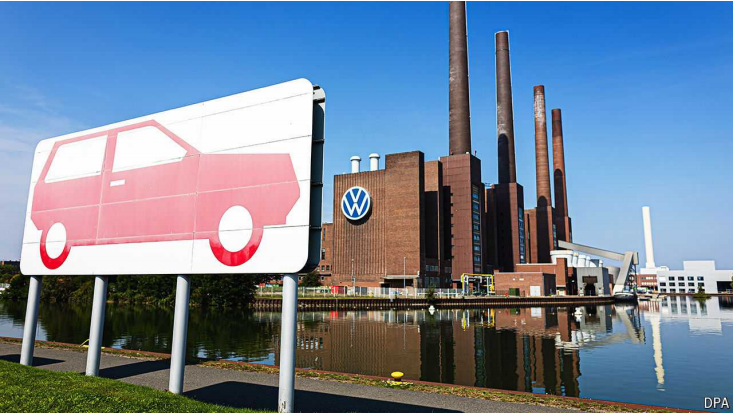

# Repairing VW requires huge upheavals

Closing a few factories will help

upheavals：剧变；激变；

huge upheavals：巨变

原文：

“Costs, costs, costs” are what Oliver Blume, the boss of Volkswagen (VW),

recently said the car giant must address most urgently. His diagnosis of VW’s

longstanding problem is nothing new, but his approach to dealing with it

undoubtedly is. On September 3rd Mr Blume announced that, for the first

time, VW was considering closing factories in Germany to tackle the

“demanding and serious situation” confronting Europe’s carmakers. Even if

he succeeds in doing so, however, shutting factories will not be sufficient to

reverse VW’s dwindling sales and stay ahead of the looming onslaught of

cheap Chinese electric vehicles (EVs).

“成本、成本、成本”是大众汽车(VW)的老板奥利弗·布鲁姆最近说的这个汽车巨头必须紧急解决的问题。他对大众长期问题的诊断并不新鲜，但他处理问题的方法无疑是新鲜的。9月3日，Blume先生首次宣布，大众正考虑关闭在德国的工厂，以应对欧洲汽车制造商面临的“苛刻而严峻的形势”。然而，即使他成功做到了这一点，关闭工厂也不足以扭转大众不断下滑的销量，并在中国廉价电动汽车(ev)即将到来的冲击面前保持领先。

学习：

Volkswagen = VW: 大众

looming：逼近；即将到来的

onslaught：攻击；猛攻

原文：

The difficulty Mr Blume will face closing factories in Germany became

apparent soon after his announcement. The firm’s governance structure

hands significant power to workers and the state of Lower Saxony, which

has a 20% stake in the business and is home to around a third of its 300,000

employees in Germany. Daniela Cavallo, the main official representing VW’s

workers, promised “fierce resistance”. Stephan Weil, premier of Lower

Saxony, says he supports cutting costs but favours alternatives to factory

closures.

布卢姆先生在关闭德国工厂时将面临的困难在他宣布后不久就变得很明显。该公司的治理结构将很大的权力交给工人和下萨克森州，下萨克森州拥有该公司20%的股份，是其在德国30万员工中约三分之一的家乡。代表大众工人的主要官员丹妮拉·卡瓦洛承诺“激烈抵抗”。下萨克森州州长斯蒂芬·韦尔(Stephan Weil)表示，他支持削减成本，但更倾向于关闭工厂以外的其他选择。

学习：

has a 20% stake：拥有20%的股份

premier： 省总理；（澳大利亚州或地区的）省长；州长          

原文：

Wish Mr Blume luck taking on VW’s entrenched interests, which ensure that it

relies heavily on expensive German workers even as rival carmakers have

shifted production to lower-cost countries. Herbert Diess, his abrasive

predecessor, departed in 2022 after several clashes with the unions. It is

unlikely that Mr Blume’s more consensual style will have better results.

祝布鲁姆先生好运，挑战大众的既得利益，这确保了它严重依赖昂贵的德国工人，即使竞争对手已经将生产转移到成本更低的国家。他粗暴的前任赫伯特迪斯(Herbert Diess)在与工会发生几次冲突后，于2022年离职。Blume先生更为一致的风格不太可能有更好的结果。

学习：

entrenched interests: 既得利益；

abrasive：美 [əˈbreɪsɪv] 粗鲁的；生硬粗暴的

consensual： 英 [kənˈsɛnʃʊəl] 基于共识的；自愿的；双方同意的；协议达成的；

原文：

Even if it does, cutting labour costs will not be sufficient to rescue VW from

its parlous state. The carmaker has spent heavily but unwisely in its effort to

transform itself into an EV powerhouse capable of making vehicles that run on

clever software. The company’s shares have continued to slide since Mr

Diess’s departure, even though Mr Blume has cancelled plans for a new EV

factory in Germany and has pushed back EV launches. Investors are wary of

the carmaker’s plans to invest €165bn ($183bn) between 2025 and 2029,

even after Mr Blume trimmed the amount by €5bn, given its reputation for

profligacy and underwhelming sales for its ID range of EVs.

即便如此，削减劳动力成本也不足以将大众从危险的境地中解救出来。这家汽车制造商投入巨资，但不明智地努力将自己转型为一个电动汽车强国，能够制造运行智能软件的汽车。自迪斯离职以来，该公司股价持续下跌，尽管布卢姆取消了在德国新建电动汽车工厂的计划，并推迟了电动汽车的发布。投资者对这家汽车制造商在2025年至2029年期间投资1650亿欧元(合1830亿美元)的计划保持警惕，尽管布鲁姆将投资金额削减了50亿€，原因是该公司以挥霍和旗下ID系列电动汽车销售不佳而闻名。

学习：

parlous：美 [ˈpɑrləs] 危险的；艰难的；

slide: 逐渐恶化；（价格、价值或水平）下跌；

shares  slide：股价下跌

push back：推迟

wary of：警惕；提防；不信任；

underwhelming：令人失望的；没留下好印象的

trim：削减

原文：

Developing software in particular has flummoxed VW. Cariad, its in-house

division, has been a disaster, delivering clunky programs well behind

schedule. Reversing a decision to develop most of its own software, it

invested $5bn in Rivian, an American EV startup, in June to gain access to its

programming expertise. Earlier this year it struck a similar deal with Xpeng,

a Chinese EV startup, to up its game on the mainland. Stephan Reitman of

Bernstein, a broker, calls the move merely a “band-aid” that adds costs and

complexity.

尤其是开发软件让大众感到困惑。其内部部门Cariad是一场灾难，交付的笨重程序远远落后于计划。今年6月，该公司逆转了开发大部分自有软件的决定，向美国电动汽车初创公司Rivian投资50亿美元，以获得其编程专长。今年早些时候，它与中国电动汽车初创公司Xpeng达成了一项类似的协议，提高其在中国大陆的竞争力。Bernstein的经纪人Stephan Reitman称这一举措仅仅是“权宜之计”,增加了成本和复杂性。

学习：

flummoxed：使混乱；（flummox的过去式）；不知所措的；困惑的          

in-house：组织内的；内部处理的；（公司或机构）内部存在的；

clunky：笨重的；沉闷的；粗笨的；

clunky programs：笨重的程序

struck a deal：达成协议

>**Struck a deal**：意思是“达成协议”或“签订交易”。这个表达通常用于描述双方通过谈判达成了某种商业或合作协议。举例：
>
>- **"Apple struck a deal with suppliers to ensure a steady supply of components for its new iPhone."**（苹果与供应商达成协议，以确保其新款iPhone的零部件供应稳定）。

up its game: 提升表现，提高竞争力

>**Game**：在这里的“up its game”意思是“提升表现”或“提高竞争力”，通常指为了在某个领域表现得更好而进行的改进或努力。举例：
>
>- **"The company decided to invest in new technology to up its game in the highly competitive smartphone market."**（公司决定投资新技术，以提高在竞争激烈的智能手机市场中的表现）。

band-aid: 权宜之计

>
>
>**Band-aid**：在这里比喻一种暂时的解决方案，虽然可以暂时缓解问题，但并没有从根本上解决问题，类似“权宜之计”或“应急方案”。举例：
>
>- **"Cutting employee benefits might be a band-aid solution for reducing costs, but it won’t address the company’s underlying financial issues."**（削减员工福利可能是减少成本的权宜之计，但它并不能解决公司根本的财务问题）。

原文：

VW’s business in China, the carmaker’s biggest market, is suffering. It sold

3.2m vehicles in the country last year, down from a peak of 4.2m in 2019

(see chart). As local competitors such as BYD have surged, its market share

there has fallen by five percentage points since 2020, to 14.5% last year. VW is

still the biggest seller of petrol-powered cars but is in seventh place for EVs,

which now account for half of all sales in the country.

大众在中国这个汽车制造商最大的市场的业务正在遭受损失。去年，该公司在中国销售了320万辆汽车，低于2019年420万辆的峰值(见图表)。随着比亚迪等本土竞争对手的崛起，其市场份额自2020年以来下降了5个百分点，去年降至14.5%。大众仍是最大的汽油动力汽车销售商，但在电动汽车方面排名第七，电动汽车目前占中国总销量的一半。

学习：

petrol-powered cars：油车

原文：

VW hopes to use Xpeng’s know-how to get up to “China speed”, cutting by

30% the time it takes to get new models to market, and to slash production

costs by 40%. Even if it can do so by 2026, when the first new cars from the

partnership hit the road, nimble Chinese competitors will be even farther

ahead.

大众希望利用Xpeng的技术达到“中国速度”,将新车型推向市场的时间缩短30%,生产成本降低40%。即使它能在2026年合作的第一批新车上路时做到这一点，敏捷的中国竞争对手也会走在更前面。

学习：

know-how： 技能；专业技能；专业知识；技术

slash：降低成本

hit the road：上路；上路吧；出发

nimble：敏捷的；灵活的；机敏的

原文：

On September 4th 16,000 German workers gathered to hear from

management about the cuts. “We still have a year, maybe two years, to turn

things around,” said Arno Antlitz, VW’s chief financial officer. If the carmaker

is to truly get back in the race, Mr Blume will need to move at China speed.■

9月4日，16000名德国工人聚集在一起听取管理层关于削减成本的意见。“我们还有一年，或许两年的时间来扭转局面，”大众首席财务官阿诺·安特利茨(Arno Antlitz)表示。如果这家汽车制造商想要真正回到竞争中，布卢姆需要以中国的速度前进。■

学习：

turn around：扭转局面

## 后记

2024年9月13日10点00分于上海。

