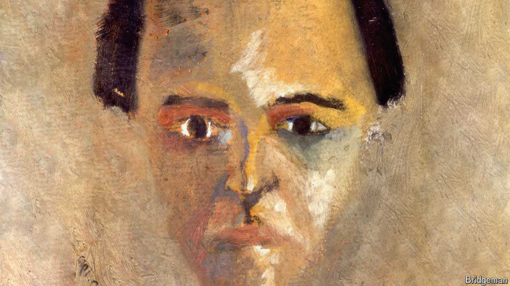

# Arnold Schoenberg was one of classical music’s most important rebels

But, 150 years after his birth, he is underappreciated

>
>
>阿诺德·勋伯格（Arnold Schoenberg）是古典音乐史上最重要的革新者之一，出生于1874年，逝世于1951年。他是奥地利-美国作曲家、音乐理论家和教育家，被誉为20世纪音乐的先驱之一。勋伯格最为人知的是他对传统和声体系的大胆突破，尤其是他创立的十二音技法，这种方法完全摒弃了传统调性音乐的和声结构，开启了无调性音乐的时代。
>
>他的代表作包括《升华之夜》《古雷之歌》《五首管弦乐曲》《月迷彼埃罗》等，这些作品展现了他在音乐结构和情感表达上的深度探索。除了作曲，他还是一位重要的音乐理论家，著有《和声学》等理论著作，对后世音乐发展产生了深远影响。
>
>Arnold Schoenberg was an Austrian composer, music theorist, and painter, known for being one of the most influential figures in 20th-century classical music. He is best known for developing the twelve-tone technique, a method of composition that abandons traditional tonality. This innovation had a profound impact on the evolution of modern music. Schoenberg's works are often noted for their atonality, a break from the harmonic conventions of his time. Some of his key compositions include *Verklärte Nacht*, *Pierrot Lunaire*, and *A Survivor from Warsaw*. His influence extends to numerous composers who followed in his footsteps, and he is regarded as a pivotal figure in the transition from late-Romanticism to modernism.

原文：

“WERE I A gambling man,” Glenn Gould said in 1966, “I would be very

inclined to place my money on the prospects for immortality of Arnold

Schoenberg above and beyond any other composer who’s lived in our era.”

Gould, a Canadian pianist, was not expressing an outlandish opinion.

Schoenberg, who was born 150 years ago, on September 13th 1874,

revolutionised Western music. By the middle of the 20th century his music

was probably more influential than that of any other composer. Aaron

Copland, an American composer, felt that all contemporary music “owes

something to his daring”.

“如果我是一个赌徒，”格伦·古尔德在1966年说，“我会非常倾向于把我的钱押在阿诺尔德·勋伯格的不朽的前景上，超过我们这个时代的任何其他作曲家。”加拿大钢琴家古尔德并没有表达古怪的观点。150年前出生于1874年9月13日的勋伯格彻底改变了西方音乐。到20世纪中叶，他的音乐可能比任何其他作曲家的音乐都更有影响力。美国作曲家阿隆·科普兰认为，所有的当代音乐都“归功于他的大胆”。

学习：

pianist：美 [ˈpiːənɪst] 钢琴家；钢琴弹奏者；

outlandish：美 [aʊtˈlændɪʃ] 古怪的；异乎寻常的；奇异的

daring：胆量；大胆；勇气；勇敢；冒险精神

原文：

Yet it was probably a good thing Gould did not bet, as Schoenberg has

mostly vanished from the public consciousness. Other mould-breakers of the

past century—Pablo Picasso, for instance, or the Expressionists—are still

celebrated. Igor Stravinsky, who, like Schoenberg, provoked a concert-hall

uproar in 1913, is beloved by classical-music audiences. So why is

Schoenberg a ghost by comparison?

然而，古尔德没有下注可能是件好事，因为勋伯格已经基本上从公众意识中消失了。上个世纪的其他创新者——比如巴勃罗·毕加索或者表现主义者——仍然享有盛名。伊戈尔·斯特拉文斯基，像勋伯格一样，在1913年引起了音乐厅的骚动，受到古典音乐观众的喜爱。那么相比之下，勋伯格为什么没有受关注呢？

学习：

mould：美 [moʊld] 模具；模型；

mould-breaker：打破常规者，创新者

uproar：美 [ˈʌprɔːr] 喧嚣；骚动；吵闹

原文：

The 150th birthday offers an opportunity to think anew about an

idiosyncratic figure. Born into a Jewish family in Vienna, he became a

Lutheran in 1898 (a strange way to seek acceptance in Catholic Austria).

Schoenberg had an avant-gardist’s disdain for the public: he thought the

artist was “always against” the world. He made difficult demands of

musicians, too. An early oratorio calls for three choruses, five solo singers

and 150 instruments.

150岁生日提供了一个重新思考一个特殊人物的机会。他出生在维也纳的一个犹太家庭，1898年成为一名路 德 教 徒(在信奉天 主 教的奥地利，这是一种寻求认可的奇怪方式)。勋伯格有一种先锋派对大众的蔑视:他认为艺术家“总是反对”这个世界。他也对音乐家提出了苛刻的要求。早期的清唱剧需要三个合唱团，五个独唱歌手和150件乐器。

学习：

idiosyncratic：英 [ˌɪdiəsɪŋˈkrætɪk] 怪异的；独特的；个性化的

avant-gardist：先锋派

disdain：美 [dɪsˈdeɪn] 蔑视；鄙视；轻蔑；

oratorio：英 [ˌɒrəˈtɔːrɪəʊ] 清唱剧；神剧；宗教剧

chorus：美 [ˈkɔːrəs]  合唱队；合唱曲

原文：

Schoenberg’s “String Quartet No. 2”, composed in 1907-08, broke with

convention by adding songs. The more radical innovation came in the fourth

movement, where Schoenberg did away with a key signature. Its absence

signified the advent of what came to be known as “atonality” (though

Schoenberg did not like the term).

勋伯格创作于1907-08年的《第二弦乐四重奏》打破常规，加入了歌曲。更彻底的创新出现在第四乐章，勋伯格取消了调号。它的消失标志着后来被称为“无调性”的出现(尽管勋伯格不喜欢这个术语)。

学习：

key signature：调号；调性符号；调记号；音调标记；

atonality：无调性

原文：

The key signature is a home address. Before Schoenberg, composers were

straying in increasingly audacious ways, but they tended to return: unsettling

dissonance would be followed by comforting consonance. Schoenberg

spurned such comfort. In his “free atonal” works no chord has special status;

musical phrases do not resolve in satisfying cadences. In throwing off the

“shackles of tonality” Schoenberg sought a musical language that could

better express emotional truths.

调号是家庭住址。在勋伯格之前，作曲家们以越来越大胆的方式迷失了方向，但他们往往会回归:令人不安的不和谐音之后会出现令人欣慰的和谐。勋伯格拒绝了这种安慰。在他的“自由无调性”作品中，没有和弦具有特殊的地位；乐句不能满足节奏。在挣脱“调性的枷锁”的过程中，勋伯格寻求一种能够更好地表达情感真相的音乐语言。

学习：

straying：迷路的；迷路者；走失的家畜；迷路；偏离；（stray的现在分词）          

audacious：大胆的；勇敢的；无畏的；敢于冒险的

dissonance：不和谐；不协和音；不一致

consonance： 和谐；一致性；协调；

spurn： 藐视；摒弃          

atonal：美 [eɪˈtoʊnl] 无调的；无调性音乐的；非传统调式的；不协和的

chord：和弦；和音；弦

cadences： 美 [ˈkeɪdənsɪz] 调子；节奏；（cadence的复数）

shackles：美 ['ʃæklz] 脚镣；镣铐；束缚；（shackle的复数）

原文：

After the trauma of the first world war, Schoenberg devised his version of a

form of atonality called serialism: the musical foundation of a piece would

be a row of all 12 possible tones, none of which could be repeated until all

had been heard. The row itself would become a new sort of home.

在第一次世界大战的创伤之后，勋伯格设计了一种被称为序列主义的无调性形式:一首曲子的音乐基础是一排所有12个可能的音调，其中任何一个都不能重复，直到所有的都被听到。音列本身会成为一种新的“家”。

学习：

trauma：创伤；外伤；损伤；精神创伤；

>
>
>最后一句话的意思是：音列本身会成为一种新的“家”，即在传统音乐中，调性和主音（如C大调的C音）通常被视为音乐的“家”，但在无调性的音乐中，音列中的每一个音都被视为同等重要，而音列本身就成为了音乐的基础和中心。

原文：

But atonality, whether free or serial, alienated listeners. One Viennese

newspaper printed its report on the premiere of the second quartet in the

crime section. After encountering some of Schoenberg’s atonal works,

Richard Strauss, a fellow composer, declared that his peer should shovel

snow, not write scores.

但是无调性，无论是自由的还是连续的，疏远了听众。一家维也纳报纸在犯罪版刊登了它对第二部四重奏首演的报道。在接触到勋伯格的一些无调性作品后，他的作曲家同事理查·施特劳斯宣称，勋伯格应该铲雪，而不是谱子。

>
>
>最后一句话的意思是：理查德·施特劳斯（Richard Strauss），作为另一位作曲家，在听到勋伯格的一些无调性作品后，讽刺地说勋伯格应该去铲雪，而不是写乐谱。这句话表达了施特劳斯对勋伯格音乐的不满或不屑，认为他不适合继续作曲。

学习：

shovel：铲

shovel snow：铲雪

原文：

Schoenberg saw himself as saving the tradition that he seemed to defy. His

music, he declared, was “no more revolutionary than any other

development” in musical history. He found followers who themselves were

among the century’s most significant composers. With Alban Berg and

Anton Webern he formed the Second Viennese School (the first one included

Beethoven, Haydn and Mozart).

勋伯格认为自己拯救了他似乎蔑视的传统。他宣称，他的音乐在音乐史上“不比任何其他发展更具革命性”。他发现自己的追随者是本世纪最重要的作曲家。他与阿尔班·贝尔格和安东·韦伯恩组成了第二个维也纳学派(第一个学派包括贝多芬、海顿和莫札特)。

学习：

Viennese School：维也纳学派

原文：

After he emigrated to America to escape the Nazis, and returned to Judaism,

Schoenberg became a seer to a generation of composers. Pierre Boulez, a

French composer, thundered that “All non-serial composers are useless” (he

also damned the Austrian for failing to take his revolution further). Even

Stravinsky, Schoenberg’s greatest rival, began composing 12-tone pieces in

the 1950s.

在他为躲避纳 粹而移民美国，并回归犹太 教后，勋伯格成为了一代作曲家的先知。法国作曲家皮埃尔·布列兹怒斥“所有非系列作曲家都是无用的”(他还谴责奥地利人未能进一步推动他的革命)。甚至连勋伯格最大的竞争对手斯特拉文斯基也在20世纪50年代开始创作12音乐曲。

学习：

emigrated：美 [ˈemiɡreitid] 移居国外，移民；（emigrate的过去式）

Judaism：犹太教

seer：（尤指旧时）预言家；先知

## **Key changes**

原文：

Yet as Schoenberg’s influence grew, the popularity of new classical music

started to shrink. It became preoccupied with solving musical puzzles, and

found a friendlier home in universities than in concert halls. One Schoenberg

acolyte, Milton Babbitt, wrote an essay in 1958 called “Who Cares if You

Listen?”.

然而，随着勋伯格影响力的增长，新古典音乐的受欢迎程度开始下降。它变得专注于解决音乐难题，并在大学找到了比音乐厅更友好的家。勋伯格的一位助手米尔顿·巴比特在1958年写了一篇名为《谁在乎你听不听》的文章。

学习：

preoccupied with：沉浸在；专注；全神贯注于          

acolyte：美 [ˈækəˌlaɪt] 助手；侍僧；追随者；

原文：

Composers care, as it turns out. To find his voice John Adams, a popular

composer of contemporary classical music, needed to cast off Schoenberg,

the “darkest and most intimidating of all the figures in my personal gallery”.

The work with which Mr Adams broke out of a “long creative lockdown”

was “Harmonielehre”. With deliberate irony, the symphony takes the title of

a harmony textbook by Schoenberg. It “was a statement of belief in the

power of tonality at a time when I was uncertain about its future”, Mr

Adams wrote in his memoir.

事实证明，作曲家在乎。为了找到自己的声音，当代古典音乐的流行作曲家约翰·亚当斯需要摆脱勋伯格，他是“我个人画廊中最黑暗、最令人生畏的人物”。亚当斯先生打破“长期创作禁锢”的作品是《和谐乐章》。带有故意讽刺意味的是，这部交响曲被称为勋伯格的和声教科书。亚当斯先生在他的回忆录中写道，这“是在我对它的未来不确定的时候，对调性力量的一种信仰声明”。

学习：

cast off：摆脱；

原文：

These days, devotees lament, Schoenberg’s music is too little heard. “People

just feel scared when they see it in the programme,” says Claire Booth, a

British soprano. All the same, she is “a little surprised at the reticence” of

concert venues to put on Schoenberg’s music in his anniversary year.

这些天来，信徒们哀叹，勋伯格的音乐太少被听到了。英国女高音克莱尔·布斯说:“人们在节目中看到它时会感到害怕。”。尽管如此，在勋伯格的周年纪念日，她对音乐会场地“沉默寡言”感到“有点惊讶”。

学习：

devotees： 英 [ˌdevəˈti:z] 信徒；爱好者；（devotee的复数）

soprano：美 [səˈprænoʊ] 女高音歌手；女高音声部；

reticence：美 [ˈrɛtɪsəns] 沉默；谨慎；无言；

concert venue：音乐会场地

原文：

Yet he achieved immortality, if not in the way Gould thought he would. His

boldness encouraged later composers to go in whatever direction they

wanted, which helps to account for the profusion of styles in classical music

today. Anna Clyne, who used a 12-tone row in her violin concerto “The

Seamstress”, says that Schoenberg’s “musical journey grants permission for

future composers…to try new compositional techniques whatever their

musical language may be”. Classical-music fans have a lot to thank

Schoenberg for—whether they know it or not. ■

然而，他却获得了永生，尽管不是以古尔德认为的方式。他的大胆鼓励了后来的作曲家向他们想要的方向前进，这有助于解释今天古典音乐风格的丰富性。安娜·克莱恩(Anna Clyne)在她的小提琴协奏曲《女裁缝》中使用了12音列，她说勋伯格的“音乐之旅允许未来的作曲家……尝试新的作曲技术，无论他们的音乐语言是什么”。古典音乐迷有很多东西要感谢勋伯格——不管他们是否知道。■

学习：

boldness：大胆；冒失

profusion：丰富；

seamstress：英 [ˈsiːmstrəs] 女裁缝；女缝纫工

## 后记

2024年9月13日11点03分于上海。