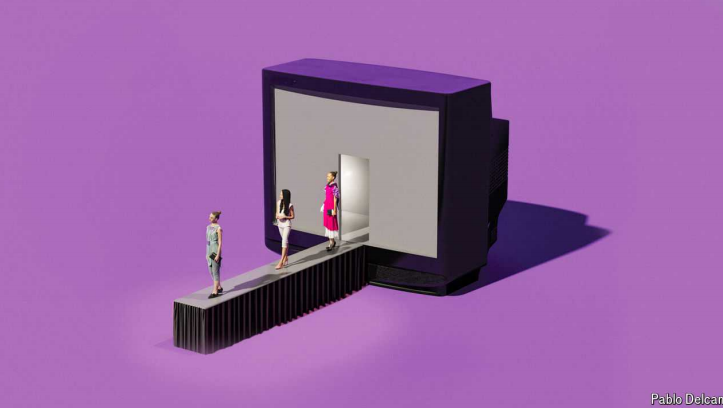

# How fashion conquered television

More and more shows celebrate fancy clothes. Often brands call the shots

原文：

From Tokyo to Seoul, on to New York, London, Milan and Paris, there are

more “fashion weeks” in September than there are weeks in the month.

Models parade down catwalks in whimsical creations that people may

marvel at in years to come—or not. Recently, haute couture has also been

starring in some of television’s most viewed and talked-about shows.

从东京到首尔，再到纽约、伦敦、米兰和巴黎，9月的“时装周”比一个月的周数还要多。模特们穿着奇思妙想的作品走在t台上，人们可能会在未来的几年里惊叹不已，也可能不会。最近，高级定制时装还出演了一些收视率最高、最受关注的电视节目。

学习：

fashion weeks：时装周

parade：美 [pəˈreɪd] 走

catwalk：时装表演台；T型舞台；

whimsical：美 [ˈwɪmzɪkl] 古怪的；异想天开的；

couture：美 [kuˈtʊ(ə)r] 高级时装设计；时装业；定制时装 **注意发音**

starring：领衔主演；主演；

haute couture：高级时装；高级女装；定制时装；

talk-about：热议；被谈论；大热          

原文：

With sumptuous gowns and eye-catching accessories, fashion has conquered

streaming. In addition to “Becoming Karl Lagerfeld”—a drama which

follows the late German designer before he took over as Chanel’s creative

director and adopted his signature monochrome outfit—Disney+ has also

released “Cristóbal Balenciaga”. The show scrutinises the Spanish

dressmaker called “the master of us all” by his peer, Christian Dior. It spans

three decades of Balenciaga’s career, from his arrival in Paris in 1937 to his

retirement in 1968.

凭借华丽的礼服和引人注目的配饰，时尚征服了流媒体。除了《成为卡尔·拉格费尔德》——一部讲述这位已故德国设计师在接任香奈儿创意总监并采用其标志性单色服装之前的故事——迪士尼+还发布了《克里斯托巴尔·巴黎世家》(Cristóbal Balenciaga)。这场秀仔细审视了这位被同行克里斯汀·迪奥称为“我们所有人的大师”的西班牙裁缝。它跨越了巴黎世家30年的职业生涯，从他1937年抵达巴黎到1968年退休。

学习：

sumptuous： 美 [ˈsʌmptʃuəs] 豪华的；奢侈的；华丽的；华贵的

gowns： 美 [gaʊnz] 礼服；长袍；长外衣；（gown的复数）

eye-catching：引人注目的；醒目的；吸引人的

accessories：配件；附件；（accessory的复数）

creative director：创意总监；艺术总监；

signature：个性化的；显示个人特色的

monochrome：美 [ˈmɑnəˌkroʊm] 单色的；黑白的

outfit：服装

Balenciaga：美 [bəˌlensiˈɑɡə] 巴黎世家

dressmaker：女装裁缝；服装设计师；

原文：

“The New Look”, released on Apple TV\+ in February, is set in the same era of

French fashion, but examines Coco Chanel’s and Dior’s contrasting fortunes

during the second world war. While Chanel collaborates with the Nazis,

Dior almost loses his sister to a concentration camp.

今年2月在Apple TV+上发布的“新面貌”以法国时尚的同一时代为背景，但考察了可可·香奈儿和迪奥在第二次世界大战期间截然不同的命运。当香奈儿与纳粹合作时，迪奥差点因为集中 营而失去了他的妹妹。

学习：
contrasting fortunes：截然不同的命运

concentration camp：（尤指战时关押政治犯和平民的）集中 营          

原文：

There have been documentaries about John Galliano, a British designer who

was fired by Dior after his drunken and racist tirades were made public, and

Diane von Furstenberg, a Belgian designer who broke sexual and wardrobe

conventions with her partying lifestyle and popular wrap dress. There is

more material to come. Netflix recently announced a docuseries focusing on

Victoria Beckham, a Spice Girl turned fashion and beauty mogul. Another

biopic of Lagerfeld, starring Jared Leto, is in the works, as is a series about

the Gucci dynasty (which was previously dramatised by Sir Ridley Scott in

2021).

也有关于英国设计师约翰·加利亚诺的纪录片，他在醉酒和种族主义言论被公开后被迪奥解雇，还有比利时设计师黛安·冯·芙丝汀宝，她以派对的生活方式和流行的裹身裙打破了性和着装的传统。还有更多的材料。网飞最近发布了一部聚焦维多利亚·贝克汉姆的纪录片，这位辣妹组合成员后来成为时尚和美容大亨。另一部由杰瑞德·莱托主演的拉格斐的传记电影正在筹备中，还有一部关于古驰王朝的系列电影(雷德利·斯科特爵士曾在2021年将其改编成剧本)。

学习：

drunken：醉的；喝醉的；酗酒的

tirade：美 [ˈtaɪˌreɪd]  长篇激烈讲话；长篇大论

wardrobe：美 [ˈwɔːrdroʊb]着装；（某人的）全部服装；行头；

wrap dress：裹裙

mogul：美 [ˈmoʊɡəl] 大人物；权贵；有权势的人；大亨

biopic：美 [ˈbaɪoʊˌpɪk] 传记电影；人物传记影片；传记片 **注意发音**

原文：

Why is fashion so chic among television and film producers? One reason is

that high fashion lends itself to high drama. It is an industry populated by

creative, glamorous people, who, as these shows attest, may be controlling,

stubborn and tortured, as well as talented. The designers are often driven by

rivalry: Lagerfeld with Yves Saint Laurent, Balenciaga with Dior and Dior

with Chanel.

为什么时尚在电视和电影制作人中如此时髦？一个原因是高级时尚本身就具有高度戏剧性。这是一个由富有创造力、魅力四射的人组成的行业，正如这些节目所证明的那样，这些人可能控制欲强、固执、饱受折磨，但也很有才华。设计师们经常被竞争所驱使:拉格斐和伊夫圣罗兰，巴黎世家和迪奥，迪奥和香奈儿。

学习：

chic：英 [ʃiːk] 时髦的；优雅的；别致的；时尚的；

high fashion：高级时装；高端时尚；时尚界

high drama：充满戏剧性          

glamorous：富有魅力的；迷人的

attest： 证明；证实；表明

原文：

It can be hard to make visually engrossing biopics of writers, since one

black-and-white page looks much like another. The same is not true of

fashionistas. Using fabric, stitches and seams, Balenciaga sculpted

innovative silhouettes. Dior described a dress as “a piece of ephemeral

architecture”. Clothes, on TV and in real life, are reflections of their wearers;

they can produce moments of striking transformation. “Screen storytelling

relies on visual codes; clothing and fashion rely on visual codes,” says

Amber Butchart, a historian of textiles and design. “You have this shared

understanding of medium.”

很难制作出视觉上引人入胜的作家传记，因为一页黑白的看起来很像另一页。时尚达人就不一样了。运用面料、缝线和接缝，巴黎世家塑造出创新的轮廓。迪奥将一件礼服描述为“一件短暂的建筑”。电视上和现实生活中的衣服是穿着者的反映；它们可以产生惊人转变的时刻。“屏幕讲故事靠的是视觉代码；服装和时尚依赖于视觉代码，”纺织品和设计历史学家Amber Butchart说。"你们对媒介有共同的理解."

学习：

engrossing：引人入胜的；使人全神贯注的          

fashionistas：英 [ˌfæʃəˈniːstəz] 时尚达人；超级时尚迷；高级女装设计师；（fashionista的复数）

fabric：面料

stitches：缝线；针法；（stitch的复数）

seams：接缝；（seam的复数）

sculpted：雕刻；雕塑；（sculpt的过去式）          

silhouettes：英 [.sɪluˈet] 轮廓；剪影；影子；（silhouette的复数） **注意发音**

ephemeral：美 [ɪˈfemərəl] 短暂的；瞬息的；暂时的

wearer：英 [ˈweərə(r)] 穿戴者

storytelling：讲故事；

textiles：美 [ˈtekˌstaɪlz]  纺织品；织物；纺织业；

原文：

Another reason for the trend is that Hollywood is currently hooked on

brands. Studios want to make stories about popular products, from Barbies

to Ferraris. Content about couturiers is a safe bet, as viewers already

recognise the names from boutiques or cosmetics, even if they know little

about their namesakes.

这种趋势的另一个原因是，好莱坞目前已经迷上了品牌。电影公司希望制作关于流行产品的故事，从芭比娃娃到法拉利。关于时装设计师的内容是一个安全的赌注，因为观众已经认识精品店或化妆品的名字，即使他们对同名的设计师知之甚少。

学习：

hooked：上瘾的；对某事物着迷的；沉迷的；被迷住的；被吸引的；

Barbie：(Barbie doll)芭比娃娃；芭比

Ferrari：美 [fəˈrɑri]  法拉利（著名赛车生产厂家；人名）

couturier：美 [kuˈtʊriər]  时装设计师；高级时装设计师

safe bet：稳妥的赌注；安全的选择；可靠的选择；

boutiques：美 [bu:ˈti:ks] 精品店；（boutique的复数）          

cosmetics：美 [kɑːzˈmetɪks] 化妆品；（cosmetic的复数）

namesake：美 [ˈneɪmˌseɪk]  以某人命名的人（或物）；同名的人（或物）

原文：

Fashion houses themselves are now getting involved in storytelling. This has

not always been the case: the producers of “The Devil Wears Prada” (2006)

initially struggled to get brands to lend clothes to the costume department,

for fear of upsetting *Vogue’*s Anna Wintour (the inspiration for the character

played by Meryl Streep).

时装公司本身现在也开始参与讲故事。情况并非总是如此:《穿普拉达的女王》(2006年)的制片人起初很难让品牌将服装借给服装部门，因为他们担心会惹恼《Vogue》的为安娜·温图尔打扮(梅丽尔·斯特里普饰演的角色的灵感来源)。

学习：

fashion houses：时尚公司

costume：服装；

原文：

But almost 20 years on, Balenciaga and Dior gave their blessing for

“Cristóbal Balenciaga” and “The New Look”, say Xabier Berzosa and Helen

Shaver, producers on the shows. The houses allowed the crews access to

their archives. Bina Daigeler, one of the costume designers on “Cristóbal

Balenciaga”, says she “was always in contact” with Balenciaga, as well as

with Chanel and Dior, to make sure that the clothes were depicted in a

“respectful and accurate” manner.

但近20年过去了，巴黎世家和迪奥对“克里斯托巴尔·巴黎世家”和“新造型”给予了祝福，时装秀的制作人夏比尔·贝佐萨和海伦·谢费说。这些公司允许人员查阅他们的档案。“Cristóbal Balenciaga”的服装设计师之一比娜·戴格尔(Bina Daigeler)表示，她“一直与巴黎世家以及香奈儿和迪奥保持联系”，以确保服装以“尊重和准确”的方式呈现。

学习：

blessing： 祝福；

costume designer：服装设计师

原文：

By lending their services in this way, fashion houses are adroitly

“controlling their image”, says Marnie Fogg, the author of “Screen Style”, a

book about TV costumes. The final scene of “The New Look”—a montage of

Dior’s outfits unfurling to soppy music—feels more like an advert than the

conclusion of a quality drama. Not one to miss a sales opportunity, Dior

released a fragrance to coincide with the show’s debut.

Marnie Fogg说，通过以这种方式提供服务，时装公司巧妙地“控制了他们的形象”，Marnie Fogg是一本关于电视服装的书《银幕风格》的作者。“新造型”的最后一幕——迪奥服装随着伤感的音乐展开的蒙太奇——感觉更像是一个广告，而不是一部优质戏剧的结尾。迪奥不会错过任何销售机会，他发布了一款香水来配合时装秀的首次亮相。

学习：

adroitly：灵巧地；机敏地

montage：美 [mɑnˈtɑʒ] 蒙太奇；蒙太奇手法；剪辑

unfurling：美 [ʌnˈfə:lɪŋ] 展开；打开；（unfurl的现在分词）

soppy：多愁善感的；情意缠绵的；

soppy music：伤感的音乐

advert：美 [ˈædvɜːrt] 广告；宣传告示；

fragrance：美 [ˈfreɪɡrəns] 香水；

debut： 美 [deɪˈbjuː] 首次亮相；（新事物的）问世；初次登台（或上场）**注意发音**

原文：

Some houses have gone even further in blurring the boundaries between

branding and entertainment. In 2021 “Fracture”, a miniseries about a

fictional singer-songwriter, was developed by Balmain to feature its latest

collection. Chanel has helped finance films that star Kristen Stewart, one of

its ambassadors. No wonder, then, that Ms Stewart was wearing rather a lot

of Chanel while playing Princess Diana in “Spencer”. (Searches for Chanel

bags, blazers and sunglasses spiked in the wake of the film’s premiere.)

一些公司甚至进一步模糊了品牌和娱乐之间的界限。2021年，Balmain开发了一部关于虚构歌手兼作曲家的迷你剧“Fracture”，以展示其最新系列。香奈儿资助了由其大使克里斯汀·斯图尔特主演的电影。难怪斯图尔特女士在《斯潘塞》中扮演戴安娜王妃时穿了很多香奈儿。(这部电影首映后，对香奈儿包、西装外套和太阳镜的搜索激增。)

学习：

fracture：骨折；断裂；破裂；折断；裂痕；

miniseries：迷你剧；短剧；小型连续剧

latest collection：最新系列

blazer：美 [ˈbleɪzər]   运动夹克；校服上衣；

premiere：首映

原文：

Last year Saint Laurent launched Saint Laurent Productions and co-

produced three feature films—a musical crime-comedy, a fantasy drama and

a horror flick—which aired at the Cannes Film Festival in May. The film

studio is overseen by Anthony Vaccarello, who is also the house’s creative

director; he is credited as the “costume artistic director” on each movie. As

well as kitting out characters in Saint Laurent, the house has provided stars

with outfits for the promotional circuit.

去年，圣罗兰推出了圣罗兰制作公司(Saint Laurent Productions ),并联合制作了三部故事片——一部音乐犯罪喜剧、一部奇幻剧和一部恐怖片——在5月的戛纳电影节上播出。电影工作室由安东尼·瓦卡雷洛监管，他也是该公司的创意总监；他被誉为每部电影的“服装艺术总监”。除了为圣罗兰的角色提供服装，该品牌还为明星们提供了宣传服装。

学习：

feature films：故事片；专题电影；专题片

fantasy drama：奇幻剧

flick：电影

horror flick：恐怖片

air：播放

Cannes：美 [kæn] 戛纳（法国港市）

Cannes Film Festival：戛纳电影节

be credited as：被誉为

artistic director:艺术总监；艺术指导；

原文：

This year LVMH, a luxury group and one of Europe’s most valuable companies,

launched its own media outlet, 22 Montaigne Entertainment. It will make

films, TV shows and podcasts based on the brands in LVMH’s stable—or, as Anish

Melwani, the chairman and chief executive for the company in North

America, put it, “identify entertainment projects that honour and

authentically showcase their unique creative portfolios”. Given that LVMH owns

14 of the world’s most famous fashion “maisons”—including Celine, Dior,

Fendi, Givenchy, Loewe and Louis Vuitton—there will be no shortage of

projects for storytellers to style.

今年，奢侈品集团、欧洲最有价值的公司之一LVMH推出了自己的媒体渠道22蒙田娱乐。它将根据路威酩轩集团旗下的品牌制作电影、电视节目和播客，或者，正如该公司北美区董事长兼首席执行官Anish Melwani所说，“确定那些尊重和真实展示他们独特创意组合的娱乐项目”。鉴于LVMH拥有14个世界上最著名的时尚“品牌”——包括Celine、Dior、Fendi、Givenchy、Loewe和Louis Vuitton——将不会缺少让故事讲述者设计风格的项目。

学习：

luxury group：奢侈品集团

media outlet：媒体频道

Givenchy：美 [dʒɪ'vɑŋʃɪ] 纪梵希（品牌名称）

## **Coming up next season...**

原文：

Ultimately the wealth of entertainment about fashion reflects a changed

media landscape. Although the luxury-fashion business is expected to bring

in \$116bn in revenue this year, up from \$86bn in 2020, the old methods no

longer tempt buyers as they once did. “You’re not going to reach your whole

audience in *Vogue.* You just aren’t,” says Jenna Barnet of Sunshine, a

consultancy that helps brands with entertainment strategy. “It’s not going to

do the whole thing for you anymore.”

最终，关于时尚的娱乐财富反映了一个变化的媒体景观。尽管奢侈品时尚业务预计今年将带来1160亿美元的收入，高于2020年的860亿美元，但旧方法不再像过去那样吸引买家。“你不可能接触到《时尚》杂志的所有观众。阳光咨询公司(Sunshine)的詹娜·巴尼特(Jenna Barnet)表示:“你根本就不是这样。“它不会再为你做所有的事情了。”

学习：

tempt：吸引

原文：

As a result, entertainment and advertising are “converging into one thing”,

Ms Barnet says, “and now we have these incredible means to tell richer and

richer stories, longer and longer stories, more valuable stories.” For now,

audiences seem happy to lap up branded content and fashion bosses, unlike

models on a catwalk, are smiling. But what seems *à la mode* today can

easily become *passé* tomorrow. ■

因此，巴尼特女士说，娱乐和广告正在“融合成一件事”，“现在我们有这些不可思议的手段来讲述越来越丰富的故事，越来越长的故事，更有价值的故事。”目前，观众似乎乐于接受品牌内容，而时装业的老板们不像时装秀上的模特那样面带微笑。但是今天看起来很流行的东西明天很容易就过时了。■

学习：

lap up：接受；

catwalk：时装表演台；T型舞台

## 后记

2024年9月13日18点29分于上海。

