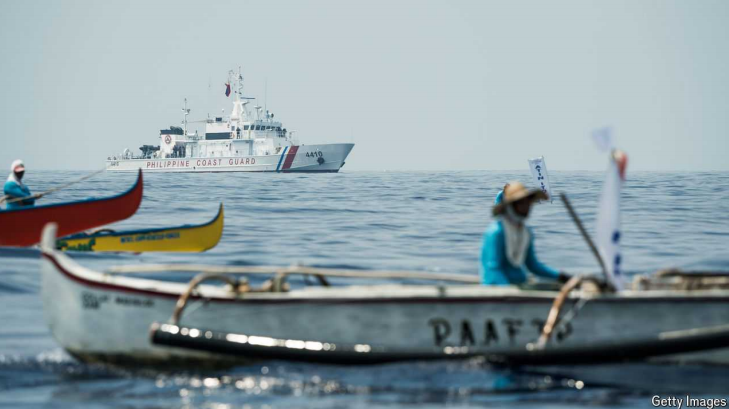

# More storms are brewing in the South China Sea

A dangerous new stage in the conflict is beginning

brewing：酿造；酝酿；（brew的现在分词）          

原文：

Eight years ago China lost a legal battle over its fantastical territorial claims

in the South China Sea. An international tribunal ruled they had no basis.

China responded by continuing to occupy and fortify reefs and rocks and

sometimes preventing fishing and energy development by other countries.

Now the confrontation is heating up as Vietnam, the Philippines and

Malaysia challenge China’s claims and aggression in different ways.

Broadly speaking, this pushback is welcome. However, it should not be

reckless. America should ensure that its ally, the Philippines, treads

carefully.

八年前，中国输掉了一场关于其在南海不切实际的领土主张的法律战。一个国际法庭裁定他们没有根据。中国的回应是继续占领和加固珊瑚礁和岩石，有时还阻止其他国家的捕鱼和能源开发。现在，随着越南、菲律宾和马来西亚以不同方式挑战中国的主张和侵略，对抗正在升温。总的来说，这种抵制是受欢迎的。但是，不应该鲁莽行事。美国应该确保其盟友菲律宾小心行事。

学习：

fantastical：美 [fæn'tæstɪkəl] 空想的；捕风捉影的；

territorial：美 [ˌterəˈtɔːriəl] 领土的；地区的；

tribunal： 美 [traɪˈbjuːnl] 法庭；审判庭；

fortify： 美 [ˈfɔːrtɪfaɪ] 加强（防御）；筑防御工事

confrontation：对抗；冲突；对峙

treads：步态；踏；（tread的第三人称单数）

原文：

The encounters can be dramatic. On June 17th Chinese coastguards wielded

axes as they confronted Philippine sailors resupplying a beached warship

that marks the Philippines’ legitimate claim on Second Thomas Shoal. Two

weeks ago China rammed a Philippine coastguard cutter on another shoal,

tearing a gap in its hull. Such confrontations often go viral on social media,

with images of Chinese bullies with water cannons. They also feature in

Sino-American diplomatic meetings, suggesting that both sides fear they

could escalate out of control.

遭遇可能是戏剧性的。6月17日，中国海岸警卫队对抗正在补给一艘搁浅军舰的菲律宾水手，这艘军舰标志着菲律宾对第二托马斯浅滩的合法权利主张。两周前，中国在另一个浅滩上撞上了一艘菲律宾海岸警卫队的快艇，船身撕裂了一个缺口。这种对抗经常在社交媒体上疯传，照片上是手持高压水枪的恶 霸。它们也出现在中美外交会议上，表明双方都担心它们可能会升级到失控的地步。

学习：

coastguards：海岸警卫队；海岸警卫队队员；（coastguard的复数）

axes：美 [ˈækˌsiz] 斧头，**注意发音**

sailors：水手；海员；（sailor的复数）

beached：搁浅；定居；（beach的过去式和过去分词）

warship：战舰；军舰；舰艇；

rammed：撞击（ram的过去式和过去分词）

cutter：小艇

shoal：美 [ʃoʊl] 浅滩；沙洲；浅水区

hull：美 [hʌl] 船体；船壳；船身；

tear a gap in its hull：船身撕裂一个缺口

原文：

The resistance by South-East Asian countries has been years in the making

and comes in different forms. Vietnam has mimicked Chinese tactics by

building up its own outposts on reclaimed land in the Spratly Islands.

Malaysia’s government is generally a walkover: it allows China to patrol its

fishing grounds and trade oil that is under sanctions in its waters. Still, even

it is now exploring for gas off Borneo inside the “nine-dash line” which

China says marks its claims.

东南亚国家的抵制已经酝酿多年，而且形式各异。越南模仿中国的策略，在南沙群岛的填海造地上建立自己的前哨基地。马来西亚政府总体上是容易屈服的角色:它允许中国在其渔场巡逻，并在其水域交易受制裁的石油。尽管如此，甚至它现在也在婆罗洲的“九段线”内勘探天然气，中国称这标志着它的主权。

学习：

resistance：抵抗；反抗

outposts：前哨

Spratly Islands：南沙群岛

walkover：（比赛或竞赛中的）轻易取得的胜利；轻而易举的事

>
>
>这里的 **"walkover"** 意思是“容易被征服或轻易屈服的一方”，在这个上下文中，指马来西亚政府在面对中国的压力时，通常表现出软弱和屈服的态度。
>
>举个例子：
>
>- **英语**: "The match was a walkover because the opponent hardly put up a fight."
>- **中文**: “这场比赛轻而易举，因为对手几乎没有抵抗。”

原文：

The Philippines has been the most assertive of all. Since 2023 the

administration of President Ferdinand Marcos has pivoted the country away

from China. It has agreed to give America access to some military bases, in

return for an upgrade of them. And it has taken a tougher line on trying to

enforce its maritime borders with patrols and public statements.

菲律宾是所有国家中最自信的。自2023年以来，费迪南德·马科斯总统的政府已将该国从中国转移出去。它已经同意让美国使用一些军事基地，以换取升级这些基地。它在试图通过巡逻和公开声明来加强其海上边界方面采取了更强硬的路线。

学习：

assertive：自信的；坚定的；坚定自信的

patrols：美 [pəˈtrəulz] 巡逻；巡查；（patrol的复数）

maritime：美 [ˈmærɪtaɪm] 海的；航海的；海事的；

原文：

All this is fair enough. But the danger for America is that encounters at sea

escalate too far, and that if a military skirmish erupted, it might be obliged to

defend the Philippines under their mutual-defence treaty. There is already

confusion. In May Mr Marcos said that the death of a Philippine citizen in

any skirmish would be “close to an act of war”, and predicted that America

would “hold the same standard”. But Lloyd Austin, America’s secretary of

defence, declined to endorse Mr Marcos’s declaration. It is an invidious

choice for America. It does not want to risk a wider war. Yet if it failed to

back an important ally, American deterrence would suffer in Asia and

elsewhere and China’s illegal claims in the South China Sea would become

more entrenched.

这一切都很公平。但对美国来说，危险在于海上冲突升级得太厉害，如果爆发军事冲突，美国可能不得不根据共同防御条约保护菲律宾。已经有混乱了。5月，马科斯先生说，任何小规模冲突中菲律宾公民的死亡都将“接近战争行为”，并预测美国将“持同样的标准”。但是美国国防部长劳埃德·奥斯汀拒绝支持马科斯先生的声明。对美国来说，这是一个令人不快的选择。它不想冒爆发更大规模战争的风险。然而，如果它未能支持一个重要的盟友，美国在亚洲和其他地方的威慑力将受到损害，中国在南海的主张将变得更加根深蒂固。

学习：

skirmish：美 [ˈskərmɪʃ] 小冲突；小规模战斗

declined：婉拒；谢绝；（decline的过去式和过去分词）

invidious：美 [ɪnˈvɪdiəs] 引起不满的；招人嫉妒的；招致怨恨的；

entrenched：根深蒂固的；牢固的

原文：

What to do? The first step is calibration and co-ordination by America and

its allies, especially the Philippines. Under their treaty, America is bound to

“meet the common danger” in the event of an armed attack on a Philippine

public vessel. Yet that does not mean the Philippines has a licence to escalate

of its own accord and expect Uncle Sam always to back it up.

怎么办？第一步是美国及其盟友，尤其是菲律宾的校准和协调。根据他们的条约，如果菲律宾公共船只遭到武装袭击，美国有义务“应对共同的危险”。然而，这并不意味着菲律宾有权自行升级，并指望山姆大叔永远支持它。

学习：

calibration：校准；调整；标定；

treaty：英 [ˈtriːti] 条约；协定；公约 **注意发音**

原文：

This year the Philippines raised tensions by deploying a vessel to Sabina

Shoal. And then, as different Philippine officials competed for influence, its

navy took action near Second Thomas Shoal without informing America or

Mr Marcos. That was foolhardy. Some hawkish members of America’s

Congress also play an unhelpful role, urging the Philippines to take

unnecessary risks on the water, without the power to back them up. Better to

have careful co-ordination of where in contested waters Philippine vessels

sail, public communication of this and clear American backing in advance.

今年，菲律宾向萨比纳浅滩部署船只，加剧了紧张局势。然后，随着不同的菲律宾官员争夺影响力，其海军在没有通知美国或马科斯先生的情况下，在第二托马斯浅滩附近采取了行动。那是鲁莽的。美国国会的一些鹰派议员也扮演了一个无益的角色，他们敦促菲律宾在没有权力支持他们的情况下在水上进行不必要的冒险。更好的办法是，仔细协调菲律宾船只在争议水域的航行位置，就此进行公开沟通，并事先获得美国的明确支持。

学习：

foolhardy：美 [ˈfulˌhɑrdi]鲁莽的；

raise tensions：加剧紧张局势

原文：

A second priority is transparency. The more the world sees of China’s claims

and the ugly way it tries to enforce them, the less legitimate they will seem.

Most countries used to suffer in silence. Now the Philippines has led the way

by publicising maritime incidents.

第二个优先事项是透明度。

原文：

Other victims of aggression should follow suit. That is likely to draw a

broader group of states to criticise China. Several European countries now

condemn its actions in the South China Sea. Next should be the Association

of Southeast Asian Nations (ASEAN). Some of its members who are chummy

with China, including Cambodia and Laos, have blocked it from criticising

Chinese activity. Other ASEAN members should speak out anyway. It is strongly

in their interest to uphold international maritime law. The South China Sea

has become a riskier place. But a more predictable policy of deterrence by

America and its allies, and more exposure of Chinese misbehaviour, are the

best approach to try to keep the peace.■

学习：

follow suit：效仿；仿效；跟着做

chummy：合得来的；亲密的；非常友好的

Cambodia： 美 [ˌkæmˈboʊdiə] 柬埔寨

## 后记

2024年9月14日14点27分于上海。本文仅用于英语学习，不代表作者的政治立场。

