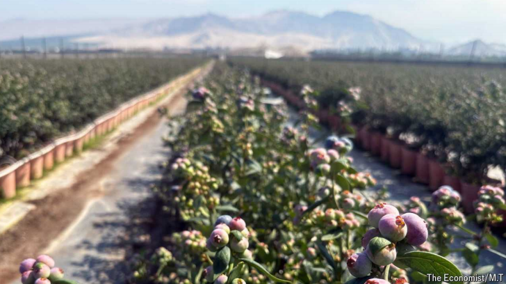
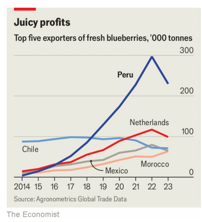

# The sweet story of Peru’s blueberry boom

Plucky farmers have transformed the market in only ten years

plucky：英 [ˈplʌki] 勇敢的；无畏的；有胆识的

原文：

Peru’s blueberry harvest is just beginning, and Ivan Jauregui, an agronomist,

looks excited. At a farm he oversees about 100km north of Lima, the capital,

workers are gently twisting the fruit from their bushes. Staff in a newly built

packing-plant load the best berries into refrigerated shipping containers, then

pack them off to the port of Callao. Mr Jauregui says he once squeezed 35

tonnes of blueberries from a single hectare of land; he is always hoping to

beat this record. “Every year we have to grow and improve,” he says.

秘鲁的蓝莓收获刚刚开始，农学家Ivan Jauregui看起来很兴奋。在首都利马以北大约100公里的一个他监管的农场，工人们正在轻轻地从他们的灌木丛中捻水果。新建包装厂的工作人员将最好的浆果装入冷藏集装箱，然后打包运往卡亚俄港。Jauregui先生说他曾经从一公顷的土地上压榨出35吨蓝莓；他一直希望打破这个记录。“每年我们都必须成长和提高，”他说。

学习：

harvest：收获；收成；收割；收获季节；

agronomist：美 [əˈgrɑnəmɪst] 农学家

gently：温柔地；轻轻地

twist：拧；扭伤；捻

twist fruit：把水果拧下来，摘水果

bushes：矮树丛；灌木（丛）；（bush的复数）

packing-plant：包装厂

berries：浆果；（berry的复数）

refrigerated：冷藏的；冷冻的；冷却的

shipping containers：集装箱

hectare：美 [ˈhekter] 公顷（等于1万平方米或约2.47英亩的面积单位，土地丈量单位）

beat the record：打破纪录

原文：

Peru caught blueberry fever a little over a decade ago. Farmers noticed that

their counterparts in Chile were making a lot of money selling the fruit

during the off-season in the United States, when prices are high. They

sought to do the same—and things have worked out better than anyone

dared hope. Back in 2013 Peruvians earned about $17m exporting

blueberries; by last year receipts had soared to $1.7bn. In 2019 Peru became

the world’s single biggest exporter of fresh blueberries. Nowadays it sends

more than twice as many berries abroad as its closest rivals.

十多年前，秘鲁出现了蓝莓热。农民们注意到，他们在智利的同行在美国的淡季卖水果赚了很多钱，当时价格很高。他们试图做同样的事情——事情的结果比任何人都不敢希望的要好。回到2013年，秘鲁人出口蓝莓赚了大约1700万美元；到去年，收入飙升至17亿美元。2019年，秘鲁成为世界上最大的新鲜蓝莓出口国。如今，它出口到国外的浆果是其最接近的竞争对手的两倍多。

学习：

off-season：淡季；农闲；反季的          

Peruvian：英 [pə'ru:vɪən]  秘鲁人

receipts： 英 [rɪˈsiːts] 收据；收入；

原文：

The country owes much of its success to novel kinds of blueberry bush.

Historically the fruit has grown well only in places with chilly winters.

Peru’s blue revolution relies on newfangled “low chill” varieties, developed

in the United States, that thrive on Peru’s coast. The International Blueberry

Organisation, an industry group, says that in 2022 the yield of a typical

Peruvian blueberry farm was nearly double the global average (which is nine

tonnes per hectare). Julio Zavala of Fall Creek, an American breeder of

blueberries, reckons it takes only about two years for a new farm in Peru to

start turning a profit. In other places four years is more common.

这个国家的成功在很大程度上归功于新型蓝莓灌木。从历史上看，这种水果只有在冬天寒冷的地方才能长势良好。秘鲁的蓝色革命依赖于在美国开发的新奇的“低温”品种，这些品种在秘鲁海岸茁壮成长。行业组织国际蓝莓组织称，2022年，一个典型的秘鲁蓝莓农场的产量几乎是全球平均水平(每公顷9吨)的两倍。来自Fall Creek的Julio Zavala是一位美国蓝莓育种家，他认为秘鲁的一个新农场只需要两年时间就能开始盈利。在其他地方，四年更常见。

学习：

chilly：寒冷的；阴冷的；凉飕飕的

newfangled：美 [ˌn(j)uˈfæŋɡəld] 新颖的；创新的；新发明的；

breeder：育种家          

turn a profit：盈利

原文：

Blueberry farmers have also gained from trends that have boosted all

manner of Peruvian produce. These include tax breaks and irrigation

megaprojects that have opened up land along Peru’s desert coastline.

Between 2000 and 2023, total annual Peruvian farm exports grew 16-fold to

$10.5bn. “It’s mind-bending,” said Rafael Zacnich of Comex, Peru’s

international trade association. Yet blueberries remain “by far” the most

profitable crop, reckons Percy Muente of Agrícola Cerro Prieto, a big

agricultural group that employs Mr Jauregui. If his firm still grows avocados

and asparagus, that is in part because it does not want to place all its berries

in one basket, he says.

蓝莓种植者也从推动秘鲁各种农产品的趋势中获益。这些措施包括税收减免和大型灌溉项目，这些项目开发了秘鲁沙漠海岸线上的土地。2000年至2023年间，秘鲁年度农产品出口总额增长了16倍，至105亿美元。秘鲁国际贸易协会Comex的拉斐尔扎克尼奇(Rafael Zacnich)表示:“这令人难以置信。”。然而，雇佣了Jauregui先生的大型农业集团Agrícola Cerro彼尔托公司的Percy Muente认为，蓝莓仍然是“到目前为止”最赚钱的作物。他说，如果他的公司仍然种植鳄梨和芦笋，部分原因是它不想把所有的浆果放在一个篮子里。

学习：

all manner of：各种各样的；各种类型的；形形色色的          

tax breaks：减税          

open up land：开发土地

mind-bending：令人难以置信的

avocado：美 [ˌævəˈkɑːdoʊ]  鳄梨；牛油果；

asparagus：美 [əˈspærəɡəs]  芦笋；芦笋笋尖（芦笋的嫩尖部分）

原文：

Boosters promise more growth. The world’s taste for blueberries is

increasing. Peruvian exporters have their eye on China, which produces

plenty of its own berries but which could eat a lot more. And there is

additional land in Peru that could be used to grow the fruit, if politicians and

investors bless the big infrastructure projects needed to water them.

助推器承诺更多的增长。世界对蓝莓的品尝正在增加。秘鲁出口商关注中国，中国生产大量自己的浆果，但可以吃得更多。如果政治家和投资者支持灌溉所需的大型基础设施项目，秘鲁还有额外的土地可以用来种植水果。

学习
grow the fruit：种植水果

原文：

Yet in future growers will also have to swerve a handful of risks. Last year

extreme weather stole a big chunk of Peru’s production (though its income

from exports continued soaring, because global prices shot up). It was not

the only country to suffer, but the sticky experience has accelerated efforts to

identify and spread varieties that might cope better with climate change. And

farmers in lots of other places fancy a slice of Peru’s blueberry pie, notes Mr

Jauregui. “Colombia, Morocco: everyone is growing blueberries now.” ■

然而在未来，种植者也将不得不避开一些风险。去年，极端天气夺走了秘鲁的大部分产量(尽管其出口收入持续飙升，因为全球价格飙升)。它不是唯一一个遭受损失的国家，但是这种痛苦的经历加速了识别和传播能更好应对气候变化的品种的努力。Jauregui先生指出，许多其他地方的农民也想尝尝秘鲁的蓝莓派。"哥伦比亚、摩洛哥:现在每个人都在种植蓝莓."■

学习：

growers：种植者；（grower的复数）          

swerve：美 [swɜːrv] 躲避；（尤指为避免碰撞而）突然转向

extreme weather：极端天气

sticky：棘手的；难处理的；难办的

sticky experience：痛苦的经历

Morocco：摩洛哥（北非国家）

## 后记

2024年9月14日15点36分于上海。

