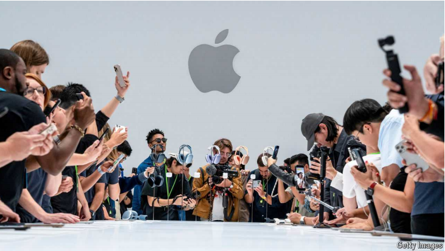
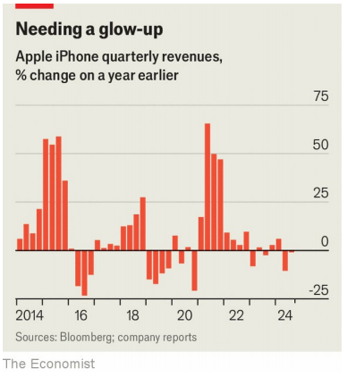

# AI will not fix Apple’s sluggish iPhone sales any time soon

sluggish：美 [ˈslʌɡɪʃ] 懒怠的；迟钝的；萎靡不振的；疲软的

The technology is not yet ready for prime time on phones or other devices

prime time：黄金时段；最佳时间；

原文：

Bling is in the air. On September 9th Apple released its latest iPhone 16

series at an event called “It’s Glowtime”. The name referred to the sheen

around Siri, its souped-up voice assistant. But it was just as appropriate for

the new colour of its snazziest iPhone 16 Pro model: “desert titanium”—in

other words, gold.

亮闪闪弥漫在空气中。9月9日，苹果在一场名为“现在是Glowtime”的活动中发布了其最新的iPhone 16系列。这个名字指的是增强版语音助手Siri周围的光泽。但它同样适合其最时髦的iPhone 16 Pro机型的新颜色:“沙漠钛”——换句话说，就是金色。

学习：

bling：亮闪闪；奢华高档的首饰或服装          

sheen：光泽；光彩；光辉

souped-up：加足马力的；提高效率的；加大马力的 ；增强版的

snazziest：时髦的；（snazzy的最高级）          

titanium：钛

原文：

A bit lacking, though, was zing. Tim Cook, Apple’s boss, played up the

promise of the phones’ generative artificial-intelligence (AI) features, which

he trailed with much hoopla in June under the moniker “Apple Intelligence”.

Although the devices come with Apple’s new superfast A 18 chips to power AI,

iPhone buyers will have to wait until at least October for the first features.

The demos look ho-hum. If you point the camera at a restaurant, Apple

Intelligence can tell you what’s on the menu. You can type a request to Siri,

as well as ask it questions. Investors hope that eventually more

conversational and personalised AI features will reboot iPhone sales, which

account for about half of Apple’s revenues but have sagged lately (see

chart). They could be waiting a while.

不过，有点欠缺的是活力。苹果公司的老板蒂姆·库克(Tim Cook)大肆宣扬这款手机的人工智能(AI)功能，他在6月份大张旗鼓地将其冠以“苹果智能”的名号。尽管这些设备配备了苹果新的超高速A18芯片来支持人工智能，但iPhone买家至少要等到10月份才能看到首批功能。演示看起来很无聊。如果你把摄像头对准一家餐厅，苹果智能可以告诉你菜单上有什么。您可以向Siri键入请求，也可以向它提问。投资者希望，最终更多的对话式和个性化人工智能功能将重振iPhone的销售，iPhone的销售约占苹果收入的一半，但最近有所下滑(见图表)。他们可能要等一会儿。

学习：

zing：兴趣；活力

play up：夸大其词

hoopla：美 [ˈhuˌplɑ] 喧闹；热闹；轰动；大肆宣传

trail: 提前预告或展示某个即将推出的功能或产品，提前宣传

>
>
>**"Trail"** 在这里指的是提前预告或展示某个即将推出的功能或产品，通常伴随着一定的宣传和期待。在文中，"he trailed with much hoopla" 意思是 Tim Cook 在六月时大力宣传了这些生成式AI功能的前景，但这些功能尚未完全推出。
>
>举例：
>1. **英文**: The movie director trailed the new film with a teaser trailer to build anticipation.
>2. **中文**: 那位电影导演通过先行预告片宣传了新电影，来引发期待。

moniker：绰号，名字

ho-hum：美 [ˌhoʊˈhəm] 无聊的；乏味的；平淡的

sagged：下跌；（sag的过去式和过去分词）

原文：

Apple is one of many firms that want to take generative AI beyond giant data

centres, known as the cloud, and run it on smaller devices, known as the

edge. Samsung, Apple’s main smartphone rival, got a head start, launching

its Galaxy S24 with some AI features earlier this year. So did Microsoft, which

has launched Windows PCs designed for AI, called Copilot+. But by and large

the market is still up for grabs. Cracking it will not be easy.

苹果是众多希望让生成式人工智能超越巨型数据中心(即所谓的云)并在更小的设备(即所谓的edge)上运行的公司之一。苹果智能手机的主要竞争对手三星抢占了先机，今年早些时候推出了带有一些人工智能功能的Galaxy S24。微软也是如此，它已经推出了为人工智能设计的Windows PCs，名为Copilot+。但总的来说，这个市场仍有待开发。破解它并不容易。

学习：

a head start：优势；有利条件；有利的开端；领先

up for grabs：人人可得的；供人争夺的；可供争取的

by and large：总的来说；总体上；大体上；

crack:  解决某个复杂的问题或进入某个难以攻克的市场

>这里的 **"crack"** 指的是解决某个复杂的问题或进入某个难以攻克的市场。在文中，"Cracking it will not be easy" 意思是要成功突破或占领这个市场（即将生成式AI从云端带到边缘设备的市场）并不容易。
>
>举例：
>1. **英文**: The team spent months trying to crack the code for the new encryption system.
>2. **中文**: 团队花了几个月的时间试图破解新的加密系统。

原文：

Most large language models (LLMs) are trained with graphics processing units

(GPUs) that use so much energy it can take a nuclear-power plant to fuel them.

They also need huge amounts of memory and unfathomable quantities of

data. All that can cost hundreds of millions of dollars.

大多数大型语言模型(LLM)都是用图形处理器(GPU)训练的，这些图形处理器消耗的能量足以让一座核电厂为它们提供燃料。它们还需要巨大的内存和难以理解的数据量。所有这些可能要花费数亿美元。

原文：

Even once they are trained, running these mega-models is expensive.

According to one estimate, it costs OpenAI, the maker of ChatGPT, 36 cents

every time someone asks the bot a question. Edge devices instead deploy

smaller models, distilled from their cloud-based big brothers. These are

cheaper, and also faster. The goal is to reach such low levels of latency that

response times feel almost human. Edge AI can also learn about a user from

their interactions with their device (Apple calls this “semantic indexing”).

即使他们受过训练，运行这些大型模型也是昂贵的。据估计，每次有人问机器人一个问题，ChatGPT的开发者OpenAI就要花费36美分。取而代之的是，边缘设备部署从基于云的老大哥中提炼出来的更小的模型。这些更便宜，也更快。目标是达到如此低的延迟水平，以至于响应时间几乎像人一样。Edge AI还可以从用户与设备的交互中了解用户(苹果称之为“语义索引”)。

原文：

In practice, however, shifting AI to the edge is not straightforward. One

problem is performance. Complex queries, such as using an AI bot to plan a

holiday, will still require cleverer cloud-based LLMs. Another problem is

computational power. Even smaller AI models require oodles of it to run,

quickly draining a device’s batteries.

然而，在实践中，将人工智能转移到边缘并不简单。一个问题是性能。复杂的查询，如使用人工智能机器人计划假期，仍然需要更智能的基于云的LLM。另一个问题是计算能力。即使更小的人工智能模型也需要大量的信息来运行，从而迅速耗尽设备的电池。

学习：

oodles：大量；众多；成堆

原文：

Companies are experimenting with various solutions. Apple Intelligence will

offer on-device AI as a first port of call, but send trickier queries to the firm’s

private cloud. The service will direct the most idiosyncratic requests to third

party LLMs such as ChatGPT. Apple promises to do so only with the user’s

permission, but the approach could still worry the privacy-conscious.

Devices, especially smartphones, have access to vast amounts of users’

personal data: whom they call, where they live, what they spend, what they

look like. Some may prefer that if generative AI tools use such information, it

remains on-device.

公司正在尝试各种解决方案。Apple Intelligence将提供设备上的人工智能作为首选，但会向公司的私有云发送更棘手的查询。该服务将最特殊的请求定向到第三方LLM，如ChatGPT。苹果公司承诺只有在用户允许的情况下才会这样做，但这种做法仍然会让注重隐私的人感到担忧。设备，尤其是智能手机，可以获取大量用户的个人数据:他们给谁打电话，住在哪里，花多少钱，长什么样。有些人可能更喜欢生成式人工智能工具使用这种信息，它仍然在设备上。

原文：

Tech firms are also making use of alternatives to GPUs that use less energy,

such as neural processing units (NPUs), to run AI models on the edge.

Qualcomm, which makes NPUs and various other chips for edge devices, talks

about maximising “performance per watt”. Compared with GPUs, whose costs

can be stratospheric, NPUs are also cheaper. No one, after all, wants a phone

that costs as much as a data centre.

科技公司也在利用能耗更低的GPU的替代品，如神经处理单元(npu)，在边缘运行人工智能模型。为edge设备制造npu和其他各种芯片的高通公司谈到了“性能功耗比”的最大化。与成本高昂的GPU相比，npu也更便宜。毕竟，没有人想要一部和数据中心一样昂贵的手机。

学习：

stratospheric：美 [ˌstrætə'sferɪk] 同温层的；平流层的，很高的

原文：

Plenty of firms have an interest in shifting AI to devices. Cloud-based LLMs are

heavily dependent on Nvidia, the leading maker of GPUs. But in edge AI

“there’s nobody that dominates,” says Taner Ozcelik, who runs Mythic, a

startup making energy-efficient chips for AI devices.

许多公司都对将人工智能转移到设备上感兴趣。基于云的LLM严重依赖于领先的GPU制造商Nvidia。但在边缘人工智能领域，“没有人占据主导地位，”Taner Ozcelik说，他经营着一家为人工智能设备制造节能芯片的初创公司Mythic。

原文：

Although no single firm may gain as much from edge AI as Nvidia has from

the cloud variety, there would still be big winners, says Neil Shah of

Counterpoint, a research firm. Making the technology work could not only

trigger a supercycle in device sales, but also create new opportunities for

apps and digital advertising. For the moment, though, edge AI is barely ready

for showtime, let alone Glowtime. ■

研究公司Counterpoint的Neil Shah表示，尽管没有哪家公司能像英伟达一样从边缘人工智能中获得如此多的收益，但仍会有大赢家。让这项技术发挥作用不仅可以引发设备销售的超级周期，还可以为应用和数字广告创造新的机会。然而，就目前而言，edge AI几乎还没有准备好展示，更不用说Glowtime了。■

## 后记

2024年9月15日10点02分于上海。

