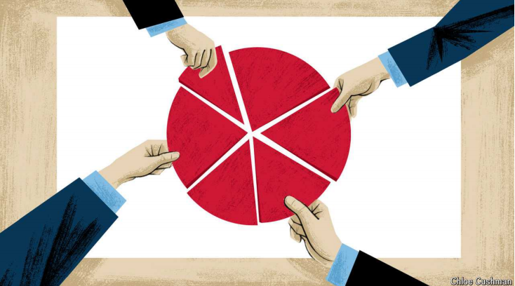

# How to finish Japan’s business revolution

Tokyo-listed companies have become more friendly to shareholders, but the job is only half-done

原文：

Shareholder capitalism has had a difficult decade. Large companies around

the world have been loaded with social, environmental and national-security

goals that are outside their usual profit-making remit, often by governments.

Corporate Japan, by contrast, has become far friendlier to shareholders of

listed firms. Governance reforms that began after Abe Shinzo became prime

minister in 2012 have chipped away at stuffy and value-destroying practices

long associated with Japan Inc. The result has been a burst of confidence in

Japan’s hitherto-stagnant economy.

股东资本主义经历了艰难的十年。世界各地的大公司都肩负着社会、环境和国家安全目标，这些目标超出了它们通常的盈利范围，通常是由政府制定的。相比之下，日本企业对上市公司的股东要友好得多。安倍晋三(Abe Shinzo)在2012年担任首相后开始的治理改革，已经逐渐消除了长期以来与日本企业相关的沉闷和破坏价值的做法。其结果是，人们对日本迄今停滞不前的经济产生了信心。

学习：

remit：职权范围；

stuffy：过于拘谨的；过分正式的

hitherto：美 [ˌhɪðərˈtuː] 迄今；迄今为止；至今

chip away at: 逐渐削弱

>这里的 *chip* 是指“逐渐削弱”或“蚕食”。在这个上下文中，*chipped away at* 是指日本的治理改革逐渐削弱了那些与日本公司长期以来联系在一起的、过时的且损害价值的做法。
>
>例子：
>1. **英文**：Over the years, reforms chipped away at the old bureaucratic systems, making the government more efficient.
>2. **中文**：多年来，改革逐渐削弱了旧的官僚制度，使政府更加高效。

原文：

The fruits of reform have been tasty. Mergers and investor activism have

surged. Share buy-backs hit a record level in 2023, and Japanese firms have

already pledged to repurchase over ¥12trn ($85bn) in their stock in 2024, up

25% on the total for all of last year. Foreign investors have noticed. In the

year to August they snapped up ¥4.7trn ($33bn) in Japanese stocks. Warren

Buffett, a storied investor, has bought stakes in cheaply valued Japanese

conglomerates.

改革的果实是美味的。并购和投资者行动主义激增。股票回购在2023年达到创纪录水平，日本公司已经承诺在2024年回购超过12万亿日元(850亿美元)的股票，比去年全年的总额高出25%。外国投资者已经注意到了。在截至今年8月的一年里，他们买入了4.7万亿日元(合330亿美元)的日本股票。著名投资者沃伦巴菲特(Warren Buffett)购买了估值低廉的日本企业集团的股份。

学习：

hit a record level：达到创纪录水平

snap up：迅速抢购，争相购买

>**Snap up**：这里指“迅速抢购”或“争相购买”。在上下文中，*foreign investors snapped up ¥4.7trn* 表示外国投资者迅速购买了价值4.7万亿日元的日本股票。
>
>- 例子：
>  - **英文**：The limited-edition sneakers were snapped up within minutes of being released.
>  - **中文**：限量版运动鞋在发布几分钟内就被抢购一空。

buy stakes：买股票

cheaply valued：低估值的

storied: 传奇的，声名显赫的

>**Storied**：这里指“传奇的”或“声名显赫的”。在上下文中，*a storied investor* 是指以其传奇经历或显赫成就而闻名的投资者，像沃伦·巴菲特这样的投资者。
>
>- 例子：
>  - **英文**：The storied football club has a history of winning championships.
>  - **中文**：这家传奇的足球俱乐部有着赢得冠军的辉煌历史。

原文：

For all the success, however, there is still huge room for improvement—

particularly when it comes to deploying capital efficiently. The trouble is

that Japan’s leaders are acting as if the job were finished. Corporate-

governance reform has increasingly been delegated to bureaucrats and is no

longer a priority at the highest levels of politics.

然而，尽管取得了成功，但仍有巨大的改进空间——尤其是在有效配置资本方面。问题是日本领导人表现得好像任务已经完成。公司治理改革越来越多地被委托给官僚，不再是最高政治层面的优先事项。

学习：

deploy capital：配置资本

原文：

The best evidence that reform is incomplete is Japan Inc’s woeful valuations.

The price-to-book ratios of listed companies, a measure of their value

relative to the worth of their assets, is a mere 1.5. By contrast, American

companies are worth five times as much as the assets they hold. Japan’s non

financial firms now hold ¥372trn ($2.6trn) in cash and bank deposits, a

figure that has risen by 82% in nominal terms since the end of 2012,

suggesting that too many executives are resting on their laurels.

改革不彻底的最好证据是日本公司可悲的估值。上市公司的市净率(衡量其价值相对于资产价值的指标)仅为1.5。相比之下，美国公司的价值是其所持资产的五倍。日本非金融企业目前持有372万亿日元(2.6万亿美元)的现金和银行存款，这一数字自2012年底以来名义上已经上升了82%，这表明太多的高管已经满足于过去的成就而不再努力进取。

学习：

reform is incomplete：改革不彻底

woeful：悲伤的；悲哀的；悲惨的；糟糕的

price-to-book ratios：市净率

bank deposits：银行存款

laurels：英 [ˈlɒrəlz] 荣誉；（表示荣誉的）桂冠；月桂树；（laurel的复数）

rest on their laurels：满足于过去的成就而不再努力进取

> “**Rest on their laurels**” 是一个习语，意思是“满足于过去的成就而不再努力进取”。在上下文中，*too many executives are resting on their laurels* 表示许多日本企业的高管对过去的成就感到满足，缺乏进一步推动公司发展的动力或行动。
>
> - **英文例子**：After winning the championship, the team rested on their laurels and didn’t perform well the following season.
> - **中文例子**：赢得冠军后，这支队伍沾沾自喜，接下来的赛季表现不佳。

原文：

Fortunately, some low-hanging fruit remains to be picked. Nicholas Benes, a

former lawyer and one of the architects of the recent reforms, has proposed

several changes. Training new corporate directors in financial and legal

skills would boost their performance, at minimal cost to companies.

Requiring official documents to be machine-readable would make it easier

for analysts and investors to compare companies, and for foreign investors to

translate those documents into their own languages.

幸运的是，一些唾手可得的果实仍有待采摘。Nicholas Benes，一位前律师，也是最近改革的策划者之一，提出了几项改革。对新的公司董事进行金融和法律技能培训，将会提高他们的业绩，而公司的成本却很低。要求官方文件是机器可读的，会让分析师和投资者更容易比较公司，也让外国投资者更容易将这些文件翻译成他们自己的语言。

学习：

low-hanging fruit：低垂的果实

corporate directors：公司董事

原文：

More controversial changes are needed, too. Popular Japanese firms might

be sold to overseas buyers who could manage them more effectively.

Alimentation Couche-Tard, a Canadian retail giant, has been trying to buy

Seven & i Holdings, which owns the 7-Eleven convenience-store brand.

Seven & i has rejected Couche-Tard’s first offer of $38.5bn. For Japan to

succeed it is important that such deals are feasible.

还需要更多有争议的变革。受欢迎的日本公司可能会被出售给海外买家，他们可以更有效地管理这些公司。加拿大零售巨头Alimentation Couche-Tard一直试图收购拥有7-Eleven便利店品牌的Seven & i Holdings。Seven & i拒绝了couch e-Tard 385亿美元的首次出价。日本要想成功，此类交易的可行性非常重要。

学习：

alimentation：美 [ˌæləmənˈteɪʃ(ə)n] 营养；供养；食物

retail giant：零售巨头

convenience-store：便利店

原文：

Other firms will conclude that less productive investments in Japan itself

should be abandoned, which means that workers will be laid off. Toshiba

and Omron, two Japanese electronics firms, have already announced

thousands of lay-offs collectively this year. Managing this change—and

explaining its necessity to the public—requires political leadership.

Unfortunately Japan’s politicians have little zeal for further reforms.

其他公司将会得出结论，应该放弃在日本本土的低生产率投资，这意味着工人将被解雇。日本两家电子公司东芝和欧姆龙今年已经宣布集体裁员数千人。管理这一变化——并向公众解释其必要性——需要政治领导力。不幸的是，日本的政治家们对进一步的改革缺乏热情。

学习：

Toshiba：美 [toʊˈʃibə] 东芝

## **No hiding**

原文：

The impetus for change today comes from the Tokyo Stock Exchange,

which is pressing listed firms to explain how they are planning to raise their

valuations. Pressure also comes from bureaucrats at the Financial Services

Agency and Ministry of Economy, Trade and Industry, which have

progressively raised governance requirements for companies and

institutional investors alike. But prospective candidates for the leadership of

Japan’s Liberal Democratic Party—which governs the country, and has done

for all but a few years in its post-war history—have barely discussed

corporate-governance reform.

今天变革的动力来自东京证券交易所，该交易所正敦促上市公司解释他们计划如何提高估值。压力还来自金融厅(Financial Services Agency)和日本经济产业省(Ministry of Economy，Trade and Industry)的官员，他们逐渐提高了对企业和机构投资者的治理要求。但是日本自由民主党领导人的潜在候选人——该党统治着这个国家，除了战后的几年之外一直如此——几乎没有讨论过公司治理改革。

学习：

impetus：美 [ˈɪmpɪtəs] 推动力；刺激；动力

原文：

If Japan’s politicians cannot recapture some of the reformist zeal of the Abe

years, there is little hope for even more difficult reforms, such as making

Japan’s rigid labour market more flexible. And unless Japanese companies

deploy capital more efficiently, the country will struggle to cope with the

challenges it is facing. Japan is the oldest large nation in the world, with

30% of its people aged 65 and over. Security threats from an increasingly

bellicose Chinese government are rising. Japan hiked its defence spending

by 27% last year, and is increasing it by around 17% this year. Strengthening

the economy to help pay for all this is crucial. A matter of such importance

and urgency should not be left to technocrats alone. ■

如果日本的政治家们不能重拾安倍时代的改革热情，那么就没有希望进行更困难的改革，比如让日本僵化的劳动力市场变得更加灵活。除非日本企业更有效地配置资本，否则日本将难以应对其面临的挑战。日本是世界上人口最老的大国，其30%的人口年龄在65岁及以上。来自中国的安全威胁正在上升。日本去年增加了27%的国防开支，今年增加了17%左右。加强经济以帮助支付所有这些是至关重要的。如此重要和紧迫的问题不应该只留给技术官僚。■

学习：

reformist：改良主义的；主张改革的；改革派的

rigid：僵化的

rigid labor market：僵化的劳动力市场

bellicose：美 [ˈbɛləˌkoʊs] 好战的；好斗的

## 后记

2024年9月17日15点13分于上海。

