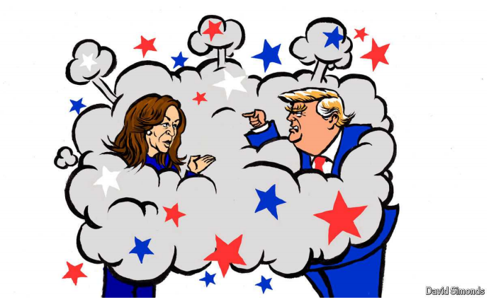

# Kamala Harris makes Donald Trump look out of his depth

out of his depth：超出他的能力范围或者知识水平，力不从心，不知所措

>
>"**Out of his depth**" 意思是某人在处理某个情况或面对某个问题时，超出了他的能力范围或知识水平，感到不知所措或难以应对。
>
>**英文例子**: When the conversation turned to advanced economics, he seemed out of his depth and struggled to keep up.
>**中文例子**: 当谈话转向高级经济学时，他显得力不从心，难以跟上讨论的节奏。

The presidential debate was a success for the vice-president

原文：

It should HAVE been Donald Trump’s moment to shine: 26 minutes into the

former president’s debate with Vice-President Kamala Harris, a moderator

asked her why the administration of President Joe Biden waited until “six

months before the election” to act against illegal immigration. Ms Harris

never got round to answering that question. Instead she talked about fighting

people-smuggling as a prosecutor, accused Mr Trump of sinking a bipartisan

bill to strengthen the border and, addressing those watching at home, urged

them to attend a Trump rally: they would hear him spew grievances and

strange tales, she said, and they would watch as bored people got up and left.

“The one thing you will not hear him talk about is *you*,” she concluded.

本该是唐纳德·特朗普大放异彩的时刻:在这位前总统与副总统卡玛拉·哈里斯辩论的第26分钟，一名主持人问她，为什么乔·拜登总统的政府等到“大选前六个月”才采取行动打击非法移民。哈里斯女士从未抽出时间来回答这个问题。相反，她以检察官的身份谈论打击人口走私，指责特朗普破坏了一项加强边境的两党法案，并向在家观看的人发表讲话，敦促他们参加特朗普的集会:她说，他们会听到他抱怨和奇怪的故事，他们会看到无聊的人起身离开。“你不会听到他谈论的是你，”她总结道。

学习：

moderator：主持人

got round to：抽空做...；找时间...；腾出时间做某事          

smuggling：走私；（smuggle的现在分词）

sinking：导致了失败

>In this context, “**sinking**” means to cause the failure or defeat of something. When it is said that Donald Trump "sank" a bipartisan bill, it means that he was responsible for the bill's failure or collapse. This could be due to his opposition, actions, or influence that led to the bill not passing or being enacted.
>
>**英文例子**: The senator's controversial remarks sank the proposed legislation.
>
>**中文例子**: 那位参议员的争议性言论导致了拟议的立法失败。

spew：美 [spju] 发泻（言辞、情感等）

grievances：美 [ˈgrivənsəz] 抱怨；（grievance的复数）

原文：

Ms Harris knew which line would get her opponent’s attention. “She said

people start leaving,” a glowering Mr Trump blurted when he had a chance

to speak. “People don’t go to her rallies. There’s no reason to go. And the

people that do go, she’s busing them in and paying them.” He stumbled

towards what should have been safe ground, illegal immigration, but chose

to invoke a debunked tale about illegal immigrants eating the pets of the

good citizens of Springfield, Ohio. Then he went back to insisting that

people love his rallies.

哈里斯知道哪一句话会引起对手的注意。“她说人们开始离开，”当特朗普有机会说话时，他愤怒地脱口而出。“人们不去参加她的集会。没有理由去。那些去了的人，她让他们上车，付钱给他们。”他跌跌撞撞地走向本应安全的地方，非法移民，但却选择援引一个被揭穿的故事，关于非法移民吃俄亥俄州斯普林菲尔德的好公民的宠物。然后他又坚持说人们喜欢他的集会。

学习：

glowering：美 [ˈglaʊərɪŋ] 怒目而视；瞪眼；（glower的现在分词形式）

blurted：突然说出；脱口而出；（blurt的过去式）

stumbled：绊倒；犯错误；（stumble的过去式和过去分词）

debunked：揭穿真相；揭穿；（debunk的过去式和过去分词）

原文：

The vice-president baited hook after hook for Mr Trump over the course of

90 minutes and each time he lunged for it. Whether she was invoking his old

business school, Wharton, in attacking his economic plans, or implying his

business success was due to a gigantic inheritance, or claiming world leaders

did not respect him, Ms Harris repeatedly provoked Mr Trump to defend his

self-image and his own record in office, rather than mount a sustained attack

on her. Call it catch-and-decrease: she made the former president look small

and angry and out of his depth. For most of the debate, she made herself

appear the challenger, while he became the beleaguered incumbent with a

record to defend.

在90分钟的时间里，副总统一个接一个地引诱特朗普，每次他都扑上去。无论是援引他的母校沃顿商学院(Wharton)来攻击他的经济计划，还是暗示他的商业成功是因为一大笔遗产，或者声称世界领导人不尊重他，哈里斯都一再挑衅特朗普捍卫他的自我形象和他自己的执政记录，而不是对她发起持续攻击。称之为捉与减:她让前总统看起来渺小、愤怒、力不从心。在辩论的大部分时间里，她让自己看起来像是挑战者，而他则成了被围攻的现任，需要为自己的记录辩护。

学习：

baited：引诱；在…中放诱饵；（bait的过去式和过去分词）

hook：挂钩；鱼钩

lunged：冲；扑； （lunge的过去式和过去分词）          

self-image：自我形象；自我印象

mount：增加；发动；开展

beleaguered：包围的；围困的；饱受批评的；处于困境的；

原文：

Ms Harris had weak moments of her own. She looked nervous and seemed

shaky in her first answer, before an early question on abortion helped her

find her stride. A performance that was clear evidence of careful preparation

may have struck some viewers as rehearsed, even artificial. For all her

powerful demonstrations of empathy for the pain and fear of some

Americans, such as women denied abortions, she failed when asked about

the deaths of 13 soldiers during the withdrawal from Afghanistan to express

any sympathy for them or their families.

哈里斯女士也有脆弱的时候。在第一次回答时，她看起来很紧张，似乎有些颤抖，后来一个关于堕胎的问题帮助她找到了应对之策。一场显然是精心准备的表演可能会让一些观众觉得是排练过的，甚至是做作的。尽管她对一些美国人的痛苦和恐惧表现出了强烈的同情，例如拒绝堕胎的妇女，但当被问及13名士兵在从阿富汗撤军期间死亡时，她没有对他们或他们的家人表示任何同情。

学习：

shaky：颤抖的

careful preparation：精心准备

rehearsed： 美 [rɪˈhɜ:st] 演习；排练；（rehearse的过去式）

artificial：做作的

find her stride: 开始做的从容 started to perform more effectively and smoothly
>
>
>"**Find her stride**" means that after initial nervousness or difficulty, Kamala Harris became more comfortable and confident in her performance. It suggests that she started to perform more effectively and smoothly, especially after the early question on abortion.
>
>**英文例子**: After a slow start in the race, the runner finally found her stride and began to close the gap with the leader.
>
>**中文例子**: 在比赛开始慢热之后，选手终于找到了节奏，开始追赶领跑者。

原文：

Yet even then her prosecutorial approach may have rescued her: she attacked

Mr Trump as having negotiated “one of the weakest deals you can imagine”

and coddling the Taliban. Mr Trump, his pride again pricked—this time over

the artistry of his dealmaking, of all vanities—began talking again about his

own record. He recounted conversations he had with a Taliban leader he

called Abdul. He insisted he had put a great agreement in place but “they

blew it”. The agreement, he said, with characteristically foggy bluster, “said

you have to do this this this this”.

然而，即便如此，她的起诉方式可能还是救了她:她抨击特朗普谈判了“你能想象到的最糟糕的协议之一”，并纵容塔利班。特朗普的自尊心再次受到伤害——这一次是因为他的交易技巧，以及所有的虚荣心——他开始再次谈论自己的履历。他讲述了他与一位他称之为阿卜杜勒的塔利班领导人的对话。他坚称，他已经达成了一项重大协议，但“他们搞砸了”。他带着典型的含糊不清的咆哮说，协议“说你必须做这个这个这个”。

学习：

prosecutorial：英 [prɒsɪkju:'tɔ:rɪəl] 原告的；公诉人的

coddle: 纵容

>“**Coddle**” 的意思是溺爱、纵容或过于呵护某人，通常表示给予过多的保护或宽容，导致对方没有承担责任或面临应有的挑战。
>
>**英文例子**: Some parents coddle their children by doing everything for them, preventing them from learning important life skills. **中文例子**: 有些父母溺爱孩子，事事替他们打点，结果孩子没有学会重要的生活技能。

pricked：刺；扎；戳；刺伤；（prick的过去式）

his pride pricked：自尊心受到伤害

artistry：英 [ˈɑːtɪstri] 艺术技巧；艺术性；创造力；

vanities：美 ['vænətis] 虚荣心；自负；（vanity的复数）

recounted：详细叙述；（recount的过去式）

foggy：模糊的；朦胧的；迷糊的

bluster：咆哮；怒吼

原文：

Mr Trump clearly longed for his former, less mischievous and less agile

opponent, Joe Biden, who abdicated the nomination after his dismal debate

against Mr Trump on June 27th. Rather than concentrate on Ms Harris, Mr

Trump repeatedly criticised Mr Biden, as though trying to will him back

onto the stage. “They don’t respect Biden,” Mr Trump fumed, while

insisting world leaders respected himself. “Where is our president?” he went

on. “They threw him out of a campaign like a dog.”

特朗普先生显然渴望他的前对手，不那么淘气也不那么敏捷的乔·拜登，他在6月27日与特朗普先生进行了令人沮丧的辩论后放弃了提名。特朗普没有把注意力集中在哈里斯身上，而是反复批评拜登，似乎试图让他重返舞台。“他们不尊重拜登，”特朗普怒斥道，同时坚称世界领导人尊重自己。“我们的总统在哪里？”他接着说。"他们把他像狗一样赶出了竞选。"

学习：

mischievous：调皮的；顽皮的；

abdicated：让位；退位；放弃；（abdicate的过去式和过去分词）

dismal：悲惨的；糟糕的

dismal debate：糟糕的辩论

will：决心；想要

will him back：想要他回来

fume：美 [fjuːm]（对…）大为生气；十分恼火

原文：

Ms Harris responded smoothly with one of several lines that seemed

practised: “It’s important to remind the former president you’re not running

against Joe Biden. You’re running against me.” It was one of the very few

times she referred to the president herself, as she repeatedly across the

evening presented herself as the candidate of change, the one, as she put it in

her closing statement, “focused on the future” rather than the past.

哈里斯平静地回应道，她用了几行看似熟练的台词:“提醒这位前总统，你不是在和乔·拜登竞选，这很重要。你在和我竞选。”这是她为数不多的几次提到总统本人的时候之一，因为她在整个晚上反复将自己描述为变革的候选人，正如她在闭幕词中所说的那样，“专注于未来”，而不是过去。

原文：

Supporters of Mr Trump criticised the moderators, two journalists from ABC,

for challenging Mr Trump on some of his claims, though each time, as in the

case of the pets of Springfield, Ohio, they had the facts on their side. They

also followed up more often with Mr Trump when he evaded a question, as

when he ducked answering whether he wanted Ukraine to win the war with

Russia or whether he regretted anything he did on January 6th 2021, when

his supporters attacked the Capitol (“I had nothing to do with that other than

they asked me to make a speech,” Mr Trump said). Pressed about whether he

had developed the health-care plan that he has long promised to replace

Obamacare, he limply replied, “I have concepts of a plan. I’m not president

right now.”

特朗普的支持者批评了主持人——来自美国广播公司的两名记者——对特朗普的一些主张提出质疑，尽管每一次，就像俄亥俄州斯普林菲尔德的宠物事件一样，他们都有事实站在自己一边。当特朗普回避一个问题时，他们也更频繁地跟进，比如当他回避回答他是否希望乌克兰赢得与俄罗斯的战争，或者他是否后悔在2021年1月6日他的支持者袭击国会山时所做的任何事情(“除了他们让我发表演讲之外，我与此无关，”特朗普说)。当被问及他是否已经制定了长期以来承诺取代奥巴马医改的医疗保健计划时，他无力地回答说，“我有计划的概念。我现在不是总统。”

学习：

evaded：逃避；规避；（evade的过去式和过去分词）

evaded a question：逃避回答问题

ducked：躲避；潜入；回避；（duck的过去式和过去分词）

limply：柔软地；软绵绵地

## **Meme machine**

原文：

Ms Harris, running with a rapidly assembled agenda, cited at several points

proposals for enhanced child tax credits and assistance for new homeowners

as part of her vision for an “opportunity economy”. It was thin stuff, but

given the vagueness emanating from Mr Trump it may have passed for

seriousness about policy.

哈里斯女士的议程安排得很快，她在几个地方提到了加强儿童税收抵免和帮助新房主的提案，作为她“机会经济”愿景的一部分。这是很单薄的东西，但鉴于特朗普发出的含糊其辞，它可能被视为政策的严肃性。

学习：

emanating：散发；（emanate的现在分词）          

原文：

Instant polls suggested viewers judged Ms Harris the victor. Her

performance delighted Democrats, and she supplied far more of the punchy

moments that tend to get highlighted in newscasts and shared online. *The*

*Economist*’s forecast had the race in essence tied going into the debate, and

its effect is impossible to predict. Ms Harris surely did not convert any

supporters of Mr Trump—who could?—but she may have assured some of

the few independent-minded voters left that she is up to the job. She

projected strength from before the debate began, when she appeared to

surprise Mr Trump by striding across to his side of the stage and sticking out

her hand. “Kamala Harris,” she said. “Let’s have a good debate.” Mr Trump

told her to “have fun”. She did. ■

即时民调显示，观众认为哈里斯女士是胜利者。她的表现让民主党人感到高兴，她提供了更多的有力时刻，这些时刻往往会在新闻广播中得到强调，并在网上分享。《经济学人》的预测在本质上把这场竞赛与这场辩论联系在一起，其影响是无法预测的。哈里斯肯定没有改变特朗普的任何支持者——谁能呢？—但她可能已经向剩下的少数有独立思想的选民保证，她能够胜任这项工作。她在辩论开始前就展示了实力，当时她大步走到特朗普的舞台一侧，伸出手，似乎让他感到惊讶。“卡玛拉·哈里斯，”她说。“我们好好辩论一下吧。”特朗普告诉她“玩得开心”。她做到了。■

学习：

punchy：强有力的；有冲击力的

newscasts：新闻广播；（newscast的复数）

independent-minded：有主见的；独立见解的

## 后记

2024年9月17日17点43分于上海。

