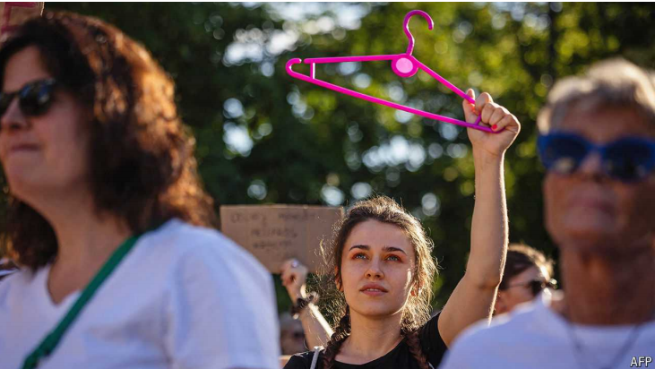

# Poland’s ruling coalition divides over women’s rights

Donald Tusk has failed to keep his promises on abortion laws

原文：

A FLAT IN Warsaw will soon become Poland’s first abortion clinic. The

interior, designed like a teenage girl’s bedroom, reflects the reality of

abortions in a country where they are in effect illegal: most of them happen

at home, the woman unassisted and alone. Abortion Dream Team, the

charity behind the project, says that every day around 130 girls and women

contact it for help in ending their pregnancies. The clinic, which will operate

in a legal grey zone, will give them space to do so—with a comfy sofa and

films to distract them while they take abortion pills.

华沙的一套公寓将很快成为波兰第一家堕胎诊所。内部设计像一个十几岁女孩的卧室，反映了堕胎在一个实际上是非法的国家的现实:大多数堕胎发生在家里，妇女独自一人，无人帮助。该项目背后的慈善机构堕胎梦之队表示，每天大约有130名女孩和妇女联系该组织，寻求帮助终止妊娠。这家诊所将在法律的灰色地带运营，将会给她们提供这样做的空间——提供舒适的沙发和电影，在她们服用堕胎药物时分散她们的注意力。

学习：

Warsaw：华沙（波兰首都）

comfy：美 [ˈkəmfi] 舒适的；舒服的；

原文：

The clinic was born out of growing frustration with Poland’s government

failing to keep its electoral promise to improve women’s rights. Last October

record turnout by young voters helped sweep Donald Tusk, the centre-right

prime minister, back to power. He had promised to put forward a bill on his

first day in office to make abortion available on demand until the 12th week

of pregnancy.

这家诊所的诞生源于对波兰政府未能兑现其改善妇女权利的选举承诺的日益不满。去年10月，年轻选民创纪录的投票率帮助中间偏右的总理唐纳德·图斯克重新掌权。他曾承诺在上任第一天就提出一项法案，让人们在怀孕12周之前可以根据要求堕胎。

学习：

frustration：懊恼；令人懊丧（或懊恼、沮丧）的事物          

原文：

But nine months later, Mr Tusk has not delivered. Natalia Broniarczyk, a

campaigner, blames a lack of will. She points to Mr Tusk’s sweeping

reforms in other areas—notably to state-owned media. “We know that what

the prime minister wants, he does,” says Ms Broniarczyk.

但是九个月过去了，图斯克先生没有兑现承诺。活动家Natalia Broniarczyk指责缺乏意愿。她指出图斯克先生在其他领域的全面改革——特别是国有媒体。“我们知道总理想要什么，他就做什么，”Broniarczyk女士说。

原文：

Since 2021 Poland has become the most restrictive country in the EU on

abortion. It is legal only if the pregnancy threatens the mother’s health or

results from rape or incest. Penalties for doctors and charities who help

women end pregnancies have sown fear. A recent UN report said Polish laws

violated human rights and “may rise to the level of torture or cruel, inhuman

or degrading treatment.”

自2021年以来，波兰已成为欧盟对堕胎限制最严格的国家。只有当怀孕威胁到母亲的健康或由强奸或乱伦导致时，堕胎才是合法的。对帮助妇女终止妊娠的医生和慈善机构的处罚已经播下了恐惧的种子。联合国最近的一份报告称，波兰法律侵犯了人权，“可能会上升到酷刑或残忍、不人道或有辱人格的待遇的水平。”

学习：

incest：美 [ˈɪnˌsɛst] 乱伦

sown：播种；种植；散播；传播；撒播；灌输；（sow的过去分词）

degrading：有辱人格的；侮辱性的；使人丧失尊严的

原文：

The battle over abortion has for many women become symbolic of how the

state treats them. The hard-right president, Andrzej Duda, says he will block

any attempts to soften laws. Mr Tusk’s inability to negotiate promised

improvements to women’s rights—if not with the president, then at least

within his coalition—has become a sign of his political ineffectiveness.

对许多女性来说，围绕堕胎的斗争已经成为国家如何对待她们的象征。极右翼总统安杰伊·杜达表示，他将阻止任何软化法律的企图。图斯克先生无法就改善妇女权利的承诺进行谈判——如果不是与总统，那么至少是在他的联盟内部——已经成为他政治无能的标志。

原文：

At the party’s flagship event for young people on August 23rd, the prime

minister admitted that he did not have a majority to legalise abortion in the

present parliament. Mr Tusk’s coalition is a broad church of almost a dozen

smaller parties. When its left-wing contingent put forward a bill in July to

decriminalise aiding abortions, the coalition’s right-most group, the Polish

People’s Party (PSL), torpedoed it. PSL insists on a referendum on abortion; the

left is infuriated by the suggestion of putting a human right to a vote.

8月23日，在该党针对年轻人的旗舰活动上，首相承认他在当前议会中没有获得堕胎合法化的多数席位。图斯克先生的联盟是由十几个小党派组成的机构。当其左翼代表团在7月提出一项法案，将资助堕胎合法化时，该联盟的最右翼团体，波兰人民党(PSL)将其否决。PSL坚持堕胎公投；左派被将人权付诸表决的提议激怒了。

学习：

contingent：代表团；小组

torpedoed： 美 [tɔr'pidod] 破坏；（torpedo的过去式）

原文：

The dispute has raised questions about whether the coalition can hobble on

for another three years. To placate his supporters, Mr Tusk’s government

recently introduced financial penalties for hospitals that refuse abortions

where they are legal and justified. The coalition is expected soon to pick up

work on a bill legalising same-sex unions, which it published in July.

这场争论引发了人们对联合政府能否再蹒跚前行三年的质疑。为了安抚他的支持者，图斯克先生的政府最近对拒绝合法堕胎的医院进行了经济处罚。预计该联盟将很快接手同性结合合法化法案的工作，该法案于7月份公布。

学习：

hobble on：蹒跚前行

原文：

But Mr Tusk needs to act fast: a presidential election is expected in May 2025.

The campaign, which starts this autumn, will only deepen ideological

divisions in his coalition. Mr Tusk’s likely nominee for president, Rafal

Trzaskowski, the left-leaning mayor of Warsaw, will clash with the centre

right’s Szymon Holownia, who leads the second party in Mr Tusk’s

coalition. Reproductive rights will be a big campaign theme for leftist

parties, who will probably nominate a woman.

但是图斯克先生需要尽快行动:总统选举预计在2025年5月举行。这场始于今年秋天的竞选只会加深他的联盟中的意识形态分歧。图斯克先生可能提名的总统候选人，左倾的华沙市长Rafal Trzaskowski，将与图斯克先生联盟中第二党的中右翼Szymon Holownia发生冲突。生育权将是左翼政党的一大竞选主题，他们可能会提名一名女性。

学习：

reproductive rights：生育权，生殖权

原文：

Disappointed voters may refuse to rally to Mr Tusk’s camp again. The race

will probably be close. Passing a bill to legalise abortion would shift the

onus to Mr Duda—and unite support for a liberal successor. Mr Tusk could

also call an abortion referendum to coincide with the election. That would

bring out voters. But his coalition would probably not be able to agree on

how to phrase the question. ■

失望的选民可能会拒绝再次回到图斯克先生的阵营。这场比赛可能会很激烈。通过一项堕胎合法化的法案将会把责任转移到杜达身上——并联合支持一位自由派继任者。图斯克先生也可以在选举的同时举行堕胎公投。那会吸引选民。但是他的联盟可能无法就如何表述这个问题达成一致。■

学习：

onus：负担；义务；责任

## 后记

2024年9月18日10点32分于上海。

