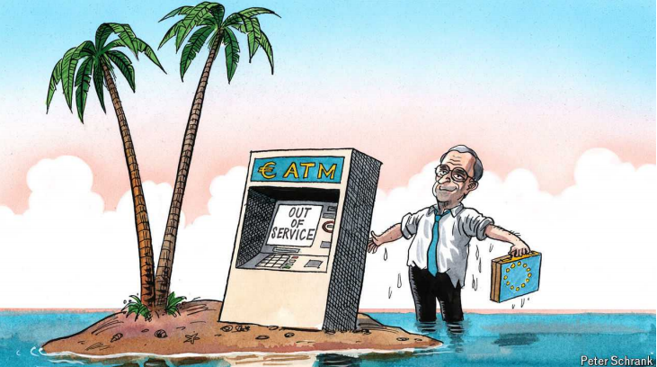

# Nice ideas, Mr Draghi—now who will pay for them?

From “whatever it takes” to “whatever the cost”

原文：

An old joke haunts economists. A chemist, a physicist and an economist are

stranded on a desert island with a tin of beans but no implement to open it.

The chemist suggests corroding the container with sea water, but concludes

it would take years. The physicist proposes a method to prise the tin open

that turns out to be equally impractical. The economist is delighted that only

she has the right answer: “Assume a tin-opener.”

一个老笑话萦绕在经济学家心头。一个化学家、一个物理学家和一个经济学家被困在一个荒岛上，带着一罐豆子，却没有工具打开它。化学家建议用海水腐蚀容器，但认为这需要几年时间。物理学家提出了撬开罐头的方法，结果证明同样不切实际。经济学家很高兴只有她有正确的答案:“假设有一个开罐器。”

学习：

haunts：徘徊于；（鬼魂）出没于（haunt的第三人称单数）

>**“Haunt”** 的意思是 “萦绕于心” 或 “持续困扰”。这里的 “haunt” 形容一个笑话或思想一直困扰着经济学家。
>
>**例子**：
>
>- **英文**: The memory of the old house still haunts her.
>- **中文**: 旧房子的记忆仍然困扰着她。

stranded：困于某地的；处于困境的

desert island：荒岛

tin：金属容器；罐头；罐

implement：手段；器械；器具；工具

corroding：侵蚀；（corrode的现在分词）

prise：美 [praɪz] 撬开；撬起

原文：

Mario Draghi, himself an economist of some renown, this week unveiled a

report on how to revive Europe’s flagging economic prospects. His answer:

“Assume €800bn” (close to $900bn). That is the annual investment the

former boss of the bloc’s central bank thinks is required to prevent the

European Union’s economy falling ever further behind America’s. The

problem is that money on that scale is as elusive in Europe as a tin-opener

on a desert island. Establishing blueprints for spending money is the easy

bit. But given EU countries are trillions of euros in debt beyond what the

club’s own rules are meant to allow, finding the cash is likely to prove as

hard as coming up with a funny joke involving economists.

马里奥·德拉吉本人就是一位颇有名气的经济学家，他本周公布了一份关于如何重振欧洲萎靡不振的经济前景的报告。他的回答是:“假设有8000亿英镑(接近9000亿美元)。这是欧盟中央银行前老板认为防止欧盟经济进一步落后于美国所需的年度投资。问题在于，如此大规模的资金在欧洲就像荒岛上的开罐器一样难以找到。建立花钱的蓝图是比较容易的。但鉴于欧盟国家的债务超过了该俱乐部自己的规则所允许的数万亿欧元，找到现金可能会像想出一个涉及经济学家的有趣笑话一样困难。

学习：

renown：声誉；名声；声望；名誉；

flagging：衰弱的；下垂的；萎靡的

elusive：难以理解的；难以找到的

原文：

A tension afflicts the EU. On the one hand, as Mr Draghi has spelled out in a

400-page report for the European Commission, it needs to invest lots to face

up to challenges facing the continent. The to-spend list is daunting. More

needs to be shelled out on defence, obviously. A bob or ten are required to

decarbonise the economy. Improving digital networks is as necessary as it is

expensive. Ageing will send welfare bills ever soaring as fewer workers

support more pensioners. There is an urgent need to invest in innovation and

skills to boost productivity, the better to build the Apple-like corporate

Goliaths that are so sorely lacking in Europe. And derisking trade, for

example by stemming dependence on hostile foreign powers for vital

commodities (Germany’s recent reliance on Russian gas, for example), will

prove expensive too. The Marshall Plan spent 1-2% of GDP per year after the

second world war to rebuild rubble-strewn bits of Europe; Mr Draghi thinks

annual investment by business and governments needs to jump by 5% of GDP

compared with now.

一种紧张关系困扰着欧盟。一方面，正如德拉吉在一份400页的报告中为欧盟委员会(European Commission)所阐述的那样，欧盟需要投入大量资金来应对欧洲大陆面临的挑战。支出清单令人望而生畏。很明显，我们需要在国防上投入更多。经济去碳化需要很多钱。改善数字网络既必要又昂贵。随着越来越少的工人供养越来越多的养老金领取者，老龄化将导致福利账单不断飙升。迫切需要投资创新和技能来提高生产率，这样才能更好地打造欧洲极度缺乏的苹果式企业巨人。此外，减少贸易，比如停止对外国敌对势力的重要商品的依赖(比如德国最近对俄罗斯天然气的依赖)，也将被证明是昂贵的。第二次世界大战后，马歇尔计划每年花费GDP的1-2%来重建欧洲的废墟；德拉吉认为，与现在相比，企业和政府的年度投资需要增加GDP的5%。

学习 ：

afflict：使痛苦；折磨；影响；困扰

daunting: 令人畏惧的；令人胆怯的；令人望而生畏的

shell out: 详细说明

>**"Spell out"** 的意思是 “详细说明” 或 “清楚地阐明”。在这里，指的是 Mr. Draghi 在一份400页的报告中详细阐述了欧盟所面临的投资需求和挑战。
>
>**例子**：
>
>- **英文**: The teacher spelled out the rules for the assignment.
>- **中文**: 老师详细说明了作业的规则。

a bob or ten：一些钱

>**"A bob or ten"** 是一种非正式表达，意思是 “一些钱” 或 “几块钱”。在这里，它用于幽默地形容需要投入大量资金来实现去碳化经济的目标。
>
>**例子**：
>
>- **英文**: We’ll need a bob or ten to fix the roof.
>- **中文**: 我们需要一些钱来修理屋顶。

stemming：阻止；封堵；遏制；（stem的现在分词）

rubble：瓦砾；碎石

strewn：撒满；散播；点缀；（strew的过去分词）

rubble-strewn：瓦砾遍地的；碎石散落的；碎石瓦砾遍布的

原文：

Alas, the other hand, the one with the money, is empty. In a rose-tinted

world, rewiring the economy could help lead to the private sector coming up

with a goodly chunk of the €800bn extra investment needed year after year.

Extending the EU single market that works well for goods to bank accounts

and stockmarkets could make viable a slew of new investments, for

example. But such a “capital markets union” was first proposed over a

decade ago and has proved elusive. Achieving it would involve taking on

many entrenched interests.

唉，另一只手，有钱的那只，是空的。在一个乐观的世界里，重组经济可能有助于私人部门拿出年复一年所需的8000亿英镑额外投资中的很大一部分。例如，将对商品运作良好的欧盟单一市场扩展到银行账户和股票市场可以使一系列新的投资变得可行。但这种“资本市场联盟”在十多年前首次提出，并被证明难以实现。实现这一目标需要挑战许多既得利益。

学习：

rose-tinted：玫瑰色的；过于乐观的；粉饰的；理想化的          

a slew of：大量；一系列；一批          

elusive：难以找到的；难以达到的

entrenched interests：既得利益；

原文：

The obvious footers of Mr Draghi’s proposed bill are the EU’s 27 national

governments, which do most of the taxing and spending in Europe. (The EU

has a small budget, at just 1% of GDP, over a third of which is spent on farm

subsidies.) But there has been too much spend and not enough tax of late.

European fiscal rules adopted ahead of the creation of the euro stipulate that

no EU country is meant to have a government-debt burden of over 60% of GDP,

nor an annual deficit of over 3%. How quaint that seems these days. Over

half the EU’s 27 member states exceeded the debt figure at last count. France,

Italy and Spain, ie, three of the EU’s four biggest countries, all have debt-to-GDP

ratios above 100%. That is the kind of level where investors get jittery about

public finances drifting further out of balance (as Liz Truss, a British prime

minister who resigned after markets balked at her announcement of tax cuts,

found out in 2022). Taken together, the debt over and above the 60%

threshold amounts to €4.8trn, equivalent to a third of the bloc’s GDP. Sadly, it

cannot simply be assumed away.

德拉吉提议的法案中明显的页脚是欧盟27个成员国政府，它们承担了欧洲大部分的税收和支出。(欧盟的预算很少，仅占GDP的1%，其中三分之一以上用于农业补贴。)但最近支出太多，税收却不够。欧元诞生前采用的欧洲财政规则规定，任何欧盟国家的政府债务负担都不能超过GDP的60%，年度赤字也不能超过3%。如今这看起来多么离奇。最近一次统计显示，欧盟27个成员国中有超过一半的国家超过了债务数字。法国、意大利和西班牙，也就是欧盟四个最大国家中的三个，都有超过100%的债务-GDP比率。这是投资者对公共财政进一步失衡感到紧张的水平(正如英国首相利兹·特拉斯(Liz Truss)在2022年发现的那样，她在市场对她的减税声明犹豫不决后辞职)。加在一起，超过60%门槛的债务总计达€4.8万亿欧元，相当于欧元区GDP的三分之一。可悲的是，它不能简单地被假定不存在。

学习：

footers：脚注；（footer的复数）

stipulate：规定；明确要求；约定

quaint：古怪的；离奇有趣的

jittery：紧张不安的；战战兢兢的

balked：英 ['bɔ:kt] 犹豫；（balk的过去式）

原文：

Whereas Mr Draghi sees the need to splurge, the very commission that asked

for his report wants national governments to tighten their belts. EU debt and

deficit rules suspended during covid-19 are being reinstated, with slight

tweaks. Nobody thinks they will prevent the kind of profligacy that was

tolerated in the past, but appearances must be maintained. France is heading

for a deficit above 5%, and has said it will miss an upcoming EU deadline to

submit its budget plans for 2025. Another six countries are in an “excessive

deficit procedure” which will force them to trim spending. Germany, ever

the virtuous fiscal pupil, has hacked spending to meet self-imposed rules far

stricter than budgetary edicts from Brussels. A fight over every *pfennig*

routinely threatens to blow up its governing coalition. €800bn a year, was it,

Mr Draghi?

尽管德拉吉认为有必要挥霍，但要求他提交报告的委员会却希望各国政府勒紧裤腰带。在新冠肺炎会议期间暂停的欧盟债务和赤字规则正在恢复，只是略有改动。没人认为他们会阻止过去被容忍的那种挥霍，但必须保持表面现象。法国的赤字将超过5%，并表示将错过欧盟即将到来的提交2025年预算计划的最后期限。另外六个国家正处于“过度赤字程序”，这将迫使他们削减开支。一向表现良好的德国财政学生大幅削减支出，以满足远比布鲁塞尔预算法令更严格的自我规定。每一个芬尼的争斗都有可能摧毁其执政联盟。每年8000亿英镑，是吗，德拉吉先生？

学习：

reinstated：使复原；使恢复；（reinstate的过去式）

trim：缩减

virtuous：品德高的；品德高尚的；品行端正的；

hack：削减

pfennig：芬尼（德国旧货币单位）

## **Money for nothing, Mario’s tips for free**

原文：

Reading between the lines, there is no doubt where the former Italian prime

minister thinks much of the money ought to come from: the EU should borrow

it, issuing its own debt over and above what national governments already

owe. A precedent for this was set after covid, when EU countries agreed to a

€750bn recovery plan underpinned by money borrowed jointly. It was meant

to be a one-off, as skinflint Germans and Dutch, worried that their thriftiness

ends up paying for southern profligacy, rarely fail to mention. Their

respective finance ministers shot down the idea of more EU debt implicit in Mr

Draghi’s wish-list within hours of its release.

从言外之意来看，这位意大利前总理认为大部分资金应该来自哪里是毫无疑问的:欧盟应该借钱，在各国政府已有债务的基础上发行自己的债务。这方面的一个先例是在冠状病毒肺炎会议之后，当时欧盟国家同意了一项由共同借款支持的7500亿欧元的€复苏计划。这本来是一次性的，因为一毛不拔的德国人和荷兰人担心他们的节俭最终会为南方的挥霍买单，所以很少不提到这一点。在德拉吉的愿望清单公布后几个小时内，他们各自的财政部长就否决了该清单中隐含的增加欧盟债务的想法。

学习：

between the lines：字里行间；言外之意

skinflint：美 [ˈskɪnˌflɪnt] 吝啬鬼；小气鬼；

thriftiness：节俭；

原文：

Perhaps the exalted economist’s pleas will unclog the debate on joint debt:

there is, for example, a good argument that some defence spending should

be financed by EU bonds. But even if a deal on joint borrowing can be

reached, it is unlikely to arrive before German elections next year, says

Shahin Vallée of the German Council on Foreign Relations. By then all eyes

will be on France and its presidential vote in 2027; then something else no

doubt. Mr Draghi paints a sobering portrait of Europe’s challenges. That

there is no way to pay for a solution is the truly worrying bit. ■

或许这位德高望重的经济学家的请求将会消除关于共同债务的争论:例如，有一个很好的论点，即一些国防开支应该由欧盟债券提供资金。但是德国对外关系委员会的Shahin Vallée说，即使联合借贷协议能够达成，也不太可能在明年德国大选之前达成。到那时，所有的目光都将聚焦于法国及其2027年的总统选举；毫无疑问还有别的原因。德拉吉冷静地描绘了欧洲面临的挑战。无法支付解决方案的费用才是真正令人担忧的地方。■

学习：

exalted：崇高的；高尚的；显赫的；有权势的；高地位的

pleas：请求；（plea的复数）          

unclog：疏通；清除堵塞；解除阻碍；使畅通

sobering：使清醒的；使冷静的

## 后记

2024年9月18日12点55分于上海。

