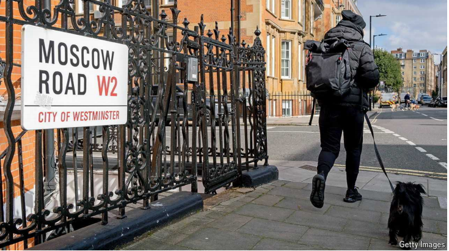

# Will Labour be better at tackling dirty money than the Tories?

Two challenges stand out. Both could be dealt with quickly

原文：

IN 2015 DAVID Cameron called time on those who saw London as “a place

to stash your dodgy cash”. A year later the then prime minister hosted an

international anti-corruption summit, at which he could tout Britain’s new

public register of company owners, the first in a G20 country. This was a

“high watermark” in Britain’s efforts to fight dirty money, reckons Robert

Barrington, a corruption expert at Sussex University.

2015年，戴维·卡梅伦(DAVID Cameron)呼吁那些将伦敦视为“藏污纳垢之地”的人停下脚步。一年后，当时的首相主持了一次国际反腐败峰会，会上他可以吹嘘英国新的公司所有者公共登记册，这是G20国家中的第一个。苏塞克斯大学的腐败问题专家罗伯特·巴林顿认为，这是英国打击黑钱活动的一个“高水印”。

学习：

stash：藏匿；隐藏；秘藏；储存；存放

dodgy cash: 来路不明的钱，不正当的资金
>
>
>**Dodgy cash** 指的是 **"不正当的资金"** 或 **"来路不明的钱"**，通常涉及非法或不道德的活动，例如逃税、贪污、洗钱或其他犯罪行为。在这个语境中，David Cameron 是指某些人把伦敦当作隐藏非法资金的避风港。
>
>- 例子：
>  - 英文：**The government is cracking down on individuals hiding their dodgy cash in offshore accounts.**
>  - 中文：**政府正在打击那些把非法资金藏在离岸账户中的人。**

tout：吹嘘

watermark：水位标记

high watermark：高水位

原文：

Russia’s invasion of Ukraine in 2022 did prompt two economic-crime laws

that, among other things, created a register of overseas entities owning

British property. But there are still big holes in the defences against illicit

finance. The National Crime Agency (NCA) says it is a “realistic possibility”

that over £100bn ($130bn) is rinsed annually through Britain’s financial

system and corporate structures. A former Tory minister has suggested that

Britain and its overseas territories, such as the British Virgin Islands (BVI) and

Cayman Islands, handle 40% of the world’s dirty money.

2022年俄罗斯入侵乌克兰确实催生了两部经济犯罪法，其中之一是建立了拥有英国财产的海外实体登记册。但是对非法金融的防御仍然有很大的漏洞。国家犯罪署(NCA)表示，每年有超过1000亿英镑(1300亿美元)的资金通过英国的金融系统和企业结构被清洗，这是一种“现实的可能性”。一位前保守党部长表示，英国及其海外领地，如英属维尔京群岛(BVI)和开曼群岛，处理着世界上40%的脏钱。

学习：

rinsed：冲洗；（rinse的过去分词）

原文：

Just before the election on July 4th, the then shadow foreign secretary, David

Lammy, accused the Conservatives of turning Britain into a “money-

laundering superpower”. His vow to make the issue a priority in office

excites anti-corruption campaigners, as does his insistence that it is about

more than money. Mr Lammy argues that turning a blind eye to dirty money

from Russia and elsewhere undermines Britain’s national security and

international reputation.

就在7月4日大选之前，当时的影子外交大臣大卫·拉米指责保守党将英国变成了一个“洗钱超级大国”。他发誓要在执政期间优先解决这个问题，这让反腐败运动者兴奋不已，他坚称这不仅仅是为了钱。拉米先生认为，对来自俄罗斯和其他地方的脏钱视而不见会损害英国的国家安全和国际声誉。

学习：

laundering： 美 ['lɔndərɪŋ] 洗涤；洗黑钱（把来路可疑的钱弄得貌似合法）；（launder的现在分词形式）

原文：

Anticipation, then, is growing as Labour works on its own anti-corruption

strategy. Unfinished business ranges from beefing up domestic enforcement

(agencies are badly underfunded) to strengthening international co-operation

(any laundering scheme worth its salt straddles several borders). But there

are two issues in particular where the government should be able to get

quick results.

随着工党制定自己的反腐败战略，人们的期待也在增加。未完成的任务从加强国内执法(机构资金严重不足)到加强国际合作(任何有价值的洗钱计划都是跨国的)。但是有两个问题特别值得注意，政府应该能够很快得到结果。

学习：

beef up：加强

worth its salt: 有价值

>**Worth its salt** 是一个习语，意思是 "有价值" 或 "称职"。在这个语境中，**any laundering scheme worth its salt** 意指任何 "有价值的洗钱计划" 或 "称得上专业的洗钱计划"，都会涉及多个国家的边境，意味着跨境操作是高效洗钱计划的常见特征。
>
>- 例子：
>  - 英文：**Any lawyer worth their salt would know how to handle this case.**
>  - 中文：**任何称职的律师都知道如何处理这个案子。**

straddles：美 [ˈstrædlz] 跨坐；（straddle的复数）

原文：

The first is to close the biggest remaining gap when it comes to knowing

who owns what: trusts. These legal arrangements may have a long history—

they date back to the Crusades—and most are probably used legitimately, for

estate-planning and the like. But investigators say they have become

increasingly popular with financial ne’er-do-wells as more light has been

shone on companies and partnerships. A study last year found that

ownership of over 100,000 properties on Britain’s overseas-entities register

was opaque, largely owing to trusts. This could be solved by strengthening

registration requirements and making the data available at least to those with

a legitimate interest in seeing it, such as the police and investigative

journalists.

第一是在了解谁拥有什么的问题上，填补剩余的最大空白:信托。这些法律安排可能有很长的历史——它们可以追溯到十字军东征时期——并且大部分可能被合法地用于遗产规划等。但调查人员表示，随着越来越多的人开始关注公司和合伙企业，他们在金融领域越来越受欢迎。去年的一项研究发现，英国海外实体登记册上超过100，000处房产的所有权是不透明的，主要是由于信托。这个问题可以通过加强注册要求和至少向那些有合法权益的人提供数据来解决，比如警察和调查记者。

原文：

The second priority should be to finally take to task the overseas territories,

which remain key nodes in global money-laundering networks. The

Conservatives’ efforts to force more openness on these sun-kissed havens

were half-hearted. “They tended to back off when accused of neocolonialist

interference or undermining the overseas territories’ economic

independence,” says Mr Barrington. Only one British dependency, Gibraltar,

has a public corporate-ownership register.

第二个优先事项应该是最终打击海外领土，它们仍然是全球洗钱网络的关键节点。保守党迫使这些阳光明媚的避风港更加开放的努力并不热心。巴林顿表示:“当被指责进行新殖民主义干涉或破坏海外领地的经济独立时，他们往往会退缩。”。只有一个英国属地直布罗陀有公开的公司所有权登记册。

学习：

sun-kissed：阳光照耀的；洒满阳光的；

half-hearted：半心半意的；不热心的；敷衍的

back off：（为避免问题或冲突而）撤退；后退；避让；退缩

原文：

Labour has a specific opportunity to strike. When the European Court of

Justice ruled in 2022 that the public should not have unrestricted access to

company registers, recalcitrant territories like the BVI and Cayman used that as

an excuse for foot-dragging. They indicated that they would follow the EU’s

lead—once it figured out how to respond. The EU has now done so,

addressing the court’s concerns while keeping a reasonably broad definition

of who can access data. The new government should now force the

territories to keep their word; it can, as one anti-graft campaigner puts it,

“ensure they’re hoist by their own petard”.

工党有罢工的特定机会。当欧洲法院(European Court of Justice)在2022年裁定，公众不应不受限制地访问公司注册信息时，英属维尔京群岛和开曼等顽固不化的地区以此为借口故意拖延。他们表示，一旦欧盟想出应对之策，他们将追随欧盟的脚步。欧盟现在已经这样做了，解决了法院的担忧，同时对谁可以访问数据保持了合理的宽泛定义。新政府现在应该迫使这些地区遵守诺言；正如一位反贪污活动家所说，这可以“确保他们搬起石头砸自己的脚”。

学习：

recalcitrant：美 [rəˈkælsətrənt] 桀骜不驯的；顽固的；抵抗权威的

foot-dragging：拖延；怠工；拖拉；

graft：腐败

hoist：举起；抬高；吊起；

petard：美 [pəˈtɑrd] 爆炸装置；炸药包；爆破筒

hoist by their own petard：自作自受；被自己设计的陷阱所害

>"**Hoist by their own petard**" 是一个来源于莎士比亚《哈姆雷特》中的短语，意思是**自作自受**或**被自己设计的陷阱所害**。在这个语境中，指的是这些不合作的地区（如英属维尔京群岛和开曼群岛）曾利用欧盟的决定作为拖延借口，现在欧盟已经解决了问题，英国新政府应该让这些地区履行他们的承诺，最终使他们陷入自己设下的局面。
>
>- 例子：
>  - 英文：**The hacker was hoist by his own petard when the virus he created crashed his own computer.**
>  - 中文：**黑客被自己制造的病毒反噬，导致他的电脑崩溃，真是自作自受。**

原文：

Britain has a long history of opposition parties talking tough on cleaning up

finance but buckling in government—usually when lobbyists get their teeth

in. Labour, which is keen not to appear anti-business, has stressed that

although it plans to tackle finance’s “dark corners”, it wants to nurture the

City. Anti-corruption policing tends to struggle in the jostle for funding:

tackling money-launderers doesn’t play as well politically as taking down

drug gangs or sex-traffickers. Sir Keir Starmer, the prime minister, “doesn’t

seem as interested as Lammy”, says another campaigner. “He’s big on the

rule of law but hasn’t really focused on rooting out dirty money.”

英国的反对党在清理金融问题上言辞强硬，但在政府面前却缩手缩脚，这种情况由来已久——通常是在游说者深入介入的时候。热衷于不表现出反商业的工党强调，尽管它计划解决金融的“黑暗角落”，但它希望滋养这座城市。反腐败政策往往会在资金争夺中陷入困境:打击洗钱者在政治上不如打击贩毒团伙或性交易者。另一名活动家表示，总理凯尔·斯塔莫爵士“似乎没有拉米感兴趣”。“他热衷于法治，但并未真正致力于根除黑钱。”

学习：

buckle: 屈服，让步
>
>
>**Buckle** 在这里的意思是 **屈服** 或 **让步**，尤其是指在压力下或面对挑战时放弃原有立场或目标。这个句子中的意思是，反对党在竞选时常常对金融清理问题态度强硬，但一旦进入政府后，通常会在压力下（如来自游说团体的影响）妥协。
>
>- 例子：
>  - 英文：**The company promised to reduce emissions, but buckled under pressure from industry lobbyists.**
>  - 中文：**公司曾承诺减少排放，但在行业游说团体的压力下屈服了。**

jostle：美 [ˈdʒɑːsl] 争抢；竞争；激烈争夺

get their teeth in：深入参与某事

>**Get their teeth in** 是指 **深入参与某件事**，通常带有强烈的专注或决心。在这个语境中，指的是游说者对某个问题进行深入干预，影响政策或决策过程。
>
>- 例子：
>  - 英文：**Once the lobbyists got their teeth into the new tax policy, it became difficult to pass reforms.**
>  - 中文：**一旦游说者深入干预新税收政策，推进改革就变得更加困难。**

traffickers：（traffickers）商人；贩子；从事违法勾当者；（trafficker的复数）

原文：

Activists’ best hope may be to stress the link to ordinary people. Joe Powell,

the Labour MP for Kensington and Bayswater in London (and a former deputy

head of a pro-transparency organisation), says that one in eight properties in

his constituency are second homes or long-term empty. He reckons that 40%

of its foreign-owned properties are trust-owned. “Meanwhile, we have a

serious lack of affordable housing. So you have to make the argument [for

greater transparency] on two levels. Yes, it’s about taking on Putin and his

cronies. But there’s also a basic democratic argument, given the impact on

the electorate, the real damage it causes locally.” ■

活动家们最大的希望可能是强调与普通人的联系。伦敦肯辛顿和贝斯沃特的工党议员乔·鲍威尔(一个支持透明组织的前副主席)说，在他的选区里，八分之一的房产是第二套住房或长期空置。他估计其40%的外国所有的财产是信托所有的。“与此同时，我们严重缺乏负担得起的住房。因此，你必须在两个层面上论证(提高透明度)。是的，这是关于对付普京和他的亲信。但也有一个基本的民主论点，考虑到对选民的影响，它在当地造成的真正损害。”■

## 后记

2024年9月18日16点21分于上海。

