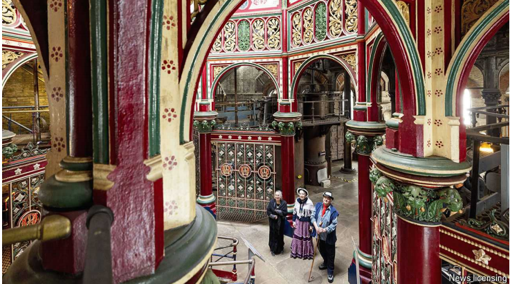

# Volunteering has big benefits for the elderly

But those Britons who would most benefit are least likely to do it

原文：

THE CROSSNESS Pumping Station is not what you’d expect of a sewage

works. With its spiral staircases, colourful tiling and intricate cast-iron

latticing, it is a monument to the brilliance of Victorian engineering. Built in

1865 under the direction of Joseph Bazalgette, its four giant, steam-powered

pumps (Prince Consort, Victoria, Albert Edward and Alexandra) were the

beating heart of a system that eradicated cholera in London and established a

model for urban sanitation.

克罗斯内斯泵站不是你所期望的污水处理厂。它的螺旋楼梯、彩色瓷砖和复杂的铸铁网格是维多利亚工程辉煌的纪念碑。在Joseph Bazalgette的指导下，于1865年建造的四个巨大的蒸汽动力泵(Prince Consort、Victoria、Albert Edward和Alexandra)是一个系统的跳动的心脏，该系统根除了伦敦的霍乱，并建立了城市卫生设施的模型。

学习：

pumping station：泵站；抽水站

sewage：美 [ˈsuːɪdʒ] 污水；

sewage works：污水处理厂；污水处理设施；污水处理系统

staircase：楼梯；

tiling：美 [ˈtaɪlɪŋ] 铺地砖；贴瓷砖；瓷砖面；地砖面

intricate：复杂的

cast-iron：铸铁的；坚固的

lattice：英 [ˈlatɪs] 格子；格架；晶格；栅格；

monument：纪念碑

eradicate：消除；根除；铲除

cholera：美 [ˈkɑːlərə] 霍乱；

sanitation：环境卫生

原文：

Steam has not been needed to pump London’s effluent in more than a

century. But on the day your correspondent visits, the Prince Consort and

Victoria are humming once again. “What other country would name its shit

pumps after the royal family?” asks Ray Fleming, a volunteer in a team that

has lovingly restored the engines and spruced up the surrounding site over

the past four decades.

一个多世纪以来，人们不再需要蒸汽来抽取伦敦的污水。但是在记者来访的那一天，两座泵又开始哼唱了。"还有哪个国家会以皇室家族的名字来命名它的大便泵？"雷·弗莱明问道，他是一个团队的志愿者，在过去的四十年里，这个团队充满爱心地修复了发动机，并打扫了周围的场地。

学习：

effluent：美 [ˈɛfluənt] 废水；污水

humming：发低哼声；（hum的现在分词形式）表示正在工作

spruce：美 [spruːs]  打扮整齐；使整洁；使显干净；

原文：

The Crossness Engines Trust has a stated mission of recovering part of

“Britain’s industrial heritage”. But it is also testament to the value of

volunteering. To almost 100 regular volunteers, many getting on a bit, it

offers purpose and community. Working there “keeps you fully occupied and

gives you something to look forward to”, says Bob Tovey. On open days he

and Mr Fleming don bowler hats, neckties and waistcoats to field questions

about the pumps’ capacity (around 250 tonnes per minute).

克罗斯尼斯引擎信托基金会宣称的使命是恢复部分“英国工业遗产”。但这也证明了志愿服务的价值。对于近100名常规志愿者来说，许多人有点老了，它提供了目标和社区。鲍勃·托维说，在那里工作“让你忙得不可开交，让你有所期待”。在开放日，他和弗莱明戴着圆顶礼帽，打着领带，穿着马甲，回答有关水泵容量的问题(大约每分钟250吨)。

学习：

testament：证据；证明；见证

don：穿上；披上；戴上

bowler：美 [ˈboʊlər] 圆顶硬礼帽

neckties：领带；（necktie的复数）

waistcoats：西装背心；马甲；（waistcoat的复数）

field：圆满答复；巧妙回答

field questions：回答问题

原文：

If that sounds like a strange way to spend a Sunday, studies back up the idea

that volunteering has big benefits for well-being (so long as people are not

bored). Younger do-gooders can find it easier to move into work. But the

biggest gains are found among the elderly. Those volunteers in the

“advanced stages of life” exhibit “better working memory and verbal

fluency”, according to one meta-analysis. Experts think the social

interactions it entails can help stave off dementia.

如果这听起来像是一种奇怪的度过周日的方式，研究支持志愿活动对健康有很大好处的观点(只要人们不无聊)。年轻的行善者会发现更容易进入工作岗位。但是最大的收益来自老年人。根据一项荟萃分析，那些处于“生命高级阶段”的志愿者表现出“更好的工作记忆和语言流畅性”。专家认为，它所带来的社会互动有助于延缓痴呆症。

学习：

do-gooders ：行善者

entail：引起；导致

starve off：避开；延缓          

dementia：美 [dɪˈmenʃə] 痴呆；老年痴呆症

原文：

There are two problems, however. First, those who would benefit most from

volunteering—because, say, they are lonely, isolated or unhappy—are least

likely to do it, says Jurgen Grotz of the Institute for Volunteering Research at

the University of East Anglia. The Crossness site, many of whose volunteers

are former manual workers, is unusual; volunteering is more often the

preserve of the affluent. That should not be surprising, says John Mohan of

the University of Birmingham: the biggest determinant of whether people

volunteer is how economically secure they feel. Stress, unpredictable shifts

or simply not having a car—all these things count.

然而，有两个问题。东安格利亚大学志愿服务研究所的尤尔根·格罗茨说，首先，那些从志愿服务中受益最多的人——比如说，因为他们孤独、孤立或不快乐——最不可能去做。克罗斯尼斯不寻常，它的许多志愿者以前都是体力劳动者；志愿服务往往是富人的专利。伯明翰大学的约翰·莫汉说，这并不奇怪:人们是否志愿的最大决定因素是他们在经济上的安全感。压力、不可预测的变化或者只是没有车——所有这些都很重要。

学习：

manual workers：体力劳动者

affluent：富裕的；充裕的；富有的

原文：

That may help explain the second problem: volunteering is in decline. A

decade ago 27% of adults in England volunteered once a month. Now it is

just 16%. The fall has been steepest among the young. Some culture

warriors blame fecklessness. Insecure work and housing are likelier culprits.

这可能有助于解释第二个问题:志愿服务在减少。十年前，英国27%的成年人每月志愿服务一次。现在只有16%。年轻人的下降幅度最大。一些文化斗士指责无能。不稳定的工作和住房更有可能是罪魁祸首。

学习：

fecklessness：徒劳; 低效率; 无能; 

culprits：美 [ˈkʌlprɪts] 罪犯；（culprit的复数）

原文：

Politicians have a long and patchy record of trying to boost volunteering.

The last tilt—the “Big Society” touted by Lord Cameron when he was prime

minister to offset deep cuts in public spending—went nowhere. But it was “a

great idea, in principle”, according to Sir Keir Starmer, the current prime

minister. A tour of Bazalgette’s masterpiece suggests that is right. ■

政治家们有着长期且不完整的推动志愿服务的记录。最后一次倾斜——卡梅伦勋爵在担任首相时鼓吹的“大社会”抵消了公共支出的大幅削减——没有取得任何进展。但据现任总理凯尔·斯塔莫爵士称，这是“原则上的一个伟大想法”。对巴扎格特杰作的一次参观表明这是正确的。■

学习：

patchy：不均匀的；不完全的；不完整的；参差不齐的

## 后记

2024年9月18日17点44分于上海。

