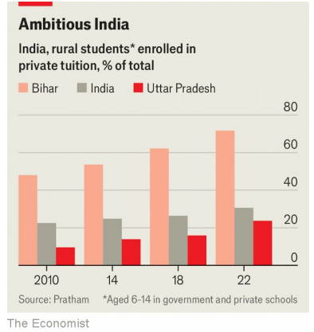

# Private tutoring is booming across poorer parts of Asia

Governments are struggling to keep up with an educational arms race

原文：

The moral of the story is clear in “12th Fail”, a recent Bollywood hit about a

poor farm boy, Manoj, bent on passing India’s ruthless police exam.

Persevere and be richly rewarded, it suggests. Yet for a film about education

and meritocracy, the portrayal of Indian schools is dismal: teacher-abetted

cheating is rife at Manoj’s local school. Where he ultimately finds success,

and love, is not at school, but at a jam-packed tutoring centre in Delhi.

这个故事的寓意在“第12次失败”中很明显，这是一部最近的宝莱坞电影，讲述了一个贫穷的农村男孩Manoj，一心想通过印度残酷的警察考试。它表明，坚持不懈会得到丰厚的回报。然而，对于一部关于教育和精英管理的电影来说，对印度学校的描述是令人沮丧的:教师教唆的作弊在Manoj的当地学校很普遍。他最终找到成功和爱情的地方不是在学校，而是在德里一个拥挤的辅导中心。

学习：

bent on：决心做；一心想要；执意；

ruthless exam：残酷的考试

persevere：美 [ˌpɜːrsəˈvɪr] 坚持；坚持不懈 **注意发音**

meritocracy：美 [ˌmerɪˈtɑːkrəsi] 精英治理；精英管理制度

dismal：糟糕的；阴暗的；令人沮丧的；

abetted：煽动；怂恿；（abet的过去式和过去分词）          

rife：普遍的；常见的；流行的；盛行的

jam-packed：挤满的；拥挤的；

原文：

Private tutoring is well known as an East Asian phenomenon. Apart from in

China, most students in East Asia get it: 72% in Hong Kong; 79% at South

Korea’s *hagwons*; 52% of lower-secondary schoolers, Japan’s main test-

crammers, in the country’s *juku*. In China, where 38% of students (and 45%

in cities) took private tutoring before a 2021 clampdown, many centres have

simply gone underground. These businesses, whatever their flaws, exist

alongside education systems that are highly effective and well-funded.

私人辅导是众所周知的东亚现象。除了中国，东亚的大多数学生都明白这一点:香港有72%；79%在韩国的hagwons；52%的初中学生，日本的主要考试填鸭式学生，在该国的juku。在中国，在2021年取缔之前，38%的学生(城市为45%)接受私人辅导，许多中心干脆转入地下。无论这些企业有什么缺陷，它们都与高效且资金充足的教育系统共存。

学习：

crammer： （应付考试的）强化训练补习学校；

clampdown：压制；取缔；限制；严禁          

## **The hard way**

原文：

But now private tutoring is on the rise in poorer parts of Asia. The scale is

huge. Although the data are scattered and shoddy, we have tried to estimate

tutoring’s prevalence in South and South-East Asia, excluding Singapore,

where the education system more closely resembles those in East Asia. From

Pakistan to Indonesia, we reckon that roughly 258m children get private

tuition.

但是现在在亚洲的贫困地区，私人家教正在兴起。规模巨大。尽管数据分散且质量低劣，但我们还是试图估算辅导在南亚和东南亚的普及程度，不包括新加坡，那里的教育体系与东亚更为相似。从巴基斯坦到印度尼西亚，我们估计大约有2 . 58亿儿童接受私人辅导。

学习：

on the rise：在增加；在增长；在上升；在上涨

shoddy：低劣的

get private tuition：接受私人辅导，接受家教 = get private tutoring

原文：

The biggest market is in India. Fully 31% of rural Indian schoolchildren

under 15 now get private tutoring, up from 23% in 2010; in some poorer

states, three in four do (see chart). Tax revenue from Indian tutoring centres

has more than doubled since 2019. But even removing India from the mix

still leaves a tutoring tally of 131m children, by our estimate.

最大的市场在印度。15岁以下的印度农村学龄儿童中，有整整31%接受私人辅导，比2010年的23%有所上升；在一些较贫穷的州，四分之三的人这样做(见图表)。自2019年以来，印度辅导中心的税收增加了一倍多。但据我们估计，即使将印度排除在外，仍有1 . 31亿儿童需要补习。

学习：

tally：合计

原文：

The first reason for the growth is gaps left by formal education systems. In

poorer parts of Asia, the state often struggles to provide good schools. In this

century, as primary education has neared universality, the share of children

enrolled in secondary school rose by 24 points in South Asia and by 16

percentage points in the rest of Asia, according to the World Bank. Yet over

the same period, government education spending as a share of GDP has

stagnated or fallen across much of the region.

增长的第一个原因是正规教育系统留下的空白。在亚洲较贫困的地区，政府往往难以提供好的学校。根据世界银行的数据，在本世纪，随着小学教育接近普及，南亚的中学入学率上升了24个百分点，亚洲其他地区上升了16个百分点。然而，在同一时期，政府教育支出占GDP的比重在该地区大部分地区停滞不前或有所下降。

学习：

primary education：小学教育；初级教育；基础教育          

secondary school：中学

原文：

In many places this has led to cuts to teachers’ salaries and textbooks. In

Cambodia, one of Asia’s poorest countries, an estimated 82% of students

take private tutoring, mostly from their own low-paid teachers seeking a

salary top-up. Schools end up less equipped to deliver results, and the worst

fall apart. Yet many Asian systems sort children through high-stakes exams.

So parents turn to tutors.

在许多地方，这导致了教师工资和教科书的削减。在亚洲最贫穷的国家之一柬埔寨，估计有82%的学生接受私人辅导，大多来自他们自己的低薪教师，寻求加薪。学校最终不具备交付成果的条件，最差的学校会分崩离析。然而，许多亚洲体系通过高风险的考试对孩子进行分类。所以父母求助于家教。

学习：

Cambodia：美 [ˌkæmˈboʊdiə] 柬埔寨

top-up：充值；补足；加满；补充

seek a salary top-up：寻求加薪

high-stakes: 带有重大风险或后果的, 可以翻译为“至关重要的”

>“High-stakes” 指的是带有重大风险或后果的，通常与需要承担很大责任或可能带来严重影响的决策或行动相关。这里指的是亚洲国家的那些决定孩子未来命运的重要考试，考试结果对学生的未来产生深远影响。
>
>### 例子：
>1. **English**: The final round of the competition was high-stakes, as winning would secure a scholarship for college.
>2. **中文**：比赛的最后一轮是至关重要的，因为获胜将获得大学奖学金。
>
>3. **English**: In high-stakes exams like university entrance tests, students face immense pressure to perform well.
>4. **中文**：在像大学入学考试这样至关重要的考试中，学生面临巨大的成绩压力。

原文：

A second factor is heightened social competition, driven by a growing

middle class and a greater demand for a limited number of university places.

Urbanisation also plays a role: children in cities are likelier to get private

tutoring than rural ones, thanks to the greater supply of tutors and better

internet access. In India, where cities have added 200m residents in 20 years,

many newly urbanised parents think that buying their children tutoring will

help them get a professional-class job. In Delhi, Mohammad Shahzad, a

supervisor at a generator manufacturer, pays 2,800 rupees ($33) a month to

have his two daughters tutored, a 30% addition to the usual school fees. His

daughters’ teachers are competent, but Mr Shahzad feels that tutoring,

despite its expense, is worth it. “It’s like having one meal: you survive, but

with two or three, you’re healthier,” he says.

第二个因素是社会竞争加剧，这是由不断壮大的中产阶级和对有限大学名额的更大需求所驱动的。城市化也是一个原因:城市的孩子比农村的孩子更有可能得到私人辅导，这要归功于更多的家教和更好的互联网接入。在印度，城市在20年内增加了2亿居民，许多新城市化的父母认为给孩子买家教会帮助他们找到专业级的工作。在德里，Mohammad Shahzad是一家发电机制造商的主管，他每月支付2800卢比(33美元)让他的两个女儿接受辅导，这是正常学费的30%。他女儿的老师很有能力，但是沙赫扎德先生认为，尽管家教费用很高，但还是值得的。“这就像吃一顿饭:你活下来了，但吃两三顿饭，你会更健康，”他说。

学习：

professional-class：专业级

professional-class job：专业级的工作

原文：

The final factor is an arms-race dynamic. Private tutoring is an anxiety

industry: if your neighbour’s children get private tutoring and yours don’t,

they risk falling behind. This holds whether tutoring demand originates from

the pressures of a rigorous schooling system or the desire to flee a failing

one. The availability of online tutoring, supercharged by the pandemic, has

made it easier to get in on that arms race.

最后一个因素是军备竞赛。私人辅导是一个令人焦虑的行业:如果你邻居的孩子有私人辅导，而你的孩子没有，他们就有落后的风险。不管辅导需求是来自严格的教育制度的压力，还是想要逃离失败的教育制度，这一点都成立。由于疫情的推动，在线辅导变得更容易参与这场军备竞赛。

原文：

Even so, research measuring the effectiveness of tutoring has produced

mixed results, says Mark Bray, an expert on Asian private tutoring. Partly

this is because of its enormous diversity. One study in rural India found that

students who had private tuition got higher reading and maths scores than

those who did not, on a par with an extra year of school. But other research,

in Sri Lanka and China, finds little or no effect on results.

亚洲私人辅导专家马克·布雷说，即便如此，衡量辅导效果的研究产生了喜忧参半的结果。部分原因是因为其巨大的多样性。在印度农村的一项研究发现，有私人辅导的学生比没有私人辅导的学生阅读和数学成绩更高，相当于多上一年学。但是在斯里兰卡和中国的其他研究发现对结果影响很小或者没有影响。

学习：

on a par with：与……同等；与……相当

## **Another brick in the wall**

原文：

The costs of private tutoring can be large. Studies show some children in

private tutoring sleep less well. The stresses extend to parents’ wallets.

Umesh Sharma, a chauffeur in Delhi, spends 1,200 rupees a month to have

his two sons tutored: 4% of the city’s average monthly income and about as

much as their school fees. In other parts of India, it is worse. In West Bengal

nearly half of all education spending, public and private, goes on coaching.

私人辅导的费用可能会很高。研究显示，一些接受私人辅导的孩子睡眠质量较差。压力延伸到了父母的钱包。梅什·夏尔马(Umesh Sharma)是德里的一名司机，他每月花1200卢比让两个儿子接受辅导:这是该市平均月收入的4%，大约相当于他们的学费。在印度的其他地方，情况更糟。在西孟加拉邦，将近一半的公共和私人教育支出用于培训。

学习：

chauffeur：美 [ʃoʊˈfɜːr] 私人司机；专职司机；雇佣司机

原文：

One big worry is that in some places private tutoring is eroding public

education. In Nepal and Cambodia, schoolteachers withhold parts of the

curriculum for their own paid tutoring after school. The incentive is clear: in

Cambodia, low-paid teachers who offered tutoring doubled their salaries. In

Bihar, India’s poorest state, a recent survey by JJSS, an NGO, found that dozens of

dilapidated government schools had almost entirely outsourced their

educational functions to private centres. Government schools have been

reduced to “merely providing a midday meal and arranging examinations”.

一个大的担忧是，在一些地方，私人辅导正在侵蚀公共教育。在尼泊尔和柬埔寨，学校老师在课后为自己的付费辅导保留部分课程。动机很明显:在柬埔寨，提供辅导的低薪教师工资翻了一番。在印度最贫穷的比哈尔邦，非政府组织JJSS最近的一项调查发现，数十所破旧的公立学校几乎完全将教育职能外包给了私立学校。公立学校已经沦为“仅仅提供午餐和安排考试”。

学习：

dilapidated：美 [dɪˈlæpɪdeɪtɪd] 破旧的；破烂的；残破的；荒废的

midday：中午；正午；午间；

原文：

What to do? South Korea spent four decades trying and failing to suppress

private tutoring, before such efforts were ruled unconstitutional in 2000.

Similarly interventionist approaches, like China’s rash crackdown, succeed

only in driving tutoring underground. Some governments are relaxed: the

education ministry in Thailand says that “the state must begin with an

assumption that private tutoring does not reduce social welfare.” Others are

experimenting. In response to a recent string of suicides, this year India’s

education ministry introduced rules banning bigger coaching centres from

enrolling students aged younger than 16. Private tuition is here to stay. But it

could be managed more effectively. ■

怎么办？在2000年被裁定违宪之前，韩国花了40年的时间试图压制私人家教，但没有成功。类似的干涉主义方法，比如中国的鲁莽镇压，只能成功地将家教推向地下。一些政府对此很放松:泰国教育部说“国家必须从一个假设开始，即私人辅导不会减少社会福利。”其他人正在试验。作为对最近一系列自杀事件的回应，今年印度教育部出台了禁止大型培训中心招收16岁以下学生的规定。私人补习将会持续下去。但它可以得到更有效的管理。■

## 后记

2024年9月21日19点28分于上海。

