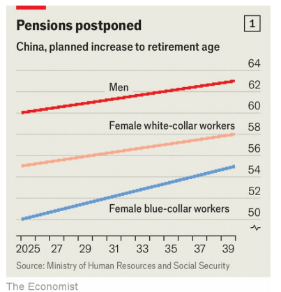

# Anger abounds as China raises its strikingly low retirement age

abound：美 [əˈbaʊnd]  充满；富于；大量；大量存在；

Old people will have to toil a little longer, assuming they can keep their jobs

toil：美 [tɔɪl]（尤指长时间的）辛勤劳动，苦干；劳累地工作；奋斗

 原文：

CHINA’S LEADER, Xi Jinping, boasts that his political system has a

matchless ability to get difficult things done. “For anything that benefits the

party and the people,” he has said, “we must act boldly and decisively.” Yet

it was not until September 13th, after years of indecision, that China

announced the first raising of its retirement age since the 1950s. From

among the world’s lowest, it will begin to creep closer to rich-world norms.

中国领导人说，他的政治体系有着无与伦比的能力来完成困难的事情。“凡是对党和人民有利的事情，”他说，“我们都要大胆果断地去做。”然而，直到9月13日，经过多年的犹豫不决，中国才宣布自20世纪50年代以来首次提高退休年龄。从世界最低水平开始，它将开始向富裕国家的标准靠拢。

学习：

matchless：无与伦比的；独一无二的；无可匹敌的

boldly and decisively：大胆果断地

indecision：优柔寡断；无决断力；决策困难；犹豫不决

creep：美 [kriːp] 缓慢地行进；逐渐发生；

原文：

Having seen the unhappy reaction to similar changes elsewhere, Mr Xi may

have had reason to hesitate. Turmoil in the West is normally something that

China’s propagandists exploit. But huge protests in France last year against a

higher pension age triggered anxious and angry comments in China over the

government’s repeated mutterings about doing something similar. “The

common people are cursing behind closed doors,” wrote one user of Weibo,

a social-media platform, referring to the contrast between public anger in

France and its furtive form in China.

看到其他地方对类似变化的不愉快反应，Xi先生可能有理由犹豫。西方的动荡通常是中国宣传人员利用的东西。但是，去年法国反对提高领取养老金年龄的大规模抗议活动，引发了中国对政府一再嘀咕要做类似事情的焦虑和愤怒的评论。社交媒体平台新浪微博的一名用户写道:“老百姓在关起门来骂人。”他指的是法国的公众愤怒与中国的隐秘形式之间的对比。

学习：

muttering：英 [ˈmʌtərɪŋ] 咕哝；喃喃低语；怨言

curse：痛骂；骂

furtive：美 [ˈfɜːrtɪv] 隐秘的；暗中的

原文：

When China at last bit the bullet and published its own timetable, it did so

with little fanfare. State-run television mentioned the move below several

other headlines on its main evening news. Viewers had to wait more than 35

minutes (and sit through nearly 20 minutes telling of Mr Xi’s activities) for

just a bare outline. The retirement age for female blue-collar workers will

rise from an astonishingly low 50 to 55, for female white-collar workers

from 55 to 58, and for men from 60 to 63 (see chart 1). These changes will

begin in January 2025 and be phased in over 15 years. For men and female

white-collar workers, the pension age will rise by a month every four

months. For blue-collar women it will rise by a month every two months.

当中国最终咬紧牙关公布自己的时间表时，它并没有大张旗鼓。国营电视台在其主要晚间新闻的其他几个标题下提到了这一行动。观众不得不等待35分钟以上(并坐了近20分钟讲述Xi先生的活动)才看到一个大概的轮廓。女性蓝领工人的退休年龄将从50岁提高到55岁，女性白领从55岁提高到58岁，男性从60岁提高到63岁(见图表1)。这些变化将于2025年1月开始，并在15年内分阶段实施。对于男女白领来说，领取养老金的年龄每四个月就会提高一个月。对于蓝领女性来说，每两个月就会增加一个月。

学习：

at last bit the bullet: 最终做出某种艰难或令人不快的决定或行动

>“At last bit the bullet” 指的是最终做出某种艰难或令人不快的决定或行动，尽管人们可能已经拖延了一段时间。它强调某个痛苦但必要的决定终于被执行。这里描述的是中国最终决定公布退休年龄改革的时间表，尽管这个决定可能不受欢迎。
>
>1. **English**: After months of hesitation, she at last bit the bullet and quit her stressful job to pursue her passion.
>2. **中文**：经过几个月的犹豫，她终于鼓起勇气，辞掉了压力山大的工作，去追求自己的热情。
>
>3. **English**: The company had been losing money for years, and they finally bit the bullet and closed several unprofitable branches.
>4. **中文**：公司多年来一直在亏损，他们最终不得不做出艰难的决定，关闭了几家无利可图的分店。

fanfare：号角齐鸣（欢迎仪式等上奏的响亮短曲）；（为庆祝而在媒体上的）炫耀；大张旗鼓

bare：勉强的

bare outline：大致的轮廓

原文：

The evening news did not bother with a follow-up report. But Chinese

netizens were very much bothered by the government’s actions. Posts with

the hashtag “reform to delay the statutory retirement age” have garnered

more than 870m views and over 240,000 comments on Weibo. Censors have

been swift to move in. More than 5,100 of these comments were posted

below an early report by Xinhua, the government’s main news agency. Try

reading these now; fewer than 30 remain, none of them disapproving.

晚间新闻没有费心做后续报道。但是中国网民对政府的行为感到非常不安。带有“延迟法定退休年龄改革”标签的帖子在微博上获得了超过8.7亿次浏览和超过24万条评论。审查人员迅速介入。这些评论中有5100多篇发表在政府主要新闻机构新华社的一篇早期报道的下方。现在试着阅读这些；剩下不到30人，没有人反对。

学习：

bother with：费心；操心；关心

statutory：美 [ˈstætʃətɔːri] 法定的；依照法令的

garner：积累；收集（信息、数据等）

原文：

But anger abounds among comments still visible on less-filtered accounts.

“Capitalist exploitation has reached the common people. Brilliant!” wrote

one in a typical thread. “So, who was the People’s Congress representing?”

asked another, referring to the country’s rubber-stamp legislature that

suddenly approved the reform without public consultation. A third weighed

in: “Corrupt officials would love to work for ever.” And another: “If this

continues, society will descend into chaos.”

但在过滤程度较低的账户上，仍然可以看到很多愤怒的评论。“资本主义的剥削已经达到了普通人的程度。太棒了！”典型的帖子这样写道。“那么，人民代表大会代表的是谁？”另一个人问道，他指的是该国橡皮图章式的立法机构，在没有征询公众意见的情况下，突然批准了这项改革。三分之一的人表示:“腐败官员喜欢永远工作。”另一个:“如果这种情况继续下去，社会将陷入混乱。”

学习：

consultation：商讨；商讨会；商议；

原文：

That is unlikely. Surveillance is so intense and the police so determined to

crush unrest that even if there are demonstrations, they are almost sure to be

small and far from the country’s most politically sensitive locations. It would

be hard to imagine China tolerating the kind of protests that erupted in

Russian cities in 2018 over pension-age reform.

这不太可能。监控力度如此之大，警方镇压骚乱的决心如此之大，以至于即使有示威活动，也几乎肯定是小规模的，而且远离该国最具政治敏感性的地点。很难想象中国会容忍2018年俄罗斯城市爆发的针对养老金年龄改革的抗议活动。

原文：

China paid attention to those events, including the concessions made by

Russia’s ruler, Vladimir Putin. Russia’s original plan was to raise the

retirement age for women from 55 to 63. Mr Putin revised that to 60, though

he stuck to 65 for men (up from 60). It had long been expected that when

China made its own move, it would announce gradual steps towards 65 for

men and women. This would be just over the average in the OECD, a club of

mostly rich countries, which in 2022 was 64.4 for men and 63.6 for women.

In the end, China settled on a plan that will see men required to work until

they are 63, though they may go on until 66 if they choose. Women will

enjoy similar flexibility.

中国关注这些事件，包括俄国统治者弗拉基米尔·普京做出的让步。俄罗斯最初的计划是将女性退休年龄从55岁提高到63岁。普京先生将其修正为60岁，尽管他坚持男性为65岁(高于60岁)。人们早就预计，当中国采取自己的举措时，它将宣布男女年龄逐步接近65岁。这将略高于经合组织(一个主要由富裕国家组成的俱乐部)的平均水平，2022年男性为64.4岁，女性为63.6岁。最后，中国制定了一项计划，要求男性工作到63岁，但如果他们愿意，也可以工作到66岁。女性将享有类似的灵活性。

学习：

concessions：让步；承认；

原文：

So why, if China is so capable of preventing protests, did it not act earlier?

After all, it faces a demographic crunch and looming pension-fund crisis no

less fearsome than those of other countries that have raised their retirement

ages. Life expectancy has risen from 35 when the Communist Party seized

power in 1949 to 77 today, less than three years below the OECD average.

People over 60 already make up more than a fifth of the population. By 2035

that ratio will be closer to a third (see chart 2). The working-age population

—from which pension contributions are drawn—is falling. Some experts

have said that without any change, the state’s pension fund, on which most

retired people rely (private pensions have yet to take off), would have run

out of money by 2035.

那么，如果中国有能力阻止抗议，为什么不早点采取行动呢？毕竟，它面临的人口危机和迫在眉睫的养老基金危机并不亚于那些提高退休年龄的国家。中国人的预期寿命已从1949年共产党掌权时的35岁，上升到如今的77岁，比经合组织的平均水平低了不到三年。60岁以上的人已经占人口的五分之一以上。到2035年，这一比例将接近三分之一(见图表2)。工作年龄人口正在下降。一些专家表示，如果不做任何改变，大多数退休人员所依赖的国家养老基金(私人养老金还未起步)将在2035年耗尽。

学习：

crunch：危机；经济紧缩

原文：

Concerns raised by critics of reform may have resonated among

policymakers. In many households, the retired play a crucial role in

providing child care. Keep them at work longer, a common argument goes,

and young people will be even less inclined to have babies.

改革批评者提出的担忧可能在政策制定者中引起了共鸣。在许多家庭中，退休人员在照顾孩子方面起着至关重要的作用。一个普遍的观点是，让他们工作的时间越长，年轻人就越不愿意要孩子。

原文：

Another oft-heard objection to reform is that forcing people to work longer

will make it harder for young people to get jobs. Youth unemployment in

China is eye-wateringly high. It reached 21.3% among urban residents in

June 2023. The government then spent months rejigging its calculations and

came up with a somewhat less embarrassing rate. In July it was 17.1%. But

this argument against raising the retirement age holds less water: making

people work for longer could encourage them to consume more, which could

boost the economy and create jobs.

另一个经常听到的反对改革的理由是，强迫人们工作更长时间会让年轻人更难找到工作。中国的青年失业率高得惊人。2023年6月在城市居民中达到21.3%。然后政府花了几个月的时间重新计算，得出了一个不那么尴尬的比率。7月份，这一比例为17.1%。但是反对提高退休年龄的论点站不住脚:让人们工作更长时间可以鼓励他们消费更多，这可以刺激经济和创造就业机会。

学习：

oft-heard：常听到的

rejig：英 [riːˈdʒɪɡ]  重新调整；重新安排

eye-watering：令人震惊的	

>“Eye-watering” 用来形容某事非常令人惊讶或震惊，通常指的是数量、金额或情况极其大或不利。在这里，指中国的青年失业率非常高，令人震惊。
>
>**例子**：
>
>- **English**: The price of the luxury car was eye-watering, costing more than a house.
>- **中文**：这辆豪华车的价格高得令人震惊，比一套房子还贵。

hold water: 某个论点、理论或说法经得起推敲、成立或合理

>“Hold water” 指某个论点、理论或说法经得起推敲、成立或合理。这里的意思是反对延长退休年龄的论点不太合理，不具备足够的说服力。
>
>**例子**：
>
>- **English**: His explanation didn’t hold water, and the committee quickly found flaws in his reasoning.
>- **中文**：他的解释站不住脚，委员会很快就发现了他推理中的漏洞。

原文：

For every person who is anxious about youth unemployment there is

someone who frets that raising the retirement age will cause the same

problem among the elderly. Age discrimination is rampant in China.

Working longer may be fine for people in secure jobs, such as in the civil

service or state-owned firms. But in the private sector people worry they will

be forced out before they reach retirement age because they are considered

too old. On social media, commenters seethe about state employees for

another reason, too: their pensions are much higher

每一个担心年轻人失业的人，都有人担心提高退休年龄会给老年人带来同样的问题。年龄歧视在中国非常普遍。对于从事稳定工作的人来说，工作时间更长可能没问题，比如公务员或国有企业。但在私营部门，人们担心他们会在达到退休年龄之前被迫离职，因为他们被认为太老了。在社交媒体上，评论者对政府雇员的愤怒还有另一个原因:他们的养老金要高得多

学习：

frets: 焦急；磨损；烦恼；（fret的第三人称单数）

seethe：发怒；怒火中烧；强压怒火

原文：

No change to this has been announced. The pensionable age for many rural

*hukou*-holders will remain at 60. One user of Weibo pointed out a reason for

the silence. “If pensions were distributed evenly across the entire population,

including farmers, I bet everyone’s pension would be less than it is now,” he

wrote. (By “everyone”, he meant “urban people”.) Mr Xi’s calls for

“common prosperity” do not, it seems, imply equality for farmers and

migrants. ■

尚未宣布对此进行任何更改。许多农村户口持有人的退休年龄将保持在60岁。一位微博用户指出了沉默的原因。“如果养老金在包括农民在内的全体人口中平均分配，我敢打赌每个人的养老金都会比现在少，”他写道。(他说的“每个人”，指的是“城市人”。)Xi先生呼吁的“共同繁荣”似乎并不意味着农民和移民的平等。■

学习：

pensionable: 有资格领取退休金的；符合领取养老金条件的；

pensionable age：退休年龄

## 后记

2024年9月23日19点46分于上海。本文用来学习英文，不涉及政治立场。

