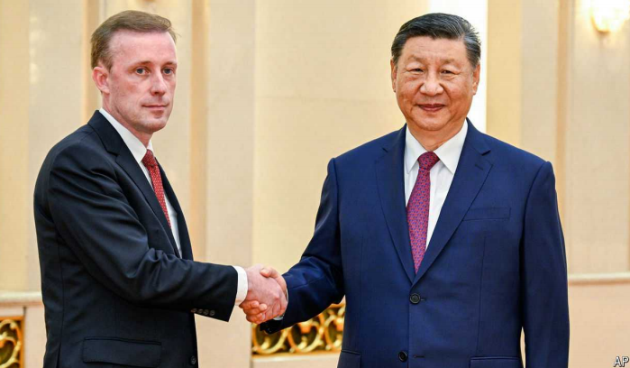

# China has freed an American pastor. Does it want anything in return?

freed：free的过去分词

paster：美 [ˈpæstər] （尤指非英国国教的）牧师；传道者；神职人员

The move followed much pleading by American officials

原文：

David Lin had been trying to help an underground Christian group build a

church in Beijing when he was detained by the Chinese government in 2006.

The ruling Communist Party does not look kindly on spiritual activities it

does not control. So Mr Lin, an American pastor, was charged with contract

fraud, a common pretext for jailing religious leaders. As expected, he was

convicted and condemned to life in prison. Though his sentence was later

reduced, he was not due to be released until 2029.

2006年，林大卫被中国政府拘留时，他正试图帮助一个地下基督教组织在北京建一座教堂。执政的共产党并不善待不受其控制的精神活动。因此，身为美国牧师的林先生被指控犯有合同诈骗罪，这是监禁宗教领袖的常见借口。不出所料，他被判有罪，终身监禁。尽管他的刑期后来被减刑，但他直到2029年才被释放。

学习：
detain：拘留

pretext：美 [ˈpriːtekst] 托辞；借口；幌子

condemned：判刑；（condemn的过去式）

原文：

Yet on September 15th the American State Department announced that Mr

Lin, 68, had been freed and was heading home. The move came after much

diplomacy. President Joe Biden raised the issue of detained Americans in

China during a meeting with his Chinese counterpart, Xi Jinping, in

November. So did Antony Blinken, America’s secretary of state, in talks

with China’s chief diplomat, Wang Yi, in July. When Jake Sullivan,

America’s national security adviser, visited Beijing last month, he is thought

to have pressed Mr Lin’s case.

然而在9月15日，美国国务院宣布68岁的林先生已经被释放，正在回家的路上。这一举动是在多次外交努力后做出的。美国总统乔·拜登在11月与中国国家主席会面时提出了在中国被拘留的美国人的问题。美国国务卿安东尼布林肯在7月与中国首席外交官王毅的会谈中也是如此。当美国国家安全顾问杰克·沙利文上个月访问北京时，他被认为就林先生的案子进行了交涉。

学习：

diplomat：美 [ˈdɪpləmæt] 外交官

原文：

The pastor was “wrongfully detained” by China, says the State Department,

using a designation that may imply he was being held in order to influence

American policy. Two other American prisoners still fit that bill, according

to the department. A businessman from Texas called Mark Swidan has been

held since 2012 on drug-related charges. Kai Li, another businessman, from

New York, was detained in 2016 and later convicted of espionage. Both men

deny the charges against them.

美国国务院表示，这名牧师被中国“错误地拘留”,使用的名称可能暗示他被拘留是为了影响美国的政策。根据该部门的说法，另外两名美国囚犯仍然符合这一条件。自2012年以来，来自德克萨斯州的商人马克·斯威丹因与毒品有关的指控被拘留。来自纽约州的另一名商人李凯在2016年被拘留，后来被判犯有间谍罪。两人都否认了对他们的指控。

学习：

designation：名称；称号；

espionage：美 [ˈespiənɑːʒ] 间谍活动；谍报活动； **注意发音**

原文：

In total there are more than 200 Americans under various forms of “coercive

measures” in China, according to estimates from the Dui Hua Foundation,

an American NGO that lobbies on their behalf. Some of these people are in

prison. Others have been hit with “exit bans”, meaning they are allowed to

travel within China, but cannot leave. The most unfortunate among this

group only discover they have been banned from exiting China upon trying

to check in at the airport.

根据代表美国非政府组织对话基金会的估计，总共有200多名美国人在中国受到各种形式的“强制措施”。其中一些人在监狱里。其他人受到“出境禁令”的打击，这意味着他们可以在中国境内旅行，但不能离开。这群人中最不幸的人在机场办理登机手续时才发现自己被禁止出境。

学习：

coercive： 美 [koʊˈɜːrsɪv] 强制性的；胁迫性的

coercive measures：强制措施

原文：

China denies engaging in hostage diplomacy. But it likes to have an

“inventory” of foreign prisoners it can use when negotiating with other

countries, says Peter Humphrey, a China analyst. These detainees come in

handy when China wants to get back its own citizens who are locked up

abroad, or when it tries to retrieve people who have fled for various reasons,

such as officials hoping to avoid corruption probes. China has signed

prisoner-transfer agreements with several countries.

中国否认参与人质外交。但是中国问题分析家Peter Humphrey说，中国希望有一份外国囚犯的“清单”,以便在与其他国家谈判时使用。当中国希望找回被关押在国外的本国公民时，或者当中国试图找回因各种原因(如官员希望逃避腐败调查)而逃离的人时，这些被拘留者就派上了用场。中国已经和几个国家签署了囚犯转移协议。

学习：

inventory：库存；存货；清单；财产目录；详细目录

come in handy：派得上用处；派上用场；

原文：

Mr Humphrey, who is British, spent 23 months in a Chinese prison between

2013 and 2015 for allegedly violating laws protecting personal data (he

denies this). But it was a more high-profile case, in 2018, that put China’s

detention policies in the spotlight. In December of that year two Canadians

—Michael Kovrig, a former diplomat, and Michael Spavor, a businessman

—were taken into custody and later charged with spying. This seemed to be

in retaliation for the detention in Canada of a Chinese businesswoman,

Meng Wanzhou, on suspicion of violating sanctions against Iran. The Justice

Department in Washington had sought her arrest so that she could be

extradited to America.

英国人Humphrey在2013年至2015年间因涉嫌违反保护个人数据的法律在中国监狱呆了23个月(他否认了这一点)。但在2018年，一个更引人注目的案件将中国的拘留政策置于聚光灯下。同年12月，两名加拿大人——前外交官Michael Kovrig和商人Michael spa vor——被拘留，随后被指控从事间谍活动。这似乎是对中国女商人孟晚舟因涉嫌违反对伊朗制裁而被拘留的报复。华盛顿的司法部曾试图逮捕她，以便将她引渡到美国。

学习：

in the spotlight：成为关注焦点；在众人瞩目之下；

custody：美 [ˈkʌstədi] 拘留；监禁

retaliation：美 [rɪˌtælɪˈeʃən] 报复；反击

原文：

The “two Michaels”, as the Canadians became known, spent more than

1,000 days in prison. Both men were released in 2021, at the same time as

Ms Meng. “So hostage diplomacy ended with a cold-war-style prisoner

exchange, with the skies between China and Canada serving as the frontier

bridge,” we wrote back then. On the next two episodes of our “Drum

Tower” podcast, Mr Kovrig shares the story of his detention for the first

time.

加拿大人所称的“两个迈克尔”在监狱中度过了1000多天。两人都在2021年获释，与孟晚舟同时获释。“因此，人质外交以冷战式的囚犯交换结束，中国和加拿大之间的天空成为边境桥梁，”我们当时写道。在接下来的两集“鼓楼”播客中，Kovrig先生第一次分享了他被拘留的故事。

原文：

The release of Mr Lin has been celebrated by American officials. But the

State Department continues to warn Americans to reconsider travel to China

because of the “risk of wrongful detentions” and the “arbitrary enforcement

of local laws”. China calls this unreasonable. It is desperate to attract tourists

and foreign investors to boost its sluggish economy, so it wants the travel

warning to go away.

美国官员对林先生的获释表示庆祝。但美国国务院继续警告美国人重新考虑去中国旅行，因为“错误拘留的风险”和“当地法律的任意执行”。中国称这是不合理的。它迫切希望吸引游客和外国投资者来提振其低迷的经济，所以它希望旅游警告消失。

学习：

sluggish：不景气的，低迷的

原文：

There have been hints recently that America might tone down its language.

Perhaps the homecoming of Mr Lin will lead to action. His release is a rare

bit of good news from the world of Sino-American diplomacy. ■

最近有迹象表明，美国可能会缓和其措辞。或许林的回国会引发行动。他的获释是中美外交界少有的好消息。■

学习：

tone down：使（言辞）温和；使（调子）缓和；

## 后记

2024年9月26日19点54分于上海。

