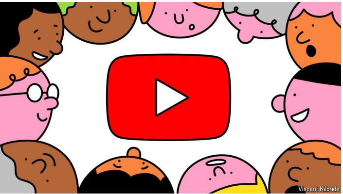

# YouTube’s do-it-yourself brigade is taking on Netflix and Disney

Legions of self-taught film-makers are coming for the television industry

brigade：美 [brɪˈɡeɪd] 大队（军事单位或消防、警察等组织）；团体；派系

take on：挑战

原文：

When Jeff Bezos, the founder of Amazon, wanted some publicity for Blue

Origin, his rocket firm, he did not turn to a television channel or a

newspaper, as he might have done a decade ago. Instead he offered Tim

Dodd, who runs a YouTube channel called “The Everyday Astronaut”, an

exclusive factory tour. The resulting video, in which the two men spend an

hour admiring hydrogen tanks and discussing the finer points of rocket

engine turbopumps, may not strike everyone as compelling TV. It has 1.6m

views nonetheless.

当亚马逊的创始人杰夫·贝索斯想要为他的火箭公司蓝色起源做些宣传时，他没有像十年前那样求助于电视频道或报纸。相反，他向经营YouTube频道“日常宇航员”的蒂姆·多德提供了一次独家工厂参观。由此产生的视频中，两人花了一个小时欣赏氢气罐，并讨论火箭发动机涡轮泵的优点，可能不会让每个人都觉得这是引人注目的电视节目。尽管如此，它仍有160万的浏览量。

学习：

publicity：宣传；推广；关注；

the finer points of：精妙之处；细节；细微之处；精细部分          

turbopumps：涡轮泵      

原文：

It also neatly illustrates a transformation in the media business. As the

internet has cut out middlemen and empowered enterprising people to

produce things themselves, an enthusiastic do-it-yourself crowd is taking on

mass-market incumbents. In-depth, chatty podcasts have shaken up radio.

Music from independent artists, not beholden to the big labels, is growing in

popularity on Spotify.

这也清楚地表明了媒体行业的转变。随着互联网淘汰了中间商，让有事业心的人能够自己生产东西，一群热衷于自己动手的人正在挑战大众市场的现有者。深入的、闲聊式的播客已经撼动了广播。不受大唱片公司控制的独立艺术家的音乐在Spotify上越来越受欢迎。

原文：

But it is in television that the change is most dramatic. As we report this

week, YouTube, which is owned by Google, has quietly built a video

streaming business to rival those of Netflix, Disney or NBC Universal. Its

legions of self-taught film-makers broadcast to 2.5bn viewers each month.

YouTube accounts for a tenth of all the television that Americans watch,

more than any other streamer or channel. And much of that audience is

young, building viewing habits that may last for decades.

但是电视领域的变化最为显著。正如我们本周所报道的，谷歌旗下的YouTube已经悄悄地建立了一个视频流业务，可以与网飞、迪士尼或NBC环球的视频流业务相媲美。其大批自学成才的电影制作人每月向25亿观众播放节目。YouTube占美国人观看的所有电视节目的十分之一，超过任何其他流媒体或频道。而且大部分观众都很年轻，形成的观看习惯可能会持续几十年。

学习：

self-taught：自学的；自修的

## **Don’t forget to like and subscribe**

原文：

YouTube is what tech types call a platform, whereas its rivals are run much

more like traditional studios. Getting a series greenlit on Disney or Netflix

means negotiating with agents and fixers before convincing a

commissioning executive to hand over a pile of money. Filming needs

hundreds of specialised people. YouTube throws all that out of the window.

Anyone can upload more or less anything they like. Most videos are free to

watch. YouTube’s job is to insert some advertisements and split the takings

with the film-maker. If that sounds like a recipe for dross, it often is. But

what is more striking is how much genuinely engaging stuff bubbles up.

YouTube是技术型的所谓平台，而它的竞争对手更像是传统工作室。获得迪士尼或网飞的一系列许可意味着在说服一位委托高管交出一大笔钱之前，要与代理人和经纪人进行谈判。拍摄需要数百名专业人员。YouTube把所有这些都扔出窗外。任何人都可以上传或多或少他们喜欢的任何东西。大部分视频都是免费观看的。YouTube的工作是插入一些广告，并与电影制作人分成。如果这听起来像是糟粕的配方，它往往是。但是更引人注目的是有多少真正吸引人的东西冒了出来。

学习：

dross：美 [drɑːs] 垃圾；杂质；劣质物；

greenlit: 批准开始

>“Greenlit” 是 “greenlight” 的过去式，意思是批准或正式允许某个项目开始，通常用于电影、电视制作等行业。这里指的是在迪士尼或 Netflix 这样的传统平台上，一部剧集的拍摄需要通过层层审批，最终获得“绿灯”才能启动。
>
>**例子**：
>
>- **English**: The studio greenlit the project after reviewing the script and budget.
>- **中文**：工作室在审查了剧本和预算后批准了该项目。

commissioning executive: 负责审查并决定是否批准新项目的高层管理人员

>“Commissioning executive” 是指负责审查并决定是否批准新项目的高层管理人员，特别是在影视行业中。他们决定哪些节目或电影可以获得资金并制作。
>
>**例子**：
>
>- **English**: The commissioning executive at Netflix decided to fund the new sci-fi series.
>- **中文**：Netflix 的节目委任主管决定资助这部新的科幻剧集。

fixer：负责幕后工作的人

>“Fixer” 是指帮助解决问题、安排联系、协调复杂事务的人，尤其是在影视制作或政治活动中。Fixers 通常负责幕后运作，帮助确保项目顺利进行。
>
>**例子**：
>
>- **English**: The producer hired a fixer to handle local permits and logistics for the film shoot in Morocco.
>- **中文**：制片人雇了一名协调员来处理摩洛哥拍摄的当地许可和后勤安排。

原文：

Technology has helped. High-quality cameras are cheap. Powerful video-

editing software runs on inexpensive laptops. And drones make dramatic

aerial shots possible. The result is that handfuls of people can make videos

with relatively high production values for a tiny fraction of the cost of

traditional television. The quality gap will only shrink. By automating many

of the tedious bits, artificial intelligence seems likely to make video

production even easier than it already is.

科技帮了大忙。高质量的相机很便宜。强大的视频编辑软件运行在廉价的笔记本电脑上。无人机使戏剧性的空中拍摄成为可能。其结果是，一小撮人可以制作相对高制作价值的视频，而成本只是传统电视的一小部分。质量差距只会缩小。通过自动化许多乏味的部分，人工智能似乎有可能使视频制作比现在更容易。

原文：

YouTube has spawned its own megastars, such as MrBeast, with his 317m

followers (and growing number of critics). But its most interesting effects

will be felt at a smaller scale. Because making content is cheap, YouTubers

can earn a living serving niches too small to be profitable for other

streaming firms. From Mr Dodd’s rocket science to rock climbing, knitting

or ancient history: think of an interest, and at least one YouTube channel is

probably dedicated to it.

YouTube已经产生了自己的超级明星，比如MrBeast，拥有3 . 17亿粉丝(以及越来越多的批评者)。但它最有趣的影响将在更小的范围内被感受到。因为制作内容很便宜，所以YouTubers可以通过为太小而无法为其他流媒体公司盈利的小众市场提供服务来谋生。从多德先生的火箭科学到攀岩、编织或古代史:想出一个兴趣，至少有一个YouTube频道可能专门关注它。

学习：

spawned：大量生产；（spawn的过去分词）；

niche：小众市场

原文：

This means that, as with the rest of media, the future of television looks

likely to become ever more targeted and specialised. Just how high the tide

of user-generated content can rise remains to be seen. Some YouTubers are

experimenting with formats such as game shows or feature films, with

mixed results. Some bits of high ground look likely to stay safe: it is hard to

see YouTube videos replacing big-budget dramas like “Game of Thrones” or

“Stranger Things”, which require upfront financing that YouTube’s business

model does not provide. In a world of ever more precisely tailored content,

those rare TV shows that have true mass-market appeal will be even more

valuable. But only because they will become rarer still. ■

这意味着，和其他媒体一样，电视的未来可能会变得更有针对性和专业化。用户生成内容的浪潮能涨到多高还有待观察。一些YouTubers正在尝试游戏节目或故事片等形式，结果喜忧参半。一些高地看起来可能会保持安全:很难看到YouTube视频取代《权力的游戏》(Game of Thrones)或《奇人异事》(Stranger Things)等大预算剧集，这些剧集需要前期融资，而YouTube的商业模式无法提供这些融资。在一个内容越来越精确定制的世界里，那些具有真正大众市场吸引力的罕见电视节目将更有价值。但仅仅是因为它们会变得更加稀少。■

## 后记 

2024年9月29日18点09分于上海。

