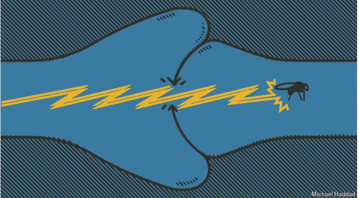

# A map of a fruit fly’s brain could help us understand our own

A miracle of complexity, powered by rotting fruit

fruit fly：果蝇

原文：

FOR BILLIONS of years, life was single-celled and boring. Even when it

became multicellular and more interesting, it took the evolution of brains,

and subsequent competition between them via the animal bodies they

inhabited, to create the biodiversity that exists today. Greater complexity

caused by brain-on-brain competition permitted better processing of

information from special organs for vision, hearing, smell, taste and touch.

This made for more cunning predators, more elusive prey and more

demanding sexual partners. It also (because much physiology is regulated by

the brain) allowed larger and more sophisticated bodies to evolve.

几十亿年来，生活都是单细胞的，无聊的。即使当它变得多细胞和更有趣时，它也需要大脑的进化，以及随后它们之间通过它们居住的动物身体进行的竞争，才能创造出今天存在的生物多样性。脑对脑的竞争所导致的更大的复杂性，使得来自视觉、听觉、嗅觉、味觉和触觉等特殊器官的信息得到更好的处理。这导致了更狡猾的捕食者，更难以捕捉的猎物和更苛刻的性伴侣。它也(因为许多生理机能由大脑调节)允许更大更复杂的身体进化。

学习：

single-celled：单细胞的

cunning：美 [ˈkʌnɪŋ] 狡猾的；机智的；

predators：英 [ˈpredətəz] 捕食者；食肉动物；掠食动物

elusive：难以捉摸的；不易捕捉的；

prey：美 [preɪ] 猎物； 被捕食的动物；

elusive prey：难以捕捉的猎物

physiology：生理学；生理功能；生物机能

原文：

Even brainless plants owe a lot of their diversity to brains, for their lives are

constantly shaped by their interactions, both beneficial and hostile, with

brainy animals. Without pollinating insects there would be no flowers.

Without grazing ungulates, grasses would not have evolved.

即使是没有大脑的植物，它们的多样性也在很大程度上归功于大脑，因为它们的生命不断地被它们与有大脑的动物的相互作用所塑造，包括有益的和有害的。没有授粉昆虫，就不会有花朵。没有食草的有蹄类动物，草就不会进化。

学习：

pollinating： 美 ['pɑlənetɪŋ] 给…传授花粉；（pollinate的现在分词形式）

grazing：放牧；吃草；（graze的现在分词）

ungulate：美 [ˈəŋɡjələt]  有蹄类动物；

原文：

Since *Homo sapiens* appeared, brains have started to analyse themselves.

And this week marks the publication of an important step towards the

betterment of that understanding. Researchers have produced a complete

map of the neurons in the brain of an adult fruit fly.

自从智人出现，大脑就开始自我分析。本周标志着朝着加深理解迈出了重要的一步。研究人员绘制了一张成年果蝇大脑中神经元的完整地图。

学习：

sapiens：英 [seɪpjənz] 现代人的

Homo sapiens：智人（全部现代人的属和种）；现代人；人类

betterment：改善；提升；增进；改良；提高

原文：

This map, called a connectome, traces the passage through the brain of the

filamentary, data-carrying protuberances of almost 140,000 neurons and logs

almost 55m connections between them. Earlier projects have mapped the

nervous systems of a simple worm (300+ neurons), a fly larva (3,016) and

the central part of an adult fly’s brain (about 27,000). But this is the real

McCoy, a complex, adult animal that can navigate in three dimensions, fight

its rivals, evade its predators and warn its confrères of threats.

这张名为“连接体”的地图追踪了近14万个神经元的细丝状、携带数据的突起在大脑中的通道，并记录了它们之间近5500万个连接。早期的项目绘制了一只简单蠕虫(300+神经元)、一只苍蝇幼虫(3016)和一只成年苍蝇大脑中央部分(约27000)的神经系统。但这是真正的麦考伊，一种复杂的成年动物，可以在三维空间中导航，与对手战斗，躲避捕食者，并警告同伴有威胁。

学习：

connectome：连接体

filamentary： 美 ['fɪləmentərɪ] 细丝的；似丝的；单纤维的

protuberances：美 [pro'tubərənsiz] 突起；瘤；结节；（protuberance的复数）

passage：通道

nervous systems：神经系统

larva：幼虫；幼体；

McCoy：真品；真实的东西；真货；

原文：

That is a tremendous achievement and is already helping researchers

comprehend how flies’ neurons collaborate to process sensory information

and turn it into instructions for action. It should help them understand

people, too. True, the brains of flies and humans operate differently; with

more than 600m years of evolution separating them, they could hardly fail

to. But what worked technologically to produce the fly connectome should,

with a bit of scaling up and the application of enough dollars, work for

vertebrates as well.

这是一项巨大的成就，已经帮助研究人员理解苍蝇的神经元如何协作处理感官信息，并将其转化为行动指令。这也能帮助他们理解他人。没错，苍蝇和人类的大脑运作方式不同；随着超过6亿年的进化，他们很难不这样做。但是，在技术上产生果蝇连接体的方法，经过一点点放大和足够的资金投入，应该也适用于脊椎动物。

学习：

vertebrates：美 ['vɜtɪbrɪts] 脊椎动物；（vertebrate的复数）

原文：

That will start with mice. But, eventually (with enough technological

improvement and quite a lot more dollars) a human-brain connectome

should be doable. If and when this happens, many questions that are

intractable today, ranging from how to treat psychiatric diseases to what

makes humans human, may be easier to answer.

这将从老鼠开始。但是，最终(随着足够的技术进步和更多的资金)人脑连接体应该是可行的。如果这种情况发生，从如何治疗精神疾病到什么使人类成为人类，许多今天难以解决的问题可能会更容易回答。

学习：

doable：美 [ˈduəb(ə)l] 可行的；可做的；可实现的

原文：

Some human brains, however, are not content to leave it at that. These brains

think the evolutionary trajectory of brains, far from having peaked with

*Homo sapiens*, is only just getting going. For, besides self-analysis, another

thing brains can now do is make simulacra of themselves. Having access to

the way natural selection has built brains over the course of hundreds of

millions of years will surely assist such efforts.

然而，一些人脑并不满足于此。这些大脑认为大脑的进化轨迹远没有在智人时期达到顶峰，而只是刚刚开始。因为，除了自我分析，大脑现在能做的另一件事是制造自己的拟像。了解自然选择在数亿年的过程中构建大脑的方式肯定会有助于这些努力。

学习：

natural selection：自然选择

原文：

From their inception in the mid-20th century, computers have often been

described as electronic brains. In the beginning, that was flattery. But, as the

field of artificial intelligence (AI) advances, the flattery is becoming nervous,

to the point where some human brains worry that something is being created

which might run out of control.

自20世纪中期问世以来，计算机经常被描述为电子大脑。一开始，这是奉承。但是，随着人工智能(AI)领域的进步，这种奉承变得紧张起来，以至于一些人类大脑担心正在创造的东西可能会失控。

原文：

Fortunately for the worriers, AI today is incredibly inefficient. It requires

power inputs which would service a small city and such vast quantities of

data to train itself that the entire internet is not enough. By contrast, flies,

which are powered by rotting fruit, can do things no AI can yet manage. If

their ability to navigate and avoid objects could be replicated, for example,

then designing self-driving vehicles would be a doddle.

对担心的人来说幸运的是，今天的人工智能效率低得令人难以置信。它需要为一个小城市服务的电力输入和如此大量的数据来训练自己，以至于整个互联网都不够用。相比之下，以腐烂水果为动力的苍蝇可以做人工智能还做不到的事情。例如，如果它们导航和躲避物体的能力可以复制，那么设计无人驾驶汽车将轻而易举。

学习：

service：服务；为…提供服务；

doddle：轻而易举的事；小菜一碟；容易的事

原文：

Adding what natural selection has created to the creativity of human brains

might thus open up a whole new field of information technology in which

describing the results as electronic brains would be no more than the truth.

This would indeed carry brains on to the next stage of their evolutionary

journey. Then the worriers might have just cause—for whether human

brains, and their attendant bodies, would be wanted as passengers on that

voyage cannot be foreseen. ■

将自然选择所创造的东西添加到人类大脑的创造力中，可能会开辟一个全新的信息技术领域，在这个领域中，将结果描述为电子大脑只不过是事实。这确实会将大脑带到进化旅程的下一个阶段。那么担心者可能有正当的理由——因为在那次航行中，人类的大脑及其伴随的身体是否会被需要作为乘客是无法预见的。■

学习：

attendant：伴随的；随之而来的；相关的；

## 后记

2024年10月5日20点19分于上海。

