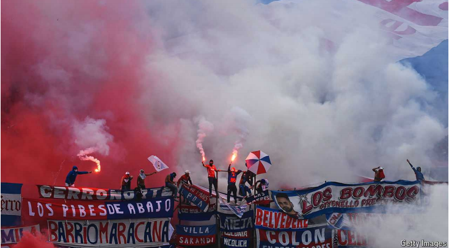

# Why is football in Latin America so complex?

Money-grubbing and regulatory capture explain its Byzantine leagues

money-grubbing：聚敛钱财的；贪财的；贪婪的；财迷的

Byzantine：错综复杂的；难以理解的；

原文：

LATIN AMERICA is a football powerhouse. Its teams include Argentina

(the current men’s world champions) and Brazil (the most successful

national team in history). Yet if the region plays football with beauty and

elegance, its league systems are achingly complex. Latin American

competitions, now in full swing, can be more confusing than the offside rule.

拉丁美洲是足球强国。其球队包括阿根廷(目前的男子世界冠军)和巴西(历史上最成功的国家队)。然而，如果这个地区的足球踢得漂亮优雅，它的联赛系统却异常复杂。如今如火如荼的拉美比赛，可能比越位规则更令人困惑。

学习：

powerhouse：强大的集团（或组织）

national team：国家队

achingly：美 ['eɪkɪŋlɪ] 极其；十分

in full swing：〈口〉正在全力进行中；正起劲；正处于全盛时期，

offside：越位的

原文：

For a fine example, look to Uruguay. In August cheers rang around your

correspondent’s street in Montevideo when Nacional, a local team, won the

country’s *Intermedio* (midseason) tournament. That competition sees

Uruguay’s 16 best teams split into two groups. The top performers from

each group compete in a final. This seems simple enough.

一个很好的例子，看看乌拉圭。8月，当当地球队Nacional赢得该国的Intermedio(赛季中期)锦标赛时，蒙得维的亚记者所在的街道上一片欢呼。这场比赛见证了乌拉圭16支最好的队伍分成两组。每组中表现最好的选手将参加决赛。这似乎很简单。

原文：

Yet every year these same 16 teams also compete against each other in an

*Apertura* (opening) league that takes place in the first months of the season,

and a separate *Clausura* (closing) league that does not start until the year is

nearing its end. An ultimate champion is decided in play-offs that include

the winners of the *Apertura*, the winners of the *Clausura,* and whichever

team has come top of an annual table (created, confusingly, by combining

the results from all three competitions). If any squad wins more than one of

those, a blizzard of fine print is consulted to work out what happens. “We

don’t even understand it ourselves,” laughs Juan Francisco Pittaluga, a

sports journalist.

然而，每年这16支球队还会在赛季前几个月举行的开幕联赛中相互竞争，以及在年底前才开始的单独的闭幕联赛。最终的冠军是在附加赛中决定的，包括Apertura的获胜者，Clausura的获胜者，以及在年度排行榜上名列前茅的任何一支球队(令人困惑的是，这是通过结合所有三场比赛的结果产生的)。如果任何一个队赢了一场以上的比赛，就会有一大堆的细则被咨询出来，看看会发生什么。体育记者胡安·弗朗西斯科·皮塔卢加笑着说:“我们自己都不明白。”。

学习：

squad：小队；小组；班组

fine print：细则；附属细则；

blizzard：暴风雪；雪暴；大批侵扰性的事物；大量的负担；大量

原文：

Elaborate formats are common all across the region. Bolivia, Colombia,

Ecuador and Mexico have *Apertura* and *Clausura* systems of their own.

Mexico has play-offs for its play-offs. Working out which teams will be

relegated at the end of a season can require a calculator: in Colombia and

Uruguay, among other places, this is determined by an average of results

over several seasons. Why is it all so complex?

复杂的格式在整个地区都很常见。玻利维亚、哥伦比亚、厄瓜多尔和墨西哥都有自己的足球体系。墨西哥附加赛后有附加赛。计算哪支球队会在赛季末降级可能需要一个计算器:在哥伦比亚和乌拉圭等地，这是由几个赛季的平均成绩决定的。为什么这一切如此复杂？

学习：

elaborate：精细的；详细的；复杂的

relegated：美 ['rɛlɪɡetid] 使降级；（relegate的过去式和过去分词）

原文：

One explanation relates to player transfers. Some years ago Argentina

decided its football season should coincide with the European one, to make

it easier to sell players to European clubs. Yet that meant playing through

January, when temperatures can reach 40°C and many fans are away at the

beach. In 1991 Argentina pioneered the *Apertura* and *Clausura* system in

part to create a midsummer break.

一种解释与球员转会有关。几年前，阿根廷决定其足球赛季应该与欧洲赛季一致，以便更容易向欧洲俱乐部出售球员。然而，这意味着比赛要持续到一月，那时气温可达40摄氏度，许多球迷都去了海滩。1991年，阿根廷率先采用了Apertura和Clausura制度，部分原因是为了创造一个仲夏假期。

学习：

player transfer：球员转会

midsummer：仲夏（一年中最热的时期）；夏至；盛夏；

原文：

Yet there is clearly more to it than that. Running several short tournaments

can allow for more matches in total (especially handy in Uruguay, a small

country which has fewer teams in its top flight than, say, England or Italy). It

is also supposed to create more matches that matter, boosting ticket sales and

income from television rights. Latin American football is both cash-strapped

by European standards and can be a route into politics (Mauricio Macri, a

former president of Argentina, came to prominence running Boca Juniors, a

big club). So bigwigs are forever creating new formats that might make

money—and perhaps also a name for themselves.

然而，事情显然不止于此。举办几场短期锦标赛可以让比赛总数增加(这在乌拉圭尤其方便，这个小国的顶级联赛球队比英格兰或意大利都少)。它还应该创造更多重要的比赛，提高门票收入和电视转播权收入。按照欧洲的标准，拉丁美洲足球既缺乏资金，又可能是进入政界的途径(阿根廷前总统毛里西奥·马克里因经营大型俱乐部博卡青年队而声名鹊起)。因此，大人物永远在创造可能赚钱的新模式——或许还能为自己正名。

学习：

top flight：一流；一流水准；顶级；最高水平

cash-strapped：现金拮据；囊中羞涩；资金拮据

bigwigs：要人；大人物（bigwig的复数）          

原文：

Byzantine rules about relegation result from regulatory capture. When

Grêmio, a famous club in Brazil, dropped down a division in 1991,

authorities all but ensured it would shoot back up by declaring that a

whopping 12 teams would be promoted the following season. European

teams can only dream of the security some of their Latin American peers

enjoy. In 2021 a dozen big European ones tried to start a league from which

none of them could be relegated. Fans gave that plan a red card.

关于降级的复杂规则源于监管俘获。当巴西一家著名的俱乐部Grêmio在1991年降级的时候，官方宣称有12支球队将在下一个赛季升级，这几乎保证了它会卷土重来。欧洲球队只能梦想他们的一些拉美同行所享受的安全感。2021年，十几个欧洲大俱乐部试图建立一个他们都不会被降级的联赛。粉丝们给了那个计划一张红牌。

学习：

division：（足球等体育运动中联赛的）级

drop down a division：降级

whopping：巨大的；很大的；庞大的；极大的；

## 后记

2024年10月6日19点36分于上海。

