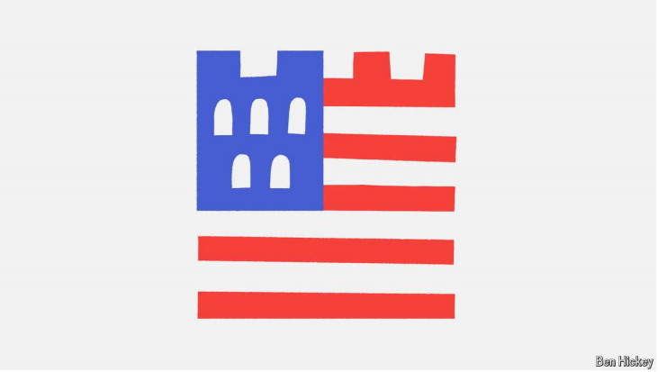
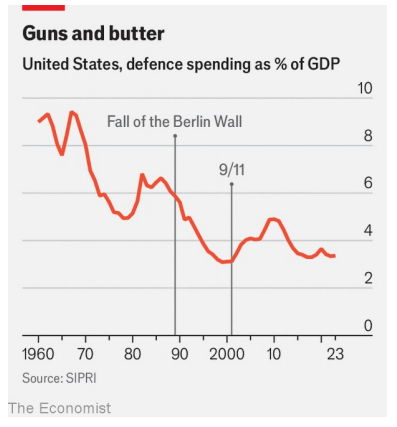

# Both candidates pledge to fortify America. How big will they go?

Hawks in Congress want to raise America’s defence budget dramatically, but the next president will decide

原文：

Presidential elections don’t often turn on debates about defence spending, in

part because funding the armed forces is one of the few bipartisan traditions

left in American politics. Donald Trump and Kamala Harris have both

issued vague commitments to strengthen the army, yet neither has offered

much detail. The terms of debate are already being set on Capitol Hill,

however, and the next president could negotiate with Congress to reshape

the Pentagon’s future.

总统选举并不经常开启关于国防开支的辩论，部分原因是为军队提供资金是美国政治中为数不多的两党传统之一。唐纳德·特朗普和卡玛拉·哈里斯都发表了加强军队的模糊承诺，但都没有提供太多细节。然而，国会山已经设定了辩论的条款，下一任总统可以与国会协商重塑五角大楼的未来。

原文：

The vehicle for such decisions is typically the National Defence

Authorisation Act (NDAA), which sets an annual baseline for military

expenditures. Haggling usually drags on for months before a bill passes with

strong majorities in both houses of Congress. The most recently approved

NDAA authorised $874bn, and Congress is currently wrangling over Joe Biden’s

$884bn request for fiscal year 2025.

此类决策的载体通常是国防授权法案(NDAA)，该法案为军事开支设定了年度基线。讨价还价通常会持续数月，直到一项法案在参众两院以绝对多数获得通过。最近获得批准的NDAA授权8740亿美元，国会目前正在就乔·拜登(Joe Biden)为2025财年申请的8840亿美元争吵不休。

学习：

vehicle：载体；工具；手段；方法

haggling：争论；讨价还价

wrangling：争论；（wrangle的现在分词）；争吵          

原文：

The main question facing the next president will be how much to increase

spending. Roger Wicker, the senior Republican on the Senate Armed

Services Committee, has called for the country to spend 5% of GDP on

defence, up from around 3% today. Republican hawks in Congress and the

broader national-security establishment have coalesced around a similarly

massive increase, and some have even called for the outright doubling of

military outlays. Many Democrats oppose such measures, but still agree that

Mr Biden has not been aggressive enough. This year, despite Democrats

holding the Senate and the White House, Mr Wicker pushed his committee

to authorise $25bn more than Mr Biden requested.

下一任总统面临的主要问题将是增加多少开支。参议院军事委员会的资深共和党人罗杰·威克呼吁美国将GDP的5%用于国防，比现在的3%有所提高。国会中的共和党鹰派和更广泛的国家安全机构已经联合起来支持类似的大规模增加，一些人甚至呼吁军费开支彻底翻倍。许多民主党人反对这些措施，但仍然认为拜登先生不够激进。今年，尽管民主党控制着参议院和白宫，但维克尔仍推动他的委员会批准比拜登要求的多250亿美元。

学习：

establishment：机构；企业；组织

coalesced：美 [ˌkəʊəˈlest] 联合；（coalesce的过去式和过去分词）

outright：彻底的；完全的；绝对的

outlays：花费；费用；（outlay的复数）

原文：

A handful of lawmakers seek cuts in defence spending, but they lack

influence. The real debate is between spending maximalists and those who

want higher funding but don’t believe that 5% of GDP is politically or fiscally

feasible. Jack Reed, the Democratic chairman of the Senate Armed Services

Committee, opposed the bill that came out of his own committee because it

would violate spending caps agreed in separate fiscal negotiations. Mike

Rogers, Mr Reed’s Republican counterpart in the House, called the Biden

request inadequate to restore deterrence but acquiesced to “the hand that was

dealt to us”.

少数立法者寻求削减国防开支，但他们缺乏影响力。真正的争论是在支出最大化主义者和那些想要更多资金但不相信GDP的5%在政治或财政上可行的人之间。参议院军事委员会(Senate Armed Services Committee)民主党主席杰克里德(Jack Reed)反对他自己的委员会提出的法案，因为该法案将违反在单独的财政谈判中达成的支出上限。里德在众议院的共和党对手迈克罗杰斯(Mike Rogers)称，拜登的请求不足以恢复威慑，但他默认了“向我们伸出的手”。

学习：

acquiesced：美 [ˌækwi'est] 默许；勉强同意；（acquiesce的过去式）

原文：

Once this year’s fight is resolved, the next president will be able to offer a

new opening bid. The question facing a Trump presidency would be whether

to embrace the generational investment Mr Wicker advocates or replicate the

more modest increases of Mr Trump’s first term. Ms Harris would have to

decide whether to maintain Mr Biden’s policy of after-inflation spending

reductions. Her preferences, as on much else, are hard to predict.

一旦今年的争斗结束，下一任总统将能够提出新的开价。特朗普当选总统面临的问题将是，是接受威克倡导的世代投资，还是复制特朗普第一任期较为温和的增长。哈里斯女士将不得不决定是否维持拜登先生的扣除通货膨胀后的开支削减政策。她的偏好和其他许多事情一样，很难预测。

原文：

America’s post-cold-war military forces—built for short, sharp conflicts—

do not appear ready for the challenges of today’s disordered world:

maintaining deterrence in the Middle East, supporting Ukraine in an

attritional conflict, adapting to new forms of warfare, and keeping pace with

China’s rapid military build-up and its growing belligerence.

美国后冷战时期的军事力量——专为短暂、尖锐的冲突打造——似乎没有准备好应对当今混乱世界的挑战:在中东保持威慑，在一场摩擦性冲突中支持乌克兰，适应新的战争形式，并跟上中国快速的军事建设及其日益增长的好战性。

学习：

belligerence：美 [bəˈlɪdʒ(ə)rəns] 好战性；交战状态；敌对行为；好斗

原文：

Russia’s invasion of Ukraine exposed America’s inability to speed up

production of munitions and other equipment. The country’s defence

industrial base has made progress, but there is more work to be done. The

next president must decide not only how much to spend but what to

prioritise. How much should America dedicate to procurement of weapons

rather than research and development? Should it shift focus to producing

greater volumes of simple weapons over more exquisite kit? Which supply

chains need to be diversified to avoid dependence on adversaries?

俄罗斯入侵乌克兰暴露了美国无力加快军火和其他设备的生产。该国的国防工业基础已取得进展，但仍有更多工作要做。下一任总统不仅要决定花多少钱，还要决定优先考虑什么。美国应该在武器采购而不是研发上投入多少？它是否应该将重心从生产更精致的装备转移到生产更多的简单武器上？哪些供应链需要多样化以避免对对手的依赖？

学习：

munitions：美 [mjuˈnɪʃənz] 军火；军需品；必需品；弹药；（munition的复数）

procurement：采购；（尤指为政府或机构）购买；购置；

exquisite：美 [ɪkˈskwɪzɪt] 精致的；精美的；雅致的；细腻的

exquisite kit：精良的装备

原文：

Consider one fiscal fight. Mr Biden requested $166bn for procurement this

year, a cut of nearly $3bn. He also wants America to buy just one attack

submarine costing nearly $5bn, a critical platform in a conflict over Taiwan,

instead of two. The House and the Senate have moved money around to fund

two attack submarines—and the White House has countered that this would

mean slower progress on developing the next generation of fighter jets.

More money in theory might mean fewer trade-offs, but the Pentagon’s

demand for weapons is limitless. What is needed is strategic coherence.

考虑一场财政斗争。拜登要求今年的采购支出为1660亿美元，削减了近30亿美元。他还希望美国只购买一艘、而不是两艘造价近50亿美元的攻击潜艇，这是台海冲突中的一个关键平台。众议院和参议院已经动用资金资助两艘攻击潜艇——白宫反驳说，这将意味着发展下一代战斗机的进度会变慢。理论上，更多的钱可能意味着更少的交易，但五角大楼对武器的需求是无限的。需要的是战略一致性。

原文：

Refitting America’s conventional forces is not the only task. China has been

energetically modernising its nuclear forces with the goal of eventually

becoming a peer to America and Russia. Nearly every existing arms-control

agreement between Washington and Moscow has collapsed, and there is no

plausible chance for trilateral arms-control agreements in the near future.

The next president will face difficult and expensive questions about how to

prepare for the new nuclear race. The Congressional Budget Office

estimated in 2023 that modernising America’s nuclear forces would cost

$756bn over the next decade.

重整美国的常规力量并不是唯一的任务。中国一直在大力推进核力量的现代化，目标是最终成为与美国和俄罗斯平起平坐的国家。华盛顿和莫斯科之间几乎所有现有的军备控制协议都已经崩溃，而且在不久的将来也没有达成三边军备控制协议的可能。下一任总统将面临如何为新一轮核竞赛做准备的困难而昂贵的问题。美国国会预算办公室(Congressional Budget Office)2023年估计，未来十年，美国核力量的现代化将耗资7560亿美元。

学习：

refitting：改装；整修；（refit的现在分词形式）          

energetically：精力充沛地；积极地          

原文：

Throughout his presidency Mr Biden has spoken about defending Taiwan,

staying the course with Ukraine and remaining a steadfast ally to Israel.

Across four years in office his rhetoric was not accompanied by ambitious

investments. This election will probably be decided on issues such as the

economy, abortion and immigration, but the choices voters make could also

have lasting consequences for America’s hard power and fiscal health. ■

在他的整个总统任期内，拜登先生一直在谈论保卫台湾，坚持与乌克兰的关系，并继续成为以色列的坚定盟友。在任的四年里，他的言辞并没有伴随着雄心勃勃的投资。这次选举可能会在经济、堕胎和移民等问题上决定，但选民的选择也可能对美国的硬实力和财政健康产生持久的影响。■

学习：

hard power：硬实力

>**"Stay the course with"** 在这里指的是 **坚持当前的政策或做法**，即在支持乌克兰的问题上继续保持一贯立场，不动摇、不放弃。
>
>### 例子：
>- **English**: Despite challenges, the government decided to stay the course with its economic reforms.  
>- **中文**：尽管面临挑战，政府决定继续坚持其经济改革政策。

## 后记

2024年10月14日13点53分于上海。

