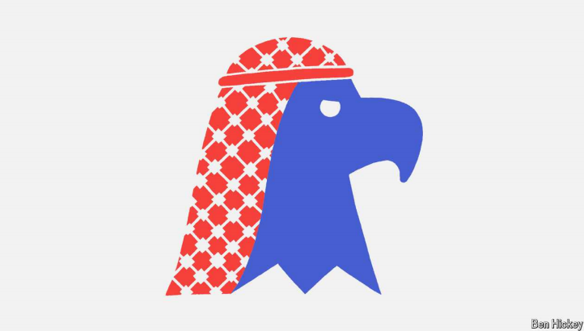

# Will the next president follow Israel into war with Iran?

Kamala Harris is likely to maintain Joe Biden’s awkward policy, while Donald Trump’s belligerent words mask a record of caution

belligerent：美 [bəˈlɪdʒərənt] 交战的；参与战争的；处于冲突中的；好战的

原文：

MANY AMERICAN presidents have dreamt of bringing peace to the

Middle East. Some could claim successes: Jimmy Carter oversaw the Camp

David accords between Israel and Egypt in 1978; Bill Clinton the Oslo

accords with the Palestinians in 1993 and a peace treaty with Jordan the next

year; Donald Trump the Abraham accords with Bahrain, the United Arab

Emirates and Morocco in 2020.

许多美国总统都梦想给中东带来和平。有些人可以宣称取得了成功:吉米·卡特监督了1978年以色列和埃及之间的戴维营协议；比尔·克林顿于1993年与巴勒斯坦签署了奥斯陆协议，并于次年与约旦签署了和平条约；唐纳德·特朗普在2020年与巴林、阿联酋和摩洛哥签署了亚伯拉罕协议。

学习：

accord：协议；

原文：

The next president will almost certainly be grappling with war, inheriting the

multi-front conflict between Israel and Iran’s “axis of resistance” that has

raged for the past year. How to prevent a regional cataclysm, and how to

avoid being dragged into another “forever war”?

下一任总统几乎肯定会忙于应付战争，继承过去一年以色列和伊朗“抵抗轴心”之间的多战线冲突。如何防止地区灾难，如何避免被拖入另一场“永久战争”？

学习：

rage：肆虐；

cataclysm：美 [ˈkædəˌklɪzəm] （突然降临的）大灾难；大灾变；大动乱；

原文：

Kamala Harris would probably hew to President Joe Biden’s awkward

policy: support Israel’s right to defend itself, try to restrain its most

dangerous actions, mitigate the humanitarian impact, seek ceasefires and

keep alive the idea of Palestinian statehood. Mr Trump suggests that Israel

should be given *carte blanche*. After Iran rained more than 180 ballistic

missiles on Israel on October 1st, Mr Biden urged the Jewish state not to

strike at Iran’s oil facilities or its nuclear sites. Mr Trump mocked such

caution: “Hit the nuclear first and worry about the rest later.”

卡玛拉·哈里斯可能会坚持美国总统乔·拜登(Joe Biden)的尴尬政策:支持以色列的自卫权，努力克制以色列最危险的行动，减轻人道主义影响，寻求停火，并保持巴勒斯坦建国的想法。特朗普建议，应该给予以色列全权。10月1日，伊朗向以色列发射了180多枚弹道导弹后，拜登敦促这个犹太国家不要袭击伊朗的石油设施或核设施。特朗普嘲笑这种谨慎:“先解决核问题，然后再担心其他问题。”

学习：

hew to：恪守；坚持；严格恪守          

statehood：国家地位，建国

carte blanche：全权委托；完全自由；无限制权力

原文：

American presidents of all stripes have said Iran will not be allowed to

acquire nuclear weapons. Yet none has bombed Iran’s sites; nor has any

given Israel the green light to do so. That is because the costs of further

inflaming the region are easy to imagine, and the rewards in terms of setting

back Iran’s nuclear programme would be temporary and hard to reckon.

美国历届总统都表示，不允许伊朗获得核武器。然而没有一个轰炸过伊朗的设施；也没有人给以色列这样做开绿灯。这是因为进一步激怒该地区的代价很容易想象，而阻止伊朗核计划的回报将是暂时的，难以估量。

学习：

of all stripes：形形色色的；各种各样的

reckon：估计

原文：

Neither Ms Harris nor Mr Trump has shown a desire to use US forces to bomb

Iran. In office Mr Trump abandoned a nuclear deal with Iran, imposed

“maximum pressure” through sanctions and in 2020 ordered the killing in

Iraq of Qassem Suleimani, Iran’s supremo for foreign military operations.

Then as now, hawks urged him to seize a rare opportunity to defeat Tehran’s

regime. But Mr Trump hoped for a deal with Iran’s clerics. Notably, he held

back from striking Iran even when it shot down an American drone and

helped to bomb Saudi oil facilities sites in 2019.

哈里斯和特朗普都没有表现出动用美军轰炸伊朗的意愿。在任期间，特朗普放弃了与伊朗的核协议，通过制裁施加“最大压力”，并在2020年下令在伊拉克杀死伊朗对外军事行动最高领导人卡西姆·苏莱曼尼。当时和现在一样，鹰派敦促他抓住一个难得的机会击败德黑兰政权。但特朗普希望与伊朗宗教领袖达成协议。值得注意的是，即使伊朗在2019年击落了一架美国无人机，并帮助轰炸了沙特的石油设施，他也没有袭击伊朗。

学习：

supremo： 美 [suːˈpriːmoʊ] 最高统治者；最高指挥官；最高领导人；

rare opportunity：难得的机会

cleric： 宗教领袖；教会人士

原文：

A subtler question is whether or how an American president might enable an

Israeli attack. Israel acting alone can probably inflict only limited damage.

The greater America’s involvement, the greater the military blow. Help

could range from sharing intelligence on targets to rescuing downed Israeli

pilots, providing air-to-air refuelling, or actually taking part in bombing

raids. In one of these scenarios, President Trump or President Harris might

give Israel the nod for military action and, in the ensuing mêlée, feel

compelled to finish the job or at least help its ally.

一个更微妙的问题是，美国总统是否或如何促成以色列的袭击。以色列单独行动可能只会造成有限的破坏。美国介入越多，军事打击越大。帮助的范围可以从分享目标情报到营救被击落的以色列飞行员，提供空中加油，或者实际参与轰炸袭击。在其中一种情况下，特朗普总统或哈里斯总统可能会同意以色列采取军事行动，并在随后的混乱中感到有必要完成任务或至少帮助其盟友。

学习：

inflict：强加于；使遭受；施加；

military blow：军事打击

refuelling：加油；补给燃料；（refuel的现在分词形式）          

nod：点头（表示同意、打招呼或示意）；首肯；默许；

原文：

However the conflict with Iran evolves between now and January, the next

president will almost certainly have to grapple with the aggravating Israeli

prime minister. According to a forthcoming book by the journalist Bob

Woodward, Joe Biden has privately referred to Binyamin Netanyahu as “a

fucking liar”. To judge by her interview this week with CBS News, Ms Harris

shares similar feelings. Mr Trump has at times been critical of Mr

Netanyahu, not least because the Israeli prime minister recognised Mr

Biden’s victory in 2020, but has also lined up with Republicans who think

Israel can do no wrong.

无论从现在到明年1月，与伊朗的冲突如何发展，下一任总统几乎肯定将不得不与这位令人恼火的以色列总理打交道。根据记者鲍勃·伍德沃德即将出版的一本书，乔·拜登私下称本雅明·内塔尼亚胡为“该死的骗子”。从本周接受CBS新闻采访来看，哈里斯女士也有类似的感受。特朗普有时会批评内塔尼亚胡，尤其是因为这位以色列总理承认拜登在2020年获胜，但他也支持认为以色列不会犯错的共和党人。

学习：

grapple with：应对；努力对付；努力应对          

aggravating：美 ['æɡrəveɪtɪŋ] 恼人的

原文：

Sympathy for Israel runs deep in American politics, as does antipathy for

Iran. Asked which foreign country was America’s greatest adversary, Ms

Harris unexpectedly replied: “Iran has American blood on their hands.”

Nevertheless, Mr Biden has struggled to restrain Mr Netanyahu, who has

played hardball in negotiations to secure a ceasefire in Gaza and shrugged

off entreaties not to open another front in Lebanon. America has armed

Israel and helped to shoot down missiles fired at it.

美国政界对以色列的同情根深蒂固，对伊朗的反感也是如此。当被问及哪个国家是美国最大的对手时，哈里斯出人意料地回答道:“伊朗的双手沾满了美国人的鲜血。”然而，拜登一直在努力克制内塔尼亚胡，后者在确保加沙停火的谈判中态度强硬，并对不要在黎巴嫩开辟另一条战线的恳求不屑一顾。美国武装了以色列，并帮助击落了射向它的导弹。

学习：

antipathy:反感；厌恶；

hardball：强硬手段；强硬策略；坚定立场；

shrug off：不予理会；对…置之不理；忽略；

entreaty：乞求；诉求

原文：

With his initial success against Hizbullah—killing its leader, Hassan

Nasrallah, and much of its military command—Mr Netanyahu feels

vindicated. He now speaks of the “opportunity to change reality” in Lebanon

and the region. He has urged the Lebanese people to cast off Hizbullah and

even hinted at regime change in Iran, saying freedom “will come a lot

sooner than people think”.

随着他对真主党的初步胜利——杀死了其领导人哈桑·纳斯鲁拉及其大部分军事指挥官——内塔尼亚胡觉得自己被证明是正确的。他现在谈到黎巴嫩和该地区的“改变现实的机会”。他敦促黎巴嫩人民摆脱真主党，甚至暗示伊朗政权更迭，称自由“将比人们想象的来得更快”。

学习：

vindicate：证明…是正确的

cast off：摆脱；抛弃；丢弃；

regime change：政权更迭

原文：

What about peace? Assuming the wars somehow die down, Ms Harris has

expressed concern for Palestinians’ suffering but has set out no plans to

achieve statehood. Mr Trump cares little for their cause; his officials have

been supporters of Israeli settlement in the occupied West Bank. Both will

doubtless pursue an elusive Israel-Saudi normalisation deal. But the longer

the wars go on, the higher the price the Saudis will demand. ■

和平呢？假设战争以某种方式平息，哈里斯女士已经表达了对巴勒斯坦人民苦难的关注，但并没有提出建国的计划。特朗普不关心他们的事业；他的官员一直支持以色列在被占领的约旦河西岸建立定居点。毫无疑问，双方都将追求难以捉摸的以色列-沙特关系正常化协议。但是战争持续的时间越长，沙特要求的价格就越高。■

学习：

die down：减弱；平息；逐渐消失          

## 后记

2024年10月16日15点39分于上海。

