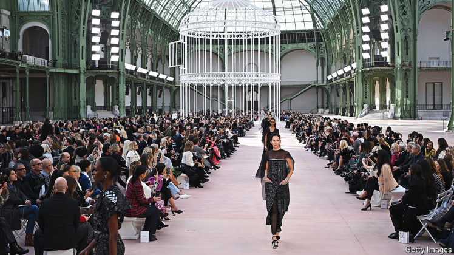

# Pity the superstar fashion designer

Creative directors are coming and going faster than the latest trends

原文：

**A** GIANT BIRDCAGE held models wearing Chanel’s latest

clothes at its show for Paris fashion week on October 1st. The

exhibit in the Grand Palais had all the hallmarks of the 114-year

old fashion house: sophistication, skirt suits and even a little black

dress. Yet at the end there was no designer to take the applause. In

June Virginie Viard, Chanel’s creative director since 2019, stepped

down. Ms Viard was only the third person to hold the role. She

took over from Karl Lagerfeld, a sharp-tongued German who held

the role for 36 years and once called sweatpants “a sign of defeat”.

Mr Lagerfeld’s predecessor was Coco Chanel. The front rows of

runway shows are now rife with gossip about who will bag

fashion’s most prestigious job. An announcement is expected this

month.

10月1日，一个巨大的鸟笼里放着穿着香奈儿最新服装的模特。大皇宫里的展览具有这家有着114年历史的时装屋的所有特征:精致、裙子套装，甚至还有一件小黑裙。然而，最终没有设计师赢得掌声。6月，香奈儿自2019年以来的创意总监Virginie Viard辞职。维亚德女士只是第三个担任这个角色的人。她接替了卡尔·拉格费尔德的职位，这位说话尖刻的德国人担任了36年，曾称运动裤是“失败的标志”。拉格菲尔德的前任是可可·香奈儿。时装秀的前排现在充斥着关于谁将获得时尚界最负盛名的工作的流言蜚语。预计将在本月宣布。

学习：

birdcage：鸟笼；鸟舍；鸟笼状物；鸟笼式建筑

sophistication：精致

hold the role：担任角色

sharp-tongued：说话尖刻的；言辞辛辣的；嘴巴毒的；

sweatpants：运动裤；休闲裤；宽松长裤

rife with：充满

bag：获得

bag the job：获得这份工作

原文：

Ms Viard is but one among many superstar designers to have left

their jobs recently. In July Peter Hawkings, creative director at Tom

Ford, left after less than a year in the role. On October 2nd Hedi

Slimane quit the top design job at Celine, owned by LVMH, a

French luxury conglomerate; on October 11th Kim Jones left the

same post at Fendi, another LVMH *maison*. Fashion designers are

coming and going faster than the latest trends.

维亚德只是最近离职的众多超级明星设计师之一。7月，汤姆·福德创意总监彼得·霍金斯在担任该职位不到一年后离职。10月2日，Hedi Slimane辞去了法国奢侈品集团LVMH旗下Celine的高级设计职位；10月11日，金·琼斯离开了另一家LVMH品牌芬迪的同一职位。时装设计师的来去速度比最新潮流还要快。

原文：

The turmoil can be attributed in part to a slowdown in sales of

luxury goods. Softening demand, notably in China, has hurt fashion

houses. On October 15th LVMH reported that revenue for its

fashion and leather-goods division for the quarter from July to

September fell by 5%, year on year. The slump is making investors

and bosses jittery, in turn giving established designers less freedom

to experiment and newly appointed ones less time to find their feet.

这场混乱可以部分归因于奢侈品销售的放缓。需求疲软已经伤害了时装公司。10月15日，路威酩轩集团报告称，其时装和皮革制品部门从7月到9月的季度收入同比下降了5%。经济衰退让投资者和老板们紧张不安，这反过来又减少了老牌设计师试验的自由，也减少了新任命的设计师站稳脚跟的时间。

学习：

luxury goods：奢侈品

softening demand：需求疲软

jittery：紧张不安的；

established：著名的；成名的

established designers：有名望的设计师

>这里的 **"established"** 意思是 **已经确立地位的、有名望的或成熟的**。在这个语境中，指的是那些 **已经在时尚界获得认可且有较长时间经验的设计师**。这些设计师通常享有较大的创作自由，但由于奢侈品需求疲软和市场不稳定，他们的创作空间也受到影响。  
>
>例子：
>
>1. **English**: The gallery featured works from both established and emerging artists.  
>   **中文**：这家画廊展示了成熟艺术家和新兴艺术家的作品。  
>
>2. **English**: The company’s new CEO is focusing on maintaining the success of its established product lines.  
>   **中文**：公司的新任CEO专注于保持其成熟产品线的成功。  
>
>在文中，**"established designers"** 暗指那些在时尚界已经获得稳定地位的设计师。市场动荡让他们的创新受限，而 **"newly appointed"**（新上任的）设计师则因为市场环境不稳定，缺乏足够的时间和机会展示自己的才能。

原文：

At the same time, designers are increasingly being asked to do

more than just fashion clothes. Karen Harvey, a consultant who

helped appoint Calvin Klein’s lead designer this year, says there is

a growing expectation in the industry that creative directors will be

able to “rescue a brand”. Virgil Abloh, a streetwear entrepreneur

and creative collaborator of Kanye West, transformed the staid

image of Louis Vuitton’s menswear by working with younger

talent. He once told an interviewer, “I am not a designer.” After he

died in 2021, aged just 41, the company replaced him with Pharrell

Williams, a singer who had also branched out into streetwear.

According to Ms Harvey, customers now expect a mix of “fashion,

zeitgeist and culture” from luxury brands—all of which creative

directors are meant to supply.

与此同时，设计师越来越多地被要求不仅仅做时装。今年帮助任命Calvin Klein首席设计师的顾问卡伦哈维(Karen Harvey)表示，业界越来越期待创意总监能够“拯救一个品牌”。维吉尔·阿布洛(Virgil Abloh)是街头服饰企业家，也是坎耶·韦斯特(Kanye West)的创意合作者，他通过与年轻人才合作，改变了路易威登男装的古板形象。他曾告诉一位采访者，“我不是设计师。”2021年，年仅41岁的他去世后，公司用法瑞尔·威廉姆斯取代了他，这位歌手也涉足街头服饰。据哈维女士说，顾客现在期望奢侈品牌的“时尚、时代精神和文化”的结合——所有这些都是创意总监应该提供的。

学习：

lead designer：首席设计师

staid：美 [steɪd] 古板的；保守的；

menswear：（尤用于商店中）男装；男士服饰

zeitgeist：美 [ˈtsaɪtˌɡaɪst] 时代思潮；时代特征 **注意发音**

原文：

Whoever replaces Ms Viard at Chanel will at least have one

advantage: the world’s second-biggest luxury-fashion brand by

sales (behind Louis Vuitton) is privately owned by two French

brothers, Alain and Gérard Wertheimer. That should mean there

will be less focus on short-term financial results. Yet Chanel is not

entirely shielded from the forces buffeting the industry. It has been

aggressively chasing growth in recent years; between 2020 and

2023 its sales nearly doubled, to around $20bn. Much of that is a

result of hefty price increases. Bernstein, a broker, estimates that

from 2020 to 2023 like-for-like prices at Chanel increased by

almost 60% on average. Among other luxury brands it examined,

only Dior put its prices up by more. Amid weakening demand,

further big increases may be difficult to pull off.

无论谁来接替Viard女士在香奈儿的职位，都至少有一个优势:这个世界上销售额第二大的奢侈时尚品牌(仅次于路易威登)是由两个法国兄弟Alain和Gérard Wertheimer私人拥有的。这应该意味着对短期财务业绩的关注将会减少。然而，香奈儿并没有完全避开打击该行业的力量。近年来，它一直在积极追求增长；2020年至2023年间，其销售额几乎翻了一番，达到200亿美元左右。这在很大程度上是价格大幅上涨的结果。经纪人Bernstein估计，从2020年到2023年，香奈儿的同类价格平均上涨了近60%。在它调查的其他奢侈品牌中，只有迪奥涨价更多。在需求疲软的情况下，进一步大幅提价可能很难实现。

学习：

buffeting：美 [ˈbəfədɪŋ] 连续猛击；冲击；打击；（buffet的现在分词）

pull off：办成；做成（困难的事情）

原文：

That will make the job of Chanel’s fourth-ever creative director

trickier. In the running are said to be Mr Slimane, recently of

Celine; Pierpaolo Piccioli, who left Valentino in March; and Marc

Jacobs, who was the creative director at Louis Vuitton for 16 years

and now has his own label. Whoever gets the job will hope to make

a strong impression quickly—lest they be pushed aside for Chanel

number five. ■

这将使香奈儿第四任创意总监的工作更加棘手。据说在竞选中的是Slimane先生，最近的Celine皮耶保罗·皮西奥利，他在三月份离开了华伦天奴；还有马克·雅可布，他在路易威登做了16年的创意总监，现在有了自己的品牌。无论谁得到这份工作，都希望尽快给人留下深刻印象——以免被挤到香奈儿第五(被换掉)。■

学习：

Valentino：华伦天奴（品牌名）

>这里的 **"Chanel number five"** 是一个双关语：
>
>1. **Chanel No. 5 香水**：这是香奈儿最著名的香水之一，代表品牌的经典形象。提到 **"Chanel number five"** 会让人联想到这个标志性的香水。
>
>2. **下一任创意总监**：在这个语境中，它暗指 **接替第四任创意总监的第五任**。如果新的创意总监无法快速取得成功，他们可能会被迅速替换为下一个人选（即“第五任”）。
>
>因此，这句话含蓄地表达了时尚界的竞争和压力之大：**新任创意总监不仅需要尽快证明自己，否则就可能很快被替换**。

## 后记

2024年10月20日14点29分于上海。

