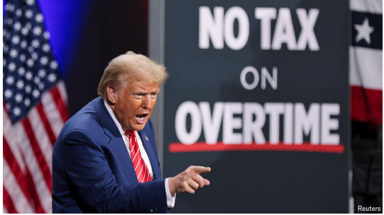
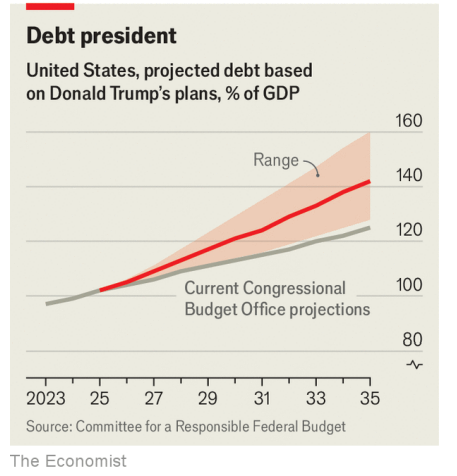

# Trump’s trillion-dollar tax cuts are spiralling out of control

His zany promises would blow up the deficit

spiralling：盘旋上升；（spiral的现在分词形式）正在变得越来越

zany：美 [ˈzeɪni] 滑稽可笑的；荒谬的；愚蠢的

blow up：摧毁；毁灭；破裂；突然失去控制

原文：

**F**OR AMERICAN policy wonks, the final stretch of the

presidential election has given rise to a new parlour game. What is

the next tax that Donald Trump will promise to cut? The

Republican candidate has trotted out a range of pledges, from no

taxes on overtime work to no taxes on retirement benefits. Last

week alone he proposed three new exemptions, including making

interest on car loans tax-deductible. It is easy to figure out what Mr

Trump hopes to gain. Yet the economic implications are dispiriting:

not just a bigger fiscal deficit but a much messier tax code.

对于美国的政策专家来说，总统选举的最后阶段引发了一场新的室内游戏。唐纳德·特朗普承诺削减的下一项税收是什么？这位共和党候选人提出了一系列承诺，从对加班不征税到对退休福利不征税。仅在上周，他就提出了三项新的免税政策，包括减免汽车贷款的利息。很容易猜出特朗普希望获得什么。然而，其经济影响令人沮丧:不仅仅是更大的财政赤字，还有更混乱的税法。

学习：

wonk：学究，专家

stretch：一段；一片；一段时间

parlour：起居室；客厅

parlour game：室内游戏；客厅游戏；家庭游戏；社交游戏          

trot：（马等）小跑；疾走；慢跑；

trot out：展示；揭露

overtime work：加班工作；超时工作          

deductible：可扣除的；可减免的

原文：

Set against the federal government’s $4trn in annual tax revenue,

some of Mr Trump’s most attention-grabbing ideas are inexpensive.

For instance, exempting tips from taxes would cost about $118bn

over the next decade, according to the Tax Foundation, a think

tank. Others would be much bigger. He has proposed reinstating a

rule to let Americans fully deduct taxes paid to state and local

governments from their federal tax bills. That could cost $1trn over

the next decade, the Tax Foundation says. And these all come on

top of Mr Trump’s baseline pledge to extend the income-tax cuts

that he made in 2017, which are due to expire at the end of next

year.

与联邦政府每年4万亿美元的税收收入相比，特朗普最引人注目的一些想法并不昂贵。例如，根据智库税务基金会(Tax Foundation)的数据，未来10年，免除小费税将耗资约1180亿美元。其他的要大得多。他提议恢复一项规则，让美国人从联邦税收账单中全额扣除支付给州和地方政府的税款。税收基金会称，这可能会在未来十年花费1万亿美元。这些都是特朗普在2017年做出的延长所得税削减的基线承诺的基础上做出的，该承诺将于明年年底到期。

学习：

set against：映衬；使平衡；反对          

attention-grabbing：吸引注意力的；引人注意的；吸引人眼光的          

reinstating：使复原；使恢复；（reinstate的现在分词形式）          

原文：

One obvious concern is that these various cuts would push up an

already bloated federal deficit. In an estimate published on October

7th, the Committee for a Responsible Federal Budget, a non

partisan group, projected that the deficit would climb to as much as

12% of GDP by 2035 under Mr Trump, up from about 7% last year.

As a result, the national debt would soar to vertiginous heights (see

chart).

一个明显的担忧是，这些各种各样的削减会推高已经膨胀的联邦赤字。在10月7日公布的一份估计中，无党派团体“负责任的联邦预算委员会”预测，在特朗普的领导下，到2035年，赤字将攀升至GDP的12%，高于去年的7%。结果，国家债务将飙升至令人眩晕的高度(见图表)。

学习：

vertiginous：美 [vərˈtɪdʒənəs] 引起眩晕的；使人感到晕眩的

原文：

Taken together, the proposals also represent a shift from Mr

Trump’s approach to taxes during his first term. The Tax Cuts and

Jobs Act of 2017—his biggest legislative accomplishment—

simplified the tax system and broadened the base of taxpayers in

order to clear the way for cuts. What he is proposing now, however,

is the creation of a dizzying array of loopholes. Philosophically, it

is hard to defend many: why, for instance, should wage workers

pay taxes on their entire income, whereas workers who receive tips

avoid taxes on some of their income? Moreover, practically it will

be a mess: individuals will have to spend more time itemising their

tax returns, and the Internal Revenue Service, already

overwhelmed, will struggle to monitor all the claimed exemptions.

总的来说，这些提议也代表着特朗普在第一个任期内税收政策的转变。2017年的减税和就业法案是他最大的立法成就，简化了税收制度，扩大了纳税人基础，为减税扫清了道路。然而，他现在提议的是制造一系列令人眼花缭乱的漏洞。从哲学上讲，很难为许多人辩护:例如，为什么工薪阶层应该为他们的全部收入缴税，而接受小费的人却可以避免为他们的部分收入缴税？此外，实际上这将是一个烂摊子:个人将不得不花更多的时间逐项填写他们的纳税申报表，而已经不堪重负的国内税收署将难以监控所有声称的免税。

原文：

The saving grace is that many of Mr Trump’s proposed tax cuts are

probably empty promises. Fiscal legislation must make it through

Congress to become law. Even if Republicans end up controlling

both the Senate and the House, moderates in the party would surely

push back against Mr Trump’s zanier proposals. Douglas Holtz

Eakin, a long-time Republican economic adviser, argues they are

mostly transactional—cheap pledges made to win an election that

are easily discarded afterwards. “They don’t come from a place of

deep, personal belief,” he says.

值得庆幸的是，特朗普提议的许多减税措施可能都是空头承诺。财政立法必须通过国会才能成为法律。即使共和党最终控制了参议院和众议院，党内的温和派也肯定会反对特朗普更滑稽的提议。长期担任共和党经济顾问的道格拉斯·霍尔茨-埃金(Douglas Holtz-Eakin)认为，这些承诺大多是交易性的——为赢得选举而做出的廉价承诺，事后很容易被抛弃。“他们不是来自一个有深刻的个人信仰的地方，”他说。

学习：

saving grace：可取之处；优点；

empty promises：空头承诺

zanier：滑稽的；愚蠢的；古怪的；荒唐的；（zany的比较级）          

原文：

But Erica York of the Tax Foundation says Mr Trump could still

complicate the debate about how to handle the expiration of the tax

cuts of 2017 by throwing unhelpful ideas into the mix. “That’s just

going to add to the pressures that Congress faces next year,” she

says. And there is one type of tax Mr Trump really does care about:

tariffs. Here, too, his promises are inflationary. At the start of his

campaign he vowed to place levies of 60% on Chinese products; on

October 15th he upped his threat to 2,000% tariffs on Chinese cars.■

但税收基金会(Tax Foundation)的埃丽卡·约克(Erica York)表示，特朗普仍可能通过抛出无益的想法，使关于如何处理2017年减税到期的辩论复杂化。“这只会增加国会明年面临的压力，”她说。还有一种税是特朗普真正关心的:关税。在这一点上，他的承诺也会导致通货膨胀。在竞选之初，他发誓要对中国产品征收60%的关税；10月15日，他威胁对中国汽车征收2000%的关税。■

## 后记

2024年10月23日20点08分于上海。

