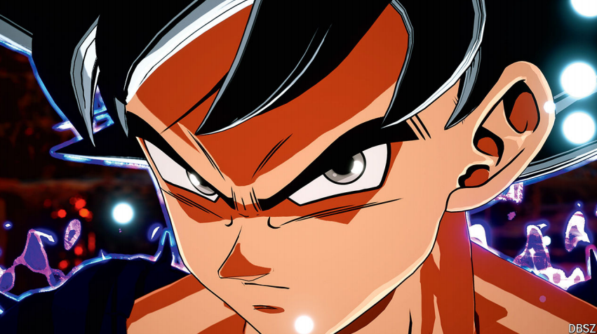

# Why the world is so animated about anime

Japan’s cartoons have conquered its screens, and more

为什么世界对动漫如此热衷

animated：热衷的；生动的；活泼的；活跃的

anime：美 [ˈænɪmeɪ] 动漫

原文：

**M**OST ATHLETES raise their fists in triumph after a win. When

Noah Lyles, an American sprinter, won gold in the Olympics 100-

metre race in August, he held his hands out in front of him, wrists

together and fingers extended, as though getting ready to catch a

large ball. The gesture may have seemed odd, but fans of Japanese

animation knew immediately that Mr Lyles, an avowed fan of the

genre, was making a reference to a popular franchise, “Dragon

Ball”.

大多数运动员在获胜后都会举起拳头表示胜利。当美国短跑运动员诺亚·莱尔斯(Noah Lyles)在8月份赢得奥运会100米比赛金牌时，他双手在胸前伸出，手腕并拢，手指伸展，好像准备好接住一个大球。这种姿态可能看起来很奇怪，但日本动画的粉丝们马上就知道，莱尔斯先生，一个该类型的公开粉丝，是指一个受欢迎的动漫，“龙珠”。

原文：

Mr Lyles had more cause to celebrate on October 11th, with the

release of a new “Dragon Ball” series and video game (more than

70m people play a mobile game from the franchise). So will Ishiba

Shigeru, Japan’s new prime minister, another fan. Once a

domestically consumed niche product “watched by people with no

friends at school”, as one veteran producer ruefully recalls, anime

has become a global sensation. These days its export value in

Japan, alongside other content such as video games, is approaching

that of semiconductors or steel; it now claims more fans outside the

country than within it. Some estimate that around 800m people

globally are animated about anime.

10月11日，随着新的“龙珠”系列和电子游戏(超过7000万人玩该系列的一款手机游戏)的发布，Lyles先生有更多的理由庆祝。日本新首相石破茂也是他的粉丝。正如一位资深制作人沮丧地回忆的那样，曾经是国内消费的小众产品“被在学校没有朋友的人观看”，动漫已经成为全球轰动。如今，它在日本的出口价值，以及其他内容，如视频游戏，正在接近半导体或钢铁；现在，它声称国外的粉丝比国内的还多。有人估计，全球大约有8亿人热衷于动漫。

学习：

niche product：小众产品

ruefully：悲伤地；可怜地；悔恨地

sensation：轰动；激动；觉察；强烈感受；引起轰动的人（或事）          

global sensation：全球轰动

原文：

Those unfamiliar with the genre often wonder what anime is.

“Animation created in Japan” is the simple definition offered by

Rahul Purini, the head of Crunchyroll, an anime-streaming service

with around 130m users across 200 countries. But there is also an

aesthetic connotation: anime is usually hand-drawn and two

dimensional, unlike the photorealistic 3D animation that has grown

more common outside Japan. The characters often resemble hyper

caffeinated Tintins, with unusually large, expressive eyes, small

noses, strange hair and easily decipherable emotions.

那些不熟悉这种类型的人经常想知道什么是动漫。“日本创造的动画”是动漫流媒体服务公司Crunchyroll的总裁Rahul Purini给出的简单定义，该公司在200个国家拥有约1 . 3亿用户。但也有一个美学内涵:动漫通常是手绘的二维动画，不像日本以外越来越常见的真实感3D动画。这些角色通常类似于高咖啡因的Tintins，有着不寻常的大而富于表情的眼睛，小鼻子，奇怪的头发和容易理解的情感。

学习：

connotation：内涵；内涵意义

decipherable：可判读的；可解释的          

>"Hyper-caffeinated Tintins" 的含义  
>在这段话中，"hyper-caffeinated Tintins" 是一种比喻，用来形容 anime 中的角色。这种比喻强调这些角色通常充满活力、过于兴奋，甚至有些夸张，类似于喝了过多咖啡后的状态。Tintin 是比利时漫画家埃尔热创作的经典角色，通常被描绘为聪明、勇敢的年轻侦探。
>
>例句：
>- The kids were hyper-caffeinated after eating all the candy at the party.
>（孩子们在派对上吃完所有糖果后兴奋得像喝了过多咖啡。）
>- His performance was so energetic that he reminded me of a hyper-caffeinated Tintin.
>（他的表演如此充满活力，让我想起了一个兴奋得像喝了过多咖啡的丁丁。）
>
>在本文中的意思：  
>"Characters often resemble hyper-caffeinated Tintins"  
>意思是：这些角色往往像兴奋得过头的丁丁，表现出极度的活力和夸张的情感特征，突显了 anime 角色的独特风格。
>
>总结  
>"Hyper-caffeinated Tintins" 强调了 anime 角色的活泼与夸张，描绘了他们的外观和情感表达方式，反映了 anime 的独特美学与文化特征。

原文：

Anime tends to be set in non-specific places, such as vaguely

European-looking cities for some films by Miyazaki Hayao,

Japan’s most acclaimed creator. The setting makes it easy for non

Japanese audiences to relate; the only barrier is language, and

animation is more easily dubbed than live-action films.

动漫往往以不特定的地方为背景，比如日本最受欢迎的创作者宫崎骏其人的一些电影中依稀有些欧洲风格的城市。这种设置让非日本观众很容易产生共鸣；唯一的障碍是语言，动画比真人电影更容易配音。

学习：

acclaimed：受称赞的；为人称道的

dubbed：译制的；配音；（dub的过去分词）          

live-action：真人版的          

原文：

Recently anime has raced into people’s homes with Lyles-like

speed. In 2023 Japan’s anime industry hit a record high, with

revenues of ¥339bn ($2.3bn), up by nearly a quarter from a year

earlier, according to Teikoku Databank, a research firm. Anime

now makes almost half its profits abroad. Netflix’s anime titles had

more than 1bn views across 190 countries last year; the most

popular included “Demon Slayer”, about an orphaned boy who

battles demons to avenge his family, and “My Happy Marriage”,

about a girl with magic powers who is underestimated by her in-

laws.

最近，动画以莱尔斯般的速度进入了人们的家庭。根据研究公司Teikoku Databank的数据，2023年，日本动漫产业创下历史新高，收入达到3390亿日元(合23亿美元)，同比增长近四分之一。动漫现在几乎一半的利润来自海外。去年，网飞的动漫作品在190个国家被观看了超过10亿次；最受欢迎的包括《恶魔猎手》，讲述了一个孤儿为了给家人报仇而与恶魔战斗的故事，还有《我的幸福婚姻》，讲述了一个被公婆低估了魔力的女孩。

原文：

Two factors help explain anime’s surging global popularity. The

first is streaming, which made anime easier to find and watch. Fans

no longer have to depend on the decisions of network programmers

or wait a week for another episode. They can binge, explore and

discover on their own. Anime viewership boomed during the

pandemic, as the world sat at home in front of screens for months.

(The year 2020 was the first time anime made more money outside

Japan than within.) Since then viewership numbers have continued

rising in Japan and around the world. Increased demand is

producing increased supply. In 2023 anime studios licensed some

300 works in regions such as North America, South-East Asia and

western Europe.

有两个因素有助于解释动漫在全球的流行。首先是流媒体，这使得动漫更容易找到和观看。粉丝们不再需要依赖网络节目制作人的决定，或者为下一集等待一周。他们可以独自狂欢、探索和发现。在疫情期间，动漫观众人数激增，因为几个月来全世界都坐在家里的屏幕前。(2020年是动漫在日本以外的收入首次超过日本国内。)从那以后，日本和世界各地的观众人数持续上升。需求的增加导致供给的增加。2023年，动漫工作室在北美、东南亚和西欧等地区授权了约300部作品。

学习：

binge：大吃大喝；暴饮暴食；沉溺（于某活动）

viewership：（电视节目或频道的）观众人数；观众类型；收视率

原文：

Second, audiences have grown tired and suspicious of Hollywood’s

neat resolutions. As Susan Napier, a professor at Tufts University

and expert on anime, explains, “Technology hasn’t brought us the

utopia we thought it would, and the post-cold-war world has

become more dangerous than we imagined,” which makes happily-

ever-after endings implausible. Anime is willing to have heroes

killed off and characters suffer huge loss. At the same time, the

protagonists are often cute and relatable. “It’s a dark world out

there,” Ms Napier says, so audiences “want that fluffy cuteness”.

其次，观众已经厌倦并怀疑好莱坞简洁的决议。正如塔夫茨大学(Tufts University)教授、动漫专家苏珊·纳皮尔(Susan Napier)所解释的，“科技并没有给我们带来我们想象中的乌托邦，冷战后的世界变得比我们想象的更加危险，”这让幸福的结局变得难以置信。动漫愿意英雄被杀，角色遭受巨大损失。同时，主角们往往很可爱，也很有共鸣。“外面是一个黑暗的世界，”纳皮尔女士说，所以观众“想要那种毛茸茸的可爱”。

学习：

protagonist：美 [prəˈtæɡənɪst]  （小说、戏剧、电影等的）主角；主人公；

relatable：让人感同身受的

fluffy：松软的；蓬松的；毛茸茸的；

原文：

Anime’s global growth has been made possible by its own

evolution. Japanese comic books and graphic novels, collectively

known as “manga”, have long provided the source material for

anime. Unlike comic books in Britain and America, manga are not

primarily or even mostly for children. Thousands of new manga are

published every year, on virtually every subject imaginable, from

pornography to reflections on war, which gives anime an

inexhaustible range of sources.

动漫的全球增长是由它自身的发展促成的。日本漫画书和漫画小说，统称为“漫画”，长期以来一直为动漫提供素材。不像英国和美国的漫画书，漫画不是主要或者甚至大部分是给孩子们看的。每年都有数以千计的新漫画出版，几乎涉及所有可以想象的主题，从色情到对战争的反思，这给了动漫取之不尽的资源。

原文：

About 30 years ago, studios started producing more anime aimed at

girls, such as “Sailor Moon”, which was less focused on fighting

and robots and more on storylines and magic. And as the fan base

got older, creators began making more sophisticated works, often

with more adult themes. Mr Miyazaki won an Oscar in 2003 for

“Spirited Away”, a baroque, fantastical story about a girl who

rescues her parents.

大约30年前，工作室开始制作更多针对女孩的动漫，比如《美少女战士》，它不太关注打斗和机器人，而更关注故事情节和魔法。随着粉丝群的扩大，创作者开始制作更复杂的作品，通常带有更多成人主题。宫崎骏凭借《《千与千寻》》获得了2003年的奥斯卡奖，这是一部巴洛克风格的奇幻电影，讲述了一个女孩营救父母的故事。

学习：

storyline：故事情节

原文：

Around that time “Dragon Ball” and “Pokémon” were engaging a

new generation of fans. Japan’s government noticed and eventually

took action: in 2013 it launched an initiative called “Cool Japan”,

in which it invested some ¥90bn to propel Japan’s creative

industries abroad. It was a flop, because of poorly chosen

investments, but that has not stopped the government from trying

again: it wants to quadruple the value of Japan’s content industry

overseas by 2033.

大约在那个时候，“龙珠”和“神奇宝贝”吸引了新一代的粉丝。日本政府注意到了这一点，并最终采取了行动:2013年，日本政府推出了一项名为“酷日本”的计划，投资约900亿日元推动日本创意产业走向海外。由于投资选择不当，这是一次失败，但这并没有阻止政府再次尝试:它希望到2033年日本内容产业的海外价值翻两番。

学习：

engaging；吸引人的；有趣的；迷人的

flop：失败；铩羽          

原文：

The painstaking nature of hand-drawn, two-dimensional animation

is providing inspiration for creators outside Japan. Earlier this year,

Usman Riaz, a Pakistani director, released a 2D feature film with

an anime-inspired aesthetic called “The Glassworker”, animated

entirely in Pakistan and originally voiced in Urdu. And the

forthcoming “Lord of the Rings” film, “The War of the Rohirrim”,

to be released in December, is in that same style. It is directed by

Kamiyama Kenji, who has spent his career working on anime.

手绘二维动画的艰苦本质为日本以外的创作者提供了灵感。今年早些时候，巴基斯坦导演乌斯曼·里亚兹(Usman Riaz)发布了一部名为《玻璃工人》(The Glassworker)的2D故事片，这部电影完全在巴基斯坦制作，最初用乌尔都语配音。即将于12月上映的《指环王》系列电影《罗希里姆之战》也是这种风格。这部电影的导演是神山健二，他的职业生涯一直致力于动画制作。

原文：

Other creators are taking that aesthetic in new directions. Netflix’s

superb “Blue Eye Samurai”, about a revenge-seeking young

woman in Edo-period Japan, won an Emmy for animation and was

among the service’s ten most popular shows in 50 countries

following its premiere last year. Created by a Japanese-American

woman and her white American husband, its lavish aesthetic and

gore pay homage to directors such as Quentin Tarantino.

其他创作者正在将这种审美带入新的方向。网飞精湛的《蓝眼武士》讲述了日本江户时代一个寻求复仇的年轻女子，赢得了艾美奖最佳动画奖，并在去年首映后成为该服务在50个国家最受欢迎的十大节目之一。由一名日裔美国妇女和她的美国白人丈夫创作，其奢华的美学和血腥向昆汀·塔伦蒂诺等导演致敬。

学习：

superb：美 [suːˈpɜːrb] 极好的；卓越的；出色的

samurai：美 [ˈsæməˌraɪ] 日本武士（尤指中世纪的）；

homage：致敬

pay homage to：向xxx致敬

gore: 血腥暴力场景

>"Gore" 的含义  
>在这段话中，"gore" 指的是在电影或艺术作品中对血腥和暴力场面的表现，通常包括大量的血液和受伤场景，旨在引起强烈的视觉冲击或情感反应。
>
>例句：
>- The horror movie was criticized for its excessive gore, which some viewers found off-putting.
>（这部恐怖电影因其过度的血腥场面而受到批评，一些观众对此感到厌恶。）
>- The novel included graphic descriptions of violence and gore that made some readers uncomfortable.
>（这部小说包含对暴力和血腥的生动描写，使一些读者感到不适。）
>
>在本文中的意思：  
>"Its lavish aesthetic and gore pay homage to directors such as Quentin Tarantino"  
>意思是：它华丽的美学和血腥的场面向昆汀·塔伦蒂诺等导演致敬，显示了作品在风格上对这些导演的影响和敬意。
>
>总结  
>在此文中，"gore" 强调了作品中的暴力元素和视觉效果，反映了其风格上的大胆与独特，同时也展示了对某些著名导演的致敬。

原文：

Yet appealing to anime fans need not entail animation: last year

Netflix launched a live-action show, “One Piece”, based on the

popular manga of the same name (the original show, launched in

1999, was one of anime’s most popular brands ever, with over

1,100 episodes and 500m copies of the manga books sold).

然而，吸引动漫迷并不需要动画:去年，网飞推出了真人表演节目《海贼王》，该节目基于同名的流行漫画(1999年推出的原创节目是有史以来最受欢迎的动漫品牌之一，售出了1100多集和5亿册漫画)。

学习：

entail：使成为必需；使必要

原文：

But for all the experimentation, traditional anime shows no signs of

flagging. “People are aware of a world that’s more amorphous and

more dangerous, [and have] less ability to believe in the happily

ever after,” Ms Napier of Tufts suggests. Bad news for the world,

but good for Japanese animators. ■

但是对于所有的实验来说，传统动画并没有衰退的迹象。塔夫茨大学的纳皮尔女士表示:“人们意识到这个世界更加不稳定，更加危险，也更不相信幸福快乐的生活。”。对世界来说是坏消息，但对日本动画师来说是好消息。■

学习：

flagging：疲乏；衰退；（flag的现在分词）

amorphous：不定形的，不稳定

## 后记

2024年10月25日16点28分于上海。

