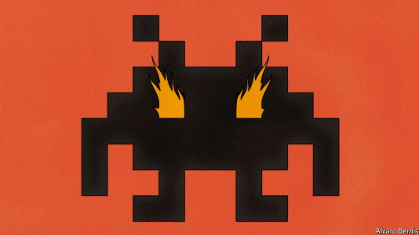

# How bad are video games for your grades?

Chinese students provide an answer

原文：

**A**RRIVING ON THE magical continent of Teyvat, you and your

twin are attacked and separated by an unwelcoming god. When you

regain consciousness, you set off in search of your lost sibling,

exploring seven beguiling worlds (one of which resembles a

Chinese national park). Along the way you team up with other

heroes, blessed with elemental powers. One can cross lakes by

freezing the water beneath his feet. Another can float on air

currents of his own creation. Together, your travelling party must

fight monsters, solve puzzles and plunder treasure chests.

到达神奇的泰瓦特大陆后，你和你的双胞胎受到了一个不友好的神的攻击并被分开了。当你恢复意识时，你出发去寻找你失踪的兄弟姐妹，探索七个迷人的世界(其中一个类似中国国家公园)。一路上，你与其他拥有自然力量的英雄组队。人们可以通过冻结脚下的水来渡过湖泊。另一个可以漂浮在他自己创造的气流上。一起，你的旅行伙伴必须打击怪物，解决难题和掠夺宝箱。

学习：

regain consciousness：恢复意识

beguiling：诱人的；迷人的          

plunder：掠夺；抢劫

chest：金库；财箱

treasure chest：宝箱

原文：

Released in September 2020 by a Chinese developer, the online

game “Genshin Impact” became a big hit. A year after its release, it

was attracting more than 13m monthly users in China and more

than 50m worldwide. The success of this home-grown creation and

others like it was not, however, a source of great pride for China’s

government. It worries that gaming addiction poses a threat to

teenagers. In 2021 a state-run newspaper complained that online

games were contributing to myopia, bad grades and alienation.

They are often described as “spiritual opium”, it said.

中国开发商于2020年9月发布的网络游戏“《原神》”大受欢迎。发布一年后，它在中国吸引了逾1300万月度用户，在全球吸引了逾5000万月度用户。然而，这个本土发明和其他类似发明的成功并没有让中国政府引以为豪。它担心游戏成瘾对青少年构成威胁。2021年，一家国营报纸抱怨说，网络游戏正在导致近视、糟糕的成绩和疏离感。它说，他们经常被描述为“精神鸦片”。

学习：

gaming addiction：游戏成瘾

myopia：美 [maɪˈoʊpiə] 近视

bad grades：糟糕的成绩，成绩差

原文：

In 2019 China’s government limited children under 18 to an hour

and a half of online game-time a day during the school week. In

2021 it went further, permitting only three hours a week. The limits

were part of a crackdown on consumer-tech firms that horrified

entrepreneurs and investors. Still, parents around the world will be

keen to know whether they did any good.

2019年，中国政府限制18岁以下的儿童在学校周期间每天只能玩一个半小时的网络游戏。2021年，它走得更远，只允许一周三小时。这些限制是打击消费科技公司的一部分，令企业家和投资者感到恐惧。尽管如此，世界各地的父母都很想知道他们是否做了什么好事。

原文：

Those curious will find some clues in a remarkable new study by

Panle Jia Barwick and Chao Fu of the University of Wisconsin

Madison, as well as Siyu Chen of Jinan University and Teng Li of

Sun Yat-Sen University. It sheds light on the impact of gaming (and

other mobile-phone habits) on the grades, well-being and job

market success of Chinese students. To tease out such effects, the

researchers make use of the government’s imposition of time limits

and the arrival of Genshin Impact. They show that mobile-phone

apps are contagious: students will use their phone more if

roommates do. The study also demonstrates some digital harm:

grades suffer along with a graduate’s initial job offers.

威斯康星大学麦迪逊分校的潘乐·贾·巴维克和Chao Fu，以及暨南大学的陈思宇和中山大学的李腾进行了一项引人注目的新研究，好奇者将从中找到一些线索。它揭示了游戏(和其他手机习惯)对中国学生成绩、幸福和就业市场成功的影响。为了梳理这种影响，研究人员利用了政府强加的时间限制和《原神》的到来。他们表明手机应用程序是会传染的:如果室友使用手机，学生们会更多地使用手机。这项研究还展示了一些数字危害:随着毕业生的第一份工作机会，成绩也受到影响。

原文：

What sets the study apart is the data. The authors have access to the

university records of thousands of undergraduates who enrolled at a

mid-tier university in an unnamed southern province from 2018 to 2020.

More remarkable, they also have access to mobile-phone

records—calls made, apps used, locations visited—for millions of

subscribers. Because customers provide their national-identity

number when they register for a phone, the researchers can match

the university records of 6,430 students to their phone data. By

looking at their calls, they can map out their friendship networks,

even before they arrived at university. And by consulting course

schedules and class locations, they are also able to chart where

students were meant to be each hour of the week.

让这项研究与众不同的是数据。作者可以获得数千名本科生的大学记录，这些本科生在2018年至2020年期间在一所未命名的南方省份的一所中等大学入学。更值得注意的是，他们还可以访问数百万用户的手机记录——拨打的电话、使用的应用程序、访问的地点。因为客户在注册手机时会提供他们的国民身份号码，所以研究人员可以将6430名学生的大学记录与他们的手机数据进行匹配。通过观察他们的电话，他们可以绘制出他们的友谊网络，甚至在他们到达大学之前。通过查询课程表和上课地点，他们还能绘制出学生一周中每个小时应该在哪里。

原文：

The data provide a detailed portrait of undergraduate life. Students

spend 93 hours a month on mobile-phone apps, including 12 hours

on games. But these averages mask wide variation. A third of the

students use their phones at least 210 hours a month—equivalent to

7 hours a day—and a third spend 30 hours a month on games. After

the arrival of Genshin Impact, the average student arrived at their

study hall 18 minutes later and returned to the dorm 25 minutes

earlier, according to the data from their phones. Those treasure

chests were not going to open themselves.

这些数据提供了大学生生活的详细情况。学生每月花93个小时在手机应用上，包括12个小时在游戏上。但是这些平均值掩盖了很大的差异。三分之一的学生每月至少使用手机210小时，相当于每天7小时，三分之一的学生每月花30小时玩游戏。根据手机数据，《原神》到来后，普通学生到达自习室的时间推迟了18分钟，回到宿舍的时间提前了25分钟。那些宝箱不会自己打开。

学习：

study hall：自习室；

原文：

Gaming can be a way to retreat from the people around you. Yet the

scholars show that app use is social. Extroverted students use

games more than their less outgoing peers. Students who report

more game-time also report better relationships with roommates.

Phone habits spread. A student’s use of apps is correlated with their

roommates’ use, and this correlation seems to reflect causation.

How else to explain why a student’s use of apps in college

correlates with even their roommates’ pre-college use?

游戏可能是逃避周围人的一种方式。然而，学者们表明，应用程序的使用是社会性的。外向的学生比他们不太外向的同龄人更多地使用游戏。据报道，玩游戏时间越长的学生与室友的关系也越好。手机习惯传播开来。学生对应用程序的使用与他们室友的使用相关，这种相关性似乎反映了因果关系。否则如何解释为什么一个学生在大学里使用应用程序甚至与他们的室友在大学前的使用相关？

学习：

>
>
>"Phone habits spread" 的含义  
>在这段话中，"phone habits spread" 指的是人们使用手机应用的习惯会在社交圈中传播，尤其是在共享居住空间的学生之间。
>
>例句：
>- When one friend starts using a new app, it often leads to others in the group picking it up as well.
>（当一个朋友开始使用一个新应用时，通常会导致小组中的其他人也开始使用。）
>
>在本文中的意思：  
>"A student’s use of apps is correlated with their roommates’ use"  
>意思是：一名学生使用手机应用的习惯与他们室友的使用习惯相关，这表明这些习惯在同居的人之间有传播的趋势。
>
>总结  
>在此文中，"phone habits spread" 强调了社交互动在学生使用手机应用中的影响，指出使用习惯不仅是个体行为，还受周围环境和人际关系的影响。

原文：

One difficulty in capturing the effects of phone habits is reverse

causality: students doing badly at school may seek escapist

comfort. In addition, an independent source of stress, such as

homesickness or loneliness, might simultaneously hurt a student’s

grades and glue them to their phone, without the phone itself

harming their grades. The researchers therefore exploit two factors

that affected phone use but not grades. One was the appearance of

Genshin Impact. The other was the government’s curbs on gaming.

These limits affected only a few of the students directly: 92% of

them were already 18 when the rules began. But the regulation did

affect their underage friends. And since gaming is contagious, a

reduction in their friends’ usage curtailed their own.

捕捉使用手机的习惯的影响的一个困难是反向因果关系:在学校表现不好的学生可能会寻求逃避现实的安慰。此外，一个独立的压力来源，如想家或孤独，可能会同时影响学生的成绩，并将它们粘在手机上，而手机本身不会影响他们的成绩。因此，研究人员利用了影响手机使用但不影响成绩的两个因素。一个是《原神》的出现。另一个是政府对游戏的限制。这些限制只直接影响了少数学生:当规则开始时，他们中的92%已经18岁了。但该规定确实影响了他们未成年的朋友。由于游戏是会传染的，减少他们朋友的使用会减少他们自己的使用。

学习：

escapist： 美 [ɪ'skeɪpɪst] 逃避现实者；逃避现实的

## **Sacrifice to the digital gods**

原文：

The findings are best conveyed by imagining two nearly identical

students, one of whom spends twice as much time gaming as the

other. The gamer’s grades, on a scale from 0 to 100, would be 0.8

points lower. Because averages are clustered in Chinese

universities, that would reduce their class ranking by 10 percentile

points. Now imagine two identical students with contrasting

roommates: one set spend twice as much time on gaming apps as

the other set. That would lower a student’s grade average by 0.4

points, partly because it would encourage the student to spend a bit

more time gaming as well, reducing their rank by 5 percentile

points.

通过想象两个几乎一模一样的学生，其中一个玩游戏花的时间是另一个的两倍，可以最好地传达这一发现。玩游戏的人的分数，从0到100，会低0.8分。因为平均水平集中在中国的大学，这将使他们的班级排名下降10个百分点。现在想象一下，两个相同的学生和不同的室友:一组花在游戏应用上的时间是另一组的两倍。这将使学生的平均分降低0.4分，部分原因是这将鼓励学生花更多的时间玩游戏，从而将他们的排名降低5个百分点。

原文：

What if gaming limits were extended to undergraduates? The

authors estimate it would cut a student’s monthly game time from

12 hours to under eight, partly because friends and roommates

would also play less. The restraint would raise their grades and lift

their wages after graduation by 0.9% or 48 yuan ($6.80) a month.

Games like Genshin Impact, which are free to play, exact a real

cost. For some spiritual opium-eaters, intent on discovering other

kinds of treasure, even lost wages may seem a small sacrifice. ■

如果游戏限制扩大到本科生会怎样？作者估计，这将把学生每月的游戏时间从12小时减少到8小时以下，部分原因是朋友和室友也会玩得更少。这一限制将提高他们的成绩，并使他们毕业后的工资提高0.9%，即每月48元(6.80美元)。像《《原神》》这样的游戏是免费的，但是要花很多钱。对于一些精神上吸食鸦片的人来说，他们一心想要发现其他种类的宝箱，即使失去工资也可能看起来是一个小小的牺牲。■

## 后记

2024年10月25日18点49分于上海。

