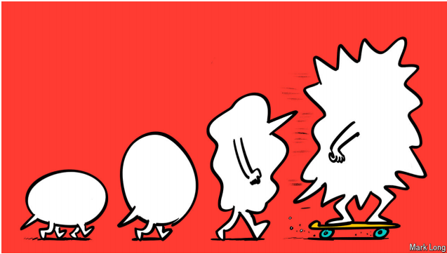

# TikTok is changing how Gen Z speaks

On social media new words spread far and fast

原文：

**T**HE WORD “demure” is old—it describes the sort of modest lady

Victorians esteemed—but it is freshly fashionable. There are some

800,000 posts on TikTok with the tag #demure. Youngsters today

are using the word with lashings of irony, invoking it to describe

everything from Saturn to sunset to New York City’s bin service.

“端庄”这个词由来已久——它描述的是维多利亚时代受人尊敬的那种端庄淑女——但现在却很流行。TikTok上有大约80万个标签为#端庄的帖子。今天的年轻人用这个词来讽刺，用它来描述从土星到日落，再到纽约市的垃圾箱服务。

学习：

demure：英 [dɪˈmjʊə] 端庄的；娴静的；

esteemed：受人尊敬的

fashionable：流行的

lashings：大量；许多

Saturn：土星；

原文：

TikTok is changing how young people talk. Other fusty words,

such as “coquette”, are fashionable again. Colloquialisms are on

the rise: members of Gen Z say “yapping” instead of “talking” and

trim “delusional” to “delulu”. New words have also become

popular. Take “skibidi”, a term popularised by a meme of an

animated head singing in a toilet; it means “cool”, “bad” or “very”,

depending on the context.

TikTok正在改变年轻人的谈话方式。其他过时的词，如“卖弄风情”，又开始流行了。口头语正在兴起:Z世代的成员说“yapping”而不是“talking ”,并将“妄想”精简为“delulu”。新词也变得流行起来。以“斯基比迪”为例，这个词因一个在厕所唱歌的动画头像的表情包而流行起来；它的意思是“酷”、“坏”或“非常”，取决于上下文。

学习：

fusty：发霉的；陈腐的；过时的

coquette： 美 [koʊˈkɛt] 卖弄风情的女子；风骚女子

colloquialisms： 美 [kəˈləukwiəliz(ə)mz] 日常交谈用语；非正式用语；白话；（colloquialism的复数）

原文：

On social media words spread far and fast. Each year at least 100

English words are produced or given new meaning on TikTok,

reckons Tony Thorne, director of the Slang and New Language

Archive at King’s College London. Some linguists think the

platform is changing not just what youngsters are saying, but how

they are saying it. A “TikTok accent”, which includes “uptalk”, an

intonation that rises at the end of sentences, may be spreading.

在社交媒体上，文字传播得又远又快。伦敦大学国王学院俚语和新语言档案馆馆长托尼·索恩估计，每年至少有100个英语单词在TikTok产生或被赋予新的含义。一些语言学家认为这个平台不仅改变了年轻人说的话，也改变了他们说的方式。一种“TikTok口音”，包括“升调”，一种在句末升高的语调，可能正在传播。

学习：

intonation：语调

uptalk：语调上扬；上扬语调；尾音上扬；

原文：

The platform’s versatility encourages experimentation. Users can

combine audio, text and video in a single post. That means words

that sound especially satisfying can go viral, as well as those that

are memorable in written form. Linguistic code has emerged,

dubbed “algospeak”, to dodge content-moderation algorithms. It

includes euphemisms (sex workers are called “accountants”), and

misspellings (“seggs” instead of sex).

该平台的多功能性鼓励实验。用户可以在一篇文章中结合音频、文本和视频。这意味着那些听起来特别令人满意的词可以像病毒一样传播，那些令人难忘的书面形式也是如此。被称为“algospeak”的语言代码已经出现，以避开内容审核算法。它包括委婉语(性工作者被称为“会计”)，以及拼写错误(seggs而不是seg)。

学习：

dodge：避免

content-moderation：内容审查

原文：

The mutation of language on TikTok is also due, in large part, to

the age of its users. Most are 18-34 years old. That matters because

“Young people are language innovators,” says Christian Ilbury, a

sociolinguist at the University of Edinburgh. For decades

youngsters have created words to distinguish themselves from

adults. On social media such neologisms find a big audience. Mr

Ilbury describes this as “linguistic identity work”; parents have

long called it attention-seeking.

TikTok上语言的变异在很大程度上也是由于使用者的年龄。大部分是18-34岁。爱丁堡大学的社会语言学家克里斯蒂安·伊尔伯里说，这很重要，因为“年轻人是语言创新者”。几十年来，年轻人创造了词汇来区别于成年人。在社交媒体上，这类新词拥有大量受众。伊尔伯里先生将此描述为“语言身份工作”；家长们一直称之为寻求关注。

学习：

neologism：美 [niˈɑləˌdʒɪzəm]  新词

原文：

The platform brings together fan groups and communities, from

\#kpopfans (people who like Korean pop music) to #booktokers

(people who love reading). These groups create their own slang,

says Adam Aleksic, a linguist and influencer. Some of it leaks into

the mainstream. Other slang comes from specific groups: black

people have innovated and spread hundreds of English words over

the years, from “cool” to “tea” (gossip). Journalists and

screenwriters popularise such words; now TikTokers do, too.

平台汇集了粉丝群体和社群，从#kpopfans(喜欢韩国流行音乐的人)到#booktokers(热爱阅读的人)。语言学家和网红亚当·阿列克西奇说，这些群体创造了他们自己的俚语。其中一些泄漏到主流中。其他俚语来自特定群体:多年来，黑人创新并传播了数百个英语单词，从“酷”到“茶”(八卦)。记者和编剧普及这样的词；现在TikTokers也这么做了。

原文：

All this speeds up the evolution of language. That delights

logophiles but befuddles dictionary-makers, who must keep a

record of the ever-expanding lexicon. The Oxford English

Dictionary (OED), Britain’s most illustrious chronicler of language,

adds a word only after it has been used for about five years. That is

too slow to keep up with modern parlance. The OED is just now

adding words such as “binge-worthy”, which already feels tired; its

own “word of the year” for 2023, “rizz” (charm), which originated

and was popularised online, has not yet made the cut. TikTok has

just the phrase to describe such a modest approach: very demure. ■

所有这些都加速了语言的进化。这让语标爱好者感到高兴，却让词典编纂者感到困惑，他们必须记录不断扩大的词汇。英国最杰出的语言编年史编纂者,《牛津英语词典》( OED)只在一个词被使用了大约五年后才添加它。这太慢了，跟不上现代的说法。《牛津英语词典》刚刚增加了诸如“值得狂欢”这样的词，这个词已经让人感到厌倦了；它自己的2023年“年度词汇”rizz(魅力)，源于并在网上流行，尚未入围。TikTok用一个词来形容这种谦逊的态度:非常端庄。■

学习：

logophile：美 [ˈlɔɡəfaɪl]  热爱词语的人；词语爱好者

befuddles：使糊涂；使迷惑不解；（befuddle的第三人称单数）

lexicon:词汇表；词库；词典

parlance: 用语；说法；措辞

## 后记

2024年10月25日20点24分于上海。

