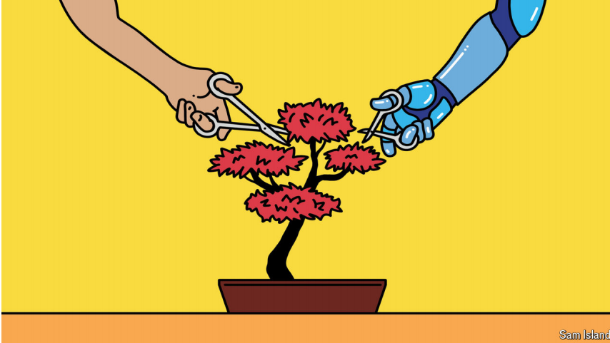

# Japan is remarkably open to AI, but slow to make use of it

The land of Doraemon embraces the new technology in theory but not in practice

*Doraemon*： 美 [ˈdɔraˈemɒn]  哆啦A梦；机器猫

原文：

**W**HICH CULTURAL icons come to mind when an American

thinks of artificial intelligence (AI)? The cyborgs of the

“Terminator” film series, or Hal of Stanley Kubrick’s “2001: A

Space Odyssey”—rogue computer systems that rise up to destroy

their human creators. What does a Japanese person recall?

Doraemon, the friendly robot helper of an enormously popular

eponymous anime series. So goes an anecdote making the rounds

in Japanese tech circles. It suggests that Japan is a land of

opportunity when it comes to AI.

当一个美国人想到人工智能(AI)时，脑海中会浮现出哪些文化图标？“终结者”系列电影中的电子人，或者斯坦利·库布里克“2001:太空漫游”中的哈尔——流氓计算机系统起来摧毁他们的人类创造者。一个日本人回忆起什么？哆啦a梦，一个非常受欢迎的同名动漫系列的友好机器人助手。日本科技圈流传着一则轶事。这表明，就人工智能而言，日本是一片充满机遇的土地。

学习：

cyborgs： 美 [ˈsaibɔ:ɡz] 半机械人；电子人；（cyborg的复数）

odyssey： 漫长而充满风险的历程；艰苦的跋涉；长途的冒险旅行

rogue： 美 [roʊɡ] 无赖；流氓；恶棍；骗子

eponymous：美 [əˈpɑnəməs] （角色）与作品标题同名的；以…的名字命名的

原文：

The tale is instructive. Japanese do feel relatively little angst about

AI. Only 25% of Japanese say that products and services using it

make them nervous, the lowest share among 32 countries surveyed

this year by Ipsos, a market research firm. On average, 50% of

global respondents feel nervous, and the share rises to 64% in

America. Few Japanese reckon AI will hasten the apocalypse: just

12% of Japanese think that it will make the future worse, the

second-lowest share in a study of 21 countries conducted last year

by the University of Toronto. Fully 36% of Americans fear the AI

future. As Sam Altman, the boss of OpenAI, the maker of

ChatGPT, put it last year while visiting Tokyo, the site of his firm’s

first office in Asia: “There’s a long history of humans and machines

working together here to embrace automation technology.”

这个故事很有教育意义。日本人确实对人工智能感到相对较少的焦虑。只有25%的日本人说使用AI的产品和服务让他们感到紧张，这是市场研究公司益普索今年调查的32个国家中最低的比例。平均而言，50%的全球受访者感到紧张，在美国这一比例上升至64%。很少有日本人认为人工智能会加速世界末日:只有12%的日本人认为它会让未来变得更糟，这是多伦多大学去年对21个国家进行的研究中第二低的比例。整整36%的美国人害怕人工智能的未来。正如ChatGPT的开发者OpenAI的老板萨姆·奥特曼去年在访问他的公司在亚洲的第一个办公室所在地东京时所说:“人类和机器在这里一起拥抱自动化技术已经有很长的历史了。”

学习：

instructive：有教育意义的；富有启发性的；

angst：英 [aŋst] （对形势、事态、生活的）忧虑；焦虑

apocalypse：美 [əˈpɑːkəlɪps] 大灾难；世界末日；世界毁灭； **注意发音**

原文：

Japanese leaders have positioned the country as open for AI

business. With a shrinking, greying population, Japan has little to

fear in terms of job losses and lots to gain in terms of potential

productivity improvements. So far Japan has no comprehensive

legal regulations on AI, and it has allowed tech companies to train

their models on copyrighted content. The ruling Liberal

Democratic Party (LDP) has called for Japan to become “the

world’s most AI-friendly country”. This spring the LDP even

turned to AI to generate a new catchphrase for a political poster

backing then-prime minister Kishida Fumio: “Economic

revitalisation: providing tangible results”. (The results of the

slogan, alas, left much to be desired: Mr Kishida was replaced this

month and the party is battling to maintain its majority in lower-

house elections on October 27th.)

日本领导人将该国定位为对人工智能商业开放。随着人口的减少和老龄化，日本在失业方面没什么可担心的，在潜在生产率提高方面有很多收获。到目前为止，日本没有关于人工智能的全面法律法规，它允许科技公司在有版权的内容上训练他们的模型。执政的自民党呼吁日本成为“世界上对人工智能最友好的国家”。今年春天，自民党甚至求助于AI，为支持时任首相岸田文雄的政治海报设计了一个新口号:“经济振兴:提供切实成果”。(唉，这个口号的结果还有很多不尽如人意之处:岸田文雄本月被替换，该党正努力在10月27日的下议院选举中保持其多数席位。)

学习：

catchphrase：流行语；名言；常用语；

left much to be desired：还有很多不足之处

原文：

Intriguing applications of AI can be found across different sectors

in Japan. Construction companies have used it to improve

efficiency on job sites; tech investors are keen on more such

innovations at the intersection of AI and hardware, where Japanese

firms have traditionally been strong. The city government in

Yokosuka, south of Tokyo, has reported big productivity gains

since implementing ChatGPT to help with administrative tasks; the

Tokyo metropolitan government is using AI to detect fires and

improve disaster-response times. Qudan Rie, last year’s winner of

the Akutagawa Prize, a prestigious award for the best work of

fiction by an up-and-coming author, used ChatGPT to generate

sections of her novel where an AI speaks. Though her revelation

generated some controversy, she was allowed to keep the award.

在日本，人工智能有趣的应用遍及不同领域。建筑公司已经使用它来提高工作现场的效率；科技投资者热衷于人工智能和硬件交叉领域的更多此类创新，日本公司在这方面传统上很强。东京以南的横须贺市政府报告说，自从实施ChatGPT来帮助处理行政任务以来，工作效率有了很大提高；东京都政府正在使用人工智能来检测火灾，并缩短灾难响应时间。芥川奖是一项声望很高的奖项，旨在奖励新锐作家的最佳小说作品，去年的获奖者曲丹·里(Robert Rie)使用ChatGPT生成了她小说中人工智能说话的部分。尽管她的揭露引起了一些争议，但她被允许保留该奖项。

学习：

up-and-coming：有前途的；积极进取的；崭露头角的；前景看好的          

原文：

Yet for all of Japan’s openness towards AI, it is failing to capitalise

on the opportunity. Masayoshi Son, the boss of SoftBank and

Japan’s most famous tech investor, has been warning for years that

his home country has been behind the curve. Earlier this month he

chastised Japanese firms for focusing on small-scale systems,

rather than building ambitious AI giants. None of the “foundation

models”—the algorithms that power generative AI—released

between 2019 and 2023 originated from Japan, according to

Stanford University. (America accounted for the most, with 182.)

Tellingly, the hottest Japan-based AI startup is Sakana AI, which is

led by two non-Japanese alumni of Google’s AI division.

然而，尽管日本对人工智能持开放态度，但它未能利用这个机会。软银总裁、日本最著名的科技投资者孙正义多年来一直警告说，日本已经落后于形势。本月早些时候，他批评日本公司专注于小规模系统，而不是建立雄心勃勃的人工智能巨头。根据斯坦福大学的数据，2019年至2023年发布的“基础模型”(为生成式人工智能提供动力的算法)没有一个来自日本。(美国占比最多，有182个。)很明显，最热门的日本人工智能初创公司是Sakana AI，由谷歌人工智能部门的两名非日本校友领导。

学习：

capitalise on ：利用

capitalise on the opportunity：利用机会

chastise：美 [ˈtʃæsˌtaɪz] 严厉批评

原文：

Japanese institutions remain strikingly risk-averse and slow to

adopt new technology. Using AI on an individual basis is easy, but

“doing something deeper—transforming systems or how

companies work—that’s a different story”, says Matsuo Yutaka,

who chairs the government’s AI council. A government survey

released this summer shows that less than half of Japanese firms

are using generative AI tools, compared with over 80% in America

or China. Among the small and medium-sized enterprises that

make up the vast majority of Japanese companies, the situation

may be even worse: less than 20% of Japanese SMEs are utilising

generative AI, according to a recent survey by Teikoku Databank, a

research firm in Tokyo. When it comes to AI, Japan does have

something to fear: being left behind.■

日本机构仍然非常厌恶风险，并且在采用新技术方面行动迟缓。在个人基础上使用人工智能很容易，但“做一些更深层次的事情——转变系统或公司如何运作——那是一个不同的故事”，政府人工智能委员会主席Matsuo Yutaka说。今年夏天公布的一项政府调查显示，不到一半的日本公司使用生成式人工智能工具，相比之下，美国和中国的这一比例超过80%。在占日本公司绝大多数的中小企业中，情况可能更糟:根据东京研究公司Teikoku Databank最近的一项调查，不到20%的日本中小企业在使用生成式人工智能。当谈到人工智能时，日本确实有一些害怕的东西:被落在后面。■

## 后记

2024年10月27日15点07分于上海。

