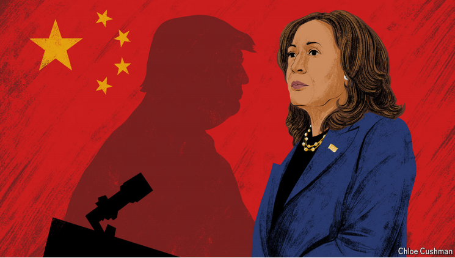

# Ambiguity or madness? Where Harris and Trump stand on China

The vice-president makes no promise to defend Taiwan; her rival boasts of being crazy

原文：

**T**HROUGHOUT HER campaign, Kamala Harris has hewed to the

foreign policy of President Joe Biden. But there is a little daylight

between the two in at least one important area: America’s relations

with China. To judge by her limited remarks on the topic, Ms

Harris seems less hawkish than her boss. She is reluctant to treat

China as an actual or potential enemy and, if elected, hopes to

maintain a dialogue with its leader, Xi Jinping. Unlike her rival,

Donald Trump, she is not interested in a trade war. This impression

was reinforced by a senior adviser who told *The Economist*:

“Conflict is not imminent. Our job is to ensure that it is not

imminent.”

在整个竞选过程中，卡玛拉·哈里斯一直坚持乔·拜登总统的外交政策。但是至少在一个重要的领域，他们俩之间还是有一丝差别的:中美关系。从哈里斯女士对这个话题的有限评论来看，她似乎没有她的老板那么强硬。她不愿将中国视为实际或潜在的敌人，如果当选，她希望与中国领导人保持对话。与她的对手唐纳德·特朗普不同，她对贸易战不感兴趣。一位高级顾问告诉《经济学人》:“冲突不会迫在眉睫。我们的工作是确保它不会迫在眉睫。”

学习：

hew to：恪守；坚持

原文：

The clearest evidence of this posture is over Taiwan, a democratic,

self-governing island with which China has vowed to “reunify”, by

force if necessary. Mr Biden said four times during his presidency

that America would defend Taiwan if China tried to invade it. But

when Ms Harris was asked a question about this in an interview

with CBS News this month, she did not repeat her boss’s pledge:

“I’m not going to get into hypotheticals.”

这种姿态最明显的证据是在台湾问题上，台湾是一个民主自治的岛屿，中国誓言要与之“统一”，如有必要将动用武力。拜登先生在其总统任期内曾四次表示，如果中国试图入侵台湾，美国将保护台湾。但是，当哈里斯女士在本月接受CBS新闻采访时被问到这个问题时，她没有重复她老板的承诺:“我不会进入假设。”

学习：

reunify：重新统一；再次合并；使再融合；恢复统一

原文：

Ms Harris is deliberately reverting to the pre-Biden policy of

“strategic ambiguity”, in which America will not say whether it

might intervene in a conflict between the mainland and Taiwan. At

a time of growing military tension across the Taiwan Strait, when

every utterance is parsed for meaning, this is a striking change. It

also stands in contrast to comments by Mr Trump, who has gone

for an entirely different sort of ambiguity—at times implying that

Taiwan is not worth defending, at others suggesting he would

threaten Mr Xi with punitive tariffs to deter an invasion. Would he

threaten to use military force? “I wouldn’t have to, because he

respects me and he knows I’m fucking crazy,” Mr Trump told the

*Wall Street Journal*.

哈里斯女士有意回到拜登之前的“战略模糊”政策，即美国不会说是否会干预大陆和台湾之间的冲突。在台湾海峡两岸军事紧张局势日益加剧的时候，当每一句话都被解析为意义时，这是一个惊人的变化。这也与特朗普的言论形成了鲜明对比。特朗普采取了一种完全不同的模糊方式——有时暗示台湾不值得捍卫，有时暗示他会用惩罚性关税威胁大陆。他会威胁使用武力吗？“我没有必要，因为他尊重我，他知道我他妈的疯了，”特朗普告诉《华尔街日报》。

原文：

In the non-crazy world, strategic ambiguity is woven into the

Taiwan Relations Act, a law passed in 1979 after America switched

diplomatic recognition from the Nationalists in Taiwan to the

Communists on the mainland. It commits America to supply

weapons for Taiwan to defend itself, which Ms Harris has vowed to

do; and to maintain its own power “to resist any resort to force or

other forms of coercion”. Ms Harris’s non-committal position is

“consistent with the Taiwan Relations Act”, says her aide. By

implication it is Mr Biden who strayed from the norm. The vice

president may want to reassure Mr Xi that America is not pushing

for war. The danger is that he may take it as a weakening of

America’s resolve.

在非疯狂的世界里，战略模糊性被编织到《台湾关系法》中，该法于1979年通过，当时美国将外交承认从台湾的国民党转向大陆的共产主义者。它承诺美国为台湾提供武器来保卫自己，这是哈里斯女士已经发誓要做的；并保持其“抵制任何诉诸武力或其他形式的胁迫”的权力。哈里斯女士的助手说，她不明确的立场“符合台湾关系法”。言下之意是拜登先生偏离了常规。副总统可能想让Xi先生放心，美国不会推动战争。危险在于，他可能会认为这削弱了美国的决心。

学习：

coercion：美 [koʊˈɜːrʒn] 强迫；威压；强制

con-committal：不明确的；不表态的；避免表明立场的

原文：

Ms Harris offered another intriguing clue in her interview with

CBS News. Asked which country was America’s greatest

adversary, she pointed to Iran, which she said had “American blood

on their hands”. Most politicians in Washington probably would

have named China. Mr Biden’s national-security strategy identifies

the country as “the only competitor with both the intent to reshape

the international order and, increasingly, the economic, diplomatic,

military, and technological power to do it.”

哈里斯女士在接受CBS新闻采访时提供了另一个有趣的线索。当被问及哪个国家是美国最大的对手时，她指向了伊朗，她说伊朗“双手沾满了美国人的鲜血”。华盛顿的大多数政客可能会提到中国。拜登的国家安全战略将中国定位为“唯一一个既有重塑国际秩序的意图，也越来越有重塑国际秩序的经济、外交、军事和技术实力的竞争者。”

原文：

Perhaps Ms Harris had Iran front of mind because it had just fired

more than 180 ballistic missiles at Israel. Her adviser insists the

vice-president is “clear-eyed” about China, pointing to her

comments at the Democratic National Convention, when she

vowed to ensure “that America, not China, wins the competition for

the 21st century; and that we strengthen, not abdicate, our global

leadership”. Moreover, much of her foreign-policy experience as

vice-president has been in dealing with Asian allies alarmed by

China’s bellicosity.

也许哈里斯女士首先想到的是伊朗，因为它刚刚向以色列发射了180多枚弹道导弹。她的顾问坚持认为副总统对中国“很清楚”,指出她在民主党全国代表大会上的评论，当时她发誓要确保“美国，而不是中国，赢得21世纪的竞争；我们要加强而不是放弃我们的全球领导地位”。此外，作为副总统，她在外交政策方面的大部分经验都是与对中国的好战性感到担忧的亚洲盟友打交道。

学习：

clear-eyed：目光敏锐的；头脑清醒的；有洞察力的

abdicate：放弃（权力、责任、职责）；弃权

alarmed：惊恐的；忧虑的          

bellicosity：美 [ˌbelɪ'kɒsətɪ] 好战

原文：

Though her comments and those of her entourage mostly align with

current policy, the tone feels softer than Mr Biden’s or Mr Trump’s.

Ms Harris may talk of competition, but not of deterrence. She has

said: “We must be able to compete and win. We should not seek

conflict.” She emphasises the need for open lines of

communication. The only warning to China is that, as her aide puts

it, “there will be real economic consequences” if it invades Taiwan.

尽管她和她的随行人员的评论大多与当前政策保持一致，但语气感觉比拜登或特朗普更温和。哈里斯女士可能会谈论竞争，但不会谈论威慑。她说:“我们必须能够竞争并获胜。我们不应该寻求冲突。”她强调了开放沟通渠道的必要性。对中国的唯一警告是，正如她的助手所说，如果它入侵台湾，“将会有真正的经济后果”。

学习：

entourage：美 [ˌɑntʊˈrɑʒ] 随行人员；随从；随员

原文：

Ms Harris is admittedly in a bind, struggling to emerge from the

shadow of the president she still serves. Policy differences either

seem disloyal or invite accusations of flip-flopping. Nor does Ms

Harris want to be outflanked by Mr Trump, whom she has accused

of being meek towards Mr Xi. Her entourage says she fully

embraces Mr Biden’s “responsibly managed competition” with

China. On the competition side of the ledger this involves industrial

policy at home, restrictions on high-tech exports to China and

strengthening alliances in Asia. On the responsible management

side it features co-operation with China on restricting fentanyl

smuggling, dialogue on artificial intelligence, contacts with

Chinese leaders and revived communication between military

commanders.

不可否认，哈里斯女士陷入了困境，挣扎着从她仍然服务的总统的阴影中走出来。政策分歧要么看起来不忠诚，要么招致摇摆不定的指责。哈里斯也不希望被特朗普击败，她曾指责特朗普对Xi过于温和。她的随行人员表示，她完全支持拜登与中国的“负责任的竞争”。在竞争方面，这涉及国内的产业政策、对中国高科技出口的限制以及加强亚洲联盟。在负责任的管理方面，它的特点是与中国在限制芬太尼走私方面的合作、人工智能方面的对话、与中国领导人的接触以及军事指挥官之间恢复沟通。

学习：

admittedly：诚然；无可否认地；

in a bind：陷于困境, 进退维谷          

flip-flopping：摇摆不定

disloyal：不忠诚的；不忠实的

accusations：指控；控告；谴责；（accusation的复数）

outflanked：挫败；智胜；（outflank的过去式和过去分词）          

meek：温顺的；谦恭的；顺从的；懦弱的；

原文：

The acute tension between the two powers, which led to dangerous

encounters at sea and in the air, has abated since a Biden-Xi

summit in November 2023. But the cordiality may not last given

the wars raging in Ukraine and the Middle East, and the fact that

China is working ever more closely with Russia, Iran and North

Korea in an “axis of autocracy”. In July a bipartisan commission on

America’s national-security strategy, mandated by Congress,

sounded a warning that America faces “the most serious and most

challenging” threats since 1945, including “the potential for near-

term major war”.

自2023年11月拜登-Xi峰会以来，这两个大国之间导致海上和空中危险相遇的紧张局势已经缓解。但鉴于乌克兰和中东的战火，以及中国与“专制轴心”中的俄罗斯、伊朗和朝鲜的合作日益密切，这种友好关系可能不会持续太久。7月，由国会授权的美国国家安全战略两党委员会发出警告，美国面临着自1945年以来“最严重和最具挑战性”的威胁，包括“近期爆发重大战争的可能性”。

学习：

abated：减少；减轻；（abate的过去式和过去分词）

cordiality：友好关系

rage in：肆虐

near-term：近期的；短期的；不久的；

原文：

Ms Harris’s camp appears not to share such dread, and shows no

sign of heeding the commission’s call for much higher defence

spending. As for the axis of autocrats, “the more they co-operate

with each other, the more we can rally allies to our side,” her aide

says. If elected, Ms Harris’s China policy will depend on the world

she finds and the people she appoints. Mr Biden, with a lifetime’s

expertise on foreign affairs, surprised many people by how tough

he turned out to be on China.

哈里斯女士的阵营似乎没有这种担心，而且没有迹象表明会注意到委员会要求更高国防开支的呼吁。至于独裁者轴心，“他们彼此合作得越多，我们就越能团结盟友支持我们，”她的助手说。如果当选，哈里斯女士的中国政策将取决于她发现的世界和她任命的人。拜登在外交事务上有着毕生的专业知识，他对中国的强硬态度让许多人感到惊讶。

学习：

dread：害怕；恐惧；担忧

原文：

Jude Blanchette of the Centre for Strategic and International

Studies in Washington says some in the Democratic Party think Mr

Biden went too far, and want a softer line. Indeed, some Democrats

see China as the most biddable member of the axis of autocracy. It

wants some form of world order and co-operates with America in

certain areas. Besides, adds Ivan Kanapathy, a former White House

official under Mr Trump, “if you have two wars going on your

watch, and you’re not going to raise defence spending, you have to

turn down the heat in the Pacific.” ■

华盛顿战略与国际研究中心的Jude Blanchette说，民主党内的一些人认为拜登先生走得太远了，希望采取更温和的路线。事实上，一些民主人士认为中国是专制轴心中最顺从的成员。它想要某种形式的世界秩序，并在某些领域与美国合作。此外，特朗普手下的前白宫官员伊万·卡纳帕希(Ivan Kanapathy)补充道，“如果你的任期内有两场战争，而且你不打算增加国防支出，你就必须降低太平洋的热度。”■

学习：

biddable：听话的；顺从的；易管教的；温顺的

## 后记

2024年10月27日15点46分于上海。

