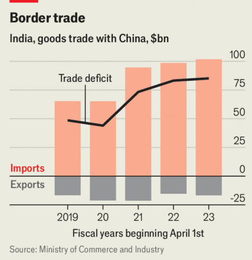
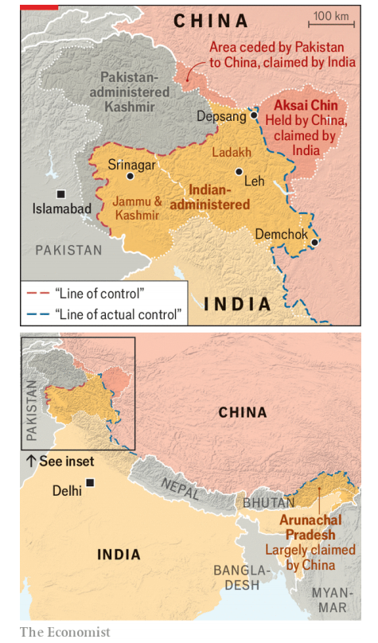

# Narendra Modi and Xi Jinping meet and resolve a border row

row：争吵；争论；争端

resolve a row：解决争端

The meeting in Russia signals a new era of closer ties

原文：

**A** FATAL BORDER clash between India and China in 2020 did not

just open a four-year fissure in bilateral ties: it triggered a tectonic

shift in Asia’s geopolitics. In its aftermath, the two countries each

sent tens of thousands of troops to their disputed Himalayan

frontier, backed by artillery, missiles and fighter jets. China

expanded military aid to Pakistan, India’s rival to the west. India,

meanwhile, restricted Chinese investment and deepened defence

ties with America and its allies. They, in turn, came to see India as

a key partner in containing China.

2020年印度和中国之间的致命边境冲突不仅开启了双边关系长达四年的裂缝:还引发了亚洲地缘政治的结构性转变。随后，两国各自向有争议的喜马拉雅边境派遣了数万军队，并配备了大炮、导弹和战斗机。中国扩大了对印度在西方的竞争对手巴基斯坦的军事援助。与此同时，印度限制了中国的投资，并加深了与美国及其盟友的防务关系。反过来，他们开始将印度视为遏制中国的重要伙伴。

学习：

clash：冲突

fissure： 美 [ˈfɪʃər] 裂缝；裂隙；裂纹；

tectonic：美 [tɛkˈtɑnɪk] 结构上的；建筑学的；影响深远的；重大的；显著的

aftermath：（战争、事故、不快事情的）后果；结果

artillery：美 [ɑːrˈtɪləri] 火炮；炮兵；炮兵部队；

fighter jets：战斗机

containing China：遏制中国

原文：

A détente which could shake up regional geopolitics again is now

under way. On October 21st Indian authorities said they had

reached an agreement with China on patrolling rights that resolved

the border standoff. The next day, China’s foreign ministry

confirmed that a deal had been reached. Then, on October 23rd,

India’s prime minister, Narendra Modi, met China’s president, Xi

Jinping, on the sidelines of the BRICS summit in Russia. It was

their first official bilateral meeting since 2019.

一场可能再次动摇地区地缘政治的缓和正在上演。10月21日，印度当局表示，他们已经与中国就巡逻权达成协议，解决了边境僵局。第二天，中国外交部证实已经达成协议。接着，10月23日，印度总理纳伦德拉·莫迪在俄罗斯金砖国家峰会间隙会见了中国国家主席。这是他们自2019年以来的首次正式双边会议。

学习：

detente：英 [deɪˈtɑːnt] 缓和；缓解；缓和政策；紧张关系的缓和

reached an agreement：达成协议

patrolling：美 [pəˈtroʊlɪŋ] 巡查；巡逻

standoff：僵局；僵持不下

sideline：次要活动

原文：

Details of the border deal have yet to be made public. Much will

depend on how it is implemented in the coming weeks. Even so,

the diplomatic breakthrough heralds a new phase of bilateral ties

that prioritises economic co-operation. That is partly because Mr

Xi, concerned by a slowing Chinese economy and trade barriers

abroad, wants better access to India’s market. But Mr Modi also

needs more Chinese technology, investment and expertise to

achieve his manufacturing goals and repair the damage from a

surprise setback in this year’s general election. Despite the border

crisis, China edged past America to reclaim its position as India’s

top trading partner in the 2023-24 financial year.

边境协议的细节尚未公开。这在很大程度上取决于未来几周如何实施。即便如此，这一外交突破预示着双边关系进入了一个以经济合作为优先的新阶段。部分原因是Xi担心中国经济放缓和海外贸易壁垒，希望更好地进入印度市场。但莫迪也需要更多的中国技术、投资和专业知识来实现他的制造业目标，并修复今年大选中意外挫折造成的损害。尽管存在边境危机，但在2023-24财年，中国仍超过美国，夺回了印度最大贸易伙伴的地位。

学习：

heralds：传达；预告；（herald的第三人称单数）

edge past: 以微弱优势超越或超过某人或某物

>“Edge”的含义  
>在这段话中，“edge past”是一个短语，意思是以微弱优势超越或超过某人或某物，通常暗示着竞争或比较。
>
>例句：
>1. In the final moments of the game, the team managed to edge past their rivals to secure a victory.
>   （在比赛的最后时刻，球队设法以微弱优势战胜了对手，确保了胜利。）
>
>2. After months of intense competition, the startup edged past its competitors to become the market leader.
>   （经过几个月的激烈竞争，这家初创公司以微弱优势超越了竞争对手，成为市场领导者。）
>
>在本文中的意思：
>“China edged past America to reclaim its position as India’s top trading partner”意思是：中国在与美国的竞争中，以微弱优势重新夺回了与印度的主要贸易伙伴地位。
>
>总结  
>这个短语强调了中国在与美国的竞争中微妙的胜利，显示出中印之间经济合作的潜力，即使在边境危机的背景下，仍然能够在贸易上占据上风。

原文：

The timing is opportune for the Indian and Chinese leaders as well,

coming just a fortnight before America’s presidential election. For

Mr Xi, it signals to the next American president that efforts to

isolate China economically, and to build a coalition of like-minded

democracies, are not working. And though Mr Modi is likely to

deepen ties with America whoever wins the White House, a

simultaneous rapprochement with China underlines India’s

commitment to a “multi-aligned” foreign policy that encompasses

close ties with Russia too. Mr Modi made this clear when he met

Vladimir Putin on October 22nd.

对印度和中国领导人来说，这个时机也很合适，因为距离美国总统大选只有两周时间。对Xi来说，这向下一任美国总统发出了信号，即在经济上孤立中国、建立志同道合的民主国家联盟的努力是行不通的。尽管无论谁入主白宫，莫迪都有可能加深与美国的关系，但同时与中国修好突显了印度对“多结盟”外交政策的承诺，这一政策也包括与俄罗斯的密切关系。莫迪先生在10月22日会见弗拉基米尔·普京时明确了这一点。

学习：

opportune：美 [ˌɑpərˈt(j)un] 适时的；恰当的；及时的

like-minded：志同道合的；志趣相投的；想法相同的

rapprochement：和解；关系改善

原文：

It is also a useful hedge for Mr Modi. If Kamala Harris wins, it

could help offset American pressure on India over issues including

human rights, exports of restricted technology to Russia and Indian

officials’ alleged involvement in an assassination attempt on a Sikh

activist in America. If Donald Trump prevails, it might mitigate the

impact of potential trade tariffs on India or an American pivot

towards China.

对莫迪来说，这也是一个有用的对冲。如果卡玛拉·哈里斯获胜，它可能有助于抵消美国在人权、向俄罗斯出口受限技术以及印度官员涉嫌参与暗杀美国一名锡克教活动人士等问题上对印度施加的压力。如果唐纳德·特朗普(Donald Trump)获胜，可能会减轻对印度的潜在贸易关税或美国转向中国的影响。

原文：

The border agreement between India and China does not resolve

their underlying dispute, which stems from the blurry boundaries

sketched by the British when they ruled the Indian subcontinent.

China still claims the Indian state of Arunachal Pradesh. India

claims Aksai Chin, an area controlled by China (see map). But the

deal could help avert the kind of military encounters that grew

more frequent and violent as each side piled up frontier

infrastructure in the years preceding the clash in 2020. That

skirmish, in which 20 Indian soldiers and at least four Chinese ones

died, was the first fatal one on the border in more than four

decades.

印度和中国之间的边界协议并没有解决它们潜在的争端，这一争端源于英国统治印度次大陆时划定的模糊边界。中国仍然声称对印度的阿鲁纳恰尔邦拥有主权。印度宣称对中国控制的阿克赛钦地区拥有主权(见地图)。但该协议可能有助于避免那种越来越频繁和暴力的军事冲突，因为双方在2020年冲突前的几年里都在堆积边境基础设施。那次冲突导致20名印度士兵和至少4名中国士兵死亡，是40多年来两国边境上的首次致命冲突。

学习：

skirmish：小冲突；小规模战斗；零星冲突；

原文：

The two sides’ military commanders and civilian officials have

since held regular talks to avoid further violence. By September

2022, they had reduced tensions by establishing “buffer zones”,

within which neither side patrols, at five of seven major

flashpoints. But over the past two years they have struggled to find

a solution at the last two flashpoints, Demchok and Depsang

Plains, which both consider to be more strategically significant.

双方的军事指挥官和文职官员已经举行了定期会谈，以避免进一步的暴力。到2022年9月，他们在7个主要热点中的5个建立了“缓冲区”，双方都不在缓冲区内巡逻，从而缓解了紧张局势。但在过去的两年里，他们一直在努力寻找最后两个热点地区的解决方案，登乔克和德普桑平原，这两个地区都被认为具有更重要的战略意义。

学习：

flashpoints：（政治动乱地区的）燃点；导火线；（flashpoint的复数）          

## **Easing off**

原文：

Indian officials suggest the new agreement will allow India and

China to patrol as they did before, rather than extending the buffer

zones to the two remaining areas. “We have gone back to where the

situation was in 2020,” India’s foreign minister, Subrahmanyam

Jaishankar, told a conference on October 21st. He added that the

“disengagement process with China” was complete, suggesting that

troops who had been blocking each other’s patrols in Demchok and

Depsang were no longer doing so.

印度官员表示，新协议将允许印度和中国像以前一样巡逻，而不是将缓冲区扩大到剩下的两个地区。“我们已经回到了2020年的状况，”印度外交部长Subrahmanyam Jaishankar在10月21日的一次会议上说。他补充称，“与中国的脱离接触进程”已经完成，这表明在登乔克和德普桑互相阻挠对方巡逻的军队不再这样做了。

原文：

General Upendra Dwivedi, India’s army chief, was more cautious.

He said the goal was to “restore trust”, including by checking that

neither side was creeping into the buffer zones. India would then

look at “disengagement, de-escalation and normal management” of

the border. The Chinese foreign ministry spokesman who

confirmed the deal did not provide more details, adding only that

China would work with India to implement the agreement.

印度陆军总司令乌彭德拉·德维韦迪将军更加谨慎。他说，目标是“恢复信任”，包括通过检查任何一方都没有潜入缓冲区。然后，印度将着眼于边界的“脱离接触、降级和正常管理”。证实该协议的中国外交部发言人没有提供更多细节，只是补充说，中国将与印度合作执行该协议。

学习：

creep：悄悄移动；缓慢地行进

creep into：悄悄混进

原文：

Some Indian media reports said that the two sides had each agreed

to patrol twice a month at different times, according to an agreed

schedule and with a maximum of 15 troops per patrol. Previously,

there was no agreed schedule or size for patrols. Other reports

suggested that the agreement would apply only to Demchok and

Depsang, while buffer zones would remain in place at the other

flashpoints.

一些印度媒体报道称，双方同意根据商定的时间表，每月在不同时间巡逻两次，每次巡逻最多15名士兵。以前，没有商定的巡逻时间表或规模。其他报道称，该协议将仅适用于登乔克和德普桑，而缓冲区将在其他热点地区保留。

原文：

Deependra Singh Hooda, a former chief of the Indian Army’s

Northern Command, which oversees part of the Chinese border,

suspects that the latter is true. He thinks that India would have

insisted on patrolling at Depsang in particular because the area,

which is largely flat, is too big to monitor remotely and too

important as a conduit for a large-scale offensive. “My own sense

is we’re not getting back exactly to the status quo pre-2020,” he

says. “But I think this is the closest we can get to it.”

印度陆军北方司令部的前长官迪彭德拉·辛格·胡达(Deependra Singh Hooda)怀疑后者是真的，该司令部负责监管部分中国边境。他认为，印度会特别坚持在德普桑巡逻，因为该地区大部分是平坦的，太大了，无法远程监控，而且作为大规模进攻的通道太重要了。“我自己的感觉是，我们不会完全回到2020年前的现状，”他说。“但我认为这是我们最接近的结果了。”

原文：

Neither side is likely to withdraw all the firepower they recently

moved to the wider border area. Nor will they stop modernising

their armed forces to prepare for future clashes. For India, that

means sticking to a path of closer military ties with Western

partners. China and India will also still compete for influence in

South Asia. And a fresh border flare-up could easily trigger another

crisis.

双方都不太可能撤回他们最近转移到更广泛的边境地区的所有火力。他们也不会停止武装部队的现代化，为未来的冲突做准备。对印度来说，这意味着坚持与西方伙伴建立更紧密的军事关系。中国和印度仍将争夺在南亚的影响力。新的边境冲突很容易引发另一场危机。

学习：

firepower：火力；火力威力；

flare-up：爆发；突发；复发

原文：

The big question now is whether diplomatic reconciliation could

turn into a prolonged period of economic integration between

Asia’s giants. If that were to occur, it would indeed be a landmark

of Himalayan significance. ■

现在最大的问题是外交和解是否会变成亚洲巨人之间的长期经济整合。如果这真的发生了，那将是一个具有喜马拉雅意义的里程碑。■

学习：

reconciliation：美 [ˌrekənsɪliˈeɪʃn] 和解；和谐一致；调解

## 后记

2024年10月27日16点30分于上海。

