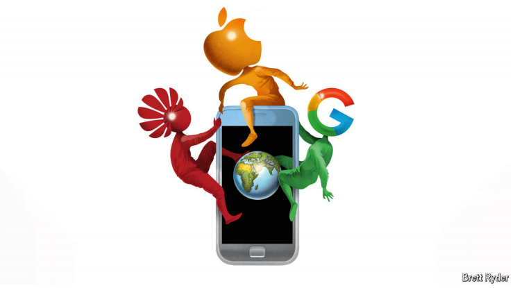

# Can Google or Huawei stymie Apple’s march towards $4trn?

The contest for global smartphone dominance gets interesting

原文：

**T**O CALL APPLE a corporate behemoth is to be uncharitable. It is

much bigger than that. On many financial measures it makes more

sense to compare the iPhone-maker not with other companies but

with stockmarket indices—and not some obscure ones, either.

Exclude financial firms and India’s Nifty 50 sit on less cash. When

Apple reports its annual results on October 31st analysts reckon its

net profit will be just below what Germany’s DAX blue chips raked

in last year. On October 21st its market capitalisation nudged

$3.6trn, more than Hong Kong’s Hang Seng.

称苹果为企业巨兽是不公平的。它比那个大得多。在许多财务指标上，更有意义的是，不要将iPhone制造商与其他公司进行比较，而是与股票市场指数进行比较——也不要与一些不知名的指数进行比较。排除金融公司和India’s Nifty 50的坐拥更少的现金。当苹果公司在10月31日报告其年度业绩时，分析师估计其净利润将略低于德国DAX蓝筹股去年的盈利。10月21日，其市值接近3.6万亿美元，超过香港恒生指数。

学习：

behemoth：美 [bəˈhiməθ] 巨型企业；巨头；庞然大物；

uncharitable：苛刻的；不宽容的；

nudged：推进；（nudge的过去式）；轻推          

>Exclude financial firms and India’s Nifty 50 sit on less cash. 
>
>这句话的意思是，如果不考虑金融公司，那么印度的Nifty 50指数中其他公司所持有的现金数量相对较少。换句话说，Nifty 50指数的企业在现金储备上不如苹果公司那样丰厚。
>
>这里的“Exclude financial firms”意指将金融行业的公司排除在外，因为金融公司通常拥有较高的流动性和现金储备。因此，在比较时，考虑其他行业的公司会使得苹果的财务状况显得更为突出。 
>
>整体来看，这句话强调了苹果在财务上的强大和卓越，特别是在与其他行业的公司进行比较时。

原文：

Rivals in Apple’s core smartphone market look puny next to the

colossus of Cupertino. Samsung, a down-on-its-luck South Korean

electronics conglomerate which sells more handsets globally than

any other firm, is worth one-thirteenth as much, despite also

boasting a huge semiconductor business. Xiaomi, a Chinese

challenger whose devices outsold iPhones in August, generates less

than 5% of Apple’s gross profit. The average iPhone sells for $900,

compared with $300 for a Samsung and half that for a Xiaomi.

Google, a Silicon Valley neighbour with a tidy digital-ad operation

and growing hardware ambitions, shifted $5bn-worth of Pixel

phones in 2023—which against a $200bn screen of iPhone sales

looks, well, like a pixel. Competition? What competition?

苹果核心智能手机市场的竞争对手在巨人库比蒂诺面前显得微不足道。三星，一家不走运的韩国电子企业集团，在全球销售的手机比任何其他公司都多，尽管也拥有庞大的半导体业务，其市值却是apple的十三分之一。中国的挑战者小米的设备销量在8月份超过了iPhones，产生不到苹果总利润的5%。iPhone的平均售价为900美元，而三星为300美元，小米为150美元。谷歌是硅谷的邻居，拥有整洁的数字广告业务和不断增长的硬件野心，在2023年转移了价值50亿美元的pixel手机——与2000亿美元的iPhone销售相比，这看起来就像一个像素点一样小。竞争？什么比赛？

学习：

colossus：巨人；巨像；

puny：弱小的；微不足道的；

Cupertino：库比蒂诺（苹果电脑的全球总公司所在地；位于美国旧金山）          

down-on-its-luck：倒霉的

原文：

Going by Wall Street analysts’ targets for Apple’s share price, it

seems nothing can stand in the way of its triumphant march

towards $4trn. Still, the iPhone’s everlasting presence in the

world’s deepest pockets cannot be taken for granted. In many ways,

its position appears less certain than it has been in years.

根据华尔街分析师对苹果股价的目标，似乎没有什么可以阻挡它向4万亿美元的胜利进军。尽管如此，iPhone手机被世界上最有钱的那批人买走的永久存在不能被认为是理所当然的。从许多方面来看，它的地位似乎比过去几年更不确定了。

原文：

The iPhone looks the most unassailable in its home market. Nearly

half of all Americans aged 12 or more own one. And many of those

who do not would like to, given how powerful a marker of status

the Apple logo has become. If you are under the age of 20, “you

either have an iPhone or blame your parents,” sums up Runar

Bjorhovde of Canalys, a research firm.

iPhone在国内市场看起来是最无懈可击的。将近一半12岁以上的美国人拥有一部手机。考虑到苹果标志已经成为多么强大的身份标志，许多不喜欢的人也愿意这么做。如果你不到20岁，“你要么有一部iPhone，要么责怪你的父母，”研究公司科纳仕公司的Runar Bjorhovde总结道。

学习：

unassailable：不可战胜的；无法摧毁的

原文：

A big wrinkle is that America’s smartphone market is shrinking.

Americans bought some 124m new handsets in 2023, according to

Counterpoint, another research firm, down from 174m six years

earlier. Now the strategy of grabbing a bigger slice of a shrinking

American pie may have run its course. Apple’s domestic sales

peaked in 2021, at 77m. Last year it shipped 70m.

一个大问题是美国智能手机市场正在萎缩。根据另一家研究公司Counterpoint的数据，美国人在2023年购买了大约1 . 24亿部新手机，低于六年前的1 . 74亿部。现在，从不断萎缩的美国馅饼中攫取更大一块的策略可能已经走到了尽头。苹果的国内销量在2021年达到7700万部的峰值。去年，该公司出货7000万英镑。

学习：

handsets：手机；（handset的复数）          

run its course：走完自然过程；事情自然结束；完成其周期          

原文：

Samsung has long craved a bite out of Apple’s business. Its latest

high-end phones were early to use Google’s Gemini artificial

intelligence (AI) to enhance search, photo-editing and other tasks.

Gemini, whose co-creator just shared a Nobel prize, slots in neatly

with the Android operating system, also designed by Google and

made available to Samsung and others on an open-source basis. But

not as neatly as it does in Google’s own Pixels, which integrate

Gemini not just with Android but also with its custom-made mobile

chips. Apple has historically relied on a similar fusion of hardware

and its operating system, iOS. But it has largely eschewed AI

model-making and, in a departure from its habitual control-

freakery, has chosen instead to rely on outside help for a critical

technology. Apple Intelligence, an AI assistant which it will begin

rolling out within days courtesy of OpenAI, creator of ChatGPT,

thus risks offering a choppier user experience than Pixels do.

三星一直渴望从苹果的业务中分得一杯羹。其最新的高端手机很早就使用谷歌的Gemini 人工智能(AI)来增强搜索、照片编辑和其他任务。Gemini的共同创造者刚刚分享了诺贝尔奖，它巧妙地与Android操作系统相结合，Android操作系统也是由谷歌设计的，并在开源的基础上提供给三星和其他公司。但不像谷歌自己的Pixels那样整洁，它不仅将Gemini与Android集成，还与定制的移动芯片集成。苹果历来依赖于硬件和操作系统iOS的类似融合。但是它在很大程度上避免了制造模型，并且背离了它习惯性的控制方式，而是选择依靠外部的帮助来获得一项关键的技术。苹果智能(Apple Intelligence)是一款人工智能助手，它将在几天内由ChatGPT的创造者OpenAI推出，因此有可能提供比Pixels 更不稳定的用户体验。

学习：

craved：恳求；渴望；（crave的过去式）          

eschewed：避开；回避；（eschew的过去式）

custom-made：定制的；定做的；量身定制的；

choppy：断断续续的；不连贯的；不稳定的

>**“Control-freakery”** 是一个俚语，指的是一个人或组织对事情过于控制、干预和掌控的倾向。这通常暗示着对细节的极度关注，以及对外部干预的不信任。在这段话中，指的是苹果公司在产品开发和技术方面一贯保持高度的控制和自主性。

>**“Courtesy”** 在这里的意思是“由于”或“感谢于”。它表示苹果即将推出的AI助手（Apple Intelligence）是基于OpenAI的技术，强调OpenAI在这个项目中的关键角色。
>
>整体来看，这段话强调了苹果在AI技术方面的一种策略转变，从以往的高度控制转向依赖外部技术，这可能导致用户体验的波动。

原文：

Apple faces even more trouble in China. Its second-largest market

is likewise in secular decline, but much more fiercely competitive.

No smartphone brand in China exceeds 18% of unit sales. Five

local ones—Oppo, Vivo, Honor, Huawei and Xiaomi—plus Apple

each chalk up at least 14%. On October 22nd the American firm’s

chief executive, Tim Cook, unexpectedly popped up in Beijing for

the second time this year—possibly in an effort to shake up what

Horace Dediu, a veteran Apple-watcher, calls the Chinese market’s

“steady state”.

苹果在中国面临更多的麻烦。它的第二大市场同样在长期下滑，但竞争更加激烈。在中国，没有一个智能手机品牌超过手机销售量的18%。五家本土品牌——Oppo、Vivo、Honor、华为和小米——加上苹果，各占至少14%。10月22日，苹果公司的首席执行官蒂姆·库克今年第二次出人意料地出现在北京——可能是为了动摇资深苹果观察家Horace Dediu所说的中国市场的“稳定状态”。

学习：

secular:长期的；慢速的

chalk up：取得；获得（成功、胜利或比赛得分）；

原文：

If so, Mr Cook had better get jiggling. According to a recent survey

by Canalys, Chinese consumers are keener than Westerners on AI

capabilities, which local rivals have been quick to offer. Apple,

meanwhile, still has no launch date for a Chinese-language Apple

Intelligence. The ultra-high-resolution cameras that Apple shuns

are a selling point for homespun rivals in a selfie-obsessed nation.

So is their Chineseness: patriotic consumption has helped Huawei,

which America has tried to smother with sanctions since 2019,

stage a remarkable comeback. It recently overtook Apple’s

shipments in China for the first time in three years. Chinese

devices, which use a greater portion of cheap but high-quality

Chinese components than iPhones do, offer better value for money,

says Yang Wang of Counterpoint. At a time of sour consumer

sentiment, that matters.

如果是这样，库克先生最好开始行动。根据科纳仕公司最近的一项调查，中国消费者比西方人更热衷于人工智能能力，而本土竞争对手已经迅速提供了这种能力。与此同时，苹果公司仍然没有推出中文版苹果智能的日期。在一个痴迷自拍的国家，苹果回避的超高分辨率相机是其他中国竞争对手的一个卖点。他们的中国性也是如此:爱国消费帮助了华为，自2019年以来，美国一直试图通过制裁扼杀华为，使其东山再起。最近，它在中国的出货量三年来首次超过了苹果。Counterpoint的王洋表示，与iPhones相比，中国设备使用了更多廉价但高质量的中国组件，因此性价比更高。在消费者情绪低落的时候，这很重要。

学习：

jiggle： 轻微地晃动或摇动

>**“Jiggle”** 在这个上下文中是一个动词，通常指轻微地晃动或摇动。在这里，它隐含的意思是暗示苹果首席执行官库克需要加快行动或反应，尤其是在竞争激烈的市场环境中。
>
>**例句：**
>- She jiggled the bottle to mix the ingredients.
>（她摇动瓶子以混合成分。）
>- The children were jiggling with excitement as they waited for the show to start.
>（孩子们因为等待演出开始而兴奋得不停晃动。）
>
>在这段话中，"had better get jiggling" 意味着库克需要迅速采取行动，以便在竞争中保持领先地位。

selling point：卖点；优势特点

homespun: 指在家里或小规模生产的东西;在这个上下文中，"homespun rivals" 指的是中国本土品牌
>**“Homespun”** 原本是指在家里或小规模生产的东西，通常用于形容手工制作的产品或具有乡土气息的事物。在这个上下文中，"homespun rivals" 指的是中国本土品牌，这些品牌在满足当地消费者需求方面具有优势，尤其是在提供本地化产品和功能时。
>
>**例句：**
>- The farmer sold his homespun goods at the local market.
>（这位农民在当地市场上出售他自制的商品。）
>- The restaurant features homespun recipes that have been passed down for generations.
>（这家餐厅提供代代相传的家常菜谱。）
>
>在这段话中，"homespun rivals" 强调了中国本土品牌的竞争力，尤其是在AI功能和适应中国市场需求方面相较于苹果的优势。

smother：使窒息；闷死；扼杀；抑制

## **Beyond Pax Cupertina**

原文：

In parts of the world where smartphone sales are still growing

apace, Apple has a different problem—its pricey iPhones are

almost nowhere to be seen. Transsion’s cut-price devices reign

supreme in Africa. In India, where Oppo, Vivo and Xiaomi together

account for two-thirds of handsets sold, Apple’s share languishes at

5%. It is possible that as their disposable incomes rise, phone

buyers in the global south will, like many Chinese before them, opt

for higher-end offerings from their current suppliers, rather than

hurrying to buy an iPhone.

在世界上智能手机销售仍在快速增长的地区，苹果有一个不同的问题——它昂贵的iPhones几乎不见踪影。Transsion的低价设备在非洲占主导地位。在印度，Oppo、Vivo和小米共占手机销量的三分之二，苹果的份额徘徊在5%。随着可支配收入的增加，全球南部的手机购买者可能会像他们之前的许多中国人一样，选择当前供应商的高端产品，而不是匆忙购买iPhone。

学习：

apace：迅速地；快速地；

cut-price：廉价的

pricey：昂贵的

languish：未能取得进展;处于一种不活跃、无生气或衰弱的状态

>
>
>**“Languish”** 是一个动词，通常指处于一种不活跃、无生气或衰弱的状态。在这个上下文中，它形容苹果在印度市场的份额表现不佳，缺乏增长或活力。
>
>**例句：**
>- After the company lost its biggest client, its sales began to languish.
>（在公司失去最大客户后，销售开始衰退。）
>- The project languished for years due to lack of funding.
>（由于缺乏资金，该项目多年未能进展。）
>
>在这段话中，"Apple's share languishes at 5%" 意思是苹果在印度市场的市场份额仅为5%，且没有明显增长的迹象，显示出其在该地区的竞争力相对较弱。

原文：

Apple may console itself by arguing that these problems look

trifling today. The world’s 1.5bn iPhone-users represent the

wealthiest one-fifth of humanity. Many happily lock themselves in

the iOS walled orchard, where Apple sells them high-margin

services from cloud storage to streaming and, soon, AI. Apple

Intelligence may be a compromise worth making, given OpenAI’s

machine-learning chops. And Mr Cook is pushing into India,

tomorrow’s biggest prize. Still, Apple must not forget that

dominant doesn’t mean indomitable. ■

苹果可能会自我安慰说，这些问题在今天看起来微不足道。全球15亿iPhone用户代表着人类最富裕的五分之一。许多人高兴地把自己锁在iOS围墙的果园里，苹果在那里向他们出售从云存储到流媒体的高利润服务，很快还有人工智能。鉴于OpenAI的机器学习能力，苹果智能可能是一个值得做出的妥协。库克先生正在进军印度，这是明天最大的战利品。尽管如此，苹果一定不能忘记，主导并不意味着不可战胜。■

学习：

console：安慰；慰藉；抚慰

trifling：微不足道的；琐碎的；不重要的

orchard：果园；果树园；种植园（尤指种植果树的）          

indomitable：坚不可摧的；勇敢坚定的；不可战胜的；不屈服的          

chops: 指某人或某组织在特定领域的技能、能力或专业知识
>**“Chops”** 在这个上下文中是一个俚语，指某人或某组织在特定领域的技能、能力或专业知识。它通常用于形容某人在某项技能或工作上的熟练程度。
>
>**例句：**
>- The chef has the chops to work in a Michelin-starred restaurant.
>（这位厨师有能力在米其林星级餐厅工作。）
>- He proved he had the chops to handle the difficult project successfully.
>（他证明了自己有能力成功处理这个困难的项目。）
>
>在这段话中，"OpenAI's machine-learning chops" 意思是OpenAI在机器学习领域的专业技能和能力，暗示苹果选择与OpenAI合作是因为他们在这一领域的强大技术背景。

## 后记

2024年10月27日21点26分于上海。

