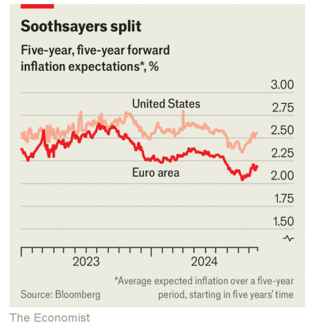

# The West faces new inflation fears

Having moved in lockstep, America and Europe now have very different concerns

lockstep：步调一致；同生同变；齐步走

原文：

**C**ENTRAL BANKERS have avoided celebrations. They know full

well that consumers and firms, stung by the highest inflation since

the 1970s, would not appreciate them. In private, though, many are

elated. The sharpest rise in borrowing costs in decades, dubbed “the

great tightening” by the IMF, appears to have worked better than

anyone expected. Global inflation has retreated to more

comfortable levels. Better still, this has been achieved without a

sharp rise in joblessness or a recession.

央行行长们避免庆祝。他们清楚地知道，受到自20世纪70年代以来最高通胀刺激的消费者和企业不会欣赏他们。然而，私下里，许多人都兴高采烈。被国际货币基金组织称为“大紧缩”的几十年来借贷成本的最大幅度上升，似乎比任何人预期的都要好。全球通胀已经回落到更舒适的水平。更好的是，这是在没有失业率急剧上升或经济衰退的情况下实现的。

学习：

know full well：非常清楚；不可否认；不可忽视          

stung：使苦恼；使不安；（sting的过去式和过去分词）          

elated：兴高采烈的；得意洋洋的；使兴奋；（elate的过去式和过去分词）          

原文：

But as inflation cools, new dilemmas emerge. What is striking is

how different they are on either side of the Atlantic. European

policymakers, having dealt with the novel phenomenon of high

inflation, now worry they are returning to a more familiar problem:

inflation that is too low, as the continent’s economic growth looks

increasingly frail. At the same time, American central bankers are

discovering that although they have made a lot of progress,

inflation is still higher than they desire. The country’s economy is

booming.

但随着通胀降温，新的困境出现了。引人注目的是大西洋两岸的差异有多大。处理了高通胀这一新现象的欧洲政策制定者，现在担心他们正回到一个更熟悉的问题:通胀过低，因为欧洲大陆的经济增长看起来越来越脆弱。与此同时，美国央行行长们发现，尽管他们取得了很大进步，但通胀率仍高于他们的预期。这个国家的经济正在蓬勃发展。

学习：

frail：脆弱的；体质弱的

原文：

Until recently, prices in the two regions had moved in lockstep.

Recent analysis by the IMF makes clear the extraordinary nature of

the inflationary wave. In the view of the IMF, it came in stages.

First, during covid-19 lockdowns, demand for goods surged as

supply chains strained. Then, as economies re-opened, pent-up

demand for services raised price pressures. Russia’s invasion of

Ukraine exacerbated problems. By mid-2022 global inflation was

triple its pre-pandemic average, and many of its causes applied to

countries everywhere.

直到最近，这两个地区的价格一直保持同步。国际货币基金组织最近的分析清楚地表明了通货膨胀浪潮的非同寻常的性质。在国际货币基金组织看来，这是分阶段的。首先，在新冠肺炎停工期间，由于供应链紧张，商品需求激增。然后，随着经济重新开放，被压抑的服务需求增加了价格压力。俄罗斯入侵乌克兰加剧了问题。到2022年年中，全球通胀是疫情危机前平均水平的三倍，其许多原因适用于世界各地的国家。

学习：

extraordinary nature ：特殊性质

pent-up：被压抑的；被抑制的；积聚的

原文：

Beneath the surface, however, there were differences. American

inflation was at first driven by the same shocks as elsewhere, but

from late 2021 a tight labour market contributed. The IMF’s

research suggests a lack of slack in America’s job market has added

two to three percentage points to annual inflation rates. In Europe,

which was more exposed to high energy prices after Russia’s

invasion of Ukraine, the labour market has been looser. The result

—high inflation—was the same, but the two regions got there

differently.

然而，在表面之下，存在着差异。美国的通胀最初是由与其他地方相同的冲击推动的，但从2021年末开始，紧张的劳动力市场起到了推波助澜的作用。国际货币基金组织的研究表明，美国就业市场的不景气给年通货膨胀率增加了两到三个百分点。在俄罗斯入侵乌克兰后更容易受到高能源价格影响的欧洲，劳动力市场更加宽松。结果——高通胀——是一样的，但这两个地区的情况不同。

学习：

**"slack"** 指的是劳动力市场中的空闲或余裕部分，也就是未充分利用的劳动力资源

lack of slack：**"Lack of slack"** 表示劳动力市场没有足够的空闲劳动力资源，这意味着就业机会紧张，雇主难以找到合适的员工。
>在这里，**"slack"** 指的是劳动力市场中的空闲或余裕部分，也就是未充分利用的劳动力资源。一个“looser” 的劳动力市场意味着有更多的空闲劳动者（如失业或寻找工作的人），而“tight” 的劳动力市场则意味着劳动力资源利用率较高，失业率较低。
>
>**"Lack of slack"** 表示劳动力市场没有足够的空闲劳动力资源，这意味着就业机会紧张，雇主难以找到合适的员工。这种情况下，工资上涨的压力增大，从而推动整体物价上涨，导致更高的通货膨胀。
>
>**例句：**
>- The economy is showing signs of slack, with many job openings unfilled.
>（经济显示出有空闲，许多职位仍未被填补。）
>- The lack of slack in the job market has resulted in wage increases, contributing to inflation.
>（劳动力市场缺乏余裕导致工资上涨，进而推动了通货膨胀。）

原文：

Now that supply chains are pretty much back to normal, these

differences are becoming apparent. They can be seen in financial

markets. The “five-year, five-year forward” inflation expectation is

a favoured measure of central bankers. Derived from interest-rate

futures contracts, it shows the inflation rate expected by investors

for the five years starting in five years’ time. By the middle of last

year, European and American rates had converged. Against a

backdrop of high inflation, market participants expected annual

price rises to settle at 2.5% on both sides of the Atlantic. Over the

past year rates have since diverged, with American medium-term

inflation now expected to be higher than European inflation (see

chart).

既然供应链已经基本恢复正常，这些差异变得越来越明显。它们可以在金融市场上看到。“未来五年”的通胀预期是央行行长们青睐的衡量标准。它来源于利率期货合约，显示了投资者对五年后开始的五年的预期通货膨胀率。到去年年中，欧洲和美国的利率已经趋同。在高通胀的背景下，市场参与者预计大西洋两岸的年价格涨幅将稳定在2.5%。在过去的一年里，利率出现了分化，美国的中期通货膨胀率预计将高于欧洲(见图表)。

学习：

backdrop：背景

原文：

American consumer-price inflation fell to 2.4% in September,

coming in above projections of a drop to 2.3%. On October 14th

Christopher Waller, a member of the Federal Reserve’s rate-setting

committee, described the data as “disappointing”. Investors have

begun to scale back their expectations of how quickly the Fed will

cut. By contrast, rate-setters at the European Central Bank are more

alarmed by the lack of inflation than its persistence. On October

17th the ECB cut rates for the third time this year; markets now

expect a further three reductions by the end of March. At their

previous meeting, minutes noted “the risk of undershooting the

target [of 2%]”. Indeed, the latest reading suggests that today euro-

zone inflation is at 1.7%.

9月份，美国消费者价格通胀率降至2.4%，高于预期的2.3%。10月14日，美联储利率设定委员会成员Christopher Waller称该数据“令人失望”。投资者已经开始降低对美联储降息速度的预期。相比之下，欧洲央行的利率制定者更担心的是通货膨胀的减少而不是持续。10月17日，欧洲央行今年第三次降息；市场现在预计，到3月底还会有三次降息。在前一次会议上，会议纪要指出“低于(2%)目标的风险”。事实上，最新数据显示，今天欧元区的通货膨胀率为1.7%。

原文：

Too little, not too much, inflation is a problem with which the ECB

is familiar. Inflation was below 2% for most of the decade before 2021.

With European growth weakening, Germany in recession and

price pressures appearing newly absent, some economists now fear

that the ECB mistook a global inflationary surge for a fundamental

change in European price dynamics, and raised rates by too much

as result. The most recent survey of professional economists by the

ECB points to medium-term euro-zone growth of just 1.3% a year,

the lowest since the survey began.

通胀过低而非过高是欧洲央行所熟悉的问题。2021年之前十年的大部分时间里，通胀率都低于2%。随着欧洲增长放缓，德国陷入衰退，价格压力似乎新近消失，一些经济学家现在担心，欧洲央行将全球通胀飙升误认为欧洲价格动态发生了根本性变化，因此加息幅度过大。欧洲央行对专业经济学家的最新调查显示，欧元区中期年增长率仅为1.3%，为调查开始以来的最低水平。

原文：

Hence the divergence. In America a still-tight jobs market is

continuing to make reducing inflation difficult; in Europe the old

picture of sluggish growth and weak price pressures is once more

reasserting itself. The Atlantic is 5,000km and 0.7 percentage

points wide. ■

因此出现了分歧。在美国，仍然紧张的就业市场继续使降低通货膨胀变得困难；在欧洲，增长缓慢和价格压力疲软的旧景象再次出现。大西洋5000公里宽，通胀差0.7个百分点。■

学习：

reassert：重新确认或重新表现出某种状态或趋势

>在这里，**"reassert"** 的意思是重新确认或重新表现出某种状态或趋势。在文中，"the old picture of sluggish growth and weak price pressures is once more reasserting itself" 意味着欧洲的经济状况，即缓慢增长和低通胀压力，再次显现出来。
>
>**例句：**
>- After a period of innovation, the company is reasserting its commitment to quality.
>（在一段创新期后，公司重新确认了对质量的承诺。）
>- The team reasserted its dominance in the league after a series of victories.
>（在一系列胜利后，球队重新表现出在联赛中的统治地位。）

## 后记

2024年10月28日19点37分于上海。

