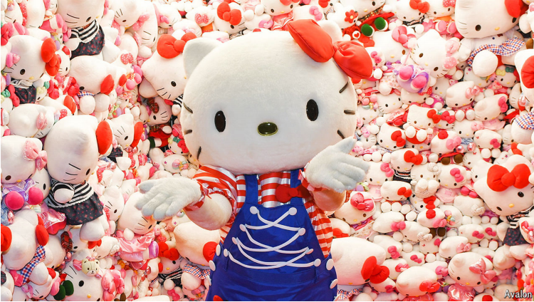

# Hello Kitty, still cute at 50

The face that launched a thousand products

原文：

**M**OST HAVE to wait until their centenary to receive birthday

wishes from the king of Britain. But King Charles III made an

exception for “a self-made entrepreneur worth billions of dollars

and a UNICEF children’s ambassador on top”. The monarch was

feting a figure more recognisable than any billionaire or emissary:

Hello Kitty, who turns 50 this year.

大多数人要等到百岁才能收到英国国王的生日祝福。但查尔斯三世为“一位白手起家、身价数十亿美元的企业家和一位联合国儿童基金会儿童大使”破了例。这位君主正在散发一个比任何亿万富翁或使者都更知名的人物的气味:凯蒂猫，她今年50岁了。

学习：

self-made：白手起家          

monarch：美 [ˈmɑːnərk] 君主；帝王

feting：（fete的现在分词形式）；庆祝；

>这里的 **"feting"** 指的是庆祝、表彰或向某人表示敬意。King Charles III 特别向 Hello Kitty 致以祝贺，庆祝其50周年生日。**"Feting"** 在这里的意思是用隆重的方式来表示对 Hello Kitty 的敬意。
>
>**例句：**
>- The town held a grand parade, feting its local hero upon his return.
>（小镇举行盛大的游行，庆祝当地英雄的归来。）
>- The company feted its founder with a gala dinner on his 80th birthday.
>（公司在创始人80岁生日时举办了晚宴以表彰他。）
>
>在本文中，"feting" 强调了对 Hello Kitty 作为文化偶像的特别致敬。

emissary：使者；特使

原文：

The character was created by Shimizu Yuko, a Japanese illustrator,

on November 1st 1974. Soon after, Kitty was appearing on an

astounding array of trinkets. Today you can wear her face on your

hands, with OPI fake nails, or your feet, in the form of Adidas

trainers. You can wash yourself in a Hello Kitty shower and dry

yourself with a Hello Kitty towel. (Unofficially, you can even

brandish a Hello Kitty AK47, or have sex using a Hello Kitty

condom.) Sanrio, the company which owns the character, makes

almost $4bn in sales annually.

这个角色是日本插画家清水段丽阳在1974年11月1日创造的。不久之后，凯蒂出现在一系列令人震惊的小饰品上。今天你可以用OPI假指甲把她的脸戴在手上，或者以阿迪达斯运动鞋的形式戴在脚上。你可以在凯蒂猫淋浴里洗澡，用凯蒂猫毛巾擦干身体。(非官方的说法是，你甚至可以挥舞凯蒂猫AK47，或者使用凯蒂猫安全套做爱。)拥有该角色的三丽鸥公司每年的销售额接近40亿美元。

学习：

trinket：美 [ˈtrɪŋkɪt]  小装饰品；（价值不高的）小首饰；

trainer：运动鞋；

brandish：挥舞（武器等）；挥动；摇晃

condom：避孕套；安全套

原文：

Kitty’s popularity is emblematic of the global craze for cute things.

In Japan the phenomenon, known as *kawaii,* dates back to at least

the 17th century, when artists started producing miniatures and

paintings of animals. Despite the name, whiskers and pointy ears,

Kitty is supposedly not a cat, but a little girl who lives in the

suburbs of London with her family.

凯蒂的受欢迎象征着全球对可爱事物的狂热。在日本，这种被称为卡哇伊的现象至少可以追溯到17世纪，当时艺术家们开始制作微缩模型和动物绘画。尽管有名字、胡须和尖耳朵，凯蒂应该不是一只猫，而是一个和家人住在伦敦郊区的小女孩。

学习：

emblematic：典型的；标志的

craze：狂热；风靡一时的流行

whiskers：胡须；腮须；（whisker的复数）          

原文：

*Kawaii* implies vulnerability and dependency, yet there is a sense

of *asobi*—playfulness—to the way Kitty looks. Her charm lies in

her expressionless face: she is composed of just three circles, six

lines and a red bow, notes Joshua Paul Dale, a specialist in Cute

Studies at Chuo University in Tokyo. The simplicity of the design

makes it easy to reproduce on all manner of items. Unlike Mickey

Mouse, Kitty’s look has not had to be updated.

卡哇伊意味着脆弱和依赖，然而凯蒂看起来却有一种爱玩耍的感觉。东京中央大学可爱研究专家约书亚·保罗·戴尔指出，她的魅力在于她面无表情的脸:她只由三个圆圈、六条线和一个红色蝴蝶结组成。这种简单的设计很容易在各种物品上复制。与米老鼠不同，凯蒂的造型不需要更新。

原文：

Kitty was born in the right place, at the right time. Kato Norihiro, a

cultural critic, has argued that she reflects the aftermath of the

second world war. With no meaningful back story, Kitty

represented the mood in Japan and “the impulse to escape history

and to stop talking about it”. She emerged as “the perfect post-war

icon”, agrees Roland Kelts of Waseda University. “Japan’s warrior

nation was shoved under the rug and the message to Japan was:

‘Shhh, look cute and beautiful’.”

凯蒂出生在正确的地方，正确的时间。文化评论家加藤典弘认为，她反映了第二次世界大战的后果。没有任何有意义的背景故事，凯蒂代表了日本的情绪和“逃避历史并停止谈论它的冲动”。早稻田大学的罗兰·凯尔茨(Roland Kelts)也认为，她是“完美的战后偶像”。“日本的武士国家被压在地毯下，给日本的信息是:‘嘘，看起来可爱又漂亮’。”

学习：

Waseda University：早稻田大学          

shoved：乱放；随便放；推挤；猛推；（shove的过去分词）

rug：小地毯；披毯；盖毯；

原文：

She also coincided with a changing social and economic landscape.

In the 1970s women joined the workforce in greater numbers; they

earned money and spent it on cute items for themselves. Yet even

when Japan’s economy faltered in the 1990s, Kitty remained

popular. When the mood is sour, sweet things are even more

desirable. You “want to retreat into that fluffiness”, says Christine

Yano, an anthropologist and the author of a book on Kitty’s

omnipresence. (Studies have shown that looking at cute things can

reduce stress and improve your mood.)

她也恰逢社会和经济形势的变化。20世纪70年代，更多的女性加入了劳动力大军；她们赚了钱，并把钱花在可爱的物品上。然而，即使在20世纪90年代日本经济不景气时，Kitty仍然很受欢迎。心情酸的时候，甜的东西更是让人向往。人类学家克里斯汀·亚诺说，你“想退回到那种蓬松的状态”，她写了一本关于猫咪无处不在的书。(研究表明，看可爱的东西可以减轻压力，改善心情。)

学习：

falter：不景气

omnipresence：遍在；无所不在          

原文：

The character went global towards the turn of the 20th century, as

Japan became an increasing source of fascination and inspiration in

the West. Demand for anime films and manga comic books grew.

In 2013 the Japanese government, seeking to capitalise on this cool

status, introduced a policy to promote the country’s culture abroad.

随着日本成为西方越来越多的魅力和灵感来源，这个角色在20世纪初走向世界。对动画电影和漫画的需求增加了。2013年，日本政府试图利用这种酷酷的状态，推出了一项在海外推广该国文化的政策。

原文：

Hello Kitty has been such a hit that other firms are trying to

replicate her success. Chinese companies are investing in new

cartoons; Sanrio, too, frequently puts out more characters. Since

2017 Cinnamoroll, a dog with a curly tail, has often ranked top of

Sanrio’s annual survey of its most popular characters. As new

characters come and go, Hello Kitty wears the same inscrutable

expression. ■

凯蒂猫大受欢迎，其他公司都试图复制她的成功。中国公司正在投资新动画片；三丽鸥也经常推出更多的角色。自2017年以来，一只尾巴卷曲的狗Cinnamoroll经常在三丽鸥年度最受欢迎人物调查中排名第一。随着新角色的出现和消失，凯蒂猫却带着始终如一的神秘表情。■

## 后记

2024年11月3日20点07分于上海。

