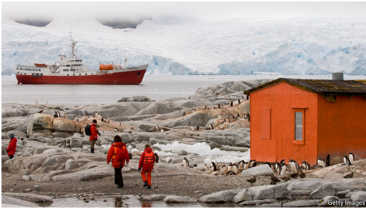
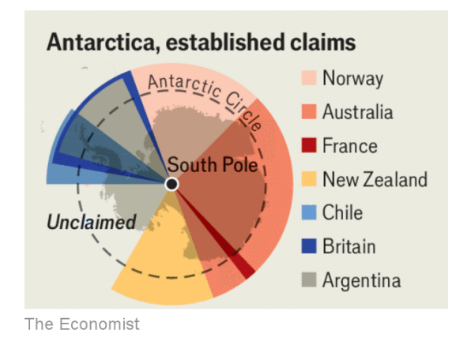

# How to avoid anarchy in Antarctica

All that stands between the status quo and chaos is a fragile treaty

anarchy：美 [ˈænərki] 无政府状态；混乱；

Antarctica：南极洲

原文：

**A**NTARCTICA IS THE only continent unbloodied by war. For

over six decades peace on the frozen land mass has been kept by

the Antarctic Treaty, an agreement signed in 1959 at the height of

the cold war that established it as a demilitarised scientific

preserve. But much like its ice sheet, the system governing

Antarctica is in trouble as global warming opens up the possibility

of mining virgin resources.

南极洲是唯一未受战争影响的大陆。60多年来，这块冰冻大陆上的和平一直由《南极条约》维持，该条约签署于1959年，当时正值冷战高峰，该条约将南极确立为一个非军事化的科学保护区。但是就像它的冰原一样，随着全球变暖开启了开采原始资源的可能性，管理南极洲的系统陷入了困境。

学习：

unbloody：未流血的，未染上血的

land mass：大陆块；陆地块；地块；

原文：

Seven countries, including Britain, Argentina, Australia and

Norway, have territorial claims over the Antarctic. The carve-up of

the continent reflects the world of the early 1900s: Britain, the

naval hegemon at the time, and its former colonies grabbed almost

60%. Norway, whose explorers were first to the South Pole, took a

bit less than 20%.

包括英国、阿根廷、澳大利亚和挪威在内的七个国家对南极有领土要求。欧洲大陆的瓜分反映了20世纪初的世界:当时的海上霸主英国及其前殖民地攫取了近60%的份额。挪威的探险者最先到达南极，占不到20%。

学习：

carve-up：瓜分；分割；分配

naval：美 [ˈneɪvl] 海军的；舰队的；军舰的

hegemon：霸主

原文：

These claims do not reflect today’s geopolitical balance and are

rejected by other powers such as China, which feels that it was

squeezed out of the original scramble for Antarctica. Nor are they

recognised by America and Russia, which both reserve the right to

make future claims. The only thing standing between a free-for-all

land grab, or even conflict, is the treaty. When it came into force in

1961 it froze all territorial claims and prohibited countries from

making new ones. Yet this status quo is now being threatened by a

new scramble· for the Antarctic.

这些主张没有反映当今的地缘政治平衡，并遭到中国等其他大国的拒绝，中国认为自己在最初争夺南极洲的过程中被挤出了市场。美国和俄罗斯也不承认它们，两国都保留未来提出权利主张的权利。唯一阻挡在一场自由的土地争夺战甚至冲突之间的是条约。当它在1961年生效时，它冻结了所有的领土要求，并禁止其他国家提出新的领土要求。然而，这一现状正受到新一轮争夺南极的威胁。

学习：

scramble for：争夺；争抢          

free-for-all：混战；自由混战；混乱场面；自由参与的活动

status quo：现状

原文：

A growing number of powers are racing to establish or expand their

presence on the continent. This year Russia opened its tenth base

and China its fifth, India is building a third and Turkey is planning

its first. Iran has not signed the treaty but has said it wants an

Antarctic base to claim its “property rights”. Were this recent

enthusiasm for polar exploration in the spirit of the treaty, which

called for peaceful scientific investigation “in the interest of all

mankind” and for a ban on any military activity, there would be

much to celebrate. Alas, in reality the treaty is in danger of

disintegrating under the pressure of countries’ Antarctic ambitions.

越来越多的大国竞相在南极洲建立或扩大自己的势力。今年，俄罗斯开设了第十个基地，中国开设了第五个，印度正在建设第三个，土耳其正在规划第一个。伊朗没有签署该条约，但表示希望一个南极基地来主张其“财产权”。该条约呼吁“为了全人类的利益”进行和平的科学研究，并禁止任何军事活动，如果这种对极地探险的热情符合该条约的精神，那将有很多值得庆祝的事情。唉，事实上，在各国南极野心的压力下，该条约有瓦解的危险。

原文：

One reason is that some countries are exploiting a loophole which

allows “military personnel or equipment for scientific research” in

order to militarise bases covertly. America’s Department of

Defence alleged in 2022 that China was deploying dual-use

technologies and facilities in Antarctica to improve the capabilities

of the People’s Liberation Army.

一个原因是，一些国家正在利用一个允许“军事人员或科研设备”的漏洞，以秘密军事化基地。美国国防部在2022年声称，中国正在南极部署军民两用技术和设施，以提高中国人民解放军的能力。

学习：

loophole：漏洞；空子；机会；出口

原文：

A second reason to worry is that countries may be eyeing

Antarctica’s potential vast deposits of oil, gas, copper and other

minerals. Russia and China appear to be positioning themselves for

future exploitation by building bases in resource-rich areas and

conducting geological surveys under the pretext of research. The

treaty bans mining in a way that cannot easily be amended before 2048.

By that date some mineral extraction there may be desirable,

were it to provide resources needed for the green transition. But

unless this takes place under an enforceable pact, a mining boom

could cause ecological damage and conflict as countries seek to

enforce their claims.

第二个令人担忧的原因是，各国可能盯上了南极洲潜在的大量石油、天然气、铜和其他矿产资源。俄罗斯和中国似乎正在为未来的开发做准备，在资源丰富的地区建立基地，并以研究为借口进行地质调查。该条约禁止采矿，但在2048年之前很难修改。到那时，如果能提供绿色转型所需的资源，一些矿物开采可能是可取的。但是，除非这发生在一个可执行的协议下，否则矿业繁荣可能会导致生态破坏和冲突，因为各国都在寻求实施自己的主张。

学习：

pretext：托辞；借口；幌子；假称          

pact：契约；盟约；和约；公约

原文：

The best solution would be to modernise the treaty so as to create a

new global agreement for managing Antarctica. However, all such

amendments require unanimous support, which Russia and China

would not provide. The practical alternative is for America and its

allies to keep trying to enforce the existing treaty but at the same

time to draft and sign an improved set of rules on things like

environmental protection and tourism that could provide a better

model for the governance of the Antarctic. These would then be

ready for all countries to adopt, should polar geopolitics ever thaw.■

最好的解决办法是更新该条约，以便达成一个新的管理南极洲的全球协议。然而，所有这些修正案都需要一致支持，而俄罗斯和中国无法做到这一点。现实的选择是，美国及其盟友继续努力执行现有的条约，但同时起草并签署一套关于环境保护和旅游等问题的改进规则，为南极的治理提供更好的模式。一旦极地地缘政治解冻，所有国家都可以采纳这些方案。■

学习：

unanimous：美 [juˈnænɪməs] （决定或意见）一致的；全体一致的；**注意发音**

thaw：融化；解冻；（敌对国家之间）关系缓和；解冻时期

## 后记

2024年11月6日14点38分于上海。

