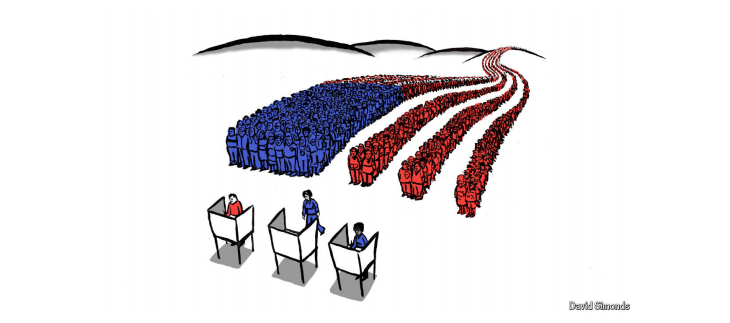

# This campaign is also demonstrating America’s democratic vitality

Let’s hope it’s not, in retrospect, the high point

原文：

**M**ASIH ALINEJAD, an Iranian-American journalist and human

rights activist, likes to tell a story about walking through New York

after appearing on various cable-TV networks to crusade against

Iran’s oppression of women. Ms Alinejad, who has a nimbus of

spiralling curls that makes her easy to recognise, describes being

stopped by people who wanted to voice their support. But on one

block a person pleaded with her not to appear again on Fox News

(“They are miserable”) while on the next a person urged her to stop

going on CNN (“They are using you”).

伊朗裔美国记者和人权活动家MASIH ALINEJAD喜欢讲述一个在各种有线电视网络上露面以讨伐伊朗对妇女的压迫后在纽约穿行的故事。Alinejad女士有着螺旋卷曲的头发，这使她很容易被认出来，她描述说被想要表达支持的人拦住了。但在一个街区，一个人恳求她不要再出现在福克斯新闻频道(“他们很悲惨”)，而在下一个街区，一个人敦促她停止上CNN(“他们在利用你”)。

学习：

crusade：美 [kruːˈseɪd] 讨伐

nimbus：美 [ˈnɪmbəs] 光环；光轮；荣光

>这里的 **“a nimbus of spiralling curls”** 是描述马西赫·阿里尼贾德（Masih Alinejad）外貌的表达，特别是她的头发。**"a nimbus"** 通常指一个光环或环绕在周围的光芒，这里指她的头发如光环般环绕在她的头部。**"spiralling curls"** 意味着她的头发是螺旋状的卷发。因此，这句话的意思是她有一头蓬松而卷曲的头发，使她很容易被人认出来。
>
>类似表达的例子：
>
>1. **"She had a halo of wild curls around her head, making her look vibrant and distinctive."**
>   - **她头上有一圈蓬松的卷发，使她看起来充满活力且与众不同。**
>
>2. **"His nimbus of golden curls caught everyone’s attention when he entered the room."**
>   - **他头上的金色卷发吸引了所有人的目光，当他走进房间时特别显眼。** 
>
>这种描述不仅形象地展示了她的外貌特征，也强调了她在人群中的辨识度。

原文：

“I was like, ‘Wow, wow—guys, having Fox News and CNN is the

beauty of America,’” Ms Alinejad said, speaking at the Global Free

Speech Summit at Vanderbilt University in Nashville, Tennessee,

on October 18th, just days before prosecutors in Manhattan would

charge four men, including a senior official in the Islamic

Revolutionary Guard Corps of Iran, with plotting to kill her in 2022.

Americans who wanted to cancel either network and watch

only one, Ms Alinejad continued, might consider life in North

Korea or Iran, where “You only see people repeating the narrative

of the government, and you only see your family members and

your heroes doing false confession in order to survive.”

10月18日，在田纳西州纳什维尔范德比尔特大学举行的全球言论自由峰会上，艾莉贾德女士说，“我当时想，‘哇，哇——伙计们，拥有福克斯新闻频道和CNN是美国的美丽之处。’”就在几天前，曼哈顿的检察官将指控四名男子密谋在2022年杀害她，其中包括伊朗伊斯兰革命卫队的一名高级官员。艾莉贾德继续说，想取消任何一个电视网、只看一个电视网的美国人可能会考虑在朝鲜或伊朗的生活，在那里，“你只会看到人们重复政府的叙述，你只会看到你的家人和英雄为了生存而做虚假的忏悔。”

学习：

false confession：虚假供述；假供词；虚假的认罪；虚假的忏悔

原文：

That is a low bar. However, it is a fair point, and a chastening one

as the climax approaches of an election campaign that has members

of both parties despairing about their democracy. American news

organisations may not always make the best use of their freedom,

yet their very freedom to misuse their freedom is a measure of what

keeps America great. In Ms Alinejad’s spirit, it seems worth

considering other ways in which this much maligned campaign is

revealing the vitality of America’s democracy—along with the

pernicious effects of negative partisanship explored in our Essay

this week·.

那是一个低标准。然而，这是一个公平的观点，也是一个令人警醒的观点，因为竞选活动的高潮即将到来，两党成员都对他们的民主感到绝望。美国新闻机构可能不会总是充分利用他们的自由，但是他们滥用自由的自由是保持美国伟大的一个措施。本着Alinejad女士的精神，似乎值得考虑这场备受诋毁的运动揭示美国民主活力的其他方式——以及我们在本周的文章中探讨的负面党派偏见的有害影响。

学习：

low bar：低标准

>
>
>这里的 **"low bar"** 指的是一个低的标准或低要求。这里意味着在评价事物的标准很低的情况下，即便它达到了这个低标准，也不能说明其特别出色。这种表达常用来暗示某事物仅仅勉强合格或不够理想。例如：
>
>- "Getting a passing grade in this easy test is a low bar; the real challenge will be the final exam."
>  - **通过这个简单测试并不算什么标准，真正的挑战是期末考试。**

chastening：

>**"Chastening"** 则指让人反思或感到谦卑的经历，通常因为它带来警醒或使人意识到自身的不足。这种经历往往带来教训，让人更清醒或更谨慎。这里用 **"chastening"** 描述了这个观点让人反思或产生了警醒感。例如：
>
>- "Losing the competition was a chastening experience, reminding her not to underestimate her rivals."
>  - **在比赛中失利让她受到警醒，提醒自己不要低估对手。**
>
>因此，整句话的意思是，虽然这个标准很低，但在一个选举即将到达高潮、双方都对民主失望的时刻，这一观点依然具有警醒的作用。

pernicious：有害的；恶性的；

原文：

Start with what can be a basic vital sign: participation. A generation

ago, when about half of eligible voters might turn up at the polls,

America’s mandarins were sounding warnings about voter apathy

and assembling commissions to overcome it. But two-thirds of

eligible voters cast ballots in 2020, the highest proportion since

1900, and voting in the midterms of 2018 and 2022 reached levels

not seen in decades. This autumn some states with early voting are

setting records for participation. (A related sign of vitality is that,

contrary to worries that threats and scorn directed at election

officials would scare off poll workers, state offices are reporting

ample levels of volunteers and paid staff.)

从最基本的重要标志开始:参与。一代人以前，当大约一半的合格选民可能出现在投票站时，美国的官员们发出了选民冷漠的警告，并组建了委员会来克服这一问题。但三分之二的合格选民在2020年投票，这是自1900年以来的最高比例，2018年和2022年的中期选举投票达到了几十年来的最高水平。今年秋天，一些提前投票的州正在创造投票率的记录。(活力的一个相关标志是，与人们担心针对选举官员的威胁和蔑视会吓跑投票工作人员相反，各州办公室报告称有大量志愿者和带薪工作人员。)

学习：

eligible：美 [ˈelɪdʒəbl] 合格的；有资格的；符合条件的

mandarin：官员

apathy：冷漠；漠不关心

assembling commissions ：组建委员会

cast ballots：投票

scorn：轻蔑；藐视；嘲笑

原文：

Along with surging registration of new voters, higher turnout is

changing the composition of the electorate in unpredictable ways.

This shift appears to be settling dumb debates within both parties in

recent years over whether turning out partisans matters far more

than persuading independent-minded voters to support your

candidate. In a changing yet evenly divided electorate, both turnout

and persuasion are essential, and the campaigns have been putting

this rather obvious insight into practice. More competition for more

voters can only benefit the country.

随着新选民登记人数的激增，更高的投票率正以不可预测的方式改变着选民的构成。这一转变似乎解决了近年来两党内部的愚蠢争论，即支持党派成员是否比说服独立选民支持你的候选人更重要。在一个不断变化但又平分秋色的选民群体中，投票率和说服力都至关重要，竞选团队已经将这一显而易见的观点付诸实践。争取更多选民的更多竞争只会让国家受益。

原文：

Indeed, one cause or effect, or both, of these efforts at persuasion is

that America is becoming less polarised by race. Both parties have

discarded facile assumptions that black or Latino voters are

monolithic on matters such as illegal immigration or policing. The

left’s conviction that Donald Trump was succeeding solely by

catering to white people began to fray after the 2020 election, when

he made gains among Latino, Asian and black voters. He is

courting them more vigorously in this campaign. That outreach has

clashed at times with his core emphasis, reaching disaffected young

men, as when a comedian popular with that group managed the rare

feat of upstaging Mr Trump by telling racist jokes before he spoke

at Madison Square Garden on October 27th.

事实上，这些说服努力的一个原因或结果，或者两者兼而有之，是美国正变得不那么种族分化。两党都抛弃了黑人或拉丁裔选民在非法移民或治安等问题上意见一致的肤浅假设。2020年大选后，左翼认为唐纳德·特朗普(Donald Trump)只是通过迎合白人而取得成功的信念开始动摇，当时他在拉美裔、亚裔和黑人选民中取得了进展。在这次竞选中，他更加积极地向他们示好。这种拓展有时会与他的核心重点发生冲突，触及心怀不满的年轻人，比如10月27日特朗普在麦迪逊广场花园发表演讲前，一名受年轻人欢迎的喜剧演员通过讲种族主义笑话抢了他的风头。

学习：

facile：美 [ˈfæsl] 肤浅的；浅薄的；缺乏深度的

monolithic ：庞大而统一的；整体的；单一的

upstaging：抢戏；使相形见绌；抢镜头；（upstage的现在分词形式）

原文：

Kamala Harris has been trying to reverse Democratic erosion

among young non-white Americans while also trying to reach

beyond her party’s base of voters with college degrees. Rather than

repeating Joe Biden’s promises to erase college-loan debt, she is

emphasising that she will create jobs that do not require a college

education. “We understand a college degree is not the only measure

of whether a worker has skills and experience to get the job done,”

she declared at a rally in Flint, Michigan, in early October.

卡玛拉·哈里斯一直试图扭转民主党在年轻的非白人美国人中的人气降低，同时也试图超越她所在政党拥有大学学历的选民基础。她没有重复乔·拜登消除大学贷款债务的承诺，而是强调她将创造不需要大学教育的就业机会。10月初，她在密歇根州弗林特的一次集会上宣称，“我们明白，大学学位不是衡量一个工人是否有完成工作的技能和经验的唯一标准。”。

原文：

Ms Harris has also been bidding to win back rural voters

Democrats have all but ignored in recent campaigns, while Mr

Trump has been campaigning in big cities—and both of them

appear to be having some success. Ms Harris has campaigned in

solidly red Texas while Mr Trump has campaigned in such

Democratic strongholds as California and New York. Both have

campaigned with members of the opposing party, though Mr

Trump’s few Democrats, such as Robert Kennedy junior, are party

misfits of longer standing than Ms Harris’s Republicans, some of

whom once worked for Mr Trump.

哈里斯也一直在努力赢回民主党在最近的竞选中几乎忽视的农村选民，而特朗普一直在大城市竞选——他们两人似乎都取得了一些成功。哈里斯在坚定支持共和党的德克萨斯州竞选，而特朗普在加州和纽约等民主党大本营竞选。两人都曾与反对党成员一起竞选，尽管特朗普的少数民主党人，如小罗伯特·肯尼迪(Robert Kennedy junior)，是比哈里斯的共和党人更久的党内不合群者，其中一些人曾为特朗普工作。

学习：

strongholds：要塞；据点；堡垒；（stronghold的复数）          

## **Use it or lose it**

原文：

The imperative to attract less-partisan voters has also compelled

both candidates to moderate some of their more extreme views. Ms

Harris has backed off leftist positions she espoused in 2019. Mr

Trump, who has moved his party towards the centre on matters

such as entitlements and gay rights, has been clumsily trying to

moderate his stance on reproductive freedoms after a backlash he

clearly did not expect to the Supreme Court’s decision in 2022 to

eliminate the constitutional right to abortion.

吸引非党派选民的迫切需要也迫使两位候选人缓和了一些更极端的观点。哈里斯女士已经放弃了她在2019年支持的左翼立场。特朗普在权利和同性恋权利等问题上让他的政党转向中间立场，他一直在笨拙地试图缓和他在生殖自由问题上的立场，此前他显然没有料到最高法院2022年取消宪法规定的堕胎权的决定会遭到强烈反对。

原文：

Far more than other protest movements this century, the grassroots

movement to restore abortion rights is proving durable and

effective. It has won in all six states that have had plebiscites on

abortion rights so far, including such conservative ones as Kansas

and Kentucky. Americans, it seems, have not forgotten how to put

their democracy to use in defence of their liberty. ■

与本世纪的其他抗议运动相比，恢复堕胎权利的草根运动被证明是持久而有效的。到目前为止，它已经赢得了所有六个就堕胎权利进行公民投票的州，包括像堪萨斯州和肯塔基州这样保守的州。美国人似乎没有忘记如何利用他们的民主来捍卫他们的自由。■

学习：

plebiscite：美 [ˈplɛbəˌsaɪt]   公民投票；全民公决；公投；

## 后记

2024年11月6日19点18分于上海。

