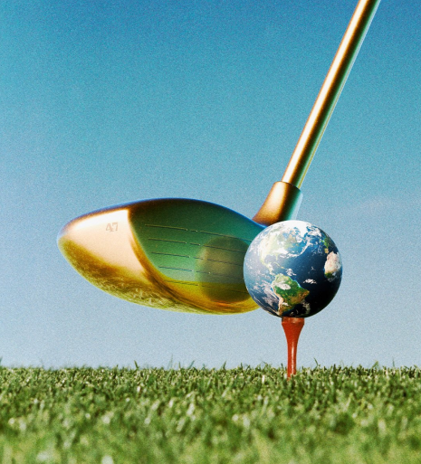

# What’s about to hit the world economy?

Trumponomics tees off

hit：影响，冲击

>
>
>**"hit"** 在这里的意思是 **“影响”** 或 **“冲击”**，通常用来指某种事件或现象对某个领域或群体产生重大影响。在这种语境下，"hit the world economy" 指的是即将对世界经济造成影响或冲击。
>
>- **Example:** "The new policy could hit the housing market hard."
>  新政策可能会对房地产市场产生重大影响。
>- **Example:** "The recession hit many businesses, forcing them to close."
>  经济衰退对许多企业造成了冲击，迫使它们关门。

tee off: 开始，启动
>1. **"tees off"** 这个表达通常来自高尔夫，意思是 **“开始”** 或 **“启动”**，尤其指某项活动的开始或起始。在这里，"Trumponomics tees off" 意味着特朗普经济学（或与特朗普政策相关的经济理念）开始实施或发挥作用。
>   - **Example:** "The company teed off a new marketing campaign today."
>     公司今天启动了一个新的营销活动。
>   - **Example:** "The event tees off with a welcome speech from the CEO."
>     活动由CEO的欢迎致辞拉开帷幕。

原文：

**C**RITICS ACCUSE Donald Trump of being too chaotic to get

much done. The speed of his first appointments should disabuse

them. The next administration means business.

批评人士指责唐纳德·特朗普(Donald Trump)太混乱，无法完成很多工作。他第一次任命的速度应该会消除他们的疑虑。下一届政府是认真的。

学习：

critics：评论家；批评者；（critic的复数）          

accuse：指责，控告；指控；控诉；

disabuse：纠正（某人的）错误观念；使醒悟；解除误解；消除（错误的信念或想法）       

mean business：认真的、做事有决心的

> 这句话的意思是：**“下一届政府有实实在在的行动计划。”**
>
> - **“means business”** 是一个常见的英语表达，意思是**“认真的、做事有决心的”**，通常用来形容某个人或团队非常严肃、专业，且有明确的目标和行动，不仅仅是空谈。
>
> 在这个上下文中，**“The next administration means business”** 传达的是，尽管有批评认为特朗普可能过于混乱、难以高效工作，但从他快速任命官员的行动来看，特朗普的政府实际上是非常专注和决心十足的，准备采取实际行动来实施计划。
>
> ---
>
> **Example:**
> - "He’s not joking, he really means business with this project."
>   他不是开玩笑的，他对这个项目确实是认真的。
>
> - "The company means business with its new product launch."
>   公司在新的产品发布上确实很有行动力。 

原文：

Stock and corporate-bond markets are broadly delighted with the

prospect of deregulation and tax cuts in a second Trump term. *The*

*Economist*, by contrast, has warned of a risk that mass deportation

and a global trade war would do real harm. The appointments

themselves attest to Mr Trump’s desire for disruption, a hard line

on China and absolute loyalty· . With such a concatenation of

signals, you may wonder what is about to hit the world economy.

股票和公司债券市场普遍对特朗普第二个任期的去监管化和减税前景感到高兴。相比之下，《经济学人》警告称，大规模驱逐和全球贸易战可能会造成真正的伤害。这些任命本身证明了特朗普渴望颠覆、对中国持强硬态度和绝对忠诚。有了这样一系列的信号，你可能会想知道什么会影响世界经济。

学习：
a hard line： 强硬立场

>这里的 **"a hard line"** 意思是 **“强硬的立场”**，指的是在某个问题或领域采取坚决、严格的态度或措施。
>
>在上下文中，**"a hard line on China"** 表示特朗普在对待中国问题上的态度非常强硬，可能涉及到贸易政策、外交关系等方面的严格措施，不容妥协。
>
>---
>
>**类似的用法示例如下：**
>
>- "The government has taken a hard line on illegal immigration, enforcing stricter border control measures."
>  政府在非法移民问题上采取了强硬立场，实施了更严格的边境管控措施。
>
>- "The company took a hard line against fraud, dismissing employees involved without hesitation."
>  公司在反对欺诈问题上采取了强硬的态度，毫不犹豫地解雇了涉及欺诈的员工。
>
>在这个句子中，“a hard line on China”意味着特朗普政府在面对中国问题时采取了非常坚定、强硬的政策立场。

原文：

The answer comes in three instalments, beginning with Mr Trump’s

intentions. His commitment to deregulation may be good for

growth. Elon Musk·, the world’s richest man, and Vivek

Ramaswamy, an entrepreneur-politician, have been named heads of

a new outfit grandly named the Department of Government

Efficiency, or DOGE. A pledge to cut $2trn from the government’s

annual budget is patently absurd, but judicious liberalisation could

be benign. On day one the new administration could speed up

legislation on permitting that is already in Congress. Mr Trump has

also promised to free up artificial intelligence. The technology is

immensely power-hungry. Just imagine if easier planning rules

helped unleash a revolution.

答案分三部分，从特朗普的意图开始。他对放松管制的承诺可能有利于经济增长。世界首富埃隆·马斯克和企业家兼政治家维维克·拉马斯瓦米被任命为政府效率部的负责人。承诺从政府年度预算中削减2万亿美元显然是荒谬的，但明智的自由化可能是良性的。在第一天，新政府可以加快已经在国会的立法。特朗普还承诺解放人工智能。这项技术非常耗电。想象一下，如果更简单的规划规则有助于引发一场革命。

学习：

instalments： 美 [ɪnˈstɔːlmənts] （故事、计划等的）部分；

outfit：部门

judicious：明智的；明断的；

power-hungry： 耗费大量能源的

>这里的 **"power-hungry"** 意思是 **“耗费大量能源的”**，通常用来形容某种技术、机器或系统需要大量的能量来运行或操作。在这里，"power-hungry" 描述的是人工智能技术对计算能力和能源的巨大需求。
>
>---
>
>**类似的用法示例如下：**
>
>- "Electric cars are less power-hungry than traditional gasoline vehicles, making them more energy-efficient."
>  电动汽车比传统汽油车更省电，因此更具能源效率。
>
>- "The new gaming console is highly power-hungry, requiring a specialized power supply."
>  新款游戏主机非常耗电，需要专门的电源供应。
>
>在上下文中，"power-hungry" 用来形容人工智能技术对资源和计算能力的巨大需求，暗示如果能够减少相关法规限制，可能会促进人工智能技术的发展和应用。

unleash：释放；解开；发动；引发；激发（情感或能力）          

原文：

Unfortunately, Mr Trump also wants to deport millions of irregular

migrants and impose tariffs of up to 60% on China· and 10-20% on

the rest of the world. All of these would be bad for growth. For

example, the costs of mass deportation could, by one estimate, run

to hundreds of billions of dollars. That does not include the

economic burden of labour shortages and spiralling consumer

prices. Roughly half of the workers on America’s farms have no

legal status.

不幸的是，特朗普还想驱逐数百万非法移民，并对中国征收高达60%的关税，对世界其他地区征收10-20%的关税。所有这些都不利于增长。例如，据估计，大规模驱逐出境的成本可能高达数千亿美元。这还不包括劳动力短缺和不断攀升的消费价格带来的经济负担。美国农场大约一半的工人没有合法身份。

学习：

irregular migrants：非法移民

run to：达到；达到特定数量；

原文：

A second part of the answer is that the tensions in Mr Trump’s

agenda will be resolved by necessity, as the hyperbole of stump

speeches comes into contact with the messy reality of governing.

Policies take so much effort to enact that his administration will

simply be unable to do everything all at once.

答案的第二部分是，特朗普议程中的紧张局势将势必得到解决，因为巡回演讲的夸张与治理的混乱现实相接触。制定政策需要付出如此大的努力，以至于他的政府根本不可能一蹴而就。

学习：

by necessity：必然；无法避免地；势必          

hyperbole：夸张；夸张的修辞；夸张手法 美 [haɪˈpɜːrbəli] **注意发音**

all at once：同时；一起；立即          

原文：

Imposing universal tariffs will take time, because they would need

approval from Congress or the use of untested presidential powers.

But free-trade Republican lawmakers could recoil at tariffs on

America’s close allies. And the use of existing law to impose a

universal tariff on national-security grounds would probably be

challenged in the courts. Likewise, apprehending, detaining and

processing millions of people will be a logistical nightmare.

Federal agencies would need to turn to state authorities for help,

many of which will refuse.

征收普遍关税需要时间，因为这需要国会的批准或者动用未经检验的总统权力。但自由贸易共和党议员可能会对美国亲密盟友的关税产生抵触情绪。利用现有法律以国家安全为由征收普遍关税可能会在法庭上受到质疑。同样，逮捕、拘留和处理数百万人将是一场后勤噩梦。联邦机构需要向州政府寻求帮助，很多州政府会拒绝。

学习：

take time：花时间做；需要时间；需要时日

recoil：美 [rɪˈkɔɪl , ˈriːkɔɪl] 对…作出厌恶（或恐惧）的反应

apprehending：逮捕；（apprehend的现在分词）          

detaining：扣留；留住；拘留；（detain的现在分词）

logistical：美 [ləˈdʒɪstɪkəl] 后勤方面的

原文：

The third part of the answer is that, mixed in with the intentions

and priorities is the mercurial temperament of Mr Trump himself.

He has a fondness for picking favourites and then dumping them.

He is also beholden to nobody. In spite of his appointment to the

White House of Stephen Miller, a longtime loyalist and a hardliner

on immigration, Mr Trump may put growth first by making a

furious noise about deportation, but limiting its real-world effect. It

is the same with Mr Musk, whom markets sense may receive

special favours. But will the bromance last? The only discipline on

a president who has succeeded so spectacularly by defying the

experts around him will be those same markets. Mr Trump has an

old-fashioned regard for share prices as a barometer of success.

答案的第三部分是，夹杂在意图和优先事项中的是特朗普本人善变的性情。他喜欢挑选喜欢的东西，然后扔掉。他也不欠任何人。尽管长期忠于特朗普并在移民问题上持强硬立场的斯蒂芬·米勒(Stephen Miller)被任命为白宫官员，但特朗普可能会通过大肆宣扬驱逐出境来将增长放在第一位，但会限制其在现实世界中的影响。马斯克也是如此，市场感觉他可能会得到特殊照顾。但是这种友谊会持续下去吗？对于一位通过藐视身边的专家而获得如此巨大成功的总统来说，唯一的约束将是那些相同的市场。特朗普将股价视为成功的晴雨表，这是一种过时的观点。

学习：

mercurial：善变的

temperament：美 [ˈtemprəmənt] 性情；性格；气性

have a fondness for：喜欢

dumping: 抛弃，突然放弃

>1. **dumping**
>   这里的 "dumping" 意思是 **“抛弃”** 或 **“突然放弃”**，通常指在一段时间后，某人突然不再支持或不再需要某物。在这里，"picking favourites and then dumping them" 表示特朗普倾向于选出一些人来亲近并支持，但很快就可能放弃他们。
>
>**类似的用法示例如下：**
>
>- "She was dumped by her long-time boyfriend after years of dating." 她和交往多年的男朋友分手了。
>- "The company dumped its old product line in favor of a new one." 公司抛弃了旧的产品线，转而推出新产品。

beholden: 感激的；受惠的；欠人情的；感恩的          

loyalist：（尤指在变动时期对统治者、政府或政党）忠诚的人；保皇党成员；

hardliner：强硬派；强硬分子

furious noise: 激烈的言辞

>1. **furious noise**
>   这里的 **"furious noise"** 意思是 **“激烈的言辞”** 或 **“愤怒的言论”**，通常指非常激烈、充满愤怒的言语或行为。这里形容特朗普可能会大肆讨论移民遣返问题，但实际上效果有限。
>
>**类似的用法示例如下：**
>
>- "He made a furious noise about the company's new policies, but nothing changed." 他对公司新政策大声抗议，但没有任何改变。
>- "The senator made a furious noise about the budget cuts during the debate." 在辩论中，参议员激烈地反对预算削减。

bromance：深厚的友谊（特指男性之间）

barometer：气压计；（反映事物变化的）晴雨表；

regard：看待

>1. 这里的 **"regard"** 意思是 **“尊重”** 或 **“看待”**，通常表示某人对某人或某事物持有某种态度。在这里，"Mr Trump has an old-fashioned regard for share prices" 意味着特朗普传统上看重股价，并将其作为衡量成功的标尺。
>
>**类似的用法示例如下：**
>
>- "She holds her teachers in high regard for their dedication." 她对老师们的奉献精神充满敬意。
>- "His regard for tradition is evident in the way he runs the company." 他对传统的尊重体现在他管理公司的方式上。
>
>在上下文中，"regard" 指特朗普对股价的传统看法，认为股价能反映其政治和经济成功的程度。

The only discipline on a president who has succeeded so spectacularly by defying the experts around him will be those same markets.这句话什么意思:

>这句话的意思是：
>
>**唯一能够对一位总统施加约束的力量，就是那些市场本身，而这位总统正是通过不顾专家意见、违背常规取得了如此显著的成功。**
>
>具体来说，这句话强调特朗普虽然在过去的执政中通过挑战和违背专家的建议取得了显著的成功，但最终，市场（例如股市）将会成为唯一能够制约他行动的因素。换句话说，尽管特朗普常常凭借自己的直觉和不拘一格的方式做决策，但市场的反应，尤其是股市的表现，将成为衡量他政策成功与否的重要标准。如果市场不满意他的政策或行动，股价可能下跌，反过来对他的决策形成压力。
>
>这句话暗示了市场作为经济与政治的反馈机制，能够对总统的决策产生重要影响。

原文：

The conclusion markets seem to be drawing is that things will work

out just fine. Although they are alive to risks of inflation and

cronyism, investors are betting that tariffs and deportations will do

little damage. Instead, the tax cuts will produce a sugar rush that

boosts corporate profits and deregulation will bring about lasting

growth.

市场似乎得出的结论是，一切都会好起来。尽管投资者意识到了通货膨胀和任人唯亲的风险，但他们认为关税和驱逐出境不会造成什么损害。相反，减税将产生一股提振企业利润的短暂兴奋，而去监管化将带来持久的增长。

学习：

alive to: 意识到

>这里的 **"alive to"** 意思是 **“意识到”或“对……保持警觉”**，指的是投资者意识到通货膨胀和裙带关系的风险，尽管如此，他们仍然选择乐观地进行投资。
>
>**示例**：
>
>- "She was alive to the risks involved in the project but decided to proceed anyway."
>  她意识到这个项目中存在的风险，但还是决定继续进行。
>- "Investors are alive to the potential for higher interest rates affecting the stock market."
>  投资者意识到更高的利率可能会影响股市。

cronyism： 任人唯亲；任用亲信；裙带关系

sugar rush: 因糖分过量摄入而产生的短暂兴奋
>**"sugar rush"** 是一种比喻，意思是 **“因糖分过量摄入而产生的短暂兴奋”**，在这里指的是由于减税政策带来的短期经济刺激效应，就像糖分刺激带来的短暂能量激增一样。
>
>**示例**：
>
>- "After eating a large amount of candy, the kids experienced a sugar rush."
>  吃了一大堆糖后，孩子们经历了糖分过量带来的短暂兴奋。
>- "The tax cuts may provide a temporary sugar rush, but the long-term effects are unclear."
>  减税政策可能带来暂时的经济刺激效应，但长期影响尚不明确。

原文：

Even if that prediction proves correct about America—a fairly big

if—it is too rosy for the rest of the world. As America borrows,

raises tariffs and grows, the dollar will strengthen. That will

dampen trade. It will also lead to higher interest rates and greater

dollar-debt burden in developing countries.

即使这一预测被证明对美国是正确的——这是一个相当大的假设——对世界其他地区来说也太乐观了。随着美国借款、提高关税和经济增长，美元将会走强。这将抑制贸易。这也将导致发展中国家利率上升，美元债务负担加重。

原文：

Some governments will be in the line of fire, especially if the threat

to extend tariffs beyond the universal rate becomes a Trumpian

negotiating tool. Most vulnerable is Mexico, which will be a target

both of Mr Trump’s immigration policy, because many illegal

migrants cross its border with the United States, and of his trade

policy, because Mexico is home to factories that send their exports

north under the United States-Mexico-Canada Agreement.

一些国家将处于风口浪尖，特别是如果将关税扩大到普遍税率以外的威胁成为特朗普的谈判工具。最脆弱的是墨西哥，它将成为特朗普移民政策和贸易政策的目标，前者是因为许多非法移民跨越了与美国的边境，后者是因为墨西哥是根据美国-墨西哥-加拿大协议向北方出口产品的工厂的所在地。

学习：

in the line of fire：**“成为攻击目标”** 或 **“处于危险之中”**
>**in the line of fire** 这个表达的意思是 **“成为攻击目标”** 或 **“处于危险之中”**，通常用来形容那些可能受到威胁、批评或攻击的人或事物。在这个语境中，"in the line of fire" 指的是一些政府，尤其是墨西哥，可能会因为特朗普的政策而成为攻击的对象。
>
>**示例**：  
>- "The company found itself in the line of fire after the product recall."  
>  由于产品召回，这家公司成了攻击的目标。  
>- "As the political crisis deepened, the government was in the line of fire from both the media and the public."  
>  随着政治危机的加剧，政府成了媒体和公众的攻击对象。

原文：

Mr Trump appears to have a special animus against the snooty

leaders of the European Union. Many Republicans allege that, by

footing the bill for American troops in Europe as part of NATO,

America is in effect paying for European welfare. For Mr Trump,

the EU’s huge trade surplus with America rubs salt in the wound.

Europe can expect to pay.

特朗普似乎对傲慢的欧盟领导人有一种特殊的敌意。许多共和党人声称，通过为作为北约一部分的美国驻欧洲军队买单，美国实际上是在为欧洲的福利买单。对特朗普来说，欧盟对美国的巨额贸易顺差无异于在伤口上撒盐。欧洲可以期待付出代价。

学习：

animus： 美 [ˈænəməs] 敌意；仇恨；

snooty：傲慢的；自大的；目中无人的；

rub：擦；涂

rub salt in the wound：伤口上撒盐

原文：

The main target of a hostile economic policy will be China. Marco

Rubio, at the State Department, and Mike Waltz, as national

security adviser, both want the rivalry between the world’s two

biggest economies to be at the heart of American policy. As firms

move supply chains out of China, a few countries may benefit.

Others may strike up a friendship with Mr Trump. As a rule,

though, the separation of the American and Chinese economies

would be highly disruptive.

敌对经济政策的主要目标将是中国。国务院的马尔科·卢比奥和国家安全顾问迈克·瓦尔兹都希望世界上最大的两个经济体之间的竞争成为美国政策的核心。随着企业将供应链移出中国，一些国家可能会受益。其他人可能会与特朗普建立友谊。然而，通常来说，美国和中国经济的分离将会是极具破坏性的。

学习：

strike up: 开始（谈话、友谊等）；建立友谊；开始来往；

as  a rule: 通常；一般来说；

## **Fore!**

原文：

Countries would do well to prepare for what is coming. The EU has

said that it will steer tens of billions of euros’ worth of spending to

defence. But it has fallen badly behind in AI and has put off

strengthening its own internal market for too long. China is in a

better position, but it has foolishly delayed the stimulation of

domestic demand·.

各国应该为即将到来的事情做好准备。欧盟已经表示，它将把价值数百亿欧元的支出用于国防。但它在人工智能方面已经严重落后，并且拖延了太长时间才强化自己的内部市场。中国处于一个更好的位置，但它愚蠢地推迟了刺激内需。

原文：

If Mr Trump unleashes a salvo of tariffs, retaliation will exert a

seductive pull, not least as a show of strength. It would, however,

be an act of self-harm. Few countries are more insulated against

trade shocks than America, with its large domestic market. Better to

take the positive side of Trumponomics, and deregulate. If Mr

Trump wants to tilt the playing-field, the best way to cope will be

to become more competitive. ■

如果特朗普发起一连串关税，报复将产生诱人的吸引力，尤其是作为实力的展示。然而，这将是一种自残行为。没有几个国家比美国更能抵御贸易冲击，因为美国有着巨大的国内市场。最好采取特朗普经济学的积极一面，放松管制。如果特朗普想改变游戏规则，最好的应对方式就是变得更有竞争力。■

学习：

salvo： 美 [ˈsælˌvoʊ] （枪炮或炸弹）齐鸣；齐射；齐投；一连串；

retaliation：报复

seductive：诱惑的；吸引人的；迷人的

not least：（强调某一例证或原因）尤其是；特别是；

insulated：美 [ˈɪnsəleɪtɪd] 隔热的；绝缘的

tilt：使倾斜；倾斜；

## 后记

2024年11月15日14点08分于上海。

