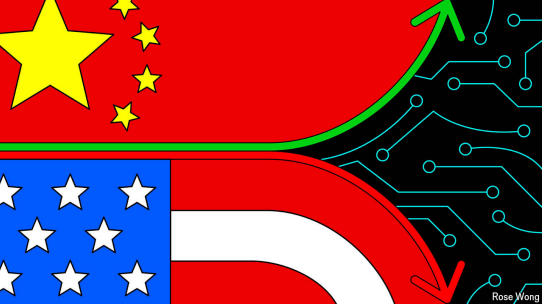
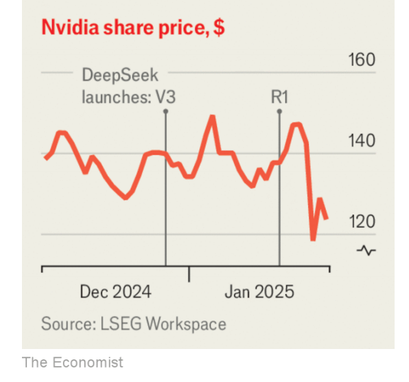

# The real meaning of the DeepSeek drama

*The Chinese model-maker has panicked investors. But it is good for the users of AI*

原文：

**T**HE MARKET reaction, when it came, was brutal. On January

27th, as investors realised just how good DeepSeek’s· “v3” and

“R1” models were, they wiped around a trillion dollars off the

market capitalisation of America’s listed tech firms. Nvidia, a

chipmaker and the chief shovel-seller of the artificial-intelligence

(AI) gold rush, saw its value fall by $600bn. Yet even if the

Chinese model-maker’s new releases rattled investors in a handful

of firms, they should be a cause for optimism for the world at large.

DeepSeek shows how competition and innovation will make AI

cheaper and therefore more useful.

当它到来时，市场的反应是残酷的。1月27日，当投资者意识到DeepSeek的“v3”和“R1”模型有多好时，他们从美国上市科技公司的市值中抹去了约1万亿美元。芯片制造商Nvidia是人工智能(AI)淘金热的主要卖家，其价值下降了6000亿美元。然而，即使这家中国模型制造商的新发布让少数公司的投资者感到不安，它们也应该成为整个世界乐观的理由。DeepSeek展示了竞争和创新将如何使人工智能更便宜，从而更有用。

学习：

shovel-seller：卖铲子的人

rattle：使紧张；（rattle的过去式和过去分词）

原文：

DeepSeek’s models are practically as good as those made by

Google and OpenAI—and have been produced at a fraction of the

cost. Barred by American export controls from using cutting-edge

chips, the Chinese firm· undertook an efficiency drive, even

reprogramming the chips it used to train the model to eke out every

drop of power. The cost of building an AI model that can stand toe-to-toe 

with the best has plummeted. Within days of its release,

DeepSeek’s chatbot was the most downloaded app on the iPhone.

DeepSeek 的模型几乎和 Google 及 OpenAI 的产品一样出色，但其成本却只是对方的一小部分。由于受美国出口管制的限制，无法使用最先进的芯片，这家中国公司开展了一场效率提升行动，甚至重新编程所使用的芯片，**竭尽所能地挖掘每一滴算力**。训练出一个能与最顶尖模型**平起平坐**的 AI 变得越来越便宜。在发布后的短短几天内，DeepSeek 的聊天机器人就成为 iPhone 上下载量最高的应用程序。

学习：

bar：禁止

eke out：勉强维持；尽量利用

>
>
>**"Eke out"**
>
>- **意思**：在这里指 **“竭力维持”** 或 **“尽量利用”**，特别是指在资源有限的情况下尽可能地提高效率或挤出额外的价值。
>- 例句：
>  - **English**: "The team managed to eke out a victory despite having fewer resources."
>  - **中文**: “尽管资源有限，团队还是勉强赢得了胜利。”
>  - **English**: "She tried to eke out a living by doing multiple part-time jobs."
>  - **中文**: “她靠做多份兼职勉强维持生计。”

toe-to-toe：针锋相对；面对面的

原文：

The contrast with America’s approach could not be starker. Sam

Altman, the boss of OpenAI, has spent years telling investors—and

America’s new president—that vast sums of money and computing

power are needed to stay at the forefront of AI. Investors have

accordingly been betting that a handful of firms stand to reap vast

monopoly-like rents. Yet if fast followers such as DeepSeek can eat

away at that lead for a fraction of the cost, then those potential

profits are at risk.

与美国的做法形成鲜明对比。OpenAI的老板萨姆·奥特曼花了几年时间告诉投资者——以及美国的新总统——保持人工智能的前沿需要大量的资金和计算能力。因此，投资者一直押注少数公司将获得巨额垄断租金。然而，如果像DeepSeek这样的快速跟随者能够以很小的成本蚕食领先地位，那么这些潜在利润就有风险了。

学习：

eat away at：侵蚀；腐蚀；消耗；使烦恼；逐渐破坏

原文：

Nvidia became the most valuable listed company in the world

thanks to a widespread belief that building the best AI required

paying through the nose for its best chips (on which its profit

margins are reported to exceed 90%). No wonder DeepSeek’s

success led to a stockmarket drubbing· for the chipmaker on

January 27th. Others in the data-centre business are also licking

their wounds, from Siemens Energy (which would have built the

turbines to power the build-out) to Cameco (which would have

provided the uranium to fuel the reactors to turn the turbines). Had

OpenAI been listed, its stock would surely have taken a tumble as

well.

英伟达之所以成为全球市值最高的上市公司，很大程度上得益于广泛流传的一种观点：打造最好的人工智能需要为最优质的芯片支付天价（据称其利润率超过90%）。因此，DeepSeek 的成功导致了1月27日芯片制造商在股市上遭遇惨败。数据中心领域的其他企业也在咬紧牙关，从负责建造涡轮机以推动扩建的西门子能源，到提供反应堆燃料的坎米科。要是 OpenAI 也上市，其股价肯定也会暴跌。

学习：

paying through the nose for

>
>
>**"paying through the nose"** 意思是 **“支付极高的价格”**，通常指为某物支付远远超过其实际价值的费用。
>
>- **English Example**: "He ended up paying through the nose for that vintage car."
>  **中文例句**: “他买那辆老爷车时花了非常贵的钱。”
>- **English Example**: "Luxury hotels often charge guests who pay through the nose for their premium services."
>  **中文例句**: “豪华酒店常常让那些为优质服务支付高额费用的客人感到价格过高。”

drubbing

>
>
>**"drubbing"** 意思是 **“惨败”** 或 **“被重创”**，常用来形容在竞争、运动比赛或市场表现中遭受严重挫折或失败。
>
>- **English Example**: "The team suffered a drubbing in last night's game."
>  **中文例句**: “球队昨晚比赛中遭遇了惨败。”
>- **English Example**: "After the disappointing earnings report, the company's stock took a drubbing in the market."
>  **中文例句**: “在令人失望的盈利报告之后，该公司的股票在市场上大幅下跌，遭到了重创。”

lick：舔；

tumble：价格、价值的）急剧下降

原文：

Yet there are far more winners than losers from the DeepSeek

drama. Some of them are even within tech. Apple will be cheering

that its decision not to throw billions at building AI capabilities has

paid off. It can sit back and pick the best models from a newly

commoditised selection. Smaller labs, including France’s Mistral

and the Emirati TII, will be racing to see if they can adopt the same

improvements, and try to catch up with their bigger rivals.

然而，在这场DeepSeek大戏中，赢家远远多于输家。他们中的一些人甚至在科技领域。苹果将会欢呼，它不投入数十亿美元建设人工智能能力的决定已经得到了回报。它可以坐下来，从新商品化的产品中挑选最好的型号。较小的实验室，包括法国的Mistral和阿联酋的TII，将竞相看看他们是否能采用同样的改进，并试图赶上他们更大的竞争对手。

原文：

Moreover, efficiency gains are likely to result in greater use of AI.

The Jevons paradox—the observation that greater efficiency can

lead to more, not less, use of an industrial input—may come into

play. The possible applications for a language model with

computing costs as cheap as DeepSeek’s ($1 per million tokens)

are vastly more numerous than those for Anthropic’s ($15 per

million tokens). Many uses for cheaper AI are as yet unimagined.

此外，效率的提高可能会导致人工智能的更多使用。杰文斯悖论——观察到更高的效率会导致更多而不是更少的工业投入的使用——可能会发挥作用。一个语言模型的可能应用，其计算成本和DeepSeek的一样便宜(每百万令牌1美元)，比Anthropic的(每百万令牌15美元)要多得多。廉价人工智能的许多用途还无法想象。

原文：

Even Nvidia may not suffer too much in the long run. Although its

market clout may be diminished, it will continue to sell chips in

vast quantities. Reasoning models, including DeepSeek’s R1 and

OpenAI’s o3, require much more computing power than

conventional large language models to answer questions. Nvidia

will be hoping to supply some of that.

即使是英伟达，长期来看也未必吃亏太多。尽管其市场影响力可能会减弱，但它将继续大量销售芯片。推理模型，包括DeepSeek的R1和OpenAI的o3，需要比传统大型语言模型更强的计算能力来回答问题。Nvidia将有望提供一部分。

原文：

However, the real winners will be consumers. For AI to transform

society, it needs to be cheap, ubiquitous and out of the control of

any one country or company. DeepSeek’s success suggests that

such a world is imaginable. Take Britain, where Sir Keir Starmer,

the prime minister, has unveiled a plan to use AI to boost

productivity. If he does not need to pay most of the efficiency gains

back to Microsoft in usage fees, his proposal has a better chance of

success. When producers’ rents vanish, they remain in the pockets

of users.

然而，真正的赢家将是消费者。要让人工智能改变社会，它需要廉价、无处不在，并且不受任何一个国家或公司的控制。DeepSeek的成功表明，这样的世界是可以想象的。以英国为例，英国首相凯尔·斯塔莫爵士公布了一项利用人工智能提高生产率的计划。如果他不需要将大部分效率收益以使用费的形式返还给微软，他的提议就更有可能成功。当生产者的租金消失时，它们仍然留在使用者的口袋里。

原文：

Some have begun to suggest that DeepSeek’s improvements don’t

count because they are a consequence of “distilling” American

models’ intelligence into its own software. Even if that were so, R1

remains a ground-breaking innovation. The ease with which

DeepSeek found greater efficiency will spur competition. It

suggests many more such gains are still to be discovered.

一些人开始认为DeepSeek的改进不算数，因为它们是将美国模型的智能“蒸馏”到自己的软件中的结果。即便如此，R1仍然是一个突破性的创新。DeepSeek轻而易举地提高了效率，这将刺激竞争。这表明还有更多这样的收获有待发现。

原文：

For two years the biggest American AI labs have vied to make ever

more marginal improvements in the quality of their models, rather

than models that are cheap, fast and good. DeepSeek shows there is

a better way. ■

两年来，美国最大的人工智能实验室竞相对他们的模型质量进行更多的边际改进，而不是廉价、快速和良好的模型。DeepSeek显示有更好的方法。■

学习：

vied：竞争；（vie的过去式和过去分词）

### 后记

2025年2月1日于山东日照。