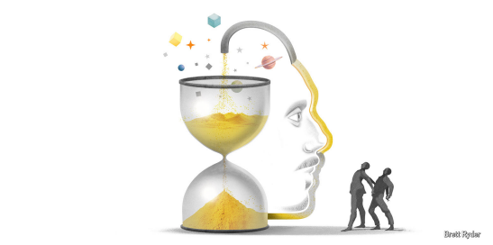

# What Elon Musk should learn from Larry Ellison

The founder of Oracle has demonstrated remarkable staying power

原文：

**D**EATH DOESN’T make sense to Larry Ellison. Especially if it is

premature like that of his doting adoptive mother, of kidney cancer

when he was 20 years old. Even mere ageing is an irritant to the co

founder of Oracle. The 80-year-old tech billionaire simply has no

time for it. He is too busy calling the shots at the business-software

giant he started in 1977 and jostling for a spot in Silicon Valley’s

race into the future, powered by daily workouts, fish, green tea and

a fridgeful of self-belief.

死亡对拉里·埃里森来说毫无道理。尤其是像他慈爱的养母那样英年早逝，在他 20 岁时死于肾癌。即便是衰老本身，对这位甲骨文公司（Oracle）联合创始人而言，也是一个恼人的存在。这位 80 岁的科技亿万富翁根本无暇顾及这些。他正忙着掌控自己于 1977 年创立的商业软件巨头，并在硅谷争相奔向未来的竞赛中争夺一席之地，全靠每日锻炼、鱼肉、绿茶和一冰箱满满的自信作为动力。

学习：

adoptive：收养的；领养的

doting：溺爱的；偏爱的

irritant：刺激的；令人恼火的；引起烦恼的

jostling：争夺

>
>
>**这里的 "fridgeful" 意思是** **“满满一冰箱的量”**，通常用来形容某样东西数量很多，多到可以装满冰箱。在这里，**"a fridgeful of self-belief"** 比喻拉里·埃里森拥有“满满一冰箱的自信”，也就是说他极度自信、自我信念十足。
>
>------
>
>**类似的用法示例如下：**
>
>- **"She keeps a fridgeful of healthy snacks for her kids."**
>   她为孩子们准备了一冰箱健康零食。
>- **"He has a fridgeful of energy drinks to keep him going through long nights."**
>   他备着一冰箱能量饮料来熬过漫长的夜晚。

原文：

The past few weeks have been full of ups and downs for Mr

Ellison. On January 21st he stood next to Sam Altman, an artificial

intelligence wunderkind, and Masayoshi Son, a hyperactive

Japanese tech investor, as President Donald Trump unveiled the

“Stargate” project to keep America First in AI by building vast data

centres to house cutting-edge models, such as those of OpenAI, Mr

Altman’s $157bn startup. The cloud infrastructure would be

provided not by Microsoft, hitherto OpenAI’s exclusive cloud

partner, but by Oracle. The market value of Mr Ellison’s firm

surged by nearly \$40bn, to $522bn. His personal fortune, derived

primarily from his 41% stake in Oracle, exceeded $210bn.

对埃里森来说，过去几周充满了起伏。1月21日，他站在人工智能神童萨姆·奥特曼和极度活跃的日本科技投资者孙正义(Masayoshi Son)旁边，美国总统唐纳德·特朗普(Donald Trump)公布了“星际之门”(Stargate)项目，通过建设庞大的数据中心来存放尖端模型，如奥特曼1570亿美元的初创公司OpenAI的模型，以保持美国在人工智能领域的领先地位。云基础设施将由甲骨文而非微软提供，微软是OpenAI迄今为止唯一的云合作伙伴。埃里森公司的市值飙升近400亿美元，至5220亿美元。他的个人财富超过2100亿美元，主要来自他在甲骨文的41%的股份。

学习：

wunderkind: 神童；奇才；天才儿童；少年得志者 美 [ˈwʊndərˌkɪnd]

hitherto: 美 [ˌhɪðərˈtuː] 迄今；迄今为止；至今；

原文：

Then came the stumble, when a whizzy Chinese firm called

DeepSeek shook investors’ belief in the need for Stargate-sized

number-crunching—and in Oracle’s valuation. Even so, Mr Ellison

remains the world’s fifth-richest man, and Oracle the third-biggest

software firm. He has a thing or two to teach fellow tech titans, in

particular his friend Elon Musk, about staying power. And it isn’t

all about diet and exercise.

尽管 DeepSeek 的出现让市场信心受挫，给 Oracle 带来了估值上的打击（一个挫折），但拉里·埃里森依然屹立不倒，是全球第五大富豪，Oracle 也是第三大软件公司，他依然可以为其他科技巨头，特别是埃隆·马斯克，展示何为持久的影响力和韧性，而不仅仅靠饮食和锻炼。学习：

stumble

>**这里的 "stumble" 意思是** **“挫折”或“失误”**，通常指在顺利发展过程中突然出现的问题、障碍或跌倒。在这里，**"Then came the stumble"** 表示 **“随后出现了一次挫折”**，指的是一家中国公司 DeepSeek 动摇了投资者对超大规模计算（Stargate 项目）必要性的信心，也影响了甲骨文公司的估值，这成为拉里·埃里森事业中的一个小挫折。
>
>------
>
>**类似的用法示例如下：**
>
>- **"The project was going well until an unexpected stumble delayed progress."**
>   这个项目进展顺利，直到一个意外的挫折导致了进度延误。
>- **"She recovered quickly after her stumble in the competition."**
>   她在比赛中的失误之后很快恢复过来。
>
>------
>
>**在此上下文中，"stumble" 说明**：
> 尽管 DeepSeek 的出现让市场信心受挫，给 Oracle 带来了估值上的打击（一个挫折），但拉里·埃里森依然屹立不倒，是全球第五大富豪，Oracle 也是第三大软件公司，他依然可以为其他科技巨头，特别是埃隆·马斯克，展示何为持久的影响力和韧性，而不仅仅靠饮食和锻炼。

whizzy：先进的

原文：

Messrs Ellison and Musk have plenty in common besides fabulous

wealth and what appears to be genuine mutual affection. They have

shared commercial interests. Between 2018 and 2022 Mr Ellison

sat on the board of Tesla, Mr Musk’s electric-car company, and at

one point owned a 1.5% stake. He also chipped in $1bn when Mr

Musk was buying Twitter, which he has since rechristened X. On

January 28th Oracle announced a partnership with SpaceX, Mr

Musk’s rocketry firm, to offer business software via SpaceX’s

Starlink satellites.

埃里森先生和马斯克先生除了巨大的财富之外，还有很多共同点，其中包括他们之间看似真诚的相互好感。他们拥有共同的商业利益。从 2018 年到 2022 年，埃里森曾是马斯克的电动汽车公司特斯拉的董事会成员，并且一度持有 1.5% 的股份。在马斯克收购推特（现在改名为 X）时，他也投入了 10 亿美元。今年 1 月 28 日，甲骨文公司宣布与马斯克的火箭公司 SpaceX 达成合作，将通过 SpaceX 的星链卫星提供商业软件服务。

学习：

Messrs：先生

>
>
>**这里的 "affection" 意思是** **“喜爱”或“亲近感”**，通常指对某人或某事的温暖感情或真挚好感。在这里，**"what appears to be genuine mutual affection"** 指的是 **“他们之间似乎存在着真诚的相互好感”**，强调拉里·埃里森和埃隆·马斯克不仅有商业往来，还彼此欣赏和支持。
>
>------
>
>**类似的用法示例如下：**
>
>- **"She showed great affection for her students."**
>   她对她的学生表现出深深的喜爱。
>- **"His affection for animals is evident in his volunteer work at the shelter."**
>   他对动物的喜爱从他在动物收容所的志愿工作中可以明显看出来。

rechristened:  美 [ri:'krisnd] 再度命名；改名；重新命名；（rechristen的过去式和过去分词）

rocketry:火箭技术；火箭学；火箭制造；火箭设计；火箭工程

原文：

Both men are technologists with an eye for the next big thing. In

the 1970s Mr Ellison spotted the commercial potential of

“relational” databases, which allow users to easily cross-reference

digital information, before anyone else; in the 2000s Mr Musk

proved similarly farsighted about electric cars (with Tesla) and

reusable rockets (with SpaceX). Both counted Uncle Sam as an

early customer: the CIA for Mr Ellison and NASA for Mr Musk. In

recent years both grew frustrated with lefty California and moved

their firms’ headquarters to business-friendlier states.

这两个人都是着眼于下一个大事件的技术专家。20世纪70年代，埃里森先生发现了“关系型”数据库的商业潜力，这种数据库允许用户比其他人更容易地交叉引用数字信息；在21世纪初，马斯克在电动汽车(特斯拉)和可重复使用的火箭(太空探索技术公司)上证明了同样的远见。两人都把山姆大叔算作早期客户:埃里森的中情局和马斯克的美国国家航空航天局。近年来，两家公司都对左翼的加州感到失望，并将公司总部搬到了对商业更友好的州。

原文：

Although Oracle and Tesla are listed, each is run like a private

business, even if it sometimes upsets Wall Street in the short run.

Each came to dominate its market. By 2012 Oracle was selling

43% of all database-management software by value, reckons

Gartner, a research firm. A decade later Teslas accounted for one in

five of all battery-powered cars bought worldwide.

尽管甲骨文和特斯拉都是上市公司，但它们都像私人企业一样运营，即使这有时会在短期内扰乱华尔街。每一家都开始主导其市场。研究公司Gartner估计，到2012年，甲骨文销售了43%的数据库管理软件。十年后，特斯拉占据了全球五分之一的电池驱动汽车销量。

原文：

A joke about Oracle’s founder is that the difference between him

and God is that the Almighty doesn’t think he is Larry Ellison. Mr

Musk relishes comparisons to Tony Stark, aka Iron Man, a Marvel

superhero—more apt for someone who prefers comic books to the

Bible but no less presumptuous. Neither likes delegating. Although

Mr Ellison has handed over the CEO reins to an able lieutenant,

Safra Catz, the closest he has to a true succession plan is funding

anti-ageing research. Mr Musk is a micromanager to the bone. And

neither is gracious about rivals, though Mr Ellison’s squabbles with

Bill Gates in the 2000s, when Oracle and Microsoft vied for

enterprise-software supremacy, now look gentlemanly compared

with Mr Musk’s expletive-filled rants on X against anyone who

disagrees with him on anything

有一个关于甲骨文创始人的笑话，说的是他和上帝的区别在于：上帝不认为自己是拉里·埃里森。马斯克先生则喜欢将自己与托尼·斯塔克（即钢铁侠，漫威超级英雄）做比较——这个比喻更适合一个喜欢漫画书而非圣经的人，但同样充满自负。两人都不喜欢授权。尽管埃里森先生已将首席执行官职务交给了一个能干的副手萨夫拉·卡茨，但他真正的继任计划就是资助抗衰老研究。马斯克则是一个彻头彻尾的微管理者。两人都不太宽容对手，尽管埃里森先生与比尔·盖茨在 2000 年代的争执——当时甲骨文和微软争夺企业软件的霸主地位——现在回头看，显得更有绅士风度，和马斯克在 X 上对任何与他意见不合的人发出的脏话式怒骂相比，差距就更大了。

学习：

Almighty：（the ~）全能者（指上帝）

relish

presumptuous：专横的；自以为是的；胆大妄为的；轻狂的；不知分寸的

rein：缰绳；控制；约束；管制；掌管

lieutenant： 美 [luːˈtenənt] 副职官员；副队长；副指挥官；代理官员；辅佐官

gracious：亲切的；和蔼的；慈祥的；优雅的；

rants：咆哮；激昂的演说；（rant的复数）

expletive：咒骂词；脏话；

原文：

This points to the first big difference between the two, one which

Mr Musk should note if he wishes to keep going strong in the

2050s, when he is Mr Ellison’s age. The younger mogul is easily

distracted. He has spread himself thin between cars, rockets, X (as

owner and power user), a tunnels business and a computer-brain

interface firm, plus a side hustle of streamlining the federal

bureaucracy on behalf of Mr Trump. Mr Ellison, by contrast,

displays a singleminded devotion to Oracle.

这指出了两者之间的第一个巨大差异，如果马斯克希望在21世纪50年代保持强劲，当他到了埃里森的年龄时，他应该注意到这一点。年轻的大亨很容易分心。他已经在汽车、火箭、X(作为所有者和超级用户)、隧道业务和计算机大脑接口公司之间分散了自己的力量，外加代表特朗普精简联邦官僚机构的副业。相比之下，埃里森表现出对甲骨文的专注。

学习：

mogul：大人物；权贵；有权势的人；大亨；巨头

hustle：忙碌；繁忙

## **Leisure doesn’t suit Larry**

原文：

This has come at the cost of his relationships—a handful of

marriages ended in divorce—and philanthropic endeavours, one of

which was run for a time by a writer at *The Economist*. But it has

worked for Oracle, which despite recent wobbles is worth nearly

three times as much as in the late 2010s, when Mr Ellison returned

to arrest its slide into irrelevance in the cloud era.

这是以他的人际关系——一些婚姻以离婚告终——和慈善事业为代价的，其中一项慈善事业曾一度由《经济学人》的一位作家经营。但这对甲骨文来说是有效的，尽管最近有所波动，但其价值仍是2010年代末的近三倍，当时埃里森先生回来阻止其在云时代变得无关紧要。

学习：

wobbles：不稳定；摇晃；（wobble的复数）

slide into：滑入；陷入；溜进          

arrest：阻止；抑制；中止；

irrelevance：无关紧要的事物          

原文：

Though Oracle’s share of its core database market is down to 17%,

behind Microsoft and Amazon, its cloud revenues are growing by

over 30% a year, much faster than at its bigger rivals. The firm is in

the running to buy TikTok’s American business, which its servers

already host, if the app’s overlords in Beijing bless a sale rather

than face a Congress-mandated ban.

尽管甲骨文在核心数据库市场的份额下降到17%，落后于微软和亚马逊，但其云收入每年增长超过30%，比其更大的竞争对手快得多。如果该应用在中国的霸主们同意出售，而不是面临国会授权的禁令，该公司有望收购抖音的美国业务，其服务器已经托管了该业务。

学习：

overlord：统治者

原文：

The second lesson is about discretion. Mr Ellison’s brash corporate

persona conceals an intensely private man whose non-business

views are almost as invisible as his company’s ubiquitous software.

His longtime support for Republicans, including Mr Trump, has not

made him sworn enemies among Democrats—wise for someone

whose firm has lots of public-sector clients. It is easy to imagine a

Democratic administration taking issue with Mr Musk, likewise a

big government contractor with SpaceX. His journey from blue to

MAGA red is littered with smouldering bridges beyond repair. But

for others, like the 39-year-old Mr Altman, there is still time to

learn. ■

第二个教训是关于谨慎的。埃里森先生那种张扬的企业形象掩盖了他本人的极度隐私性格，他的非商业观点几乎和公司无处不在的软件一样不为人知。他长期支持共和党，包括特朗普，但这并没有让他在民主党人中成为誓言的敌人——这对于有很多公共部门客户的公司来说是明智的。很容易想象，一个民主党政府可能会与马斯克发生冲突，他同样是一个政府大承包商，拥有 SpaceX。但马斯克从支持蓝色党派到转向MAGA红色的过程中，已经留下了许多无法修复的桥梁。而对于像39岁的阿尔特曼（Mr. Altman）这样的其他人来说，仍然有时间去学习。

学习：

brash：自以为是的；盛气凌人的；冒失的

persona

>**"Persona"** 意思是 **“外在表现或公众形象”**，通常指一个人在公众或他人面前展现出来的形象或性格特征。在这里，"Mr Ellison's brash corporate persona" 表示 **埃里森先生在商业领域展现出来的张扬形象**，这种形象与他实际的个性和生活方式有所不同。
>
>**类似的用法示例如下：**
>
>- **"His public persona is one of confidence and charisma, but he's actually quite shy."** 他的公众形象是自信和有魅力的，但他实际上相当害羞。
>- **"She carefully curates her online persona to attract professional opportunities."** 她精心打造她的线上形象，以吸引职业机会。
>
>**在此上下文中的意思：** "Mr Ellison’s brash corporate persona" 即 **“埃里森先生在商业领域的张扬形象”**，但实际上他是 **一个非常隐私的人，几乎没有在公众面前展示他的私人观点**。

sworn

>
>
>**"Sworn"** 意思是 **“发誓的、誓言的”**，通常用于描述因为某种强烈的原因而成为敌人的关系。在这里，"sworn enemies" 表示 **“发誓要成为敌人”**，也就是非常敌对的关系。
>
>**类似的用法示例如下：**
>
>- **"They became sworn enemies after their bitter argument."** 他们因激烈的争吵而成为了死敌。
>- **"The two countries became sworn enemies during the war."** 两国在战争中成为了死敌。
>
>**在此上下文中的意思：** “他的长期支持共和党，包括特朗普，并没有让他成为民主党人的誓言敌人”即 **“他与民主党人的敌对关系并不强烈，尽管他支持共和党”**，这是因为 **他的公司有很多公共部门客户**，所以他需要与民主党保持一定的友好关系。

smoulder：英 [ˈsməʊldə]  （无明火地）阴燃；闷烧；（感情）郁积；压在心头；被抑制的情绪（或冲突）

smouldering

>
>
>**"Smouldering"** 意思是 **“冒烟的，未完全熄灭的，仍然有潜在风险的”**，通常形容某事虽然没有爆发，但仍然存在潜在的冲突或问题。在这里，"smouldering bridges" 表示 **“烧毁的桥梁”**，强调 **马斯克与民主党之间关系的破裂**，这些桥梁在某种程度上已经无法修复。
>
>**类似的用法示例如下：**
>
>- **"The fire was smouldering in the corner of the room."** 火在房间的角落冒着烟。
>- **"After the argument, their friendship ended with smouldering tensions."** 争吵后，他们的友谊以未完全消散的紧张关系结束。
>
>**在此上下文中的意思：** “他的从支持蓝色党派到支持特朗普红色党派的转变上留下了很多无法修复的桥梁”即 **“马斯克的党派转换造成了与许多人和机构的关系破裂，这些关系仍然充满着无法解决的冲突和敌意”**。

## 后记

2025年3月23日18点19分于上海。

