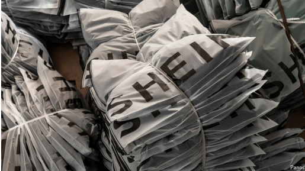

# Shein and Temu are in Donald Trump’s cross-hairs

*An end to the de minimis exemption will hurt Chinese e-commerce firms—and enrage American consumers*

针对唐纳德·特朗普，SHEIN和Temu正处于他的攻击目标之中
**——美国消费者的购物成本将上升**

>
>
>**"cross-hairs"**
>意思是 **“瞄准线”**，在这里引申为 **“成为攻击目标”** 或 **“被锁定”**，通常用于形容某人或某事正受到特别关注或批评，就像射手的瞄准器锁定了目标一样。
>
>- **English Example:** "The scandal put the politician squarely in the cross-hairs of the media."
>- **中文例句:** “这场丑闻让那位政治家成为媒体瞄准的对象。”
>- **English Example:** "After his controversial comments, he found himself in the cross-hairs of his critics."
>- **中文例句:** “在发表争议言论后，他发现自己成为了批评者攻击的目标。”

de minimis：最低减让标准

>
>
>**"de minimis waiver"**
>意思是 **“微不足道免税条款”**，指的是一种法律规定，豁免对低于某个特定价值（最近为800美元）的货物征收关税。这里的“de minimis”来源于拉丁语，意为“最小的、微不足道的”，强调这些货物的价值低到可以忽略不计。
>
>- **English Example:** "Many online shoppers benefit from the de minimis waiver, as their purchases fall below the taxable threshold."
>- **中文例句:** “许多网购者受益于微不足道免税条款，因为他们购买的商品价值低于应征税的门槛。”
>- **English Example:** "Under the de minimis waiver, goods valued under $800 are exempt from customs duties."
>- **中文例句:** “根据微不足道免税条款，价值低于800美元的货物可免征关税。”

exemption：免税

enrage：激怒

原文：

**F**OR AMERICAN CONSUMERS, online shopping has just got

dearer. On February 1st Donald Trump did away with a decades-

old provision, known as the *de minimis* waiver, that exempted

goods under a certain value (lately $800) from customs duties.

With the same stroke he raised tariffs on Chinese goods by 10%.

Then on February 5th the United States Postal Service announced

that it had temporarily suspended inbound parcels from China and

Hong Kong, before abruptly reversing, causing all manner of

confusion.

对于美国消费者来说，网购变得更加昂贵。2月1日，特朗普废除了一个沿用了几十年的规定，该规定被称为*de minimis*豁免，免除了对低于一定价值（最近为800美元）的商品征收关税。同一次举措中，他将对中国商品的关税提高了10%。随后在2月5日，美国邮政局宣布暂时停止接收来自中国大陆和香港的进境包裹，但随后又突然反转这一决定，引发了各种混乱。

学习：

dear：昂贵

do away with：废除；去掉；

provision：条款

waiver：[法律]弃权；放弃权利；弃权声明；免除；豁免；

customs duties：关税；海关关税；海关税          

stroke

>
>
>**"stroke"**
>意思是 **“一举”** 或 **“一下子”**，在这里形容特朗普以单一决断或迅速的行动完成了两项措施（取消免税规定和提高关税）。这一表达借用了绘画或书写中“一笔”完成的意象，强调行动的果断和迅速。
>
>- **English Example:** "With one stroke, the CEO announced major changes in the company's strategy."
>- **中文例句:** “CEO一下子宣布了公司战略的重大调整。”
>- **English Example:** "The government changed the policy with one bold stroke."
>- **中文例句:** “政府以一项大胆举措迅速改变了政策。”

all manner of：各种各样的；各种类型的；形形色色的          

原文：

Millions of packages arrive in America from China every day. Mr

Trump’s new trade barriers will be a blow not only to American

consumers, but also to the e-commerce companies that have cashed

in on the *de minimis* exemption. Shein, a Chinese apparel group

whose largest market is America, is now the world’s biggest fast-

fashion retailer by sales. Temu, a Boston-based offshoot of the

Chinese e-commerce firm Pinduoduo, has also expanded rapidly in

America since it launched there in 2022. TikTok, a Chinese-owned

short-video app that is currently in legal limbo in America, has

built a thriving e-commerce business there as well, through its

TikTok Shop feature.

每天都有数以百万计的包裹从中国抵达美国。特朗普的新贸易壁垒不仅对美国消费者是一个打击，对那些利用微量豁免获利的电子商务公司也是一个打击。Shein是一家中国服装集团，其最大的市场是美国，现在是世界上销售额最大的快时尚零售商。Temu是中国电子商务公司拼多多的波士顿分公司，自2022年在美国推出以来，也在美国迅速扩张。TikTok，一个中国拥有的短视频应用，目前在美国处于法律边缘，通过其抖音商店功能，也在美国建立了蓬勃发展的电子商务业务。

学习：

blow：打击

apparel：美 [əˈpærəl] 服装；

offshoot：（尤指）分支机构

limbo：不确定的状态

>
>
>**"limbo"** 的意思是 **“不确定的状态”** 或 **“悬而未决”**，通常指某件事情因法律、政治或行政程序未完成而处于停滞或不明朗的境地。在这里，"legal limbo" 表示 TikTok 在美国的法律地位尚不确定，可能面临监管、禁令或限制，但尚未有明确的裁决。
>
>------
>
>**类似的用法示例如下：**
>
>- **English Example:** "After the company's bankruptcy, the employees were left in limbo, unsure if they would ever receive their unpaid wages."
>- **中文例句:** “公司破产后，员工们陷入了不确定的状态，不知道自己是否还能拿到未支付的工资。”
>- **English Example:** "The new immigration law has left thousands of applicants in legal limbo, waiting for their cases to be processed."
>- **中文例句:** “新的移民法让数千名申请人陷入法律不确定状态，他们的案件迟迟未被处理。”
>- **English Example:** "The merger deal is stuck in limbo as regulators review potential antitrust concerns."
>- **中文例句:** “由于监管机构在审查可能的反垄断问题，该合并交易陷入了不确定状态。”
>
>------
>
>**在本文中的意思：**
>
>*"TikTok, a Chinese-owned short-video app that is currently in legal limbo in America,"*
>意思是：“TikTok 这款中国拥有的短视频应用目前在美国的法律地位尚未确定。”
>
>这表明 TikTok 可能正面临法律诉讼、监管审查，或者存在是否能继续在美国运营的不确定性。

原文：

Total *de minimis* shipments into America were worth around $80bn

in 2024, by one estimate, up from $50m in 2012. Late last year

American customs officials were processing 4m of these shipments

per day, an increase from 2.8m a year earlier. They comprise

roughly 20% of America’s e-commerce market and about 7% of all

the consumer goods imported into the country. Most come from

China.

据估计，2024年，美国的小额不收税的货物总价值约为800亿美元，高于2012年的5000万美元。去年年底，美国海关官员每天处理400万件此类货物，高于一年前的280万件。它们约占美国电子商务市场的20%,占美国所有进口消费品的7%。大多数来自中国。

原文：

The exemption helps keep prices low and speeds up processing.

Many American consumers have been willing to overlook the often

shoddy quality of products from Shein and Temu because they are

so cheap. This will change when tariffs and other customs fees are

added, which in some cases may double the price for consumers.

Logistical disruption could be an even bigger problem for the

companies, which have tended to ship products straight from

factories in China. Shipments will now be subject to more customs

procedures and data provisions from which they were exempt in

the past. This will probably overload American customs’ capacity

for processing, which is said to be strained already, and delay

deliveries.

该**豁免**（*de minimis exemption*）有助于保持低价，并加快商品的通关处理速度。许多美国消费者之所以愿意忽视 Shein 和 Temu 产品往往质量粗糙的问题，是因为它们**价格低廉**。但当关税和其他海关费用被加上去后，情况将发生变化，在某些情况下，这可能会让消费者支付的价格翻倍。

对于这些公司而言，**物流中断可能是一个更大的问题**，因为它们通常直接从中国工厂发货。现在，所有**货运**（*shipments*）将需要接受更多的海关程序，并遵守此前被豁免的数据规定。这可能会让**本已紧张的美国海关处理能力**雪上加霜，并导致**配送延迟**。

学习：

shoddy quality：劣质

Logistical disruption：物流中断

data provisions

>
>
>**"data provisions"** 的意思是 **“数据规定”**，通常指政府或机构要求企业在海关、贸易或其他合规操作中提供的特定信息或数据。在这里，"data provisions" 指的是美国海关对进口商品的新要求，即企业需要提供更多的物流、商品来源、供应链等相关数据，而这些规定以前并不适用于 Shein 和 Temu。

原文：

The changes will test Shein’s and Temu’s ability to adapt. The risk

of an end to the exemption has been hanging over their heads for

months: it was initiated by Joe Biden before he left office. The

resulting disruption will weaken their businesses, but will not be a

fatal blow, argues Mark Williams of Capital Economics, a research

firm. The companies could push more shipments through third

countries, such as Vietnam, though that would add to delivery

times, which can already be lengthy. Other options include setting

up warehouses closer to customers, to lessen delays, and sourcing

products from other countries. Shein already sources wares from

Brazil and Turkey

这些变化将考验Shein和Temu的适应能力。几个月来，取消免税的风险一直悬在他们头上:这是乔·拜登在离任前提出的。研究公司资本经济的马克·威廉姆斯认为，由此产生的混乱会削弱他们的业务，但不会是致命的打击。这些公司可以通过越南等第三国运送更多货物，尽管这将增加已经很长的交货时间。其他选择包括在离客户更近的地方建立仓库以减少延误，以及从其他国家采购产品。Shein已经从巴西和土耳其采购商品

学习：

a fatal blow：致命打击

source：采购；

原文：

Meanwhile, the fallout from ending the *de minimis* exemption will

also test Mr Trump’s resolve to wage trade battles using consumer

goods. Chinese e-commerce has been wildly popular in America.

Many products featured on Amazon, America’s favourite e-

emporium, are sold by Chinese companies. A paper by Pablo

Fajgelbaum of the University of California, Los Angeles and Amit

Khandelwal of Yale shows that poorer zip codes in America receive

more *de minimis* shipments. Ditching the exemption will therefore

disproportionately hurt poor families. Mr Trump has delayed the

forced closure of TikTok, seemingly to appease its many American

users. Perhaps angry shoppers will soon change his mind about the

*de minimis* exemption, too. ■

与此同时，取消小额免税的影响也将考验特朗普利用消费品发动贸易战的决心。中国的电子商务在美国非常受欢迎。美国最受欢迎的电子商城亚马逊上的许多产品都是由中国公司销售的。加州大学洛杉矶分校的Pablo Fajgelbaum和耶鲁大学的Amit Khandelwal的一篇论文显示，在美国，越穷的地区接收越多的小额货物。因此，取消免税将极大地伤害贫困家庭。特朗普推迟了TikTok的强制关闭，似乎是为了安抚其许多美国用户。也许愤怒的购物者也会很快改变他对小额免税的看法。■

学习：

wage：进行（斗争、讨论等）；持续从事（某活动）

emporium：美 [ɛmˈpɔriəm] 大型商场；大百货商店；商业中心

e-emporium：电子商城

ditch：抛弃；摆脱；丢弃；放弃

appease：平息；抚慰；缓和；

## 后记

2025年2月10日21点14分于上海。

