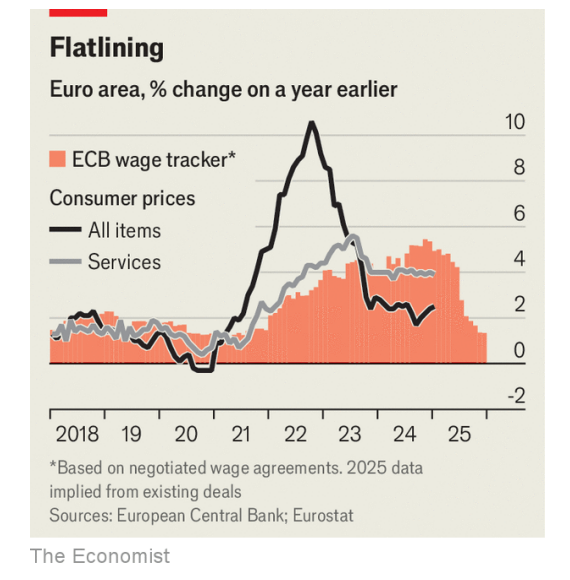

# Europe has no escape from stagnation

*Things look increasingly dark for the continent*

escape from：逃离；逃脱；从…中逃出；摆脱；避免；避开          

>
>
>这里的 **"escape"** 意思是 **“摆脱”或“逃离”**，通常用于描述无法避免某种情况或困境。在这里，**"Europe has no escape from stagnation"** 表示 **“欧洲无法摆脱经济停滞”**，强调欧洲深陷经济停滞（stagnation）之中，找不到解决办法。
>
>类似的用法示例如下：
>
>- **"There was no escape from the economic downturn; every industry was affected."**
>   经济衰退无可避免，所有行业都受到了影响。
>- **"The struggling company had no escape from bankruptcy."**
>   这家陷入困境的公司无法摆脱破产的命运。
>
>在本文上下文中，"escape" 强调 **欧洲经济面临结构性停滞，当前政策措施不足以带来真正的复苏**，暗示欧洲可能长期处于低增长甚至零增长的状态。

原文：

**I**T IS HARD to avoid the soft bigotry of low expectations. The

EU’s statistics bureau titled a recent release—showing no

economic growth in the last quarter of 2024—“GDP stable in the

euro area”. “Stagnant” would have been more accurate.

**很难避免“低期望的温和偏见”。** 欧盟统计局最近发布的一份报告显示，2024 年最后一个季度的经济增长为零，但该报告的标题却是——**“欧元区 GDP 保持稳定”**。实际上，**“停滞”** 可能更为准确。

学习：

bigotry：美 [ˈbɪɡətri] 偏执；顽固；不宽容

>
>
>**"bigotry" 的意思**
>
>**"bigotry"** 指 **“偏执”或“固执的偏见”**，通常用于描述对某种观点、群体或现象的顽固歧视或偏见。在这里，"the soft bigotry of low expectations" 直译为 **“低期望的温和偏见”**，意思是 **对某个群体或情况设定的期望过低，从而形成一种隐性的歧视或偏见**。
>
>**类似用法示例**：
>
>- "Some teachers fall into the trap of the soft bigotry of low expectations, assuming that students from disadvantaged backgrounds cannot achieve high academic success."
>  一些教师陷入了**低期望的温和偏见**，认为来自贫困家庭的学生无法取得高学业成就。
>- "Policies should challenge individuals to do better rather than reinforce the soft bigotry of low expectations."
>  政策应该鼓励个人做得更好，而不是加深**低期望的温和偏见**。

原文：

Policymakers, at least, are increasingly alarmed by the situation.

Ursula von der Leyen and Christine Lagarde, head of the European

Commission and European Central Bank respectively, together

wrote recently that faster growth was needed to protect the quality

of life of Europeans, and their security. The intent was to jolt

politicians and the public into action.

政策制定者至少对当前形势越来越警觉。欧盟委员会主席 **乌尔苏拉·冯德莱恩** 和欧洲央行行长 **克里斯蒂娜·拉加德** 最近联合撰文，表示更快的经济增长对于**保护欧洲人的生活质量和安全**至关重要。他们的目的在于**让政客和公众猛然警觉并采取行动**。

学习：

>
>
>**"jolt" 的意思**
>
>**"jolt"** 指 **“使震惊；使猛然醒悟”**，通常用于描述某种突如其来的刺激或冲击，使人警觉或采取行动。在这里，"The intent was to jolt politicians and the public into action." 意思是 **“其目的是让政客和公众猛然警觉并采取行动。”**
>
>**类似用法示例**：
>
>- "The sudden economic downturn jolted the government into implementing urgent reforms."
>  **突如其来的经济衰退促使政府紧急实施改革。**
>- "The shocking news of the disaster jolted the entire nation."
>  **灾难的震惊消息让整个国家都为之一震。**

原文：

But where is growth supposed to come from? Europe’s ageing

population is not as innovative as it once was, dampening

productivity. The global economy will no longer support Europe’s

export-led approach. Investment requires confidence in the future.

Consumers are fearful, with many choosing to keep money in the

bank. The ECB remains busy fighting inflation and governments

are avoiding difficult reforms for fear of a populist backlash. Small

wonder, then, that even optimistic growth forecasts for this year

barely go beyond 1%.

但是增长应该从哪里来呢？欧洲老龄化的人口不像以前那样具有创新精神，抑制了生产力。全球经济将不再支持欧洲的出口导向模式。投资需要对未来有信心。消费者感到恐惧，许多人选择把钱存在银行。欧洲央行仍忙于抗击通胀，各国政府因担心民粹主义反弹而回避艰难的改革。难怪今年即使是乐观的增长预测也仅仅超过1%。

学习:

dampen：抑制

原文：

One idea is that, as inflation subsides, the ECB can return to

stimulating the economy with lower interest rates. ECB

policymakers have already cut their main rate from 4% in June to

2.75%. Markets expect them to reach 2% by the year’s end, as

wage growth cools, which would, in turn, cut cost pressures for

firms. Yet the problem is that prices are still rising by 2.5% a year.

Those for services are particularly hot, increasing at 4% a year.

Thus hope of much looser policy will probably prove forlorn.

一种想法是，随着通胀消退，欧洲央行可以重新以较低的利率刺激经济。欧洲央行决策者已经将主要利率从6月份的4%下调至2.75%。随着工资增长降温，市场预计到今年年底将达到2%，这反过来将减轻企业的成本压力。然而问题是价格仍以每年2.5%的速度上涨。服务业尤其火爆，年增长率为4%。因此，放宽政策的希望可能会被证明是渺茫的。

学习：

subside：减弱

forlorn：美 [fərˈlɔːrn] 被遗弃的；无人照顾的；不可能成功的；无助的；无援的；没希望的

原文：

Analysts had thought consumers might spur the economy once

their real wages started to rise. Now that pay packets are swelling,

however, they are refusing to play their part. The euro-zone

household savings rate tended to hover at around 12% before the

covid-19 pandemic. As of October, the date of the most recent data

release, it was above 15%. Consumer sentiment has recently

dropped again, to below its long-term average. Europe’s gloom, it

turns out, is resistant even to higher wages.

分析人士原本认为，一旦**实际工资开始上涨**，消费者可能会推动经济增长。然而，现在**薪资增长**了，消费者却**拒绝发挥这一作用**。

在新冠疫情爆发前，欧元区**家庭储蓄率**通常维持在 **12% 左右**。但截至**最新数据发布的 10 月**，这一比例已**超过 15%**。**消费者信心**最近再次下降，低于其长期平均水平。事实证明，欧洲的**消极情绪**甚至**对工资上涨也具有抗性**。

学习：

pay packets：工资包，工资

hover： 悬停；盘旋；徘徊；犹豫

原文：

External demand is unlikely to come to the rescue either. China is

hellbent on exporting its manufacturing surplus to the world, rather

than buying more from Europe. America no longer wants to play

the role of consumer of last resort, and could push more Chinese

goods Europe’s way by raising trade barriers. Although in theory

trade deals could fuel the EU’s export machine, protectionists, led

by France, will attempt to slow things down, as can be witnessed in

their opposition to a deal with Mercosur, a large South American

trade group.

外部需求也不太可能出手相救。中国不顾一切地向世界出口其制造业盈余，而不是从欧洲购买更多。美国不再想扮演最终消费者的角色，并可能通过提高贸易壁垒将更多的中国商品推向欧洲。尽管理论上贸易协议可以推动欧盟的出口机器，但以法国为首的保护主义者将试图减缓这一进程，他们反对与南美大型贸易集团南方共同市场(Mercosur)达成协议就是明证。

学习：

hellbent：坚决的；疾驰的；拼命的

last resort：最后不得已；万不得已；最后手段

原文：

The continent’s leaders have explored making use of the EU’s

budget-deficit rules to spend more on defence, in order to protect

against possible future Russian aggression. Germany, one of the

bloc’s most miserly members, needs to invest and has the money,

which the next government may make use of after a forthcoming

election. Greater government spending should therefore offer some

support to the European economy, but it is unlikely to provide a

large boost. Italy has to cut spending to stabilise its debt; France

has to do so to bring down an outsize deficit.

欧洲大陆的领导人已经探索利用欧盟的预算赤字规则来增加国防开支，以抵御俄罗斯未来可能的侵略。德国是欧元区最吝啬的成员国之一，它需要投资并拥有资金，下届政府可能会在即将到来的选举后利用这些资金。因此，增加政府支出应该会为欧洲经济提供一些支持，但不太可能提供大的提振。意大利不得不削减开支以稳定其债务；法国不得不这样做，以降低巨额赤字。

学习：

miserly：吝啬的；小气的；极少的；微小的

>
>
>这里的 **"miserly"** 意思是 **“吝啬的”或“节俭的”**，通常用来形容某人或某个实体在花钱方面极度谨慎，甚至到了过度节省的程度。在这里，"Germany, one of the bloc’s most miserly members" 表示 **德国是欧盟中最节俭的成员之一**，强调德国在财政政策上的保守态度。
>
>类似的用法示例如下：
>
>- **"The company is miserly when it comes to giving employee bonuses."**
>  这家公司在发放员工奖金方面非常吝啬。
>- **"He is so miserly that he refuses to turn on the heating even in winter."**
>  他非常节俭，甚至在冬天也不愿意开暖气。
>
>在本文上下文中，"miserly" 形容德国政府长期以来在财政支出上的谨慎态度，尽管它**有足够的资金进行投资**，但往往**不愿意增加开支**。

outsize：特大号的；超大的；巨大的；

原文：

That leaves businesses’ animal spirits. A rejigging of the global

economy creates plenty of opportunities. New forms of technology,

not least artificial intelligence, are waiting to be adopted. The green

revolution, where Europe has a head start, is gaining followers

around the world. But if companies are keen to splash the cash,

they have a funny way of showing it. Their investment rate has

steadily fallen since 2019. Now Donald Trump’s protectionist

policies may induce export-minded firms to invest in America

instead.

这就剩下了企业的动物精神。全球经济的重组创造了大量机会。新形式的技术，尤其是人工智能，正等待着被采用。欧洲领先的绿色革命正在世界各地赢得追随者。但是，如果公司热衷于挥金如土，他们有一种有趣的方式来展示这一点。自2019年以来，他们的投资率稳步下降。如今，唐纳德·特朗普的保护主义政策可能会诱使出口导向型企业转而投资美国。

学习：

rejig：重新调整

not least：（强调某一例证或原因）尤其是；特别是

a head start：优势；有利条件；有利的开端；领先；

minded: 有…倾向的；

原文：

The commission’s leaders are putting their faith in supply-side

reforms, hoping to simplify regulation, remove single-market

barriers and knit together capital markets. Although this is a good

start, the plans seem unlikely to get the bloc anywhere near the

€800bn ($830bn, or 4.5% of GDP) in annual investment that Mario

Draghi, a former president of the ECB, envisaged in a doorstopper

of a report on the European economy he published in September.

To become green, remain prosperous and live securely, the EU and

its member states will have to go further. Stable GDP is not

enough. ■

欧盟委员会的领导人寄希望于供给侧改革，希望简化监管，消除单一市场壁垒，整合资本市场。虽然这是一个良好的开端，但该计划似乎不太可能让欧元区接近8000亿欧元(8300亿美元，或GDP的4.5%)的年度投资，这是欧洲央行前行长马里奥·德拉吉(Mario Draghi)在9月份发表的一份关于欧洲经济的报告中所设想的。为了变得绿色、保持繁荣和安全地生活，欧盟及其成员国必须更进一步。稳定的GDP是不够的。■

学习：

knit：紧密结合；使紧密结合；使团结一致

>
>
>这里的 **"doorstopper"** 意思是 **“厚重的大部头书”**，通常用来形容一本非常厚、内容庞杂、阅读起来费力的书籍。在这里，"a doorstopper of a report" 形容 **Mario Draghi 在 9 月发布的关于欧洲经济的报告非常厚重、内容详尽**，意味着这份报告信息量极大，需要深入研究。
>
>类似的用法示例如下：
>
>- **"He just finished reading a doorstopper of a novel—over 1,000 pages long!"**
>   他刚读完一本厚重的小说，足足有 1000 多页！
>- **"The new tax reform bill is a real doorstopper, filled with complex legal jargon."**
>   新的税收改革法案是一份真正的大部头文件，里面充满了复杂的法律术语。
>
>在本文上下文中，"doorstopper" 强调 **Mario Draghi 的报告篇幅庞大、信息丰富**，并且提出了**欧盟经济转型所需的巨大投资规模（€8000 亿）**，以凸显当前改革措施可能**远远不足**。

## 后记

2025年2月14日22点45分于上海。