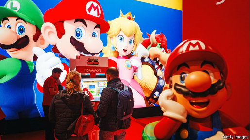
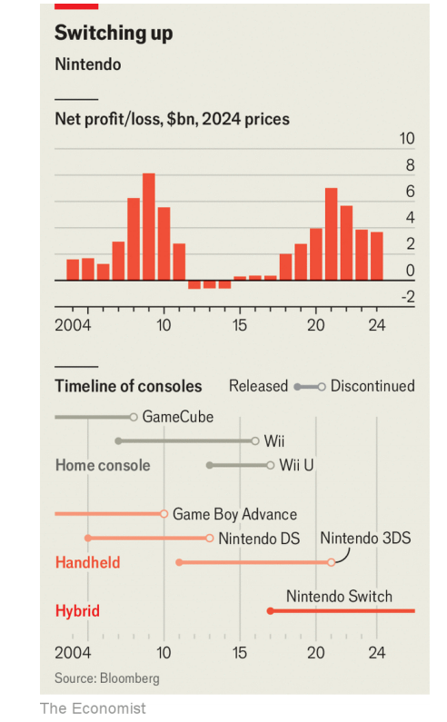

# Can Nintendo’s new console propel it to even greater heights?

*The Switch 2 is another bet that price and portability will beat processing clout*

**任天堂的新游戏机能否让它再创辉煌？**
**Switch 2 是任天堂的一次新赌注——它相信价格和便携性将胜过计算处理能力。**

文章的标题和副标题表明，**任天堂继续押注“便携性+实惠价格”**，而非 **“硬件性能”**，这一策略是否能延续 **Switch 1 的成功**，仍值得关注。

Nintendo：美 [nin'tendo] 任天堂（日本电子游戏公司及其开发的电脑游戏名称）

console：手柄

>
>
>**"console" 的含义**
>
>这里的 **"console"** 指的是 **“游戏机”**，通常指视频游戏设备，如 **Nintendo Switch、PlayStation、Xbox** 等。
>在本文中，**"Nintendo’s new console"** 指的是 **任天堂即将推出的新一代游戏机（Switch 2）**。
>
>**类似的用法示例**
>
>- *The PlayStation 5 is one of the most popular gaming consoles in the world.*
>  （PlayStation 5 是全球最受欢迎的游戏机之一。）
>- *Handheld consoles like the Nintendo Switch are great for gaming on the go.*
>  （像 Nintendo Switch 这样的便携式游戏机非常适合随时随地玩游戏。）

任天堂的新游戏机能让它更上一层楼吗？

>**"clout" 的含义**
>
>**"clout"** 在这里的意思是 **“影响力、力量”**，可以指个人、公司或技术方面的权威和实力。在科技或商业领域，**"clout"** 通常用来描述企业的市场影响力或技术竞争力。
>
>**类似的用法示例**
>
>- *The CEO has a lot of political clout in the industry.*
>  （这位 CEO 在行业内拥有很大的政治影响力。）
>- *Apple’s brand clout helps it dominate the smartphone market.*
>  （苹果品牌的影响力帮助它主导了智能手机市场。）

>
>
>**"processing clout" 的含义**
>
>**"processing clout"** 结合了 **"processing"（处理能力）** 和 **"clout"（影响力、实力）**，在这里指的是 **“计算处理能力”**，即游戏机的 **图形处理能力（GPU）、中央处理器（CPU）** 等核心硬件性能。
>文章提到，**Switch 2 的核心策略仍然是“价格和便携性”胜过“高性能”**，意味着任天堂仍然不会专注于与 **PlayStation 或 Xbox** 竞争 **顶级硬件性能**，而是更看重**性价比和便携性**。
>
>**类似的用法示例**
>
>- *The latest gaming PC has unmatched processing clout for high-end graphics.*
>  （最新的游戏 PC 在高端图形处理能力方面无可匹敌。）
>- *Smartphones are improving their processing clout to handle more advanced AI applications.*
>  （智能手机正在提升处理能力，以支持更高级的 AI 应用。）

portability： 轻便；可携带性；可携带

原文：

**T**HE WORLD’S most successful maker of gaming hardware has

not released a new console for nearly eight years. Yet the fanfare

around the Nintendo Switch 2, expected to launch in the next few

months, has been relatively quiet. Last month Nintendo released a

brief video introducing the machine, which looks much like its

predecessor. Under the plastic casing things are no more exciting:

analysts expect the console to pack about as much processing

punch as Sony’s PlayStation 4 (PS4), which is more than 11 years

old.

**全球最成功的游戏硬件制造商已经近八年没有发布新游戏机了。然而，预计将在未来几个月推出的 Nintendo Switch 2，并没有引起太大的轰动。**
**上个月，任天堂发布了一段简短的视频介绍这款新设备，它的外观与前代产品相似。而在塑料外壳之下，情况也没有更令人兴奋的变化：分析人士预计，这款游戏机的处理能力大约与 11 年前的 PlayStation 4（PS4）相当。**

文章强调了 **Switch 2 在性能上的保守策略**，即它的计算能力并不会达到 PlayStation 5 或 Xbox Series X 的水平，而是 **更接近于上一代主机（PS4）**，这可能会让部分玩家感到失望。

学习：

fanfare：号角齐鸣（欢迎仪式等上奏的响亮短曲）；（为庆祝而在媒体上的）炫耀；大张旗鼓

casing：外壳；包层；护套；罩

>
>
>**"punch" 的含义**
>
>这里的 **"punch"** 指的是 **“力量”** 或 **“冲击力”**，在科技或性能相关的语境下，通常指 **计算能力、图形处理能力或整体性能**。
>
>**类似的用法示例**
>
>- *This small laptop packs a surprising punch for its size.*
>  （这款小型笔记本电脑的性能令人惊讶。）
>- *The new camera delivers an impressive punch in terms of image quality.*
>  （这款新相机在图像质量方面表现强劲。）

>**"pack processing punch" 的含义**
>
>**"pack"** 在这里的意思是 **“装载、配备”**，而 **"processing punch"** 结合了 **"processing"（处理能力）** 和 **"punch"（力量）**，整体意思是 **“具备强劲的计算处理能力”**。
>在本文中，**"pack about as much processing punch as the PS4"** 的意思是：**Switch 2 的性能大致相当于 11 年前的 PlayStation 4，并不会带来革命性的提升**。
>
>**类似的用法示例**
>
>- *This budget smartphone packs enough processing punch for casual gaming.*
>  （这款平价智能手机的处理能力足以应对休闲游戏。）
>- *The new tablet packs a powerful processing punch, making it great for video editing.*
>  （这款新平板的处理能力非常强劲，适合视频编辑。）

原文：

The Switch 2 is a sheep in sheep’s clothing. So why is Nintendo’s

share price at an all-time high? As greater computing power leads

to diminishing improvements to the gaming experience, Nintendo

is betting that consumers are willing to trade processing oomph for

portability and price. That proved to be a winning gamble with the

original Switch. With its next console, Nintendo is doubling down

on the strategy

**Switch 2 是一款“表里如一的普通产品”。那么，为什么任天堂的股价却创下历史新高？**
**随着计算能力的提升对游戏体验的边际收益递减，任天堂押注于消费者愿意用计算性能换取便携性和价格优势。这一策略在初代 Switch 上已被证明是成功的赌注。而在即将推出的新主机上，任天堂正加倍坚持这一策略。**

文章强调了 **Switch 2 并没有带来惊喜性的性能升级**，但 **任天堂依然押注便携性和价格优势，以吸引消费者**。

学习：

oomph：美 [ʊmf] 魅力；吸引力；活力；劲头；

>
>
>**"oomph" 的含义**
>
>**"oomph"** 是一个俚语，表示 **“动力、冲击力、活力”**，通常用于描述 **产品的性能、吸引力或整体影响力**。
>
>**类似的用法示例**
>
>- *This car lacks oomph; the acceleration is too slow.*
>  （这辆车动力不足，加速太慢。）
>- *The speech needed more oomph to really inspire the audience.*
>  （这次演讲需要更有感染力，才能真正激励听众。）

processing oomph

>**"processing oomph" 的含义**
>
>**"processing oomph"** 结合了 **"processing"（计算能力）** 和 **"oomph"（动力、冲击力）**，指的是 **设备的计算能力和性能强度**。
>
>在本文中，**"trade processing oomph for portability and price"** 的意思是：
>**任天堂认为消费者愿意牺牲更强的计算性能（处理能力），来换取便携性和更低的价格。**
>
>**类似的用法示例**
>
>- *This laptop doesn’t have much processing oomph, but it’s ultra-light and cheap.*
>  （这款笔记本电脑计算能力一般，但非常轻便且价格便宜。）
>- *Gamers want more processing oomph for high-resolution graphics and faster frame rates.*
>  （游戏玩家希望拥有更强的计算性能，以支持高分辨率画面和更快的帧率。）

>
>
>**"a sheep in sheep’s clothing" 的含义**
>
>**"a sheep in sheep’s clothing"** 是对常见短语 **"a wolf in sheep’s clothing"（披着羊皮的狼）** 的戏谑变体。
>
>- "A wolf in sheep’s clothing" 形容的是 **表面温和、内在危险** 的事物。
>- **"A sheep in sheep’s clothing"** 则表示 **“外表普通，内部也没有隐藏的惊喜”**，即 **表里如一、没有任何隐藏实力或特别之处**。
>
>在本文中，"The Switch 2 is a sheep in sheep’s clothing" 的意思是：**Switch 2 没有任何突破性的升级，它的外观和性能都与前代产品相似，没有隐藏的强大性能**。
>
>**类似的用法示例**
>
>- *This budget car is a sheep in sheep’s clothing—don’t expect any hidden luxury features.*
>  （这款廉价汽车表里如一，别指望它有隐藏的豪华配置。）
>- *The new software update is just a sheep in sheep’s clothing; it barely changes anything.*
>  （这个新的软件更新毫无惊喜，几乎没有任何变化。）

原文：

Early rounds of the “console wars” were defined by competition

over what the machines could do. Each new generation of console

represented a step change in graphical fidelity or gaming

mechanics. Nintendo’s N64, released in 1996, catapulted Mario

from two dimensions into three; Sony’s PlayStation 2, launched in

2000, rendered a formerly blocky Lara Croft in glorious curves.

**早期的“游戏机大战”主要围绕着硬件性能展开竞争。每一代新游戏机都在图形精细度或游戏机制上带来了飞跃性的进步。**
**1996 年，任天堂推出的 N64 让马里奥从 2D 进入 3D 世界；2000 年，索尼发布的 PlayStation 2 使曾经方块状的劳拉·克劳馥变成了流畅的曲线。**

学习：

step change：阶跃变化          

>
>
>**"step change" 的含义**
>
>**"step change"** 指的是 **“重大变化、飞跃性的进步”**，通常用于描述一个系统、技术或过程在某一阶段发生的 **显著改进**。
>
>在本文中，**"Each new generation of console represented a step change in graphical fidelity or gaming mechanics"** 的意思是：
>**“每一代新游戏机都在图形精细度或游戏机制上带来了飞跃性的进步。”**
>
>**类似的用法示例**
>
>- *The introduction of electric cars marked a step change in the automobile industry.*
>  （电动汽车的引入标志着汽车行业的重大变革。）
>- *The company’s AI technology has undergone a step change, making it far more powerful than before.*
>  （公司的 AI 技术实现了飞跃性的进步，使其比以往更强大。）

fidelity： 美 [fɪˈdeləti] 准确性；保真度；逼真度；

catapultted：美 [ˈkætəˌpʌltid] 用弩炮发射；用弹射器发射；推向

blocky

>
>
>**"blocky" 的含义**
>
>**"blocky"** 形容 **“方块状的、生硬的、不够流畅的”**，通常用于描述低分辨率的图像或粗糙的图形设计。
>
>在本文中，**"rendered a formerly blocky Lara Croft in glorious curves"** 的意思是：
>**“让过去方块状的劳拉·克劳馥（《古墓丽影》主角）变成了流畅的曲线。”**
>这里指的是 **早期《古墓丽影》游戏中的角色模型比较粗糙，而 PlayStation 2 的提升使其画面变得更加细腻和流畅。**
>
>**类似的用法示例**
>
>- *Old video games had blocky graphics due to low resolution.*
>  （老游戏由于分辨率低，画面显得方块化。）
>- *The animation looked blocky and unnatural, as if it were made of Lego bricks.*
>  （这个动画看起来很生硬、不自然，就像是用乐高积木拼出来的。）

原文：

Today each update is marginal. Sony’s PS5 Pro, a hulking $700

beast released in November, offers improvements over the PS5 that

are imperceptible to most players. As a result, many no longer

bother to upgrade: nearly half of active PlayStation gamers still use

an old PS4, Sony says. Game publishers increasingly cater to older

machines: Electronic Arts recently released a version of its latest

“Star Wars” game for the PS4, more than a year after it launched on

the PS5

今天，每次更新都是微不足道的。索尼11月发布的PS5 Pro是一款700美元的庞然大物，它比PS5有很多改进，但是大多数玩家都感觉不到。因此，许多人不再费心升级:索尼表示，近一半活跃的PlayStation游戏玩家仍在使用老款PS4。游戏发行商越来越迎合老机器:电子艺界在PS5上推出一年多后，最近为PS4发布了最新版的“星球大战”游戏

学习：

cater to：迎合

原文：

The first generation of Nintendo’s Switch proved that a console no

longer needs to be cutting edge to be a commercial hit. On

February 4th Nintendo reported that lifetime sales of the device had

reached 151m, just shy of the record set by the PS2 20 years ago.

The Switch pushed Nintendo’s operating profit close to an all-time

high, though it has recently begun to fall again as the device has

aged (see chart). The Switch 2 will be backwards-compatible,

meaning millions of existing Switch users can upgrade and still

play their old games. Analysts expect the new console to cost a

modest $400-500 (Trumpian tariffs notwithstanding), which should

also help sales.

任天堂的第一代Switch证明了一台游戏机不再需要成为商业成功的先锋。2月4日，任天堂报告称，该设备的终身销售额已达1 . 51亿英镑，仅略低于20年前PS2创下的记录。这一转变将任天堂的营业利润推至接近历史最高水平，尽管随着设备老化，该利润最近开始再次下降(见图表)。Switch 2将向后兼容，这意味着数百万现有的Switch用户可以升级，仍然可以玩他们的旧游戏。分析师预计，这款新游戏机的价格将在400-500美元之间(尽管有特朗普关税)，这也将有助于销售。

学习：

commercial hit：商业大片；商业热点；商业热门          

shy of：次于

backwards-compatible：向后兼容

notwithstanding：虽然，尽管

原文：

Although still underpowered relative to its peers, Nintendo’s new

console promises more computing might than the first-generation

Switch. That creates a “potentially transformative opportunity” for

game publishers, says Matthew Ball, a technology analyst. Many of

the most popular titles of recent years, such as Activision’s “Call of

Duty” or Take-Two’s “Red Dead Redemption 2”, cannot run on the

Switch. Nintendo’s new console will offer enough power to support

them. The chance to reach millions of gamers on Nintendo’s

platform opens a big new market for these publishers.

尽管与同类产品相比，任天堂的新游戏机仍然动力不足，但它承诺比第一代Switch拥有更强的计算能力。技术分析师马修·鲍尔(Matthew Ball)表示，这为游戏发行商创造了一个“潜在的变革机会”。许多近年来最受欢迎的游戏，如动视的《使命召唤》或Take-Two的《红色死亡救赎2》，都不能在Switch上运行。任天堂的新游戏机将提供足够的电力来支持他们。在任天堂平台上接触数百万游戏玩家的机会为这些发行商打开了一个巨大的新市场。

原文：

They need it: soaring development costs and stagnant demand have

pushed many game-makers into crisis. Last month Electronic Arts

sharply reduced its revenue forecast for the year. Ubisoft’s future is

uncertain following a string of flops; the French game-maker has

lost around 90% of its market value since its peak in 2018. Even

Sony and Microsoft, Nintendo’s biggest rivals, are expected to

publish more games on its platform to recoup the rising costs of

development. Sony recently released “LEGO Horizon Adventures”

on the Switch, and Microsoft is encouraging Xbox users to “play

anywhere”, selling gaming subscriptions that can be used on any

device.

他们需要它:飙升的开发成本和停滞的需求已经将许多游戏制造商推入危机。上个月，艺电大幅降低了今年的收入预期。在经历了一连串的失败后，育碧的未来是不确定的；自2018年达到峰值以来，这家法国游戏制造商已经损失了约90%的市值。即使是任天堂最大的竞争对手索尼和微软，也有望在其平台上发布更多游戏，以补偿不断上涨的开发成本。索尼最近在Switch上发布了“乐高地平线冒险”，微软正在鼓励Xbox用户“在任何地方玩”，出售可以在任何设备上使用的游戏订阅。

学习：

recoup：美 [rɪˈkuːp] 收回；偿还；补偿

原文：

The Switch 2’s sales are unlikely to match those of its predecessor,

believes Josh Chapman of Konvoy, a venture-capital fund focused

on gaming. Whereas the Switch originally faced little competition

in the handheld market, the space is now becoming crowded. The

portable Steam Deck, released in 2022 by Valve, another video

game company, offers PC titles on the move. Valve announced last

month that it will also power new portable consoles made by

Lenovo. Microsoft and Sony are said to be working on handheld

Xbox and PlayStation devices. If the old console wars were about

building the mightiest machines, the next battle may be about

building the smallest. ■

**Konvoy 这家专注于游戏行业的风投基金的 Josh Chapman 认为，Switch 2 的销量可能无法匹敌它的前代产品。最初，Switch 在掌机市场几乎没有竞争对手，而如今这一领域已变得拥挤不堪。**
**2022 年，另一家电子游戏公司 Valve 推出了便携式 Steam Deck，使玩家可以在移动中游玩 PC 游戏。Valve 上个月还宣布，它将为联想等公司生产的便携式游戏机提供技术支持。与此同时，据传微软和索尼也在研发便携版的 Xbox 和 PlayStation 设备。如果说过去的游戏机大战比拼的是硬件性能的强大，那么下一场战斗可能比拼的就是谁能造出最小的掌机。**

学习：

>
>
>**"title" 的含义**
>
>**"title"** 在这里指的是 **“电子游戏”**，特别是某个平台或公司发布的特定游戏作品。
>
>在本文中，**"The portable Steam Deck, released in 2022 by Valve, another video-game company, offers PC titles on the move."** 的意思是：
>**“2022 年，另一家电子游戏公司 Valve 推出了便携式 Steam Deck，使玩家可以在移动中游玩 PC 游戏。”**
>这里的 **"PC titles"** 就是 **“PC 游戏”**，指的是可在个人电脑上游玩的游戏作品。
>
>**类似的用法示例**
>
>- *The PlayStation 5 launched with several exclusive titles, including "Demon’s Souls" and "Spider-Man: Miles Morales".*
>  （PlayStation 5 上市时推出了几款独占游戏，比如《恶魔之魂》和《蜘蛛侠：迈尔斯·莫拉莱斯》。）
>- *Nintendo is famous for its first-party titles like "The Legend of Zelda" and "Super Mario".*
>  （任天堂以其第一方游戏闻名，比如《塞尔达传说》和《超级马里奥》。）

## 后记

2025年2月16日21点57分于上海。

