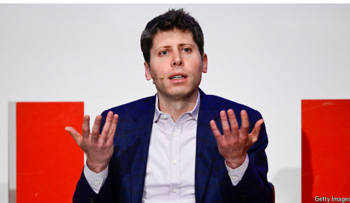

# Elon Musk’s $97bn offer is a headache for Sam Altman’s OpenAI

*Tesla’s boss is willing to use whatever means he can to hobble his opponent*

hobble：美 [ˈhɑbəl] 妨碍；跛行；阻止；

原文：

**F**OR MOST startups, a buyout offer nearing $100bn is something

to be celebrated. But OpenAI is not like other startups—and Elon

Musk· is not like other acquirers.

对于大多数初创公司来说，接近1000亿美元的收购要约是值得庆祝的事情。但OpenAI不像其他创业公司——埃隆·马斯克也不像其他收购者。

学习：

buyout：企业收购；股权收购          

原文：

On February 11th a consortium led by Mr Musk, the world’s richest

man, made an unsolicited $97bn bid for the assets of the non-profit

entity that controls OpenAI, the leading developer of artificial

intelligence (AI) models. Mr Musk, who helped found the firm, is

in an escalating feud with Sam Altman, OpenAI’s boss, over its

transition to a more orthodox, for-profit corporate structure, which

Mr Musk claims would be a betrayal of the company’s original,

safety-first mission. In reality, Mr Musk is bent on hobbling the

biggest competitor to xAI, a rival company he launched in 2023—

and seems willing to use whatever means he can to do so.

2月11日，由世界首富马斯克先生领导的财团主动出价970亿美元收购控制人工智能(AI)模型领先开发商OpenAI的非盈利实体的资产。马斯克帮助创建了这家公司，他与OpenAI的老板萨姆·奥特曼之间的不和正在升级，争论的焦点是open ai向更正统的盈利性公司结构的过渡，马斯克声称这将背叛公司最初的安全第一的使命。实际上，马斯克一心想要拖垮xAI的最大竞争对手，而xAI是他在2023年创办的一家公司，他似乎愿意使用一切可能的手段来做到这一点。

学习：

consortium：美 [kənˈsɔːrtiəm] 联盟；财团；联合体；合资企业

unsolicited：主动提供的；自发的；未被要求的；未受邀请的

feud：美 [fjuːd] 长期争吵；宿怨；夙怨；世仇；不和；积怨；纠纷

原文：

Mr Musk’s offer is best understood as a spoiler. OpenAI is raising

ever larger sums of money to fund the vast amount of computing

power it needs to make advanced AI. To do that, it has promised

outside investors, of which Microsoft, a tech giant, is the biggest,

that they will get equity stakes in a for-profit company, rather than

the murky ownership fudge that currently exists. Negotiations are

under way to determine what share of that new firm the non-profit

receives in return for ceding control over the current arrangement.

马斯克的提议最恰当的理解是 **搅局行为**。OpenAI 正在筹集越来越多的资金，以支持其运行先进 AI 所需的 **庞大计算资源**。为了实现这一目标，该公司向外部投资者（其中最大的投资者是科技巨头 **微软**）承诺，他们将获得 **营利性公司** 的 **股权**，而不是目前这种 **模糊不清的所有权安排**。目前，谈判正在进行，以确定 **非营利组织（OpenAI 的母机构）** 在 **让渡当前架构的控制权** 后，能够获得多少新公司股份作为回报。

学习：

get equity stakes：获得股权

murky：模糊的

>
>
>**"spoiler" 的含义**
>
>这里的 **"spoiler"** 意思是 **“搅局者”或“破坏者”**，通常指某人或某事通过介入某个进程，破坏或干扰其原本的计划。在这个语境下，**"Mr Musk’s offer is best understood as a spoiler"** 表示 **“马斯克的提议更像是一种搅局行为”**，暗示他并非真正想要收购 OpenAI，而是通过此举扰乱 OpenAI 目前的融资和决策进程。

原文：

OpenAI swiftly rejected the outside bid. On X, Mr Musk’s social

network, Mr Altman posted a facetious counter-offer: $9.7bn to

“buy Twitter”, as the site was once called. “OpenAI is not for sale,”

insists Chris Lehane, the firm’s spokesman. That apparently reflects

the position of the non-profit’s board. Jill Horwitz, professor of law

at the University of California, Los Angeles, says the board’s

fiduciary duty is to act in line with OpenAI’s legal purpose, which

is to build superhuman intelligence that is “safe and benefits all of

humanity”. That may give it more wriggle room to reject the offer.

OpenAI迅速拒绝了外界的出价。在马斯克的社交网络X上，奥特曼发布了一个滑稽的还价:97亿美元“收购Twitter”，该网站曾被称为Twitter。“OpenAI是非卖品，”该公司发言人Chris Lehane坚称。这显然反映了非营利组织董事会的立场。加州大学洛杉矶分校(University of California，Los Angeles)法学教授吉尔·霍维茨(Jill Horwitz)表示，董事会的受托责任是按照OpenAI的法律宗旨行事，即建立“安全并造福全人类”的超人智能。这可能会给它更多拒绝提议的回旋余地。

学习：

facetious：美 [fəˈsiʃəs] 诙谐的；滑稽的；爱开玩笑的；

fiduciary:美 [fəˈd(j)uʃiˌɛri] 基于信任的；托管的；代理的

wriggle：美 [ˈrɪɡl] 蠕动；扭动；曲折移动

wriggle room：回旋余地

原文：

Mr Musk’s target audience, though, may not be the board. More

probably he is seeking to ratchet up pressure on the attorneys-

general of California and Delaware, where OpenAI is based and

registered. His lawyers have urged them to scrutinise the change in

OpenAI’s ownership structure to ensure the charity surrenders

control at fair-market value, and threatens a bidding war if they do

not. Insiders at OpenAI think it absurd that the officials in the two

Democrat-governed states will bow to the will of Mr Musk, a

prominent ally of President Donald Trump. But as Ms Horwitz puts

it, they have “clear law to apply”.

不过，马斯克的目标受众可能不是董事会。更有可能的是，他正试图向OpenAI总部和注册地加州和特拉华州的总检察长施压。他的律师敦促他们仔细审查OpenAI所有权结构的变化，以确保该慈善机构以公平的市场价值放弃控制权，并威胁说，如果他们不这样做，就会发生竞购战。OpenAI的内部人士认为，这两个民主党执政的州的官员将屈从于总统唐纳德·特朗普(Donald Trump)的重要盟友马斯克的意愿是荒谬的。但正如霍维茨女士所说，他们有“明确的法律可以适用”。

学习：

ratchet up：（使）有一定上升；（使）有一定提高          

attorneys-general：总检察长

原文：

It is therefore possible that, even if Mr Musk’s chances of gaining

control of OpenAI are slim, his bid will complicate its future. It

will be more difficult to justify valuing the non-profit’s assets at

less than $97bn if there is a concrete offer for that sum. But such a

figure will mean that a smaller share of the equity in the new for-

profit company will be left for outside investors. OpenAI is said to

be in the process of raising some $40bn from investors including

SoftBank, a Japanese tech conglomerate. Mr Musk may be hoping

to derail those efforts.

因此，即使马斯克先生获得OpenAI控制权的可能性很小，他的出价也可能会使其未来复杂化。如果有具体的出价，将更难证明这家非营利机构的资产估值低于970亿美元是合理的。但这样的数字意味着，新的盈利性公司将有更少的股权留给外部投资者。据说OpenAI正在从包括日本科技集团软银在内的投资者那里筹集大约400亿美元。马斯克可能希望破坏这些努力。

学习：

derail：使出轨；使脱轨

derail those efforts：破坏这些努力，使之付之东流

原文：

The bid follows acrimony over Mr Altman’s announcement,

together with Mr Trump, of the “Stargate Project” on January 21st,

a fund of $100bn backed by OpenAI and SoftBank, among others,

and intended to invest in data centres in America. Mr Musk, who

was reportedly kept in the dark, was quick to argue that the backers

did not have the money (something they have denied)

此次收购提议的背景是 **阿尔特曼的公告引发的激烈争议**。1 月 21 日，阿尔特曼与特朗普共同宣布了 **“Stargate 计划”**，该计划由 OpenAI 和 **软银** 等机构支持，规模达 **1000 亿美元**，旨在投资美国的数据中心。**马斯克 reportedly（据报道）对此毫不知情**，他迅速质疑该项目的投资方是否真的有足够的资金（而对方否认了这一说法）。

学习：

>
>
>**"acrimony" 的含义**
>
>这里的 **"acrimony"** 意思是 **“尖刻、怨恨”**，通常用于形容因争执或分歧而产生的敌意或恶劣气氛。在这个语境下，**"The bid follows acrimony over Mr Altman’s announcement"** 表示 **“此次收购提议是在阿尔特曼的公告引发激烈争议之后发生的”**，暗示马斯克等人与阿尔特曼之间因该项目产生了不满和对立情绪。
>
>------
>
>**类似的用法示例**
>
>- *The acrimony between the two executives was evident during the heated board meeting.*
>  （这两位高管在激烈的董事会议上显然充满敌意。）
>- *After years of acrimony, the two countries finally reached a trade agreement.*
>  （经过多年的激烈争执，这两个国家最终达成了贸易协议。）

原文：

“I think he’s just trying to slow us down,” Mr Altman said on

February 11th. “I feel for the guy. I don’t think he’s a happy

person.” In fact, Mr Musk is never happier than when he is in the

thick of a fight. ■

“我认为他只是想让我们慢下来，”奥特曼先生在2月11日说。“我同情那家伙。我不认为他是一个快乐的人。”事实上，马斯克最开心的时候莫过于战斗最激烈的时候。■

学习：

feel for：同情；摸索；寻找          

## 后记

2025年2月15日22点58分于上海。