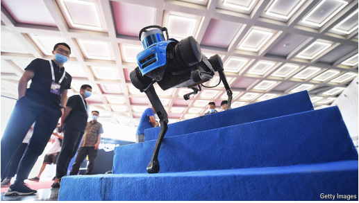

# Behind DeepSeek lies a dazzling Chinese university

It models itself on Stanford, and is in the tech hotspot of Hangzhou

原文：

**A** HUGE STATUE of Mao Zedong still stands near the entrance to

Zhejiang University, surveying the transformation of the eastern

city of Hangzhou, 175km (110 miles) south-west of Shanghai.

Such statues look anachronistic wherever they linger across China,

but especially so here, and especially after the events of the past

few months.

一座巨大的毛泽东雕像仍然矗立在浙江大学的入口处，俯瞰着杭州这座位于上海西南175公里(110英里)的东部城市的变化。

学习：

survey：俯瞰

anachronistic：美 [əˌnækrə'nɪstɪk] 时代错误的

linger：继续存留；

原文：

The recent revolution in Hangzhou has not been a Maoist one, but a

technological one. DeepSeek, the AI company whose

groundbreaking models stunned foreign competitors last month,

was developed in Hangzhou. It was founded by Liang Wenfeng, an

alumnus of Zhe Da, as the university is known (from its Chinese

name, Zhejiang Daxue). Zhe Da is still largely unknown outside

China, but it is at the heart of a dynamic new ecosystem of

researchers and entrepreneurs in the city that models itself on

California’s Silicon Valley

学习：

alumnus：美 [əˈlʌmnəs] 校友；毕业生

原文：

That ecosystem came into sharp focus on February 17th, when

China’s leader, Xi Jinping, met a group of tech entrepreneurs in

Beijing·. Among them was Jack Ma, who founded Alibaba, an e

commerce giant, in Hangzhou in 1999, but then disappeared from

view in 2020 after criticising the financial regulator. Another was

Mr Liang, who studied artificial intelligence at Zhe Da and made

his first forays into business there. China’s leader apparently

bringing Mr Ma in from the cold so publicly, and meeting with Mr

Liang, will only fuel Hangzhou’s growth.

学习：

forey：美 [ˈfɔrˌeɪ] （改变职业、活动的）尝试；短暂尝试；初步尝试；

原文：

Zhe Da has already grown fast in recent decades, buying high-end

equipment and hiring top-tier scientists. Some 70,000 students and

faculty now live and work across its seven campuses, in blocky

buildings overlooking lakes and plum trees. Hangzhou and other

cities have said they want to transform their universities into

“innovation ecosystems”. Zhe Da has not only become a research

powerhouse but, even more importantly, has been adept at turning

bright young students into business leaders. It says it will be a

“world-class” university by 2027. Alumni say it is modelling itself

on Stanford University rather than China’s most prestigious

colleges in Beijing and Shanghai.

近几十年来，浙大已经快速发展，购买高端设备，雇佣顶尖科学家。大约70，000名学生和教职员工现在生活和工作在它的七个校区，在可以俯瞰湖泊和李子树的块状建筑里。杭州和其他城市表示，他们希望将自己的大学转变为“创新生态系统”。浙大不仅成为了一个研究巨头，更重要的是，它善于将聪明的年轻学生培养成商业领袖。据说，到2027年，它将成为一所“世界级”大学。校友们表示，该校正在效仿斯坦福大学(Stanford University)，而不是北京和上海最负盛名的中国高校。

学习：

faculty：教职工

overlooking：俯视，眺望；（overlook的现在分词形式）          

plum：梅子；梅树；李子；李树

原文：

This may sound fanciful, and on overall measures of reputation and

student experience by the QS World University Rankings, Zhe Da

ranks 47th globally. Yet by some metrics, the university has already

eclipsed many of the world’s best. It now produces more scientific

papers than any other university, according to the latest Leiden

ranking, a measure of the volume of research output. It is behind

only Harvard in producing papers deemed to be in the top 10% of

their fields

这听起来可能有点异想天开，根据QS世界大学排名的声誉和学生体验的总体衡量，浙大在全球排名第47位。然而，从某些指标来看，这所大学已经让许多世界顶尖大学黯然失色。根据最新的莱顿排名，它现在比任何一所大学产生更多的科学论文，莱顿排名是研究产出量的一个衡量标准。在发表的论文被认为是该领域前10%的方面，它仅次于哈佛

原文：

Alumni are among the wealthiest entrepreneurs in China, according

to rankings by Hurun, a research firm, of those with more than 5bn

yuan ($700m) in assets. They include Colin Huang, the founder of

Pinduoduo, an e-commerce giant, and Duan Yongping, an

electronics tycoon.

根据研究公司胡润的排名，浙大校友是中国最富有的企业家之一，拥有超过50亿元人民币(7亿美元)的资产。他们包括电子商务巨头拼多多的创始人黄峥和电子大亨段永平。

原文：

In recent months the university’s reputation for enterprise has

reached new heights. China is abuzz with talk of the “Six Little

Dragons” of Hangzhou, a clutch of zippy startups, three of which

were founded by Zhe Da alumni. DeepSeek is one. Another is

Manycore Tech, a 3D-design software firm, which on February

15th announced a plan to list in Hong Kong this year. Then there is

DEEP Robotics, which specialises in dog-like robots (pictured),

used for patrolling and rescue operations.

最近几个月，这所大学的企业声誉达到了新的高度。中国正在热议杭州的“六小龙”，这是一群充满活力的初创企业，其中三家是由浙大校友创办的。DeepSeek就是一个。另一家是3D设计软件公司Manycore Tech，该公司于2月15日宣布了今年在香港上市的计划。然后是DEEP Robotics，它专门研究像狗一样的机器人(如图)，用于巡逻和救援行动。

学习：

abuzz：议论纷纷的；嘈杂的；喧闹的；喧哗的

a clutch of：一些

zippy：有活力的；快速的

原文：

Three factors lie behind the university’s success. The first is its

ability to attract and foster talent. Although many students in China

yearn for a stable government job, Zhe Da has long drawn more

daring souls, who throw themselves into startup competitions

where they can pitch business ideas to get university funding. Their

professors are unusual, too, encouraging students to dabble across

disciplines in order to spark ideas, and trying to foster what they

call a “mistake-tolerant” atmosphere.

这所大学成功的背后有三个因素。首先是它吸引和培养人才的能力。尽管许多中国学生渴望一份稳定的政府工作，但浙大长期以来吸引了更多勇敢的人，他们投身于创业竞赛，在那里他们可以提出商业想法，以获得大学资金。他们的教授也不同寻常，鼓励学生涉猎不同学科以激发灵感，并试图培养他们所谓的“容忍错误”的氛围。

学习：

foster talent：培养人才

yearn for：渴望；向往；

stable government job：稳定的工作

daring：大胆的；勇敢的；无畏的；冒险的

pitch：提出（建议）；

dabble：涉猎

原文：

When Huang Chaoyu was in high school he built a temperature

controlled tank for his pet fish. Now a 21-year-old undergraduate

studying materials science at Zhe Da, he has set up a company with

his supervisor aiming to produce a kind of biological “glue” to help

heal wounds. Pure research is important for breakthroughs, he says,

but “to truly change society you need industry”. Mr Huang is part

of a special class, first offered in 1999, that helps science students

learn about entrepreneurship. It meets in a shared workspace where

a sleek white robot stands near a poster calling on students to “dare

to innovate”. On average, one fifth of the class starts a company

within five years of graduating, say university officials. Alumni

help them find funding, internships and contacts.

黄上高中时，为他的宠物鱼建了一个温控水箱。21岁的他现在是浙大大学材料科学专业的本科生，他和导师一起成立了一家公司，旨在生产一种帮助愈合伤口的生物“胶水”。他说，纯研究对突破很重要，但“要真正改变社会，你需要工业”。黄先生是一个特殊班级的一员，这个班级于1999年首次开设，旨在帮助理科生了解企业家精神。会议在一个共享的工作区举行，一个光滑的白色机器人站在一张呼吁学生“敢于创新”的海报旁。大学官员表示，平均而言，五分之一的学生在毕业后五年内创办了一家公司。校友帮助他们寻找资金、实习机会和人脉。

学习：

set up a company：成立公司

science students：理科生

sleek：光滑的；有光泽的；光亮的

contacts：人脉

change society：改造社会；变革社会          

原文：

Many faculty members start companies, too. Chinese universities

are typically uneasy about distractions from academic pursuits. But

Zhe Da has been helping its scientists commercialise their findings

for decades, says Jin Yiping, a university administrator. In 2009 it

set up an institute dedicated to this purpose. DEEP Robotics is run

by Zhu Qiuguo, a professor at the school of engineering. His

colleague, Gao Chao, runs a company which makes textiles from

graphene, an advanced material.

许多教师也创办了公司。中国的大学通常担心学术追求受到干扰。但是浙大几十年来一直在帮助其科学家将他们的发现商业化，一位大学管理人员金说。2009年，它为此成立了一个研究所。DEEP Robotics由工程学院教授朱秋国负责。他的同事高朝经营着一家用石墨烯这种先进材料制造纺织品的公司。

学习：

uneasy：不安的；忧虑的；

university administrator：大学管理人员

graphene：美 ['græfɪnɪ] 石墨烯

原文：

The second factor helping Zhe Da is location. Hangzhou is a

liveable canal-crossed city just 45 minutes by train from Shanghai,

but a long way from the politicians in the capital. After the

Communist Party took power in 1949, state planners largely

ignored it, leaving space for private firms to re-emerge when

reforms began in 1978. Of the top 100 companies in Hangzhou, 82

are private, a high proportion for a large Chinese city. Its GDP per

person is nearly double the national average.

帮助浙大的第二个因素是地理位置。杭州是一个运河两岸的宜居城市，从上海乘火车只需45分钟，但离首都的政客们却很远。1949年共产党掌权后，国家计划者基本上忽视了这一点，在1978年改革开始时，为私营企业的重新崛起留下了空间。在杭州的前100家公司中，有82家是私营企业，这对于一个中国大城市来说是一个很高的比例。它的人均GDP几乎是全国平均水平的两倍。

学习：

liveable：宜居的

原文：

That Mr Ma’s company, Alibaba, was founded here has also had an

impact. The university describes the firm as a “good neighbour,

partner and friend”. In 2017 Mr Ma made a big donation to a

university hospital. In 2023 Alibaba donated its quantum

computing lab to the university. For nearly a decade Alibaba and

the university have jointly run a research centre for what they call

“frontier technologies” such as computer vision. It takes interns

and post-doctoral students from the university and helps them find

jobs in industry.

马云的公司阿里巴巴在这里成立也产生了影响。该大学将该公司描述为“好邻居、好伙伴和好朋友”。2017年，马云向一所浙大医院捐赠了一大笔钱。2023年，阿里巴巴将其量子计算实验室捐赠给了该大学。近10年来，阿里巴巴和该大学联合运营了一个研究中心，研究他们所谓的“前沿技术”，如计算机视觉。它接收大学的实习生和博士后，并帮助他们在工业界找到工作。

原文：

Third, Hangzhou officials are known for getting things done

without asking for favours or fancy dinners, says Zhang Jie, an

investor and Zhe Da alumna. This makes it easier for young

graduates to start companies. Most government services can be

used through an app, notes a local entrepreneur. Officials love tech

firms. They offer startup founders with PhDs up to 15m yuan in

funding if they move to the city

第三，投资者、毕业于浙大大学的张杰(音译)表示，杭州官员以不需要宴请或者申请，就提供帮助完成事情而闻名。这使得年轻的毕业生更容易创办公司。一位当地企业家指出，大多数政府服务都可以通过应用程序使用。官员们喜欢科技公司。他们为拥有博士学位的创业者提供高达1500万元的资金，如果他们搬到城市的话

学习：

fancy dinners：豪华晚餐

alumna： 美 [əˈləmnə] 女校友；女毕业生

原文：

Other universities are trying to emulate Hangzhou’s success.

Tsinghua in Beijing is producing AI talent, much of which gets

hired by DeepSeek. The South China University of Technology in

Guangzhou has close links with China’s electric-vehicle industry.

But Hangzhou’s mix is hard to replicate, notes Yao Yang, an

economist at Peking University. And talent tends to cluster in a few

spots, not disperse to many

其他大学正试图效仿杭州的成功。北京的清华大学正在培养人工智能人才，其中许多人被DeepSeek聘用。广州的华南理工大学与中国的电动汽车行业有着密切的联系。但是北京大学的经济学家姚洋指出，杭州的混合很难复制。人才往往聚集在少数几个地方，而不是分散到许多地方

学习：

disperse： 美 [dɪˈspɜːrs] 分散

## **Going global**

原文：

Zhe Da still faces challenges in competing on a global level. One

problem is that it relies largely on the government for funding. That

has served it well so far, but leaves it at the mercy of changing

official priorities and fiscal constraints. Alumni are generous but

building up an endowment to match, say, Stanford’s $36bn is

unlikely. And even then, the university must defer to officials on

how to spend it.

浙大在全球竞争中仍然面临挑战。一个问题是，它在很大程度上依赖政府提供资金。到目前为止，这种做法很好地服务了它，但却让它受到了不断变化的官方优先事项和财政约束的摆布。校友们很慷慨，但建立一个与斯坦福大学360亿美元相当的捐赠基金是不太可能的。即便如此，大学也必须遵从官员的意见，决定如何支出。

学习：

defer to：听从；尊重          

原文：

Compared with its overseas peers, few of Zhe Da’s faculty or

students are from outside China. It has poached elite researchers

from American universities (including, last year, Sun Song, a star

mathematician from the University of California, Berkeley) but

they are typically of Chinese descent. Political tensions with the

West do not help. Nor do the barriers to free speech common in

China.

与海外同行相比，浙大的教师和学生很少来自中国以外。它从美国大学挖走了精英研究人员(包括去年加州大学伯克利分校的明星数学家孙松)，但他们通常都是华裔。与西方的政治紧张没有帮助。言论自由的障碍等等。

学习：

poach：挖走

descent：美 [dɪˈsent] 血统；出身；家系；祖先；

of Chinese descent：中国血统

原文:

For all that, Zhe Da shows that “the tectonic plates of global higher

education are shifting very dramatically”, says William Kirby, a

China expert at Harvard Business School. In January China

released a plan to become an “education power…with global

influence” by 2035. Not long ago that goal would have looked

overly ambitious. Now, places like Zhe Da have made it look

surprisingly likely. ■

哈佛商学院的中国问题专家威廉·柯比说，尽管如此，浙大表明“全球高等教育的构造板块正在发生巨大变化”。今年1月，中国发布了一项计划，计划到2035年成为“具有全球影响力的教育强国”。不久前，这个目标看起来过于雄心勃勃。现在，像浙大这样的地方让这看起来很有可能。■

学习：

tectonic：美 [tɛkˈtɑnɪk] 地壳构造的；结构上的；建筑学的；影响深远的；重大的；显著的

tectonic plates：板块；构造板块；地质构造板块          

## 后记

2025年2月27日18点32分于上海。

