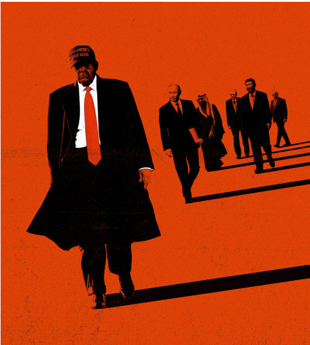

# Donald Trump has begun a mafia-like struggle for global power

*But the new rules do not suit America*

原文：

**T**HE RUPTURE of the post-1945 order is gaining pace. In

extraordinary scenes at the UN this week, America sided with

Russia and North Korea against Ukraine and Europe. Germany’s

probable new chancellor, Friedrich Merz, warns that by June

NATO may be dead. Fast approaching is a might-is-right world in

which big powers cut deals and bully small ones. Team Trump

claims that its dealmaking will bring peace and that, after 80 years

of being taken for a ride, America will turn its superpower status

into profit. Instead it will make the world more dangerous, and

America weaker and poorer.

1945年后秩序的破裂正在加速。在本周联合国非同寻常的场景中，美国站在俄罗斯和朝鲜一边，反对乌克兰和欧洲。可能成为德国新总理的弗里德利希·默茨警告说，到六月，北约可能会寿终正寝。一个强权即公理的世界即将到来，在这个世界里，大国达成协议，欺负小国。特朗普团队声称，它的交易将带来和平，在被愚弄了80年之后，美国将把它的超级大国地位转化为利润。相反，这将使世界更加危险，美国更加虚弱和贫穷。

学习：

rupture：美 [ˈrʌptʃər] （关系的）破裂；决裂；裂开

gaining pace：加快步伐

cut deals：达成交易

原文：

You may not be interested in the world order—but it is interested in

you. America’s Don Corleone approach has been on display in

Ukraine. Having initially demanded $500bn, American officials

settled for a hazy deal for a joint state fund to develop Ukrainian

minerals·. It is unclear if America will offer security guarantees in

return

你可能对世界秩序不感兴趣，但它对你感兴趣。美国的堂-科利昂方法已经在乌克兰展现。在最初要求5000亿美元后，美国官员接受了一项模糊的协议，同意成立一个联合国家基金来开发乌克兰矿产。尚不清楚美国是否会提供安全保障作为回报

原文：

The administration is a swirl of ideas and egos but its people agree

on one thing: under the post-1945 framework of rules and alliances,

Americans have been suckered into unfair trade and paying for

foreign wars. Mr Trump thinks he can pursue the national interest

more effectively through hyperactive transactions. Everything is up

for grabs·: territory, technology, minerals and more. “My whole life

is deals,” he explained on February 24th, after talks on Ukraine

with Emmanuel Macron, the French president. Trump confidants

with business skills, such as Steve Witkoff, are jetting between

capitals to explore deals that link up goals, from getting Saudi

Arabia to recognise Israel to rehabilitating the Kremlin.

本届政府是各种想法和自我的漩涡，但它的人民同意一件事:在1945年后的规则和联盟框架下，美国人被骗进了不公平的贸易，并为外国战争买单。特朗普认为，他可以通过极度活跃的交易更有效地追求国家利益。一切都是可以争夺的:领土、技术、矿产等等。2月24日，在与法国总统埃马纽埃尔·马克龙就乌克兰问题进行会谈后，他解释道:“我的一生就是交易。”。史蒂夫·威特科夫(Steve Witkoff)等具有商业技巧的特朗普亲信正穿梭于各国首都之间，探索将目标联系起来的交易，从让沙特承认以色列到修复和克里姆林宫的关系。

学习：

swirl：漩涡

sucker：欺骗；诱骗；欺诈

up for grabs：人人可得的；供人争夺的；待人认领的；可供争取的；

confidants：密友；知己；（confidant的复数）

rehabilitating：美 [ˌri:həˈbiliteitɪŋ] 修复；（rehabilitate的现在分词）

原文：

This new system has a new hierarchy. America is number one. Next

are countries with resources to sell, threats to make and leaders

unconstrained by democracy. Vladimir Putin wants to restore

Russia as a great imperial power. Muhammad bin Salman wants to

modernise the Middle East and fend off Iran. Xi Jinping is both a

committed communist and a nationalist who wants a world fit for a

strong China. In the third rank are America’s allies, their

dependence and loyalty seen as weaknesses to exploit.

学习：

fend off：抵挡；抵御

原文：

Territory is up for negotiation, detonating the post-1945 rules.

Ukraine’s boundary may be set by a Trump-Putin handshake. The

borders of Israel, Lebanon and Syria have been blurred by 17

months of war. Some outside powers are indifferent to this. Yet Mr

Trump has eyed up Gaza, as well as Greenland and in any Sino-American 

talks, Mr Xi could bid for territory, too, for example

offering to limit exports in return for concessions on Taiwan, the

South China Sea or the Himalayas.

学习：

detonate：美 [ˈdɛtnˌeɪt] 爆炸；使爆炸；引爆；起爆

concession：让步

原文：

Haggling over the economy goes far beyond tariffs to embrace a

fusion of state power and business. That signals a retreat from the

idea that commerce is best governed by neutral rules. Bilateral

discussions between America and Russia, Saudi Arabia, Taiwanese

executives and Ukraine include oil output, construction contracts,

sanctions, Intel plants, the use of Elon Musk’s Starlink satellite

service and a desert golf tournament.

围绕经济的讨价还价远远超出了关税，而是包含了国家权力和商业的融合。这标志着商业最好由中性规则管理的观念的倒退。美国与俄罗斯、沙特阿拉伯、台湾高管和乌克兰之间的双边讨论包括石油产量、建筑合同、制裁、英特尔工厂、使用埃隆马斯克的Starlink卫星服务和沙漠高尔夫锦标赛。

学习：

haggling：争论；讨价还价；（haggle的现在分词形式）

原文：

The new dealmakers claim their approach will benefit the world.

Mr Trump argues it is also in America’s interest. Are they correct?

Both Mr Trump and leaders in the global south are right to say that

the post-1945 order had decayed. When diplomacy stagnates,

unconventional ideas can work—think of the Abraham accords

between Israel and some Arab states.

新的交易撮合者声称，他们的方法将造福世界。特朗普辩称，这也符合美国的利益。他们是正确的吗？特朗普和全球南方的领导人都有理由说，1945年后的秩序已经衰落。当外交停滞时，非常规的想法可以发挥作用——想想以色列和一些阿拉伯国家之间的亚伯拉罕协议。

学习：

in America’s interest：符合美国的利益

accords：协议

原文：

Yet it is a leap from there to using dealmaking as an organising

principle. The complexity is overwhelming: Saudi Arabia wants a

defence deal to deter Iran, which America may grant if it

recognises Israel. But that requires Israel and the Palestinians to

endorse a two-state future, which Mr Trump rejected in his plan to

bring peace to Gaza. Russia wants oil sanctions lifted, but that

could cut Saudi Arabia’s income and increase India’s bills. And so

on. Meanwhile, when borders are contestable wars will follow.

Even giants like India may feel insecure. Because Mr Trump views

power as personal rather than anchored by America’s institutions,

he may find it hard to persuade his counterparts that agreements

will endure—one reason he is no Henry Kissinger·.

然而，将交易撮合作为一种组织原则，这是一个飞跃。复杂性是压倒性的:沙特阿拉伯想要一份防御协议来威慑伊朗，如果它承认以色列，美国可能会同意。但这需要以色列和巴勒斯坦认可两国未来，而特朗普在给加沙带来和平的计划中拒绝了这一点。俄罗斯希望解除石油制裁，但这可能会减少沙特阿拉伯的收入，增加印度的账单。诸如此类。与此同时，当边界存在争议时，战争就会接踵而至。甚至像印度这样的巨人也会感到不安全。因为特朗普认为权力是个人的，而不是由美国的机构维系的，他可能会发现很难说服他的对手协议会持久——这是他不是亨利·基辛格的一个原因。

学习：

lift：解除（制裁）

原文：

The world will therefore suffer. What Mr Trump does not realise is

that America will suffer, too. Its global role has imposed a military

burden and an openness to trade that has hurt some American

industries. Yet the gains have been much greater. Trade benefits

consumers and importing industries. Being the heart of the dollar

financial system saves America over $100bn a year in interest bills

and allows it to run a high fiscal deficit. The foreign business of

American firms is worth $16trn. Those firms thrive abroad because

of reasonably predictable and impartial global rules on commerce,

rather than graft and transient special favours—an ethos that suits

Chinese and Russian firms far better.

世界将因此遭殃。特朗普没有意识到的是，美国也会遭殃。它的全球角色带来了军事负担和贸易开放，损害了一些美国产业。然而，收益要大得多。贸易有利于消费者和进口行业。作为美元金融体系的核心，美国每年节省超过1000亿美元的利息账单，并允许其维持较高的财政赤字。美国公司的海外业务价值16万亿美元。这些公司在国外蓬勃发展，是因为合理可预测和公正的全球商业规则，而不是贪污和短暂的特殊照顾——这种风气更适合中国和俄罗斯的公司。

学习：

graft：贪污

transient：英 [ˈtrænziənt] 短暂的；暂时的

special favours：特殊照顾

ethos：美 [ˈiːθɑːs] 风气；（某团体或社会的）道德思想

原文：

Mr Trump believes that America can partially or fully abandon

Europe and perhaps its Asian allies, too. He says it has a “beautiful

ocean as a separation”. However, wars now involve space and

cyberspace, so physical distance offers even less protection than it

did in 1941, when Japan’s attack on Pearl Harbor ended America’s

isolationism. What is more, when America wants to project hard

power or defend the homeland, it depends on allied help, from the

Ramstein airbase in Germany and Pine Gap signals station in

Australia to missile-tracking in Canada’s Arctic. In Mr Trump’s

world, America may no longer have free access to them.

特朗普认为，美国可以部分或全部抛弃欧洲，或许还有亚洲盟友。他说它有一个“美丽的海洋作为分离”。然而，现在战争涉及空间和网络空间，因此物理距离提供的保护甚至不如1941年，当时日本偷袭珍珠港结束了美国的孤立主义。此外，当美国想要投射硬实力或保卫本土时，它依赖于盟国的帮助，从德国的拉姆斯坦空军基地和澳大利亚的派恩盖普信号站到加拿大北极地区的导弹跟踪。在特朗普的世界里，美国可能不再能自由接触它们。

学习：

airbase：空军基地

原文：

Advocates of dealmaking assume that America can get what it

wants by bargaining. Yet as Mr Trump exploits decades-old

dependencies, America’s leverage will rapidly fall away. Sensing

betrayal, allies in Europe and beyond will turn to each other for

security·. If chaos spreads, America will have to deal with new

threats even as it has fewer tools: think of an Asian nuclear-arms

race in a system with weak American alliances and weaker, or

broken, arms control. At a dangerous time, friends, credibility and

rules are worth more than a quick buck. Congress, financial

markets or voters could yet persuade Mr Trump to walk back. But

the world has already started planning for a lawless era. ■

交易撮合的倡导者认为美国可以通过讨价还价得到想要的东西。然而，随着特朗普利用几十年的依赖关系，美国的影响力将迅速下降。感受到背叛，欧洲内外的盟友将相互寻求安全。如果混乱蔓延，美国将不得不应对新的威胁，尽管它拥有的工具更少:想象一下亚洲核军备竞赛，在这样一个体系中，美国的联盟很弱，军备控制也更弱或已被打破。在危险时刻，朋友、信誉和规则比快钱更有价值。国会、金融市场或选民仍有可能说服特朗普收回成命。但是这个世界已经开始为一个无法无天的时代做准备了。■

学习：

a quick buck：快钱；轻松赚的钱；迅速赚到的钱

lawless：无法无天的；违法的；不受法律约束的；无秩序的；混乱的          

## 后记

2025年3月1日20点50分于上海。