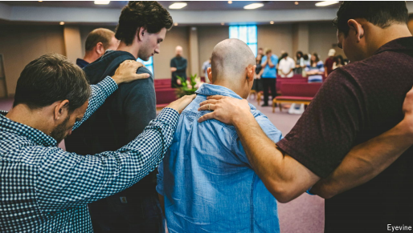
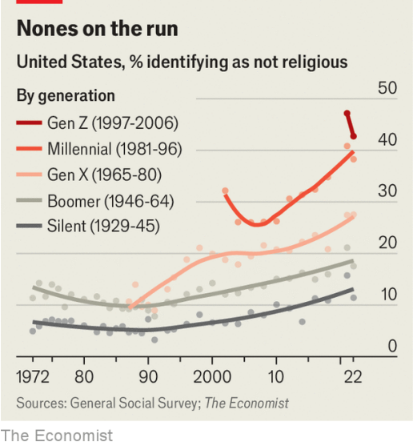

# America’s Gen Z has got religion

*Because of them, a long decline in the number of Christians has levelled off*

原文：

**T**HE MEETING houses of the First Church in Cambridge, founded

by Puritans, have been around for 400 years. George Washington

worshipped in one; the Massachusetts Constitution was debated in

another. Like other venerable churches in America its pews have

thinned out as religiosity has declined.

由清教徒建立的剑桥第一教堂的聚会场所已经存在了400年。乔治·华盛顿在一间被崇拜；马萨诸塞州宪法在另一间辩论。像美国其他古老的教堂一样，随着宗教狂热的下降，教堂的长椅也变得稀疏了。

学习：

Puritans：美 [ˈpjʊrətənz] 清教徒；（Puritan的复数）

venerable：美 [ˈvenərəbl] 值得尊敬的；可敬的；令人崇敬的；庄严的

pews：教堂长椅；教堂包厢；

religiosity：美 [rɪˌlɪdʒiˈɑsəti] 虔诚；虚伪信仰；宗教狂

原文：

On a cold New England morning last Sunday young congregants at

First Church told your correspondent that few of their friends are

religious. But recent data shows they are part of a pause in trend.

The share of Americans who identify as religious has levelled off,

and this faith resilience has a surprising source: Gen Z.

上周日一个寒冷的早晨，新英格兰第一教堂的年轻教徒告诉记者，他们的朋友中很少有人信教。但最近的数据显示，它们是趋势停顿的一部分。认同宗教信仰的美国人的比例已经稳定下来，这种信仰弹性有一个令人惊讶的来源:z世代。

学习：

congregant：美 [ˈkɑŋɡrəɡənt]  会众；教堂会众；集会者；聚会者；

原文：

In 1972 some 90% of Americans said they were Christian,

compared to a mere 5% saying they had no religious affiliation

(researchers call them “the Nones”). By 2021 the Nones had

swelled to 29%, a rise that was mostly consistent across lines of

race, sex, income and education. On average, each successive birth

cohort has been 10% less Christian than its predecessors.

1972年，大约90%的美国人说他们是基督徒，相比之下，只有5%的人说他们没有宗教信仰(研究人员称他们为“异类”)。到2021年，不信教者已经上升到了29%，这一上升趋势在种族、性别、收入和教育方面都是一致的。平均而言，每一代出生的人都比前一代少10%的基督徒。

学习：

affiliation：美 [əˌfɪliˈeɪʃn] 隶属；（与政党、宗教等的）隶属关系；联系

cohort：美 [ˈkoʊhɔːrt] 有共同特点或举止类同的）一群人；一批人；（统计学中的）队列；同期群；（生物学中的）群体

原文：

But new data from the Pew Research Centre shows that Gen Z is

about as religious as older peers. If Americans born between 2000

and 2006—a cohort at the heart of Gen Z—followed their

predecessors, about 41% would identify as Christian. Instead Pew’s

data shows that 46% do.

但是来自皮尤研究中心的新数据显示，Z世代和年长的同龄人一样虔诚。如果在2000年至2006年间出生的美国人——Z世代的核心人群——追随他们的前辈，大约41%的人会认为自己是基督徒。相反，皮尤的数据显示46%的人这么认为。

原文：

Nearly three-quarters of Gen Z reports feeling lonely. Having just

emerged from a service at First Church in Cambridge, 20-year-old

Julia LaGrand says that she takes comfort in the fact that while

friends may come and go “people in church don’t get to reject

you.” For some of this isolated generation, church offers solace. ■

近四分之三的Z世代表示感到孤独。20岁的朱莉娅·拉格朗(Julia LaGrand)刚刚从剑桥第一教堂(First Church)的一场仪式中出来，她说，尽管朋友可能来来往往，但“教堂里的人不会拒绝你”，这让她感到安慰。对于一些孤独的一代人来说，教堂提供了慰藉。■

学习：

service：宗教仪式；宗教礼仪；礼拜

takes comfort：获得安慰，获得慰藉

solace：美 [ˈsɑːləs] 安慰；慰藉；抚慰；心灵慰藉

## 后记

2025年3月3日22点23分于上海。