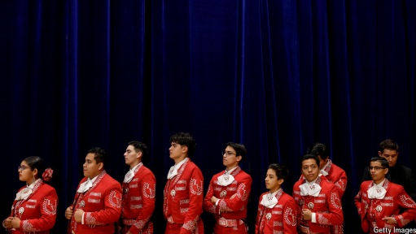

# The spread of mariachi tells a very American story

mariachi：美 [ˌmɑriˈɑtʃi] 墨西哥街头民乐队；墨西哥传统音乐演奏者（常为街头乐队成员）；墨西哥街头音乐

*Extreme commitment to extracurriculars meets cultural pride*

原文：

**A**S MAGA HEARS it, the sound of the border is the trill of gunfire

and the cry of trafficking victims. For others, it is a lot more

heartwarming: the toot of the trumpet, the strum of the *guitarrón*,

the yelp of the *grito*, the stomp of patent-leather boots. It is the

sound of a bunch of Texan high-school students playing mariachi,

for love and for course credit.

正如MAGA所听到的，边境的声音是枪声的颤音和贩运受害者的哭声。对其他人来说，这更令人温暖:小号的嘟嘟声，吉他的乱弹声，格里托的叫喊声，漆皮靴子的跺脚声。这是一群德克萨斯高中生演奏墨西哥墨西哥音乐的声音，为了爱，当然也是为了学分。

学习：

trill： 美 [trɪl] （连续）发颤音；

gunfire：枪炮声；射击；开枪；枪战；交火

trafficking：非法交易

toot：喇叭声；尖锐的喇叭声；嘟嘟声

strum：弹拨声；弹奏声；一阵弹奏

stomp：重踏舞；跺脚；重步舞；

course credit：课程学分；学分          

原文：

Instruction in mariachi—the most Mexican of genres—is popular

and getting more so in border states. Over 120 public schools in

Texas teach it. The best ensembles come from the Rio Grande

valley. Interest is growing in other places with big latino

populations, too. In Nevada the number of students taking mariachi

class in the Clark County school district, which encompasses Las

Vegas, is 8,200, up 40-fold in 20 years.

墨西哥街头音乐——最具墨西哥特色的音乐类型——很受欢迎，而且在边境州越来越受欢迎。德克萨斯州有超过120所公立学校教授这门课程。最好的合奏来自里奥格兰德河谷。人们对其他拉美裔人口众多的地方也越来越感兴趣。在内华达州，包括拉斯维加斯在内的克拉克县学区内，参加墨西哥音乐课的学生人数为8200人，在20年内增长了40倍。

学习：

Iatino：（居住在美国的）拉丁美洲人；拉美裔美国人；拉丁美洲裔居民

原文：

Mariachi’s popularity is a story of migration and diaspora: a third

of Texans have Mexican heritage, and one in four of them were

born outside America. Jalen from Lubbock practises her *vihuela* (a

stringed instrument) for five hours a day and says that through it

she expresses her culture, “which is Hispanic, Mexican and all

that”

墨西哥街头的流行是一个移民和散居的故事:三分之一的德州人有墨西哥血统，四分之一的人出生在美国以外。来自拉伯克的彭江雨每天练习五个小时的vihuela(一种弦乐器)，她说通过它她表达了自己的文化，“西班牙文化、墨西哥文化等等”

学习：

diaspora： 美 [daɪˈæspərə] 流散的民族或群体；移民群体；族群分散

have Mexican heritage：有xxx血统

原文：

Not all players see it this way—some just love the music. Nithila,

who was born in India, and Chloe, who is black and from Georgia,

got into mariachi at their school near Houston because they found

orchestra “monotonous”. Judges at competitions, such as a recent

one in Seguin, note the diversity that the girls bring to their troupe.

Daniel, a trumpeter, gets called *güero*, or white boy. He is from the

border city of El Paso; playing mariachi “brings me home”, he

says.

并不是所有的演奏者都这样认为——有些人只是喜欢音乐。出生在印度的尼希拉和来自佐治亚州的黑人克洛伊在休斯顿附近的学校迷上了墨西哥乐队，因为他们觉得管弦乐队“单调乏味”。比赛的评委们，比如最近在塞古因举行的比赛，注意到了女孩们给他们的团队带来的多样性。小号手丹尼尔被称为güero，也就是白人男孩。他来自边境城市埃尔帕索；他说，演奏墨西哥音乐“让我回家”。

学习：

troupe：剧团；表演团；艺术团；

trumpeter：美 [ˈtrəmpədər] 小号手；号手；吹鼓手

原文：

The uptake reflects a very American tendency: to take

extracurriculars to the next level and get fiercely competitive about

them, even when few students plan to go professional. This

happened long ago with what school music directors call the “big

three” (band, orchestra, choir), not to mention sports such as

American football.

这种吸收反映了一种非常美国化的趋势:将课外活动提升到一个新的水平，并为此展开激烈的竞争，即使很少有学生打算成为职业选手。这种情况很久以前就发生在学校音乐总监所谓的“三巨头”(乐队、管弦乐队、合唱团)身上，更不用说像美式足球这样的运动了。

学习：

>
>
>**这里的 "uptake" 意思是** **“接受、参与、使用”**，通常指人们对某项活动、想法或产品的接受程度。在这里，**"The uptake reflects a very American tendency"** 意思是 **“这种参与度反映了一种非常美国式的趋势”**，即**学生们对课外活动的热情和竞争性**。
>
>------
>
>**类似的用法示例如下：**
>
>- **"The uptake of electric vehicles has increased rapidly in recent years."**
>   近年来，电动汽车的普及率迅速上升。
>- **"There was a slow uptake of the new health insurance policy among employees."**
>   员工对新的健康保险政策接受度较低。
>
>------
>
>**在此上下文中的意思：**
>
>**"The uptake reflects a very American tendency: to take extracurriculars to the next level and get fiercely competitive about them."**
> 意思是：
> **这种（对玛利亚奇音乐的）参与度反映了一种非常美国式的趋势：将课外活动提升到更高水平，并在其中激烈竞争，即使很少有学生打算从事相关职业。**
> 这里强调了 **美国学生对于课外活动的高度投入和竞争精神**，即使这些活动并非他们未来的职业方向。

原文：

In mariachi’s case, it is also the result of a decades-long and

distinctly American effort to formalise its teaching in academic

settings, says Lauryn Salazar of Tarleton State University. Now

there is a pipeline of licensed mariachi teachers who graduate

university, then get jobs in schools. In Mexico, by contrast,

instruction tends to be vocational and at specialised institutes. “Our

mariachis are learned; they have degrees,” says Dahlia Guerra, who

started a university programme in Texas in 1989. Americans say

Mexicans see the scene north of the border and wish they could

match its resources and calibre in their schools.

塔尔顿州立大学的Lauryn Salazar说，就墨西哥街头音乐而言，这也是几十年来美国致力于将其教学正式化的结果。现在有一批持有执照的墨西哥音乐教师，他们从大学毕业，然后在学校找到工作。相比之下，在墨西哥，教学往往是职业的，在专门的机构进行。“我们的墨西哥艺人是有学问的；他们有学位，”达丽亚·格拉说，她于1989年在德克萨斯州开始了一项大学计划。美国人说，墨西哥人看到了边境以北的景象，希望他们能在自己的学校里找到与之匹配的资源和能力。

学习：

>
>
>**这里的 "calibre" 意思是** **“水准，素质，能力”**，通常指某人或某物的质量或能力水平。在这里，**"match its resources and calibre in their schools"** 意思是 **“匹配（美国）学校的资源和水准”**，即墨西哥人希望他们的学校也能达到美国的资源配置和教学质量。
>
>------
>
>**类似的用法示例如下：**
>
>- **"The calibre of students at this university is exceptionally high."**
>   这所大学的学生素质极高。
>- **"The restaurant is known for its high-calibre service and excellent food."**
>   这家餐厅以高水平的服务和出色的美食闻名。
>
>------
>
>**在此上下文中的意思：**
>
>**"Americans say Mexicans see the scene north of the border and wish they could match its resources and calibre in their schools."**
> 意思是：
> **美国人表示，墨西哥人看到美国的玛利亚奇音乐教育体系后，希望他们的学校也能匹配美国的资源配置和教育水平。**
> 这里强调的是 **美国的玛利亚奇音乐教育体系更加正规化，师资力量更强，而墨西哥的相关教学则更偏向职业培训。**

原文：

That a folkloric tradition has become so popular among American

teenagers is sweet and amusing. The repertoire calls for a wide

vibrato and is full of ballads about homeland, beautiful women and

life on the ranch. Rural concerns are common themes, such as that

feeling when your cow runs away or your vegetable cart breaks

down. Pablo, a high-school senior with frosted tips, appreciates that

mariachi channels all emotions. “You could cry, you could laugh,”

he says. “You could dedicate a song to someone. Like an ex.”

Whereas musicians in a symphony orchestra focus on their sheet

music or their conductor, says Dr Guerra, mariachis “look into the

eyes of their audience”.

民俗传统在美国青少年中变得如此流行，这既甜蜜又有趣。该曲目需要广泛的颤音，充满了关于祖国、美女和牧场生活的歌谣。农村问题是常见的主题，比如当你的牛跑了或者你的蔬菜车坏了时的感觉。Pablo是一名头顶霜花的高中毕业生，他很欣赏墨西哥街头艺人表达所有情感的方式。“你可以哭，也可以笑，”他说。“你可以把一首歌献给某人。像前任一样。”格拉博士说，交响乐团的音乐家专注于乐谱或指挥，而墨西哥艺人“看着观众的眼睛”。

学习：

folkloric：美 ['foʊklɔrɪk] 民间传说的；民俗的

repertoire：美 [ˈrepərtwɑːr] 全部剧目；全部节目；节目集；

vibrato： 美 [vəˈbrɑdoʊ] 颤音；音乐中的振音技巧；

ballads：民歌；叙事诗歌；民谣；（ballad的复数）

ranch：大牧场；大农场

high-school senior：高中毕业班学生；高三生          

frosted：结霜的；被霜覆盖的；霜冻的；

sheet music：活页乐谱；散页乐谱；单页乐谱；乐谱          

原文：

Still, the genre is undeniably old-fashioned. Asked about her

favourite mariachi style, Azucena, who plays the *guitarra de golpe*

in her school’s varsity ensemble, mishears the question and

answers: reggaeton. ■

不可否认，这种类型已经过时了。当被问及她最喜欢的墨西哥音乐风格时，在学校的校队合奏团中演奏吉它拉·德·戈尔佩的阿祖塞纳，听错了问题和答案:雷鬼音乐。■

学习：

varsity：美 [ˈvɑrsədi] 大学校队；大学体育代表队

varsity ensemble：校队合奏团

## 后记

2025年3月4日20点39分于上海。